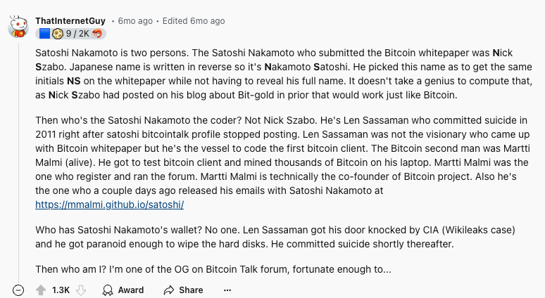

This topic has been discussed to death, and there's not really much more of interest to say about it, but I've had this note in my private drafts for quite a while, so I figured I'd just publish it.

To me, the most likely answer to the question of who **Satoshi Nakamoto** is, is that it's an intentional alias used by a collective of initial founders.

Adam Back was one of the first people to receive an email from the Satoshi email address, in August 2008, when Satoshi wrote to check a citation to Back's [Hashcash](hashcash.md) paper [@rizzoReadAdamBacks2024]. His work on Hashcash is clearly a foundation for Bitcoin: the white paper says it uses "a proof-of-work system similar to Adam Back's Hashcash" [@nakamotoBitcoinPeertoPeerElectronic2008]. Many people have speculated that he is Satoshi, including the author of [this video](https://www.youtube.com/watch?v=XfcvX0P1b5g). In April 2026, a [New York Times investigation](https://www.nytimes.com/2026/04/08/business/bitcoin-satoshi-nakamoto-identity-adam-back.html) by John Carreyrou concluded that Back is most likely Satoshi. Back denies it [@robertsNewYorkTimes2026].

I assume that he, Nick Szabo (author of [Bit gold](https://unenumerated.blogspot.com/2005/12/bit-gold.html) [@szaboBitGold2008]) and Hal Finney (who built RPOW, a reusable [Proof-of-Work](proof-of-work.md) system) decided on the use of an alias for their work. Satoshi described Bitcoin as "an implementation of Wei Dai's b-money proposal [...] and Nick Szabo's Bitgold proposal" [@nakamotoTheyWantDelete2010], and Finney was the first person besides Satoshi to run Bitcoin and the recipient of the first bitcoin transaction [@finneyBitcoinMe2013].
 
Additionally, I think Len Sassaman wrote the original Bitcoin client, as Evan Hatch argues [@hatchLenSassamanSatoshi2021], and I figure that Sassaman had the keys to the Satoshi wallet; hence, it has never moved since his passing. Satoshi's last known email was in April 2011 [@wikipediaSatoshiNakamoto], and Sassaman died in July 2011 [@wikipediaLenSassaman]. The roughly 1.1 million bitcoins thought to be Satoshi's have never been spent [@lernerWellDeservedFortune2013]. Not everyone buys the Sassaman theory, though: his widow has denied it, and he publicly criticised Bitcoin's lack of anonymity [@morrisWhyLenSassaman2024].

If Satoshi is a collective (containing Adam, Nick, Hal, Len and maybe others like Martti Malmi, founder of the first Bitcoin community forum [@bitcoinwikiSirius]), each of them can claim, without lying, that they're not Satoshi.

[This Reddit comment](https://www.reddit.com/r/CryptoCurrency/comments/1b12azf/comment/ksc328o) also proposes a similar theory, though it leaves out Adam Back and Hal Finney.

It also adds some conspiratorial thinking: that Nick's initials, N.S., are the initials of *N*akamoto *S*atoshi in reverse (Japanese name order) - it's possible, but I'd say it's more of a coincidence.

*Source: [this Reddit comment](https://www.reddit.com/r/CryptoCurrency/comments/1b12azf/comment/ksc328o) on r/CryptoCurrency.*

I mean, even if there is literally some guy who called himself Satoshi Nakamoto, who is none of these people, the actual legwork was done by these people, so I think it's fair to say that the product that became Bitcoin was indeed co-created by all these people.

## Digging into the timestamps

With some help from Claude Code, I went back to the primary sources to test the collective theory: Satoshi's emails with Martti Malmi, Mike Hearn and Gavin Andresen, and around 1,500 of Adam Back's own posts.

### Satoshi's sleep gap

Satoshi sent Malmi 144 emails between May 2009 and February 2011 [@malmiSatoshiSiriusEmails2024]. Not one of them was sent between 07:03 and 14:37 UTC. Malmi's own emails in the same archive are spread across every hour of the day.

That gap looks like sleep for someone in the Americas. But the email headers tell a different story: they used +0000 in winter and +0100 in summer, switching exactly with British Summer Time. So either one person kept an American schedule on a British clock, possibly to muddy the trail, or more than one person was involved.

### Adam Back's schedule doesn't fit

Back moved to Malta in 2009, where Satoshi's gap is the working day: roughly 9am to 4:30pm in summer. I checked Back's posts in sources where the timestamp is his own, not a server's or a moderator's:

| Source | Posts | Inside Satoshi's gap |
|---|---|---|
| Bitcointalk, 2013-2021 [@bitcointalkLatestPostsAdam3us] | 404 | 39% |
| bitcoin-dev list, sent from Malta [@bitcoindevMailingListArchive] | 151 | 44% |
| Cypherpunks list, 1996-1998 [@cypherpunksMailingListArchive] | 694 | 29% |
| Cryptography list, 2001-2016 [@metzdowdCryptographyArchive] | 176 | 21% |
| Satoshi's emails to Malmi | 144 | 0% |

The hours Satoshi avoided are the hours Back posts most. The only emails I could find from Back during Satoshi's active years are two posts to the cryptography list in March 2010, and one of them was sent at 08:35 UTC, right in the middle of the gap.

Back himself has used this kind of argument: he dismissed the Sassaman theory because "the documentary ruled out very early anyone in europe given the time of forum posts" [@utodayAdamBackBreaks2026]. The same logic applies to him.

There are caveats. There's almost no data for Back between 2008 and 2011, his posts from 2001 to 2003 fit the gap better (8.5% inside it), and a careful Satoshi could have deliberately written or sent emails at certain hours. So this weakens the case for Back without ruling him out.

One trap worth knowing about: the cryptography mailing list was moderated, so the timestamps on mail-archive.com show when a post was approved, not when it was written. For Satoshi's own 18 posts to that list, the delay was about 16 hours on average. Any timing analysis built on that archive will be misleading.

### Satoshi's schedule changed in 2011

In 2011, the pattern breaks. Of the eleven emails from that year in these archives, four fall inside the gap, including three of the last four [@hearnSatoshiEmails]. His final known email, to Gavin Andresen on 26 April 2011 ("I've moved on to other things"), was sent at 08:29 UTC [@andresenElevenYearsAgo2022]. The other seven, including his January and February emails to Malmi and his 9 March emails to Hearn, still fit the old pattern.

That could be a new job, travel, or emails written earlier and sent later. Or it could be a different person at the keyboard, which is what you'd expect if Satoshi was a collective handing things over. (The Hearn times assume his email archive is in Zurich time, where he lived. The Gavin time is confirmed by two separate renderings of the same email.)

### What cuts against a collective

- The early mining looks like a single machine running a single piece of software [@lernerReturnDeniersRevenge2019].
- Satoshi's emails read like one developer: "my test suite", a Windows-only build, "18 months development", and Hal Finney described in the third person as someone who "helped me a lot" [@malmiSatoshiSiriusEmails2024].
- Satoshi put two spaces after almost every full stop (96% to 100% in every half-year of the Malmi emails), which is a very consistent personal habit.
- Satoshi sent emails and bitcoin while Hal Finney was running a timed race [@loppHalFinneyWas2023].
- Len Sassaman lived in Belgium, which doesn't fit the gap, and his widow says he was "a Mac user" [@dlnewsWasLenSassaman2024], while the first Bitcoin release was Windows only.

On balance, the timestamps fit one main author better than a group, and they fit Adam Back poorly. The most interesting loose thread is the change in 2011.
