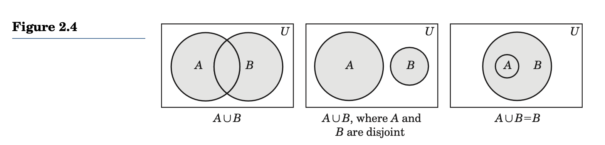
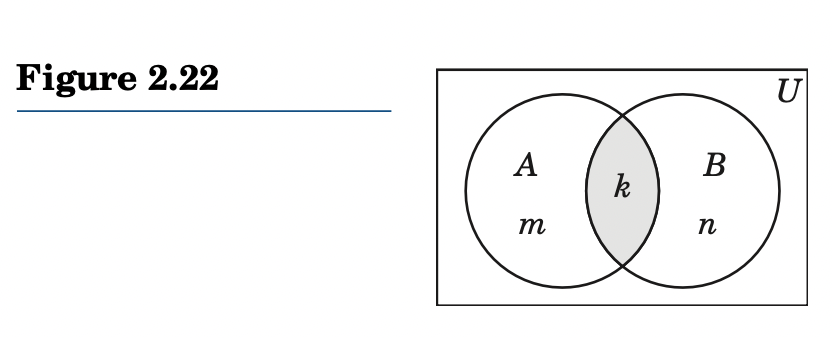

Notes from [Discrete Mathematics with Applications] by Susanna Epp.

## Chapter 1. The Language of Logic

### 1.1. Propositions

* A declarative sentence that is either true or false but not both.
* [Truth Value](../../../permanent/truth-value.md)
    * The truthfulness or falsity of a proposition is called its truth value, denoted by T(true) and F(false)

## Chapter 2. The Language of Sets

* Concept of a set fundamental: "revolutionised mathematical thinking"
* Foundation of set theory laid by German mathematician Georg Cantor in latter part of 19th century.
* Problems looked at:
    * Find the number of positive integers ≤ N and divisible by a, b, or c.
    * How many subsets does a finite set with n elements have?
    * How would you define the set of legally paired parentheses?
    * How many sequences of legally paired parentheses can be formed using n pairs of left and right parentheses?

### 2.1 The Concept of a Set

* Set is a collection of well-defined objects called "elements" or "members" of the set.
    * Note that set is actually an undefined term like point or line in geometry.
* There can be no ambiguity about whether something belongs to a set:
    * Vowels of English alphabet form set.
    * Beautiful flowers do not, as it's a subjective term.
* Notation:
    * Sets are denoted by capital letters: $A$
    * Elements lowercase: $x$
    * If an object $x$ is an element of a set $A$ it's written as: $x \in A$
    * If not: $x \notin A$
* 2 methods of defining sets
    * Listing method: V = {A, E, I, O, U}
    * Set builder: $\{x|P(x)\}$
        * $|$ means "such that"
        * Reads as: "set consisting o all objects x such that x has the property P(x)"
        * Let B bet the set of all months of the year with exactly 30 days. Then
            * $B = \{x | x \text{ is a month of the year with exactly 30 days }\}$
            * = $\{\text{September, April, June, November}\}$
* Russell's Paradox
    * $S = \{ X | X \notin X \}$
        * $S$ consists of all sets that do not belong to themselves as elements.
        * Is $S \in S$ If so, then by definition $S \notin S$
        * Therefore, we have a contradiction.
            * The paradox shows, not every predicate defines a set.
* Subset
    * If every element of $A$ is also an element of $B$, then $A$ is a subset of $B$.
    * Denoted as $A \subseteq B$
    * We can also thinking of it as B contains A: $B \supseteq A$
    * If $A$ is not a subset of $B$ then we write: $A \nsubseteq B$
* Equal sets:
    * If two sets are equal, we say: $A = B$.
* Empty set:
    * A set containing no elements is the empty (or null) set.
    * Denoted by: $\emptyset$ or `{}`
    * An empty set is a subset of every set.
    * However, $\{ \emptyset \} = \emptyset$
        * A set with an empty set, is not the same as the empty set.
* Universal Set
    * A special set $U \ne \emptyset$ that's not the null set, such that every set is a subset of U.
        * It's called a universal set, denoted by U.
    * Therefore, $A \subseteq U$ for every set A.
    * For the sets: {a}, {b, c, d} an {b, d, e, f}, then U = {a, b, c, d, e, f} may be chosen as valid universal sets.
* Disjoint Sets
    * 2 sets without common elements.
    * Examples:
        * `{Green, Red, Blue}` and `{Orange, Yellow, White}`
        * `{+, -, *, /}` and `{^, V, -> <->}`
* Venn Diagrams
    * A means of representing the relationship between sets.
    * Named after English logician John Venn.
        * In a Venn diagram, universal set U is represented by points inside a rectangle and sets by the points enclodes by simple close.
    * No overlap:
    
    * A subset of B
    

    * A and B has common elements.
    
* Power Set
    * Family of setsets of set A is the power set of A, denoted by P(A).
    * Find power set P(A) of the set A = {a, b} = {{a}, {b}, {a, b}, {}}
* Finite and Infinite Sets
    * A set with a well-defined number of elements is a **finite set**
        * Set of countries
    * A set with a non-finite number of element is an **infinite set**
        * Set of integers
        * Set of points on a line
    * Commonly used infinite sets:
        * $\mathbf{Z}$ = set of integers = {... -1, 0, 1, ...}
        * $\mathbb{N}$ = $\mathbf{Z^{+}}$ = set of positive integers = {1,2,3,...}
        * $\mathbf{Z^{−}}$ = set of negative integers = {. . . , −3, −2, −1}
        * $\mathbf{W}$ = set of whole numbers = $\{0,1,2...\}$
        * $\mathbf{Q}$ = set of rational numbers = $\{p/q|p, q \in \mathbf{Z} ∧ q \neq 0\}$
        * $\mathbb{R}$ = set of real numbers
        * $\mathbb{R}^{+}$ = set of positive real numbers = ${x \in \mathbb{R}|x > 0}$
        * $\mathbb{R}^{−}$ = set of negative real numbers = ${x \in \mathbb{R}|x < 0}$
    * Some additional subsets of $\mathbb{R}$ called **intervals**, given here where $a < b$
    * closed interval - `[a,b] = {x ∈ R|a ≤ x ≤ b}`
    * closed–open interval - `[a, b) = {x ∈ R|a ≤ x < b}`
    * open–closed interval - `(a, b] = {x ∈ R|a < x ≤ b}`
    * open interval `(a, b) = {x ∈ R|a < x < b}`
        * A bracket at the end point means it is included in set, where parenthesis indicates it is not included.
        * Set $\{ x \in R|x \geq a \}$ is denoted by $[a, \infty)$.
* The Hilbert Hotel Paradoxes
    * Paradox one:
        * A major hotel has infinite rooms.
        * The hotel manager tells you they are full. However, they can accomodate you.
            * Move everyone down one room: Room 1 -> Room 2 and so on for infinitey.
    * Paradox two:
        * Infinite number of conventioneers arrive at hotel looking for room.
        * Can't give each room one at a time, since it will result in chaos.
        * Instead: move guest in Room 2 to 2, guest in 2 to 4, guest in 3 to 6.
        * Put old guests in even-numbered rooms, so new guests can be checked into odd-numbered.
    * Paradox three:
        * Infinitely many hotels with infinite rooms are leveled by an earthquake.
        * All guests survive and come to Hilbert hotel. How can they be accomodated?
* Sets used in study of formal languages:
    * Alphabet
        * A finite set $\sum$ (uppercase sigma) of symbols is an alphabet.
            * A word or string over $\sum$ is a finite arragements of symbols from $\sum$
        * Only alphabet understood by a computer is the binary alphabet {0, 1}
        * Every zip code is a word over alphabet $\{0, ..., 9\}$
        * Sets like {a, b, c, ab, bc} are not considered alphabets since string ab can be obtained by juxtaposing symbpols next to each other.
    * Length of a word
        * Length of word is denoted by $||w||$: the number of sumbols in it.
        * Word of length zero is empty word denotes by $\lambda$
        * Examples:
            * $||ab|| = 2$
            * $||aabba|| = 5$
            * $||\lambda|| = 0$
            * Set of words over alphabet $\sum$ is denoted by $\sum^{*}$
    * Concatenation
        * Concatenation of 2 words $x$ and $y$ is denoted by $xy$, obtained by appending word $y$ to $x$.
* Exercises 2.1
    * Rewrite each set using the listing method.
        * 1. The set of months that begin with letter A.
            * { April, August }
        * 2. The set of letters of the word GOOGOL.
            * {G, O, L}
        * 3. The set of months with exactly 31 days.
            * {Jan, March, May, July, September, November }
        * 4. The set of solutions of the equation x^2 - 5x + 6 = 0
            * {2, 3} (had to use Wolfram Alpha for this. Forgetten how to do solution sets).
    * Rewrite each using set-builder notation.
        * 5. The set of integers between 0 and 5:
            * $S = \{x \in \mathbf{R} | 0 < x < 5 \}$
        * 6. Set of January, February, May and July :
            * $B = \{x | x \text{ is a month of the year in January ,February, May and July }\}$
        * 7. Set of all members of United Nations
            * $B = \{x | x \text{ is a country that is member of UN }\}$
        * 8. $\{ \text{Asia}, \text{Australia}, \text{Antartica}\}$
            * $B = \{x | x \text{ is a continent in Asia, Australia, Antartica }\}$
    * Determine if 2 sets are equals:
        * 9. {x, y, z}, {x, z, y}
            * These are equal as they contain same elements.
        * 10. {x | x^2 = 1}, {x|x^2 = x}
            * These are not equal. The first is: $\{1\}$, the second is $\{0, 1\}$
        * 11. {x | x^2 = x}, {0, 1}
            * Equal.
        * 12. $\{x, \{y\}\}, \{\{x\}, y\}$
            * Not equal.
    * Mark each as true or false.
        * 13. $a \in \{alfa\}$
            * True
        * 14. $b \subseteq \{a, b, c\}$
            * False. b is in a, b, c but b is not a set.
        * 15. $\{x\} \subseteq \{x, y, z\}$
            * True. $\{x\}$ is a sub set.
        * 16. $\{0\} = \emptyset$
            * False. A set containing 0 is not the empty set.
        * 17. $0 \in \emptyset$
            * False. 0 is not in the empty set.
        * 18. $\{0\} = 0$
            * False. A set containing the empty set is not 0.
        * 19. $\{\emptyset\} = \emptyset$
            * A set containing an empty set, is not an empty set.
        * 20. $\emptyset \in \emptyset$
            * False. The empty set is not in an empty set.
        * 21. $\emptyset \in \{ \emptyset \}$
            * True. The empty set is in this set.
        * 22. $\{ x | x \neq x \} = \emptyset$
            * True. There is no x that isn't equal to x.
        * 23. {x, y} = {y, x}
            * True. Order of elements does not matter.
        * 24. $\{x\} \in \{\{x\}, y\}$
            * True. The set containing $x$ is in the set.
        * 25. $\emptyset$ is a subset of every set?
            * True
        * 26. Every set is a subset of itself?
            * True
        * 27. very nonempty set has at least two subsets
            * True. Itself and the empty set.
        * 28. The set of people is in the world is infinite
            * False. There's a finite number of people in the world.
        * 29. The set of words in the dictionary is infinite
            * False. There are a finite set of words in the dictionary.
    * Find the power set of each set
        * 30. $P(\emptyset)$ = $\{ \emptyset \}$
        * 31. $P( \{ a \})$ = $\{ \emptyset, \{ a \} \}$
        * 32. $P(\{a,b,c \}) = \{ \emptyset, \{ a \}, \{ b \}, \{ c \}, \{ a, b \}, \{ b, c\}, \{a, c \}, \{ a, b, c \} \}$
        * 33. Number of subsets with n elements = $2^{|n|}$

### 2.2 Operations with Sets

* Union
    * The **union** of 2 sets $A$ and $B$ is obtained by merging them.
    * Denoted as $A \cup B$.
        * $A \cup B = \{x | (x  \in A) \lor (x \in B)\}$
* Intersection
    * The **intersection** of 2 sets $A$ and $B$ denoted by $A \cap B$ is the set of elements common to A and B.
    * $A \cap B = \{ | (x \in A) \land (x \in B)\}$
    * 
    * 2 sets are considered disjointed if their intersection is the empy set.
* Difference
    * The difference of two set $A$ and $B$ (or **relative complement** of B in A) denoted by $A - B$.
        * $A - B = \{x \in A|x \notin B\}$
        * Order is important.
* Complement
    * The difference $U - A$ we call the **complement** of A.
        * Represent as $A'$ (and also $\overline{A}$?)
* Symmetric Difference
    * In $A$ or $B$ but not both.
* Set and Logic Operations
    * Set and Logic operations are closely related:

| Set operation  | Logic operation |
| -------------- | --------------- |
| $A \cup B$     | $p \lor q$      |
| $A \cap B$     | $p \land q$     |
| $\overline{A}$ | $\neg p$        |
| $A \oplus B$   | p XOR q         |

* [Inclusion-Exclusion Principal](../../../permanent/inclusion-exclusion-principal.md)
    * Let A and B be two finite sets.
    * $|A \cup B| = |A| + |B| - |A \cap B|$
    * Proof
        * Suppose $|A \cup B| = k$
        * Since $A \cap B \subseteq A$ and $A \cap B \subseteq B$
        * We can assume $|A| = k + m$ and $|B| = k + n$ for some nonnegative integers m and n
        * Then:
            * $|A \cup B| = m + k + n$
            * $= (m + k) + (n + k) - k$
            * $= |A| + |B| - |A \cap B|$

    

### Recursively Defined Sets

A new way of defining sets.
Look at this set of numbers $S=\{2, 2^2, {2^2}^2, {{2^2}^2}^2, ...\}$ has 3 characteristics:
1. $2 \in S$
2. If $x \in S$ then $2^{x} \in S$
3. Every element of S can be obtained using a finite applications of properties 1 and 2 only.]

Property 1 identifies the primitive elements in S and ensures it's nonempty.

Property 2 establishes a systematic procedure to construct new elements from known elements.

How do we know ${2^2}^2 \in S$? Well:
    * By property $1, 2 \in S$
    * By property (2), 2^2 \in S, now choose x = 2^2 and apply property 2 again; so ${2^2}^2 \in S$
    * Property 3 guarantees that in no other way can element of S be constructed. That means the various elements of S can be obtained systematically by apply the properties.
These characteristics can be generalized and employed to define a set S implicitly. The definition is a recursive definition.

A **recursive definition** of set S consists of 3 clauses:
    * The **basis clause** explicitly lists at least one primitive element in S, ensuring that S is nonempty.
    * The **recursive clause** establishes a systematic recipe to generate new elements from known elements.
    * The **terminal clause** guarantees that the 1st 2 clases are the only ways the elemnts of S can be obtained.
Often the terminal clause is omitted for convenience.

##### Example 2.34

Let S be the set defined recursively as follows

1. $2 \in S$
2. if $x \in S$, then $x^2 \in S$

Describe the solution by the listing method.

Choose $2 \in S$ by the basis clauses.
Apply the recursive clause, $4 \in S$
Now choose x = 4 and apply recurive clause again, so $16 \in S$.
Continuing like this, we get $S = \{2, 4, 16, 256, 65536, ...\}$
