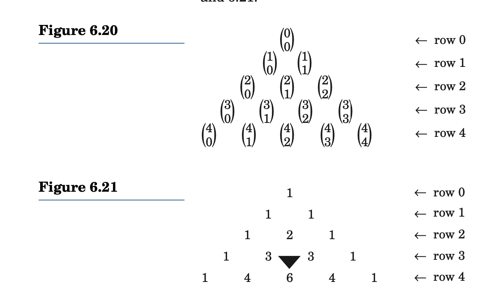
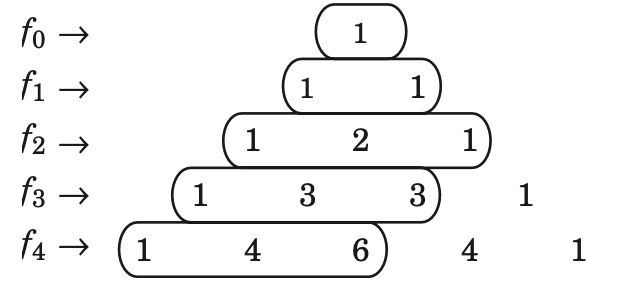

## 6.4 Combinations

pg. 365

* [Combination](Combination)
    * We know that a [Permutation](../../../permanent/permutation.md) is an ordered arrangement of elements in a set.
    * Sometimes, the order of elements is unimportant, only the membership matters. These are considered [Combination](permanent/combination.md)s.
    * For example, a committee like $A = \{Costa, Shea, Weiss, Hall, Chen\}$ is just a set - the order of names doesn't matter.
    * If you would like to form a subcommittee of 3 members: {Costa, Shea, Weiss}, {Costa, Shea, Hall}, and {Costa, Shea, Chen}.
        * Each is a combination of the five elements taken three at a time, or a **3-combination**
    * Formal definition:
        * An **r-combination** of a set of n elements, where $0 \leq r \leq n$, is a subset containing r elements.
        * The number of r-combinations of a set with n elements is denoted by $C(n, r)$ or $\binom{n}{r}$
        * The number of combinations is also called [Binomial Coefficient](Binomial Coefficient).
    * Example:
        * Find the number of r-combinations of the set {a,b,c}, when r = 0, 1, 2, or 3.
        * Solution:
            * One subset contains zero elements: the null set. Number of 0-combinations: C(3, 0) = 1
            * 3 subsets contain one element each: {a}, {b} and {c}. C(3, 1) = 3
            * 3 subsets contain 2 elements each: {a, b}, {b, c}, {c, a}. C(3, 2) = 3
            * 1 subsets contains 3 elements: {a, b, c}. C(3, 3) = 1
            * Answer: 1 + 3 + 3 + 1 = 8
        * Theorem:
            * The number of r-combinations of a set of n elements is given by $C(n, r) = \frac{n!}{r!(n-r)!} \ \ \ 0 \leq r \leq n$
        * Proof:
            * By definition, there are $C(n, r)$ r-combinations of a set of n elements. Each combination contains r elements and contributes $P(r, r) = r!$ r-permutations, so the total number of r-permutations is $r!C(n, r)$. But, by defintion there are $P(n, r) = \frac{n!}{(n-r)!}$ r-permutations. Therefore:
                * $r!C(n,r) = \frac{n!}{(n-r)!}$
                * $C(n, r) = \frac{n!}{r!(n-r)!}$
    * Example 6.21
        * Compute the number of subcommittees of three members each that can be formed from a committee of 25 members.
        * $C(25, 3) = \frac{25 * 24 * 23}{3!} = 13800 / 6 =  2300$
    * Example 6.22 - The pizza problem
        * Let $f_n$ denote the max number of places into which a pizza can be diided with n cuts. What's the formula for $f_n$
        * Clearly, the max number of regions can be relizaed when every 2 cuts, intersect and no 3 cuts are concurrent.
        * $f_n$ can be defined recursively as:
            * $f_0 = 1$
            * $f_n = f_n-1 + n, n \geq 1$
        * Solving this recurrence relation:
            * $f_n = 1 + \frac{n(n+1)}{2}$
        * Can be rewritten as:
            * $f_n = 1 +n + \frac{n(n-1)}{2}$
            * $C(n, 0) + C(n, 1) + C(n,2), \ n \geq 0$
    * Example 6.23 - How many committees of 3 blondes and 4 brunettes can be formed from a group of 5 blondes and 6 brunettes?
        * 3 blondes can be selected from 5 blondes in $C(5, 3) = 10$ different ways.
        * 4 brunettes from 6 brunettes in $C(6, 4) = 15$ different ways.
        * $10 * 15 = 150$
    * Example 6.24
        * Let A be a 10-element subset of the set {1, 2, ...., 15}
        * Let $A_s$ be a subset of A containing 3 elements, where the subscript s denotes the sum of elements in $A_s$.
        * For example, the subset {2, 4, 5} is denotes by A_11
        * Determine if each subset of A can be identifies by a unique name A_s. In other words, does every sum i + j + j, have a unique value s, where $1 \leq i < j < k < 15$?
        * Solution:
            * We can use the [Pigeonhold Principal](Pigeonhold Principal)
                * The least value of s is 1 + 2 + 3 = 6 and largest value is 13 + 14 + 15 = 42.
                * Therefore, there are $6 \leq s \leq 42$, at most 37 possible values of $s$.
                * There are C(10, 3) = 120 three-element subsets (pigeons) of A and only 37 possible sums.
                    * So by pigeon hole principal, at least 2 subsets must yield the same sum.
                    * So not every three-element subset of A can have a unique name.
                    * One example is subsets {1, 2, 5} and {1, 3, 4} both equal 8.
* Theorem 6.11
    * $C(n, r) = C(n, n - r)$ where $0 \leq r \leq n$
* Example 6.25
    * Find the number of groups that can be formed from a group of seven marbles if each group must contain at least 3 marbles.
    * Since each group can contain at least 3 marbles, it can contain 3, 4, 5, 6 or 7:
        * Groups with 3 = C(7, 3) = 35
        * Groups with 4 = C(7, 4) = 35
        * Groups with 5 = C(7, 5) = 21
        * Groups with 6 = C(7, 6) = 7
        * Groups with 7 = C(7, 7) = 1
        * Total groups = 35 + 35. +21 + 7 + 1 = 99
    * But from Theorem 6.11 we can also think of it as number of groups containing at most 2 marbles:
        * Number of groups containing at most 2 marbles: C(7, 0) + C(7, 1) + C(7, 2) = 1 + 7 + 21 = 29
        * Number of groups containing 3: total possible groups - number of groups at most 2 = 2^7 - 29 = 99

## 6.5 Permutations and Combinations with Repetitions

pg. 376

* [Permutations with Repetitions](Permutations with Repetitions)
    * Take the word REFERENCE.
    * If you swap an E with another E, the word does not change.
    * How can you compute permutations?
    * Problem
        * If the word REFERENCE had all distinct letters, the answer would be 9!, but duplicate letters exist.
    * Solution:
        * Let N denote number of unique words.
        * Think of the Rs as distinct letters: $R_1$ and $R_2$, and Es the same: $E_1$ through to $E_4$.
        * If E and R were distinct, there would be $2! \cdot 4!$ possibilities for their arrangement. So we remove that from the 9! factorial as follows:
            * $N = \frac{9!}{2! \cdot 4!} = 7560$
    * Theorem 6.13
        * The number of permutations of n items of which n_1 items are of one type, n_2 are of second types ... and n_k are of kth type, is: $n! / (n_1!n_2! ... n_k!)$
        * Proof
            * Let N denote total permutations.
            * Let $A_1, ... A_{n_1}$ denote items of first type... $Z_1 ... Z_{n_k}$ items of kth type.
            * If all items where distinct, total would be n_! permutations.
            * If items $A_1, ... A_{n_1}$ are distinct, they can be arranged in $n_1!$ ways and so on.
            * By [Multiplication Principal](Multiplication Principal), if all items are distinct, there would be $(n_1!, n_2!, ... n_k!)N$ permutations:
                * $N = \frac{n!}{n_1!n_2! ... n_k!}$
        * Problem
            * Find the number of bytes containing exactly 3 0's.
        * Solution
            * Let N denote number of bytes containing exactly 3 0's
            * Total bits = 8
            * Count of 0's in arrangement: 3
            * Count of 1's in arrangement: 5
            * $N = \frac{8!}{3!5!} = 56$

### Combinations with Repetitions

pg. 379

* Permutations can deal with repeated elements, so can combinations (called **selections**).
* Example:
    * Five friends go to local restaurant for bevs: iced tea, hot tea, or coffee.
    * Waitress puts all 5 requests on the same order.
    * How many different orders are possible for the table?
        * Order doesn't matter, and same can be selected by more than one person.
* Example 6.30
    * Find the number of 3-combinations of the set S = {a, b}
    * Solution:
        * S contains n = 2 elements.
        * Since each combinations must contain 3 elements, r = 3.
        * Since r > n, the elements of each combinations must be repeated.
        * Consequently, a combination may contain three a's, two a's and one b. One a and 2 b's or 3 b's.
        * Using the set notation, the 3-combinations are {a, a, a}, {a, a, b}, {a, b, b}, {b, b, b}.
        * So four 3-combinations of a set of two elements.
* Example 6.31
    * Find the number of 3-combinations of the set {a, b, c}, where the elements may be repeated.
    * Solution:
        * Using set notation, the various 3-combinations are:
            * {a, a, a}, {a, a, b}, {a, a, c}, {a, b, b}, {a, b, c}, {a, c, c}, {b, b, b}, {b, b, c}, {b, c,c }, {c, c, c}
        * The set has 10 3-combinations.
* Example 6.32
    * Back to first problem.
    * Add notation to prevent confusion:
        * $\frac{ }{\text{iced tea}} / \frac{ }{\text{hot tea}} / \frac{ }{\text{coffee}}$
    * Mark each persons selection with X:
        * XX / X /XX indicates that 2 people selected iced team, one hot tea, 2 cofee.
    * So, number of possible bev orders equals number of permutations of 7 items (five X and two /'s) of which five are alike (X) and other 2 are alike /
    * Answer:
        * $\frac{7!}{5!2!} = 21$
    * This solution strategy produces following theorem.
* Theorem 6.14
    * The number of r-combinations with repetitions from a set of n elements is $C(n + r - 1, r)$
    * Proof:
        * Each r-combination with repeated elementes from a set of n elements can be considered a string of r X's and (n - 1) slashes.
        * Each string contains $r + n - 1 = n +r -1$ symbols, or which r are alike (X's) and $n - 1$ are alike (slashes). The number of strings/r-combinations equals:
            * $\frac{(n + r - 1)!}{r!(n - 1)!} = C(n + r - 1, r)$
* Example 6.33
    * There are 5 types of soft drinks at restaurant:
        * Coke Classic
        * Diet Coke
        * root beer
        * Pepsi
        * Sprite
    * How many combinations can 11 guests make?
    * By Theorem 6.14:
            * $C(5 + 11 - 1, 11) = \frac{15!}{11!4!} = 1365$

## Exercises 6.5

### 1. Find the number of distinct words that can be formed by scrambling the word CALCULUS

There are 8 letters in the word CALCULUS.

 Number of times each letter appears in the word:

* 2 C
* 1 A
* 2 L
* 2 U
* 1 S

Apply formula for **distinct permutations of n objects, where some of the objects are identitical**. The formula is:

$P = \frac{n!}{p_1!p_2!...p_k}$

Where $p_k$ is the frequency of k distinct objects.

$P = \frac{8!}{2! \cdot 2! \cdot 2!} = 5040$

Hence 5040 words can be formed by scrambling the letters of the word CALCULUS.

### 2. Find the number of distinct words that can be formed by scrambling the words TALLAHASSEE

There are 11 possible letters in the word TALLAHASSEE.

Number of times each letter appears in the word:

* T = 1
* A = 3
* L = 2
* H = 1
* S = 2
* E = 2

Formula for distinct permutations of n objects, where some of the objects are identitical:

$P = \frac{n!}{p_1! \cdot p_2! \cdot p_k!}$

$P = \frac{11!}{3!2!2!2!} = 831600$

---

### 3. Find the number of bytes that contain exactly two 0's

Let N the number of bytes that contain exactly two 0's.

Total number of bits n=8
Number of 0's: 2
Number of 1's: 6

$N = \frac{8!}{2!6!} = 28$

### 4. Find the number of bytes that contain exactly five 0's

Let N the number of bytes that contain exactly five 0's.

Total number of bits n=8
Number of 0's: 5
Number of 1's: 3

$N = \frac{8!}{5!3!} = 56$

### 5. Find the number of bytes that contain at least five 0's

Let N the total number of bytes that contain at least 5 0's.

Total number of bits n =8

Case 1: there are 5 0s. We need to find how many arrangements amongst 8 positions. C(8, 5) = 56
Case 2: there are 6 0s. We need to find how many arrangements amongst 8 positions. C(8, 6) = 28
Case 3: there are 7 0s. We need to find how many arrangements amongst 8 positions. C(8, 7) = 8
Case 4: there are 8 0s. We need to find how many arrangements amongst 8 positions. C(8, 8) = 1

56 + 28 + 8 + 1 = 93

### 6. Find the number of bytes that contain not more than two 0's

Case 1: There are 2 0's: C(8, 2) = 28
Case 2: There are 1 0: C(8, 1) = 8
Case 3: There are 0 0's: C(8, 0) = 1

28 + 8 + 1 = 37

### 19. There are 5 types of desserts available at a restaurant. Find the number of ways eight people can select them, if order does not matter

We know the number of r-combinations with repetitions from a set of n elements is $C(n + r - 1, r)$

$C(5 + 8 - 1, 8) = \frac{(n + r - 1)!}{r!(n - 1)!} = \frac{12!}{8!4!} = 495$

### 20. A restaurant offers six choices for the main dish. How many ways can a group of nine women select the maindish? Assume that order does not matter

n = 5
r = 9

$C(n + r - 1, r) = C(5 + 9 - 1. 9) = \frac{(5 + 9 -1)!}{9!4!} = 715$

### 35. Find the number of ways 10 quarters can be distributed among 3 people - Aaron, Beena and Cathy - so that Aaron and Beena get one quarter, Beena gets no more than 3 and Cathy gets 2

We know that $x_1 + x_2 + x_3 = 10$

We also know that
$x1, x2 >= 1$
$x2 \leq 3$
$x3 \geq 2$

Let $c = x3 - 1$, therefore, $c \geq 1$

Therefore,

x1 + x2 + c + 1 = 10
x1 + x2 + c = 9

There are 3 cases for x2:
* x2 = 1
    * x1 + c = 8
        * Total solution = 7 as each one of them have to be more than equal to 1.
* x2 = 2
    * x1 + c = 7, total solution = 6
* x2 = 3
    * Total solutions = 5

There, total ways to distribute is 7 + 6 + 5 = 18.

### 36. Find the number of ways 11 raisins can be distributed among four children—Daisy, Emily, Francis, Gail—so that Daisy, Emily, and Francis get at least two raisins, Francis gets no more than four, and Gail gets at least three

We know that $x_1 + x_2 + x_3 + x4 = 11$

We know that
$x_1, x_2, x_3 >= 2$
$x3 <= 4$
$x4 >= 3$

Cases for $x_3$
* $x_3 = 4$
    * $x_1 + x_2 + 4 + x_4 = 11$
    * $x_1 + x_2 + x_4 = 7$
    * Only 1 case: $x_1=2, x_2=2, c=3$
* $x_3 = 3$
    * $x_1 + x_2 + 3 + x_4 = 11$
    * $x_1 + x_2 + x_4 = 8$
    * 2 cases:
        * $x_1 = 2, x_2 = 3, x_4 = 3$
            * 2 + 3 + 3 = 8
        * $x_1 = 3, x_2 = 2, x_4 = 3$
            * 3 + 2 + 3 = 8
* $x_2 = 2$
    * $x_1 + x_2 + 2 + x_4 = 11$
    * $x_1 + x_2 + x_4 = 9$
    * 4 cases:
        * $x_1 = 2, x_2 = 2, x_4 = 5$
            * $2 + 2 + 5 = 9$
        * $x_1 = 2, x_2 = 3, x_4 = 4$
            * 2 + 3 +4 = 9
        * $x_1 = 3, x_2 = 2, x_4 = 4$
            * 3 + 2 + 4 = 9
        * $x_1 = 3, x_2 = 3, x_4 = 3$
            * 3 + 3 + 3 = 9

$1 + 2 + 4 = 7$ ?

## 6.6 The Binomial Theorem

The binomial coefficients satisfy a vast array of properties.

* [Pascal's Triangle]
    * The various binomial coefficients $\binom{n}{r}$ where $0 \leq r \leq n$, can be arranged in the form of a triangle called Pascal's Triangle.
    * 
    * It has interesting properties:
        * Every row begins with and ends in 1.
            * This happens because $C(n, 0) = 1 = C(n, n)$
        * It is symmetric about a vertical line through the middle.
            * This is because $C(n, r) = C(n, n - r)$
        * Any interior nubmer in each row is the sum of the numbers immediately to its left and right in preceding row.
            * By virtue of [Pascal's Identity](Pascal's Identity)
        * From Example 6.22, the maxium number of places $f_n$ into which a pizza can be divided with n distinct cuts is given by $f_n = C(n, 0) + C(n, 1) + C(n, 2)$
            * This is the sum of the 1st 3 numbers of row n of Pascal's triange.
            * 

### Exercises 6.6

Find the coefficient of each:

1\. $x^3y^5$ in the expansions of $(x + y)^8$

2. $x^4y^6$ in the expansion of $(x − y)^{10}$

Using the binomial theorem, expand each:

5. $(x+y)^4$
6. $(x−y)^5$
7. $(2x−1)^5$
8. $(x + 2y)^6$

Find the middle term in the binomial expansion of each:

9. $(x + \frac{1}{x})^{4}$
10. $(x - \frac{1}{x})^{6}$
