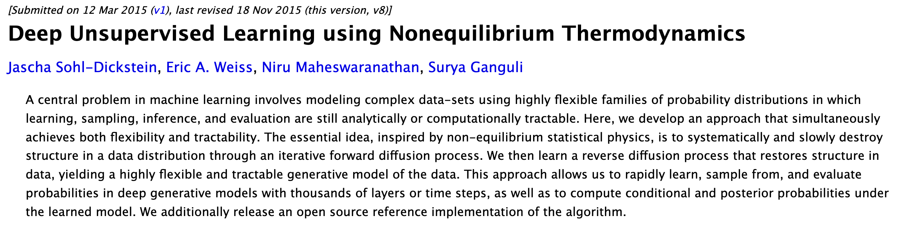

<!--
NotebookLM prompt
The target audience of this podcast is a relatively technical person somewhat familiar with AI concepts. Make it easily digestible, per your default settings, but please cover all key material.

This is one of the earliest papers about diffusion models and was released in 2015. Please speak about it in past tense.
-->

## Overview

This research paper proposes a novel method for training probabilistic models, which can be used to model complex datasets like images, by systematically and slowly destroying and then restoring structure in a data distribution.

The method uses a forward diffusion process to gradually transform the data distribution into a simple, tractable distribution, and then learns a reverse diffusion process that reconstructs the data distribution.

This approach offers several advantages over traditional probabilistic models: it allows for high flexibility in model structure, enables exact sampling and evaluation of probabilities, and facilitates the computation of conditional and posterior probabilities.

The paper demonstrates the effectiveness of this method through experiments on various datasets, including images from CIFAR-10 and MNIST.

---

The authors introduce [Diffusion Models](../permanent/diffusion-models.md)

Forward Diffusion: Add noise to data over multiple steps.
Reverse Diffusion: Learn to reverse the process. Go from noise to data.

Based on concept from physics called [Annealed Importance Sampling](../permanent/annealed-importance-sampling.md)

---

## Abstract

A central problem in machine learning involves modeling complex data-sets using highly flexible families of probability distributions in which learning, sampling, inference, and evaluation are still analytically or computationally tractable. Here, we develop an approach that simultaneously achieves both flexibility and tractability. The essential idea, inspired by non-equilibrium statistical physics, is to systematically and slowly destroy structure in a data distribution through an iterative forward diffusion process. We then learn a reverse diffusion process that restores structure in data, yielding a highly flexible and tractable generative model of the data. This approach allows us to rapidly learn, sample from, and evaluate probabilities in deep generative models with thousands of layers or time steps, as well as to compute conditional and posterior probabilities under the learned model. We additionally release an open source reference implementation of the algorithm.

## 1. Introduction

Historically, probabilistic models suffer from a tradeoff between two conflicting objectives: tractability and flexibility. Models that are tractable can be analytically evaluated and easily fit to data (e.g. a Gaussian or Laplace). However, these models are unable to aptly describe structure in rich datasets. On the other hand, models that are flexible can be molded to fit structure in arbitrary data. For example, we can define models in terms of any (non-negative) function $\phi(x)$ yielding the flexible distribution $p(x) = \frac{\phi(x)}{Z}$, where $Z$ is a normalization constant. However, computing this normalization constant is generally intractable. Evaluating, training, or drawing samples from such flexible models typically requires a very expensive Monte Carlo process.

A variety of analytic approximations exist which ameliorate, but do not remove, this tradeoff, for instance mean field theory and its expansions (T, 1982; Tanaka, 1998), variational Bayes (Jordan et al., 1999), contrastive divergence (Welling & Hinton, 2002; Hinton, 2002), minimum probability flow (Sohl-Dickstein et al., 2011b;a), minimum KL contraction (Lyu, 2011), proper scoring rules (Gneiting & Raftery, 2007; Parry et al., 2012), score matching (Hyvärinen, 2005), pseudolikelihood (Besag, 1975), loopy belief propagation (Murphy et al., 1999), and many, many more. Non-parametric methods (Gershman & Blei, 2012) can also be very effective. (Non-parametric methods can be seen as transitioning smoothly between tractable and flexible models. For instance, a non-parametric Gaussian mixture model will represent a small amount of data using a single Gaussian, but may represent infinite data as a mixture of an infinite number of Gaussians.)

### 1.1. Diffusion probabilistic models

We present a novel way to define probabilistic models that allows:

1. extreme flexibility in model structure,
2. exact sampling,
3. easy multiplication with other distributions, e.g. in order to compute a posterior, and
4. the model log likelihood, and the probability of individual states, to be cheaply evaluated.

Our method uses a Markov chain to gradually convert one distribution into another, an idea used in non-equilibrium statistical physics (Jarzynski, 1997) and sequential Monte Carlo (Neal, 2001). We build a generative Markov chain which converts a simple known distribution (e.g. a Gaussian) into a target (data) distribution using a diffusion process. Rather than use this Markov chain to approximately evaluate a model which has been otherwise defined, we explicitly define the probabilistic model as the endpoint of the Markov chain. Since each step in the diffusion chain has an analytically evaluable probability, the full chain can also be analytically evaluated.

Learning in this framework involves estimating small perturbations to a diffusion process. Estimating small perturbations is more tractable than explicitly describing the full distribution with a single, non-analytically-normalizable, potential function. Furthermore, since a diffusion process exists for any smooth target distribution, this method can capture data distributions of arbitrary form.

We demonstrate the utility of these diffusion probabilistic models by training high log likelihood models for a two-dimensional swiss roll, binary sequence, handwritten digit (MNIST), and several natural image (CIFAR-10, bark, and dead leaves) datasets.

### 1.2. Relationship to other work

The wake-sleep algorithm (Hinton, 1995; Dayan et al., 1995) introduced the idea of training inference and generative probabilistic models against each other. This approach remained largely unexplored for nearly two decades, though with some exceptions (Sminchisescu et al., 2006; Kavukcuoglu et al., 2010). There has been a recent explosion of work developing this idea. In (Kingma & Welling, 2013; Gregor et al., 2013; Rezende et al., 2014; Ozair & Bengio, 2014) variational learning and inference algorithms were developed which allow a flexible generative model and posterior distribution over latent variables to be directly trained against each other.

The variational bound in these papers is similar to the one used in our training objective and in the earlier work of (Sminchisescu et al., 2006). However, our motivation and model form are both quite different, and the present work retains the following differences and advantages relative to these techniques:

1. We develop our framework using ideas from physics, quasi-static processes, and annealed importance sampling rather than from variational Bayesian methods.
2. We show how to easily multiply the learned distribution with another probability distribution (eg with a conditional distribution in order to compute a posterior).
3. We address the difficulty that training the inference model can prove particularly challenging in variational inference methods, due to the asymmetry in the objective between the inference and generative models. We restrict the forward (inference) process to a simple functional form, in such a way that the reverse (generative) process will have the same functional form.
4. We train models with thousands of layers (or time steps), rather than only a handful of layers.
5. We provide upper and lower bounds on the entropy production in each layer (or time step).

There are a number of related techniques for training probabilistic models (summarized below) that develop highly flexible forms for generative models, train stochastic trajectories, or learn the reversal of a Bayesian network. Reweighted wake-sleep (Bornschein & Bengio, 2015) develops extensions and improved learning rules for the original wake-sleep algorithm. Generative stochastic networks (Bengio & Thibodeau-Laufer, 2013; Yao et al., 2014) train a Markov kernel to match its equilibrium distribution to the data distribution. Neural autoregressive distribution estimators (Larochelle & Murray, 2011) (and their recurrent (Uria et al., 2013a) and deep (Uria et al., 2013b) extensions) decompose a joint distribution into a sequence of tractable conditional distributions over each dimension. Adversarial networks (Goodfellow et al., 2014) train a generative model against a classifier which attempts to distinguish generated samples from true data. A similar objective in (Schmidhuber, 1992) learns a two-way mapping to a representation with marginally independent units. In (Rippel & Adams, 2013; Dinh et al., 2014) bijective deterministic maps are learned to a latent representation with a simple factorial density function. In (Stuhlmüller et al., 2013) stochastic inverses are learned for Bayesian networks. Mixtures of conditional Gaussian scale mixtures (MCGSMs) (Theis et al., 2012) describe a dataset using Gaussian scale mixtures, with parameters which depend on a sequence of causal neighborhoods. There is additionally significant work learning flexible generative mappings from simple latent distributions to data distributions, early examples including (MacKay, 1995) where neural networks are introduced as generative models, and (Bishop et al., 1998) where a stochastic manifold mapping is learned from a latent space to the data space. We will compare experimentally against adversarial networks and MCGSMs.

Related ideas from physics include the Jarzynski equality (Jarzynski, 1997), known in machine learning as [Annealed Importance Sampling](../permanent/annealed-importance-sampling.md) (AIS) (Neal, 2001), which uses a Markov chain which slowly converts one distribution into another to compute a ratio of normalizing constants. In (Burda et al., 2014) it is shown that AIS can also be performed using the reverse rather than forward trajectory. Langevin dynamics (Langevin, 1908), which are the stochastic realization of the Fokker-Planck equation, show how to define a Gaussian diffusion process which has any target distribution as its equilibrium. In (Suykens & Vandewalle, 1995) the Fokker-Planck equation is used to perform stochastic optimization. Finally, the Kolmogorov forward and backward equations (Feller, 1949) show that for many forward diffusion processes, the reverse diffusion processes can be described using the same functional form.

*Figure 1. The proposed modeling framework trained on 2-d swiss roll data. The top row shows time slices from the forward trajectory $q\left(x^{(0 \cdots T)}\right)$. The data distribution (left) undergoes Gaussian diffusion, which gradually transforms it into an identity-covariance Gaussian (right). The middle row shows the corresponding time slices from the trained reverse trajectory $p\left(x^{(0 \cdots T)}\right)$. An identity-covariance Gaussian (right) undergoes a Gaussian diffusion process with learned mean and covariance functions, and is gradually transformed back into the data distribution (left). The bottom row shows the drift term, $f_\mu\left(x^{(t)}, t\right) - x^{(t)}$, for the same reverse diffusion process.*

## 2. Algorithm

Our goal is to define a forward (or inference) diffusion process which converts any complex data distribution into a simple, tractable, distribution, and then learn a finite-time reversal of this diffusion process which defines our generative model distribution (See Figure 1). We first describe the forward, inference diffusion process. We then show how the reverse, generative diffusion process can be trained and used to evaluate probabilities. We also derive entropy bounds for the reverse process, and show how the learned distributions can be multiplied by any second distribution (e.g. as would be done to compute a posterior when inpainting or denoising an image).

### 2.1. Forward Trajectory

We label the data distribution $q\left(x^{(0)}\right)$. The data distribution is gradually converted into a well behaved (analytically tractable) distribution $\pi(y)$ by repeated application of a Markov diffusion kernel $T_\pi(y \mid y'; \beta)$ for $\pi(y)$, where $\beta$ is the diffusion rate.

The forward trajectory, corresponding to starting at the data distribution and performing $T$ steps of diffusion, is thus:

$$
q\left(x^{(0 \cdots T)}\right) = q\left(x^{(0)}\right) \prod_{t=1}^{T} q\left(x^{(t)} \mid x^{(t-1)}\right) \tag{3}
$$

For the experiments shown below, $q\left(x^{(t)} \mid x^{(t-1)}\right)$ corresponds to either Gaussian diffusion into a Gaussian distribution with identity-covariance, or binomial diffusion into an independent binomial distribution. Table App.1 gives the diffusion kernels for both Gaussian and binomial distributions.
