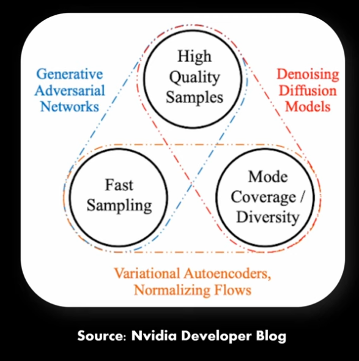

Notes from [Diffusion models from scratch in PyTorch](https://www.youtube.com/watch?v=a4Yfz2FxXiY&t=1s).

How to implement [Denoising Diffusion Model](../permanent/denoising-diffusion-model.md)

Recap:

* [Variational Auto-Encoder](../permanent/variational-auto-encoder.md)
    * Compress input into latent distribution.
    * Samples from input to recover input.
    * After training, can sample from the distribution to generate new datapoints.
    * Outputs can be "blurry"
* [Generative Adversarial Network](../permanent/generative-adversarial-network.md)
    * Can produce high-quality outputs but might be difficult to train.
    * Mode collapse / vanishing gradients.
* [Denoising Diffusion Model](../permanent/denoising-diffusion-model.md)
    * Relatively new approach.
    * Work by destroying the input until only noise is left, then recovering it from noise.
    * Sampling speed can be slow.
* 2 important papers:
    * [Denoising Diffusion Probabilistic Models](denoising-diffusion-probabilistic-models.md)
    * [Diffusion Models Beat GANs on Image Synthesis](../permanent/diffusion-models-beat-gans-on-image-synthesis.md)
        * Follow up that made improvements:
            * Extra normalisation layers.
            * Residual connections.
* Key 2 steps:
    * Forward process: gradually "destroying" an image.
    * Parametrised backward process.
        * Also called de-noising.
        * Markov chain: sequence of events where each time step depends on the previous time step.
* A typical sequence length is t=1000
* At inference time, can run backwards process to generate images.

* Key implementation details:
    * Noise scheduler: sequentially adds noise.
    * Model that predicts noise in an image.
    * A way to encode the timestep.

Colab notebook: https://colab.research.google.com/drive/1sjy9odlSSy0RBVgMTgP7s99NXsqglsUL?usp=sharing

The Stanford Cars dataset no longer works. I get `HTTP Error 404: Not Found`. So I'll have to update that code based on https://github.com/pytorch/vision/issues/7545

* Forward process: