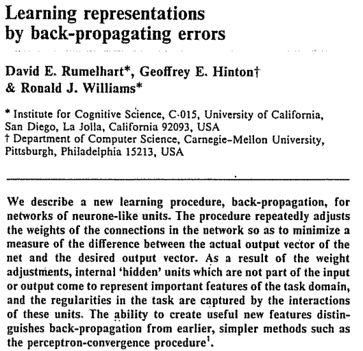

These are my notes on paper [Learning representations by back-propagating errors](https://www.nature.com/articles/323533a0) by David E. Rumelhart, Geoffrey E. Hinton & Ronald J. Williams.

This is the paper that described the pivotal algorithm [Backpropagation](../permanent/backpropagation.md), which is used to train neural networks.

