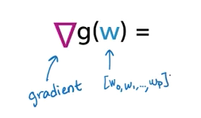
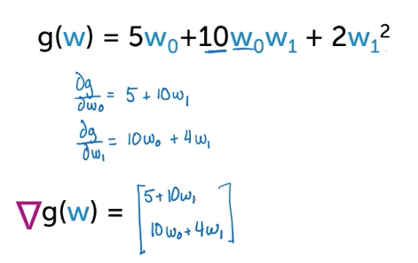

* Course Outline:

  * Module 1: Simple regression

    * Low number of inputs
    * Fit a simple line through the data
    * Need to define "goodness-of-fit" metric for each possible line.
    * Gradient descent algorithm:
      * Get estimated parameters
        * Interpret
        * Use to form predictions

  * Module 2: Multiple relationships

    * More complicated relationship than just a line.
    * Incorporate more inputs when training the model.

  * Module 3: Assessing performance

    * Determine when "overfitting" the data.
    * "Bias-variance tradeoff"
      * Simple models are well behave but can be too simple to describe a behaviour accurately.
      * Complex models can have odd behaviour.

  * Module 4: Ridge Regression

    * ``Ridge total cost = measure of fit + measure of model complexity``
    * Cross validation (??)

  * Module 5: Feature Selection & Lasso Regression
    * What are the most important features for model?
    * ``Lasso total cost = measure of fit + (different) measure of model complexity``
    * Will learn: coordinate descent algorithm.
  * Module 6: Nearest neighbor & kernel regression
    * Methods useful when you have a lot of data:
      * Nearest neighbor: find closest piece of data to what you're looking at and use for predictions
      * Kernel regression

* Assumed background
  * Basic calculus (LOL)
  * Basic linear algebra:
    * Vectors
    * Matrices
    * Matrix multiply

## Regression fundamentals

* Housing prices
  * Look at recent sales in the neighbour hood to help inform your house price.
* Data:
  * "For each house that sold recently, record square feet the house had and what the price was."
    * ``x1 = sq_ft, y2 = price````x2 = sq_ft, y2 = price``, ``x3 = sq_ft, y3 = price`` etc
  * Regression model: ``y[i] = f(x[i]) + E[i]`` - Outcome is the function applied to the input plus some rror.
    * ``E(e[i]) = 0`` - expected value of error is 0 - will be equally likely to have positive or negative  values.
* Tasks in regression:
  * Task 1: Determining options for data model.
  * Task 2: Estimate the specific fit from the data.
* Block diagram for regression (diagram from memory)

  </img>

### ML Model 

* Equation of a line: "intercept + slope * variable of interest" (``f(x) = W₀ + W₁ * Xᵢ``)
  * Single point includes the error (the distance from point back to line): (``f(x) = W₀ + W₁ * Xᵢ + εᵢ``).
  * Parameters of model = ``W₀`` (intercept) and ``W₁`` (slope)
    * Aka: regression coefficients.

### Quality metric

* "Cost" of using a given line.
  * Can be calculated with "Residual sum of squares (RSS)" 
    * Take each error (``εᵢ``) - calculated as ``(actual_value - predicted value)²``
    * Add them for each point.
    * In pseudo:
      
      ```
      RSS(W₀, W₁) = sum([(y - (W₀ + W₁ * Xᵢ))² for y in actual_prices])
      ```

  * Goal is to search over all possible lines to find the lowest RSS.

### Using fitted line

* Estimated parameters:
  * ``Ŵ₀``
    * Intercept: value of ``y`` when ``x == 0``
      * In the context of square feet features, it'd be houses that are just land.
      * Usually not very meaningful (aka intercept is negative, does that mean land only sales mean the seller gets money??)
  * ``Ŵ₁``
    * Estimated slope
    * "Per unit change in input" - "when you go up 1 square foot, how much does the price go up?"

### Finding the best fit (minimizing the cost)

* ``min([RSS(W₀, W₁) for (W₀, W₁) in ALL_POSSIBLE_PARAMS])``
* Convex / concave functions:
  * Concave
    * Looks like arc of cave.
    * Line between 2 points lie below curve of function
    * Max is where derivative = 0
  * Convex 
    * Opposite of concave
    * Any two points will be above the curve of the function
    * Min is where derivative = 0

      </img>
  * Other functions:
    * Can be multiple solutions to derivative = 0 or no solutions

* Finding the max or min analytically:
  * Get derivate of function eg (``-2w + 20``).
  * Set derivate to 0 then solve for ``w``: (``-2w + 20 = 0 == w = 10``):

* Finding the max via hill climbing:
  * Idea:
    * Keep increasing ``w`` via some "step size" until "converged" eg: derivate = 0.
    * Divide space:
      * On one side, the derivative will be more than 0, on the other less.

    * In pseudo:

      ```
      # g = func
      # w = value

      def has_converged(g, w):
           return derivate(g, w) ~ 0

      while not has_converged(g, w):
          w = w + STEP_SIZE
      ```

    * While not converged:
      * Take previous w
      * Move in direction specified by derivated via some step size
  * Choosing stepsize and convergence criteria:
    * Fixed step size = set to constant size.
      * Can result in jumping over optimal, resulting in slow convergence.
    * Decrease the stepsize as you get closer to convergence.
    * Convergence will never get exactly to 0, but you set a threshold for convergence success.
      * Threshold depends on dataset.
    * Commons choices:
      * Algorithms that decrease with number of iterations:
        * ``η[t] = α / t`` (step size at position t is some alpha over t)
        * ``η[t] = α / sqrt(t)`` (step size at position t is some alpha over square root of t)

### Multiple dimensions: gradients

* When you have functions in higher dimensions, don't talk about "derivates" talk about "gradients".
* Notation example:

  </img>
  
* Gradient definition:
  * A vector (array) with partial derivatives.
* Partial derivatives:
  * Same as derivate but involves other derivates. Treats them like constants.
* Worked example:

  </img>

* Gradient descent == hill descent but compute the gradient instead of derivate for each iteration.

### Asymmetric cost functions

* "Prefer to under estimate than over"
  * Eg: don't want to predict my house price as too high.
