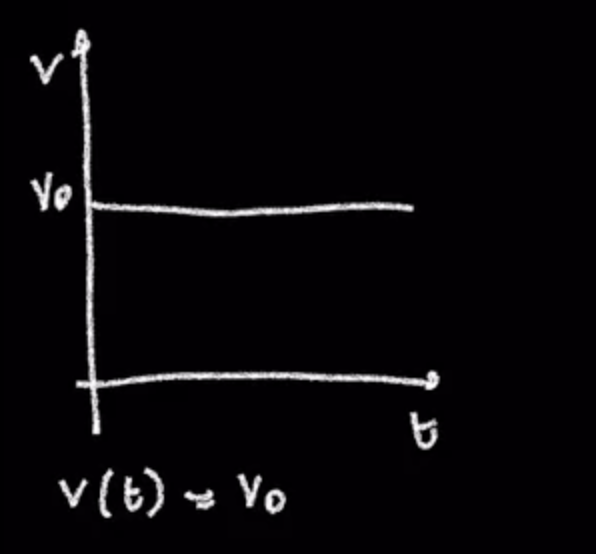
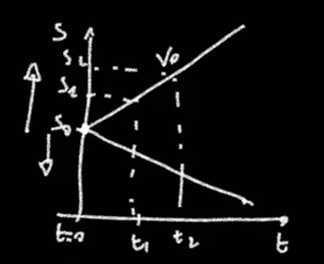
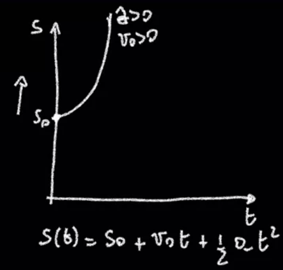

#BscUoL/CM #Maths/Functions

## Kinematics

* [Kinematics](../../../../permanent/Kinematics.md)
    * A way of describing the position of particles that how constant accelartion: how their speed changes and the distance travelled.
        * Examples:
            * What happens if I drop a ball from the top of a cliff?
                * The constant acceleration is given by gravity.
            * What happens if I'm a cyclist and I'm going down a hill?
                * Again, my acceleration is given by gravity
            * Gravity tends to be involved in most examples where we have constant acceleration because we live on a planet that has a force called $G$ or gravity which is around 10 meters per second.
        * It equates laws of motion:
            * How does that object speed up?
            * How does travel distance?
        * Why do you want to do that? Well, then you can think of many situations. We won't go into them now, but imagine if you're creating a game and you wanted to make it look like it was the real-world
        * Then these laws of motion will help you program properties of the objects which are under constant acceleration to look like they're realistic. It's important to understand the nature of the real world when you're modeling it and simulating it in the computer. That's why this subject is important and it gives you a first idea about how we do that.
        * The particles move with a constant acceleration. I can write the acceleration as a constant a and a will not change.
        * That is a constant and that will be a number. You really got to work it out or you'll be told what the number is.
        * Of course, if you put constant acceleration on the body, it's going to get faster
        * if you put the force or the acceleration is going against the velocity is going to slow down.
        * It's going to come to it like putting the force of breaks
        * You have an acceleration which is different opposite direction to vel
        * Particles moving with constant accelation
            * acceleration = $a$ (const)
            * initial velocity = $u$
            * final velocity = $v$
            * time elapsed = $t$
            * distance travelled = $s$
        * Four Rules of Kinematics
            * k1 = $s = \frac{u+v}{2} t$
                * distance travelled is average velocity x time
            * k2 = $v - u = at$
                * Change in acceleration is the same as how much it changes over time
            * k3 = $s = ut + \frac{1}{2} at^{2}$
            * k4 = $v^2 - u^2 = 2as$
                * Final velocity ^2 - inital velocity ^2 = 2 times acceleration x distance
        * Will always get 3 variables, and you will be asked to find the 4th depending on the question. Mostly about picking the correct formula to use.
        * Example:
            * I drop a tennis ball and it hits the ground after four seconds.
            * I tell you that the gravity, which is the acceleration.
                * The gravity gives you an acceleration of 10 and that 10 is constant.
            * I tell you that the gravity is 10. If I'm dropping a ball from a cliff, what is the initial velocity?
                * Well, the initial velocity is 0, because I'm letting it go from my hand. Right at the beginning it's not moving. The initial velocity is 0.
            * We're given the time is four.
            * The question says, find the final velocity.
            * Well, which formula do you think I'll use? I'll use this one, V equals u plus a,t. V equals naught, because there is no initiative of oscillate plus 4 times the time, so 4 times 10. The final velocity is 40 meters per second. Then the final thing. The distance traveled S equals to getting back is ut. That's naught, there' i no initial velocity times 4, I know that's a naught, plus 1/2 times the acceleration, which is 10 times t squared and t is 4 times 4 squared. This is equal to naught times 4, which is naught, plus 1/2 times 10, which is acceleration times the time squared, which is 80. Naught plus 80 is 80. The distance traveled is 80 meters. I actually think these are quite simple. You're not expected to know how to get these four laws of equations of motion. Only how to apply them in the right way.
                Your three knowns and you've got to find one unknown. It's a question of choosing the right formula and applying it. Hopefully, that should be quite straightforward.

## Uniform and uniformly accelerated motion, review and examples

* [Uniform Motion](Uniform%20Motion)
    * So far, we have looked one-dimensional motion: motion along the line.
    * Have looked at 2 forms of motion:
        * Uniform motion
        * uniformly accelerating motion
    * Uniform motion is one-dimensional motion with constant velocity.
    * We can example how our velocity changes with respect to time.
    * If the velocity does not change from its initial value, $v(t)$ remains at the initial value $v_0$.
        

    * Alternatively, here, the velocity increases over time
      

      * We can mark out different points in time and calculate the velocity: $s(t) = s_0 + v_0t$
          * $s(t)$ - represents the position of the object at time $t$.
          * $s_0$: This is the initial position of the object.
          * $v_0$: This represents the initial velocity of the object, or its speed in a specific direction at time $t=0$.
              * Velocity is often measured in meters per second (m/s) but it could be any appropriate unit of length per unit of time.
          * $t$: This is the time that has elapsed. Time is usually measured in seconds (s)
          * So you know where an object started, and you know its constant speed, can figure out where it will be in time.
      * $S(t) = S_0 + {V_0}t$
* [Uniform Accelerating Motion](Uniform%20Accelerating%20Motion)
    * Here the velocity is no longer constant.
        * If acceleration is positive, velocity will increase in time.
        * If acceleration is negative, velocity will decrease in time.
        * The formula for velocity is: $v(t) = v_0 + at$
            * $v_0$ = Initial velocity
            * $at$ = acceleration by time.
    * Can see our position as a function of time on a graph.
        
    * Equation to describe the position: $S(t) = S_0 + V_0 t + \frac{1}{2} {o_t}^2$
* Two key equations:
    * 1. $v(t) = v_0 - gt$
    * 2. $s(t) = s_0 + v_0 t - \frac{1}{2} g t^2$
    * g = gravitation acceleration = 9.8m/s^2
* Consider the case of a person jumping in the air:
    * Initial velocity: $1.2m$ (middle of body for a basketball player)
    * Jump height: $h = 0.3m$
    * Some conditions we have to understand:
        * gravitation acceleration constant:
    * To get the maximum height, where velocity is 0:
        * $v(\text{tmax}) = 0 = v_0 - gt_{max} \rightarrow tmax = \frac{v_0}{g}$
    * We can use the 2nd equation to get position at tmax.
        * $s(tmax) = s_0 + h = s_0 + v_0 \cdot tmax - \frac{1}{2} g (\frac{v_0}{g})^2$
        * We can replace tmax:
            * $s(tmax) = s_0 + h = s_0 + v_0 \cdot \frac{v_0}{g} - \frac{1}{2} g (\frac{v_0}{g})^2$
        * Can simplify by removing $s_0$ on both sides of equation:
            * $h = \frac{{v_0}^2}{g} - \frac{{v_0}^2}{2g} = \frac{{v_0}^2}{2g}$
        * Now we can find v_0:
            * $v_0 = \sqrt{2gh}$
            * $v_0 = \sqrt{2 \cdot 9.8 \cdot 0.3}$
            * $v_0 = 2.42$ (some how lecture gets 4.2 m/s)
        * There was a final formula about f_final, but I really cannot follow.

## Topic 5 live webinar: intervals and graphs

* [Closed Interval](Closed%20Interval)
    * $a \le x \le b$
    * Endpoints are included in the range
* [Open Interval](Open%20Interval)
    * $a \lt x \lt b$
    * Endpoints are not included
* [Semiclosed Range](Semiclosed%20Range)
    * $a \le x \lt b$
