#BscUoL/CM #Maths/Functions

## Lesson 5.1 Introduction to graph sketching and kinematics

* Graph Sketching and Kinematics overview
    * Define a [Function](../../../../permanent/function.md).
    * Show how to graphically represent a function.
* [Function](../../../../permanent/function.md)
    * A function f(x) links elements x,y of two sets X and Y.
        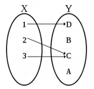
    * f(x) tells you what to do with input x.
    * Example: $f(x) = 2x + 4$
        * multiple by 2 and add 4
        * this function is mapping of real numbers to real numbers $f(x): R \rightarrow R$
    * [Domain of a Function](../../../../permanent/function-domain.md):
        * Elements of X on which f is defined.
        * Example:
            * Range excluding endpoints: $-4 < 4 < 4$ or $(-4, 4)$
                * all values between -4 and 4, excluding -4, 4.
            * Range including endpoints: $-4 \le x \le 4$ or $[-4, 4]$ include -4 and 4
            * Can mix inclusive/exclusive: $-4 \le x \lt 4$ or $(-4, 4]$ includes -4 not 4.
            * Union between 2 intervals: $-4 \le x \lt 4 \cup 6 \lt x \lt 8$ or $[-4, 4) \cup (6, 8)$
    * Codomain of a function:
        * Elements of Y linked by f to X.
        * Codomain also called image of the function.
    * [Surjective Function](../../../../permanent/surjective-function.md)
        * to each $y \in Y$ at least one $x \in X$
          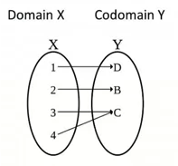
    * [Injective Function](../../../../permanent/injective-function.md)
        * to each $x \in X$ only one distinct $y \in Y$
          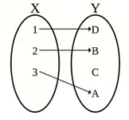
    * [Bijective Function](Bijective%20Function)
        * Injective + Surjective (one-to-one)
          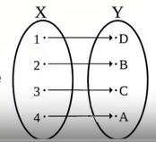
* [Cartesian Coordinates](../../../../../../permanent/cartesian-coordinates.md)
    * A of coordinates which is commonly used to graphically represent the range of a function.
    * Contains 2 perpendicular axes, $x, y$ to map and label points on the plane
      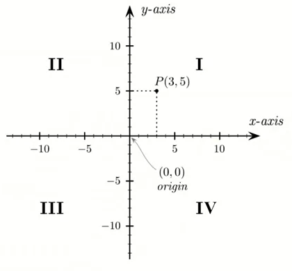
    * For point P in the above example, the projection on the x and y axes give a numeric pair, that is used to describe the point.
        * x is the length of the projection on the x-axis.
        * y is the length of the projection on the y-axis.
        * generic point on y-axis $P(0, y)$
        * generic point on x-axis $P(x, 0)$
    * Distance between P and Q:
        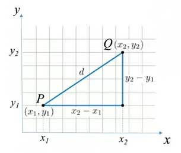
        * Can use Pythagoras theorem: $d_{PQ} = \sqrt{(x_2 - x_1)^2 + (y_2 - y_1)^{2}}$
* Examples:
    * $f(x) = -2x + 4$ Domain $R$.

| x      | -5                | -4      | -3       | -2      | -1      | 0      |
| ------ | ----------------- | ------- | -------- | ------- | ------- | ------ |
| f(x)   | -2 (-5) + 4 = 14 | 12      | 10       | 8       | 6       | 4      |
| coords | (-5, 14)          | (-4, 12) | (-3, 10) | (-2, 8) | (-1, 6) | (0, 4) |

| x      | 1               | 2      | 3       | 4       |
| ------ | --------------- | ------ | ------- | ------- |
| f(x)   | -2 (1) + 4 = 2 | 0      | -2      | -4      |
| coords | (1, 2)          | (2, 0) | (3, -2) | (4, -4) |

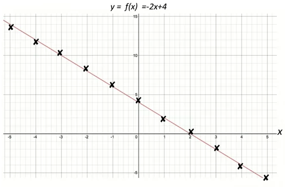
* Intersection with y-axis $\rightarrow$ $x=0 \rightarrow y_0 = f(0) = -2(0) + 4 = 4$
* Intersection with x-axis $\rightarrow y = 0 -> f(x_0) = 0$
* Solve $-2x_0 + 4 = 0 \rightarrow 2 x_0 = 4 \rightarrow x_o = 2$
* The angle that the straight line makes with x-axis
    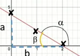
    * $\beta = 180 - \alpha$
    $tan(\beta) = a/b = 4/2 = 2$
* [Slope-Intercept Form](../../../../../../permanent/Slope-Intercept%20Form.md) for a straight line: $y = mx + n$
    * With $m = tan(\alpha)$, In our case $n=4$, $m=tan(\alpha) = -\tan(\beta) = -2$

## Quiz

The function $f$ is defined as $f(x) = \frac{1}{x+1} + 2$ on the domain $x > -1$.

1. Write down the equations of the asymptotes to the curve $y = f(x)$
2. Find the range of the function $f$.

Asymptotes:

A function of the form $f(x) = \frac{1}{x+a} + b$ has two asymptotes.

The vertical asymptote is given by the value of $x$ that makes the denominator equal to zero. In this case, $x+1=0$ implies that the vertical asymptote is $x=-1$.

The horizontal asymptote is given by the constant $b$ if $|a|$ tends to infinity. Here, as $x$ gets larger and larger (approaching infinity), the $\frac{1}{x+1}$ term becomes insignificant compared to the constant 2. This gives the horizontal asymptote as $y=2$.

### Essential Reading

Croft, A. and R. Davison Foundation maths. (Harlow: Pearson, 2016) 6th edition. Chapter 17 Graphs of functions.

Chapter 3 Motion (sections 3.1–3.7) of the following book
Bone, G., G. Chadha and N. Saunders A Level Physics A for OCR Year 1 and AS student book. (Oxford: OUP, 2015).

#### Motion 3.1 Distance and speed

* [Calculating Average Speed](Calculating%20Average%20Speed)
    * The average speed $v$ of an object can be calculate from the distance x tranvelled and the time t taken using the equation:
        * $\text{ average speed } = \frac{\text{ distance travelled }}{\text{ time taken }}$
        * Can be written algebrically as: $v = \frac{\Delta x }{\Delta t}$
            * The greek capital letter $\Delta$ means "change in". From the SI base units for distance and time, the unit of speed is $ms^{-1}$.
    * Worked example:
        * A car travels 2.5km in 1 minute 22 seconds. The average speed for the road is 50mph ($22ms^{-1}$$).
            * Step 1. Identify the equation and list the known values:
                * $v = \frac{\Delta x}{\Delta t}$
                * $\Delta x$ = 2500m
                * $\Delta t$ = 1 minute 22 seconds = 60 + 22 = 82s.
            * Step 2. Substitute the values into the equation and calculate the answer:
                * $v = \frac{2500}{82} = 30.49ms^{-1}$
                * $v = 30ms^{-1}$ (2 s.f.)
            * Since 30ms > 22ms, the driver exceeded the average speed limit.
* [Distance-time Graphs](Distance-time%20Graphs)
    * Graphs of distance against time are used to represent the motion of objects.
        * Distance is plotted on the y-axis (vertical axis).
        * Time is plotted on the x-axis (horizontal axis)
    * In distance-time graphs, a stationary object is represented by a horizontal straight line. An object moving at a constant speed is represented by a straight, sloping line.
    * The gradient of that line is equal to the distance travelled divided by the time taken, $\frac{\Delta x}{\Delta t}$, in other worse to the speed of the object.
        * speed = gradient of a distance-time graph.
    * In Fig 2:
        * Change in distance: $\Delta x = 1400 - 400 = 1000m$
        * Change in time: $\Delta y = 70 - 20 = 50s$
        * Speed $v = \frac{\Delta x}{\Delta y} = \frac{1000}{50} = 20ms^{-1}$
        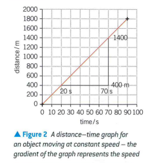
    * Tip: use at least half the length of the line to make the gradient.
* [Instantaneous Speed](Instantaneous%20Speed)
    * One critism of checks on average speed: the vehicle can hit a top speed above the speed limit, and then travel slowly for part of it to meet average speed limits.
    * Instantaneous Speed is speed of car over short interval of time.
    * Insantaneous pseed is found by drawing the tangent to the distance-time graph, then determining the gradient of this tanger.
    * Greater the gradient, the greater the instantaneous speed.
    * Summary questions
        * 1. Calculate the average speed in $ms^{-1}$ for the following bicycle journeys:
            * a) a distance of 180m covered in a time of 9.0s:
                * $180/9 = 20ms^{-1}$
            * b) a distance of 2.0km covered in 6.5 minutes:
                * 2.0km = 2000m
                * 6.5 minutes = 60 x 6.5 = 390m
                * $2000 / 6.5 = 5.13ms^{-1}$
        * 2. A snail travels 19.2m in 1 day (24 hours)
            * Calculate its average speed in $ms^{-1}$
            * $\Delta x = 19.2m$
            * $\Delta y = 24 * 60 * 60 = 84600$ seconds
            * $19.2/84600 = 0.0002ms^{-1}$
        * 3. A car travels for 19 sat an average speed of 31 m s- 1. How far does it travel?
        * 4. An aircraft travels at an average speed of 240 m s- 1 for 12 000 km.
        * 5. A lorry travels on a motorway for 2.0 minutes at a constant speed of $25 ms^{-1}$. It then struggles on a hill and travels 800 m in 50 s. Calculate:
            * a the total distance travelled; (2 marks)
            * b the average speed of the lorry.
        * Use Figure 3 to determine tM instantaneous speed of the object at time t = 80 s.
* 3.2 Displacement and velocity
    * Where a swimmer does one 2 laps, returning to their original position, their displacement is 0.
    * A displacement $s$ is a [Vector](../../../../permanent/vector.md) quantity, unlike distance, which is a [Scalar](Scalar).
    * Average velocity $v$ of an object can be calculated from the change in displacement and the time taken.
            * $\text{average velocity} = \frac{\text{ change in displacement }}{\text{ time taken }}$
            * We can write it in algebraic form as: $v = \frac{ \Delta s } { \Delta t }$
            * Where $\Delta s$ is the change in displacement and $\Delta t$ is the time taken.
            * The SI unit for velocity is $ms^{-1}$
        * Worked example, to see how average speed and average velocity differ:
            * Leeds is 21 km south of Harrogate, but the distance by road is about 24km (Fig 2).
            * It takes 37 minutes to travel from Harrogate to Leeds by road.
            * Calculate the avertage pseed and athe average volecity.
            * Step 1. Identify the equations needed:
                * average speed: $v = \frac{\Delta x}{\Delta y}$, average velocity: $v = \frac{\Delta s}{\Delta t}$
            * Step 2. substitude the values in SI units into the equations and calculate the answers.
                * time taken = $\Delta t = 60 \times 37 = 2220s$
                * average speed: $v = \frac{\Delta x}{\Delta y} = \frac{24000}{2220} = 10.8ms^{-1} = 11ms^{-1}$ (2 s.f.)
                * average velocity: $v = \frac{\Delta s}{\Delta t} = \frac{21000}{2220} = 9.5ms^{-1}$
                * The magnitude of the average velocity is 9.5ms^{-1} and its direction is due south from Harrogate.
            * b) What would happen to the magnitude of the average volecity if the journey was from Harrogate to Leeds and then back to Harrogate?
                * The overall change in displacement woudl be zro and theroge average velocity would be zero.
    * Diplacement-time graphs
        * Graphs of displacement against time are used to represent the motion of objects.
        * Displacement is plotted on the y-axis (vertical axis).
        * Time is plotted on the x-axis (horizontal axis).
        * Here we see the displacement-time graph for a car travelling along a straight road. The car is travelling at a constant velocity between $t = 0$ and $t = 20s$, as seen from the first straight-line section of the graph.
            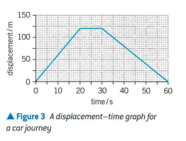
        * The horizontal section of the graph between t = 20s and t = 30s shows the displacement of the car remians constant.
        * Therefore, the carm ust be stionary.
        * After t =30s, teh graph is still a sraight line but has a negative slope.
        * The dosplacement is getting smaller.
        * The car must therefore be returning at a constant velocity.
        * You can determine the velocity of an object from the gradient of its displacement-time (s-t) graph. If th e graph is no a straigh line, draw a tangent to the graph, then calcualte the gradient of this tangent for the instantaneous velicty, as illustrated in Fig 4.
            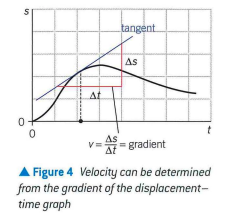
        * Example: use figure 3 to find velocity of the car at t = 10s and t = 40s
            * Step 1. Identify the equation needed and how to obtrain the values from the graph:
                * $\text{ Velocity } v = \frac{\Delta s}{\Delta t}$
                    * The right-hand terms are equivalent to the change on the y-axis (s) divided by the change on the x-axis (t)
            * Step 2. Substitude the values into the equation and calculate the answer.
                * The velocity at t=10s can be determined from the gradient of the straight-line graph between t=0 and t=20s
                    * $\text{velocity v } = \frac{\Delta s}{\Delta y} = \frac{120-0}{20-0} = 60ms^{-1}$
                    * velocity at $t=40s$ can be determined from the gradient of the straight-line graph between $t =30s$ and $t = 60s$
                        * $\text{ velocity v } = \frac{ \Delta s }{\Delta t} = \frac{0-120}{60-30} = -4.0ms^{-1}$
                            * Negative sign fo the velocity shows that the car is travelling in the opposite direction toits motion between 0 and 20s
        * Summary questions:

## Lesson 5.2 Higher order polynomials

* Recap: Cartesian coordinates allow map and label points on the plane.
    * By associating a point a pair of numbers called Cartesian Coordinates.
* For a function associated with value x, and another value f(x), we can interpret as coordinates on the plane.
    * For example, a [Linear Function](../../../../permanent/linear-function.md) when plotted is a straight line.
* [Quadratric Functions](../../../../permanent/quadatric-functions.md)
    * A function where $x$ appears with a power equal or less than two.
    * For example, consider the function $f(x) = x^2 - 4x$, $D = \mathbb{R}$
        * It appears like a parabola on a graph.
            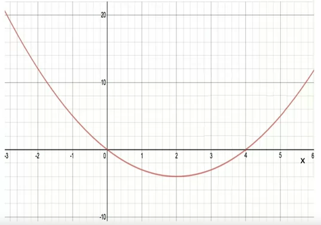
    * You can make the plot using a simple table, evaluating the function for different inputs.
        * $-3, (-3)^2 - 12 = 21$,
        * $-2, (-2)^2 - 4 = 21$
        * $-1, (-1)^2 - 4 = 5$
        * $0, (0)^2 - 0 = 0$
        * $1, (1)^2 - 4 = -3$
        * $2, (2)^2 - 8 = -4$
    * Knowing where the function intersects the axis can be helpful.
        * We can see from looking at the plot of the graph.
        * We can also calculate it by setting the alt axis as 0:
            * Intersection with y-axis $\rightarrow x=0 \rightarrow y_0 = f(0) = (0)^2-4(0) = 0$
            * Intersection with x-axis $\rightarrow = f(x_0) = {x_0}^2 +-4x_0 = 0$
    * Solve ${X_0}^2 - 4x_0 = x_0 (x_0-4) = 0 \rightarrow x_0 = 0, x_0 = 4$
        * Since there is 2 answers, it tells us that there's 2 points of intersection.
    * Generic quadratic function $f(x) = ax^2 + bx + c$
        * Intersection with y-axis: $\rightarrow x=0 \rightarrow y_0 = f(0) = a(0)^2 + (0) +c$
        * Intersection with x-axis: $\rightarrow y=0 \rightarrow f(x_0) = {ax_0}^2 + bx_0 + c = 0$
        * Solve ${ax_0}^2 + bx_0 + c = 0 \rightarrow x_0 = (-b \pm \sqrt(b^2 - 4ac) ) / (2a)$
* [Cubic Function](Cubic%20Function)
    * $f(x) = ax^3 + bx^2 + cx + d$
    * Ex: $x^3 - 4x$, $D=R$
    * Intersection with y-axis $\rightarrow x=0 \rightarrow = y_0 = f(0) = (0)^3 - 4(0) = 0$
    * Intersection with x-axis $\rightarrow = y = 0 \rightarrow f(x_0) = 0$
    * Solve ${x_0}^3-4x_0=x_0({x_0}^2-4)=0 \rightarrow x_0 = 0, x_0 = \pm 2$
        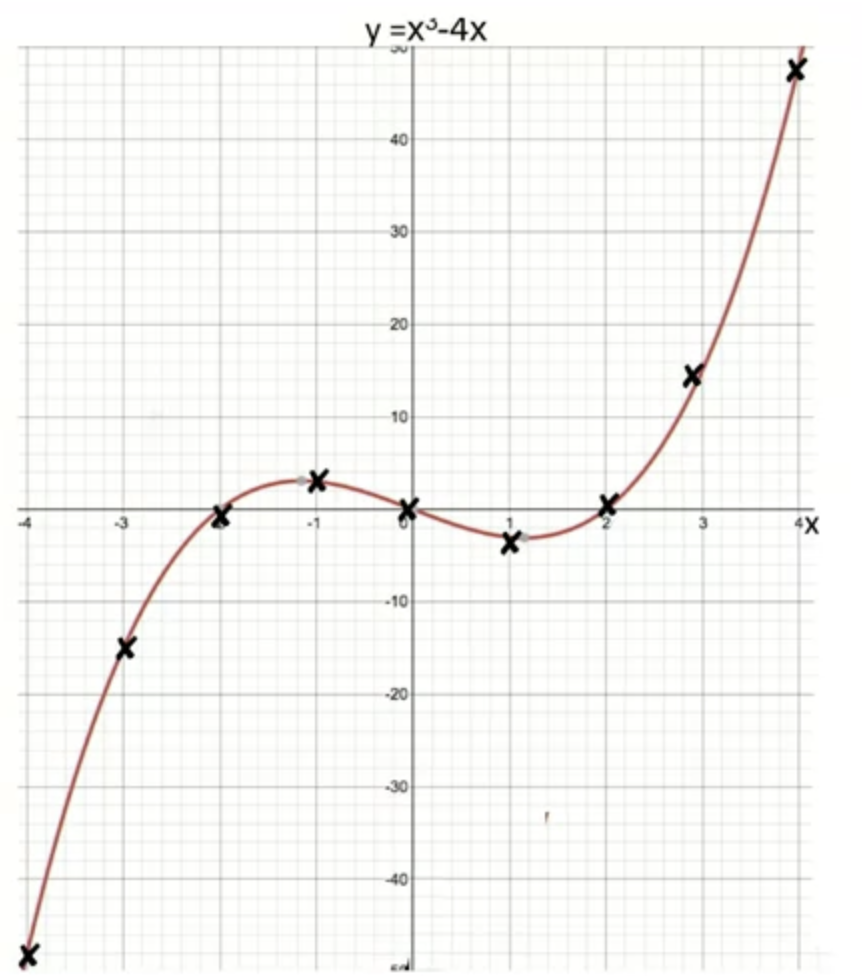
    * Note: vertical line intersects the curve in only one point: single-valued functions.
    * Higher order polynomials $f(x) = ax^n + bx^{n-1} + ... + cx + d$
        * Example in factorised form: $f(x) = (x+2)(x+1)(x-1)(x-2)(x-3) n =5 D = R$
            * We can set x to value to make the parenthesis equal to 0, to find the intersection points.
* [Fraction](Fraction)
    * $f(x) = P(x) / Q(x)$
    * $f(x) = x/(x^2-1)$
        * Domain: $R\{-1, 1\}$
    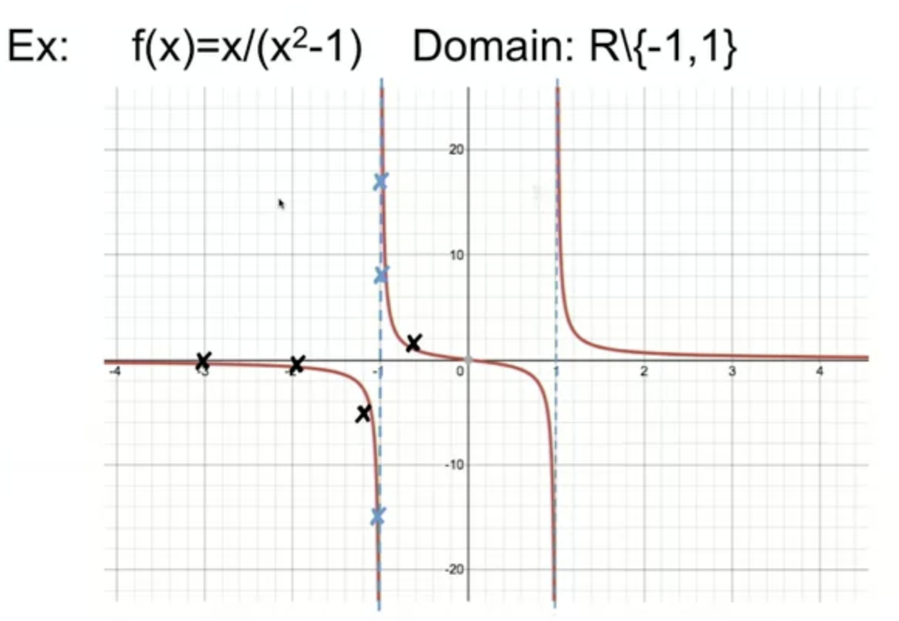
    * This specific function has two vertical asymptotes in x equal minus 1 and x equal 1, which are indicated by the dashed blue lines on the plot.

## Essential reading

Larson, R. Precalc with limits. (Boston, MA: Cengage, 2017) 4th edition. Chapter 1 Functions and their graphs (sections 1.1–1.8).
