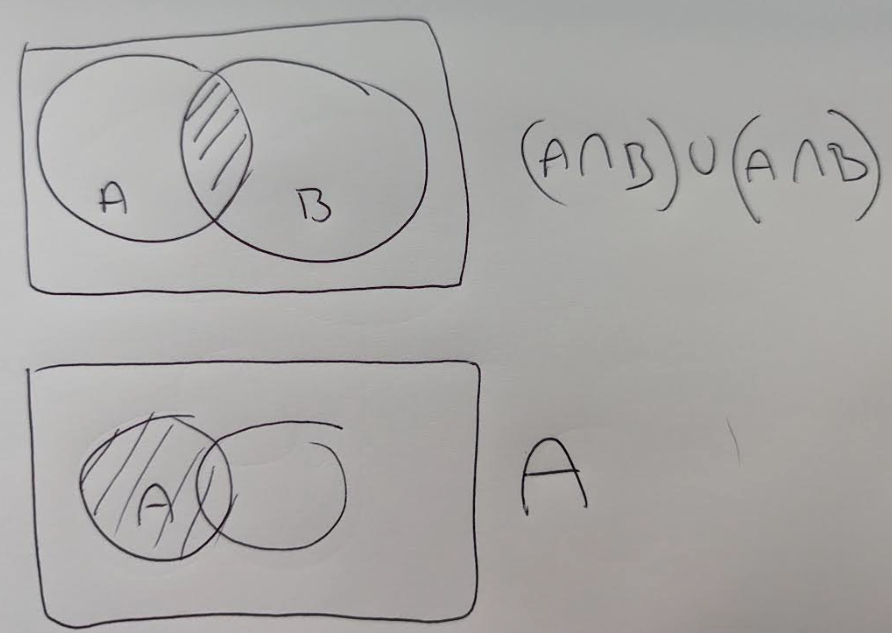
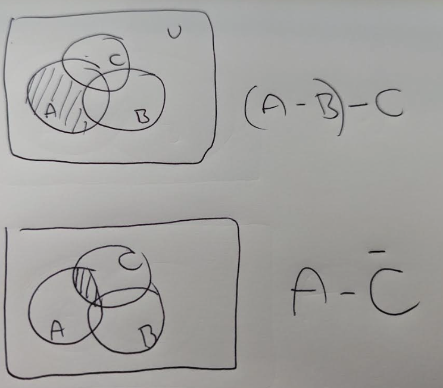
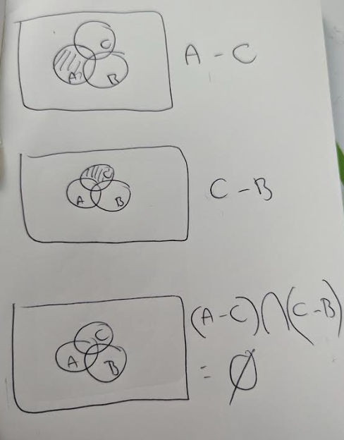
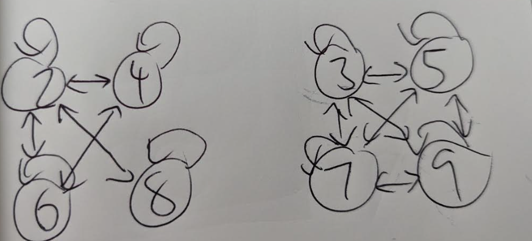

# Final Exam

## Part A

## Question 1

In Company, there are 55 members of staff. Each member posts a greeting card to all the members. How many greeting cards where posted by them?

Each person posts to 54 people. Therefore:

55 * 54 = 2970

## Question 2

Which of the following represents the set:

$\{−1, \frac{1}{2}, \frac{−1}{3},\frac{1}{4},\frac{−1}{5},\frac{1}{6},\frac{−1}{7},\frac{1}{8},\frac{−1}{9},\frac{1}{10} \}$

$\frac{(-1)^n}{n} : n \in Z \text{ and } 0 \leq n \leq 10 \}$

## Question 3

Let $R$ be a relation on the set of positive integers with $n \ R \ m \rightarrow n \text{ divides } m$

Which of the following statements is true about this relation $R$?

* It is reflexive. $\forall x \in S$, $x \ R \ x$. A number always divides itself.
* It is NOT symmetric. $\forall x \in S$, If $x \ R \ y$, then $y \ R \ x$ is NOT true. For example, 2 / 4 is true, but 4 / 2 is false.
* It is transitive. $\forall x,y \in S$ if $x \ R \ y$ and $y \ R \ z$ then $x \ R \ z$. If 2 / 4 and 4 / 8 then 2 / 8. If 3 / 6 and 6 / 60 then 3/ 60.

Therefore the answer is reflexive, transitive and NOT symmetric.

## Question 4

Which of the following are not functions?

The trick to this will be to find the ones that have invalid input in the range.

a.
$f : R \rightarrow R$
$f(x) = \frac{1}{1 + x^2}$

This is a function. As there are no negative numbers returned $\forall x \in R$, $x^2$, so it will never divide by 0.

b.
$f : R \rightarrow R$
$f(x) = log_e(x)$

This is NOT a function, as the range is invald when $x \leq 0$

c.
$f : R \rightarrow R$
$f(x) = \frac{1}{1 - x^2}$

This is NOT a function, as the range is invalid when $x = 1$, $\frac{1}{1-1} = \frac{1}{0}$

d.
$f: Q \rightarrow Q$
$f(x) = \frac{x}{2}$

This is a function. There isn't any number in the set of rational numbers that can't be divided by 2.

## Question 5

Which degree sequence cannot represent a simple graph?

We know that for a simple graph, the degree of each vertex of G is at most equal to $n-1$.

Therefore: $2, 4, 3, 3$ is not a simple graph.

## Question 6

Let $p$ and $q$ be two propositions. Which one of the following logical expression is equivalent to $\neg (p \rightarrow q)$

| p   | q   | $\neg p$ | $\neg q$ | $p \rightarrow q$ | $\neg (p \rightarrow q)$ | $p \lor \neg q$ | $p \land \neg q$ | $\neg p \land q$ | $\neg p \lor q$ |
| --- | --- | -------- | -------- | ----------------- | ------------------------ | --------------- | ---------------- | ---------------- | --------------- |
| 0   | 0   | 1        | 1        | 1                 | 0                        | 1               | 0                | 0                | 1                |
| 0   | 1   | 1        | 0        | 1                 | 0                        | 0               | 0                | 1                | 1                |
| 1   | 0   | 0        | 1        | 0                 | 1                        | 1               | 1                | 0                | 0                |
| 1   | 1   | 0        | 0        | 1                 | 0                        | 1               | 0                | 0                | 1                |

## Question 7

What is the number of edges in a complete graph $K_{10}$?

Number of edges in complete graph = $K_N = N(N-1)/2$

$$
\begin{align}
&= 10 * 9 / 2 \\
&= 90 / 2 \\
&= 45
\end{align}
$$

## Question 8

In how many ways a committee of 5 members can be selected from 6 men and 5 women, consisting of 3 men and 2 woman?

Number of ways we can select 3 men from 6 men (given order is not important):

$\frac{n!}{k!(n-k)!}$
$\frac{6!}{3! 3!} = 20$

Number of ways we can select 2 woman from 5 woman:

$\frac{5!}{2!3!} = 10$

Using the multiplication principle, we get 20 * 10 = 200

## Question 9

In how many ways can a football team of 11 be selected from a squad of 15 players?

$\frac{15!}{11!4!} = 1365$

## Question 10

Consider the following predicate logic statement:

$\forall x \in D$, $\exists y \in D$, $(P(x) \land Q(x) \rightarrow R(x))$

Which one of the predicate logic statements below is equivalent to the negation of the original statement?

$\neg (\forall x \in D$, $\exists y \in D$, $(P(x) \land Q(x) \rightarrow R(x)))$

$(\exists x \in D$, $\forall y \in D$, $\neg (P(x) \land Q(x) \rightarrow R(x)))$

We can simplify that, knowing that the negation of $P \rightarrow Q$ is $P \land \neg Q$

$(\exists x \in D$, $\forall y \in D$, $P(x) \land Q(x) \land \neg R(x)))$

## Part B

### Question 1

a. List the elements of the following sets

i. $\{x | x \in Z \land (x ^2 = 6)\}$

$\emptyset$

ii. $\{x | x \in Z \land (x ^2 = 9) \}$

$\{ 3 \}$

iii. $\{x | x \in \mathbb{N} \land (x \mod 2 = 1) \land (x < 10) \}$

$\{1, 3, 5, 7, 9\}$

b. Let $A$ and $B$ be two sets such that $|A| = |B| = n$ and $|A \cap B| = 1$. Find:

i. $|A \cup B|$

$$
\begin{align}
|A \cup B| &= |A| + |B| - |A \cap B|\\
&= n + n - 1 \\
&= 2n - 1
\end{align}
$$

ii. $|P(A \cup B)|$

We know that $|P(S)| = 2^{|S|}$.
Therefore, $|P(A \cup B)| = 2^{2n-1}$

c. Prove the following set identities, using either Venn Diagrams or the rules of sets. Show your working.

i. $(A \cap B) \cup (A \cap B) = A$

The set identity $(A \cap B) \cup (A \cap B) = A$ is not correct.

It can be simplified based on absorption rule: $(A \cap B) = A$

It would only be correct when $B = A$

This venn diagram shows that $(A \cap B) \cup (A \cap B) \neq A$

ii. $(A - B) - C \subseteq A - \overline{C}$

This statement is FALSE.

This Venn Diagram shows that $(A - B) - C \not \subseteq A - \overline{C}$

iii. $(A - C) \cap (C - B) = \emptyset$

This Venn Diagram proves that this set identity is TRUE.

d. Let $p$, $q$ and $r$ be three propositions for which $p$ and $q$ are T and $r$ is false. Determine the truth value for each of the following.

i. $p \rightarrow (r \rightarrow q)$

$T \rightarrow (F \rightarrow T)$
$T \rightarrow T$
$T$

ii. $(p \oplus r) \rightarrow \neg q$

$T \rightarrow \neg T$
$T \rightarrow F$
$F$

iii. $p \land (r \rightarrow q)$

$T \land (F \rightarrow T)$
$T \land T$
$T$

e. The universe of discourse is the set of all positive integers, $\mathbb{Z}^{+}$

What are the truth values for each of the following?

i. $\exists x \forall y (x \leq y)$

True

When $x = 1$, $x \leq y$ is true for all $y \in Z^{+}$

ii. $\exists x \exists y (x + y = 0) \lor (x \cdot y = 0)$

False.

These are no positive integers that can be added to make zero, or multiplied to make zero. This would only be true if the universe of discourse included 0 or negative numbers.

iii. $\forall x \forall y (x \cdot y \geq x + y)$

False.

When $x = 1$ and $y = 1$, $x \cdot y = 1$ and $x + y = 2$, $1 \not \geq 2$

f. Re-write the following statements without any negations on quantifiers.

i. $\neg \exists x P(x)$

$\forall x \neg P(x)$

ii. $\neg \exists x \neg \exists y P(x, y)$

$\forall x \neg \neg \exists y P(x, y)$

$\forall x \neg \forall y \neg P(x, y)$
$\forall x \exists y \neg \neg P(x, y)$
$\forall x \exists y \neg P(x, y)$

iii. $\neg \exists x \forall y P(x, y)$

$\forall x \exists y \neg P(x, y)$

g. Decide whether the following arguments are valid or not. State the Rule of Inference or fallacy userd.

Note: I assume this parent question description is wrong, based on the questions below it.

i. Let $A$, $B$, and $C$ be three sets. Prove by contradiction that if $A \cap B \subseteq C$ and $x \in B$ then $x \not \in A - C$

To prove by contradiction, we start on the assumption that the statement we want to prove is false, and show this leads to false proposition.

Assume that $A \cap B \subseteq C$ and $x \in B$ then $x \in A - C$

From set difference, we have $x \in A$ and $x \not \in C$.
Since $x \in B$, we have $x \in A \cap B$
Therefore, we have $x \in A \cap B$ and $x \not \in C$, which contradicts the assumption that $A \cap B \subseteq C$

Therefore, our assumption that $x \in A - C$ must be false.
This proves that $A \cap B \subseteq C$ and $x \in B$ then $x \not \in A - C$

ii. Suppose that I want to purchase a tablet computer. I can choose either a large or a small screen; a 64GB, 128GB or 256 GB storage capacity and black, while, gold or silve cover.

Screen options = 2
Storage capacity options = 3
Cover colour options = 4

Total options = 2 * 3 * 4 = 24

---

### Question 3

a. Explain the difference between a Euler path and an Euler cycle

A Euler path is a path in a graph that visited each edge exactly once.
A Eyler cycle is a Euler path that visits each edge exactly once, but which ends at the same vertex.

The key difference is that a Euler path ends at different vertices, where a cycle ends at the same vertex.

b. Find the maximum nnumber of comparisons to be made to find any record in a binary search tree which holds 3000 records.

Assuming the tree is balanaced, the maximum number of comparisons to be made is equal to the height.

We calculate the height as $h = \text{ceil}(log_2 (N + 1))$

h = 9

Therefore, there are 9 comparisons to be made to find any record in a balanaced BST.

c. Explain what is meant by the term "path"

A path is a trail (where no edge is repeated) where neither vertices nor edges are repeated.

d. The figure shows a network of cycle tracks. The number on each edge represents the length, in milse, of that track. Jay wishse sto cycle from A to I as part of a cycling holiday. She wishes to minimise the distance she travels.

Init.

| Node | Shortest path from A |
| ---- | -------------------- |
| A    | 0                     |

Unvisited = {B, D, E, C, F, G, H, I}

Step 2.

Visit B.

| Node | Shortest path from A | Previous vertex |
| ---- | -------------------- | --------------- |
| A    | 0                    | A               |
| B    | 23                   | A               |

Unvisited = {D, E, C, F, G, H, I}

Step 3.

Visit E.

| Node | Shortest path from A | Previous vertex |
| ---- | -------------------- | --------------- |
| A    | 0                    | A               |
| B    | 23                   | A               |
| E    | 23 + 27              | B                |

Unvisited = {D, C, F, G, H, I}

Step 4.

Visit D

| Node | Shortest path from A | Previous vertex |
| ---- | -------------------- | --------------- |
| A    | 0                    | A               |
| B    | 23                   | A               |
| E    | 23 + 27              | B               |
| D    | 23 + 28              | B                |

Unvisited = {D, C, F, G, H, I}

Step 5.

Visit C

| Node | Shortest path from A | Previous vertex |
| ---- | -------------------- | --------------- |
| A    | 0                    | A               |
| B    | 23                   | A               |
| E    | 23 + 27              | B               |
| D    | 23 + 28              | B               |
| C    | 39                   | A                |

Unvisited = {F, G, H, I}

Step 6.

Visit F

| Node | Shortest path from A | Previous vertex |
| ---- | -------------------- | --------------- |
| A    | 0                    | A               |
| B    | 23                   | A               |
| E    | 23 + 27 =50              | B               |
| D    | 23 + 28 = 51              | B               |
| C    | 39                   | A               |
| F    | 51 + 21 = 83              | D                |

Unvisited = {G, H, I}

Step 7.

Visit G

| Node | Shortest path from A | Previous vertex |
| ---- | -------------------- | --------------- |
| A    | 0                    | A               |
| B    | 23                   | A               |
| E    | 23 + 27 =50          | B               |
| D    | 23 + 28 = 51         | B               |
| C    | 39                   | A               |
| F    | 51 + 21 = 83         | D               |
| G    | 51 +37 = 88          | D               |

Unvisited = {H, I}

Step 7.

Visit G

| Node | Shortest path from A | Previous vertex |
| ---- | -------------------- | --------------- |
| A    | 0                    | A               |
| B    | 23                   | A               |
| E    | 23 + 27 =50          | B               |
| D    | 23 + 28 = 51         | B               |
| C    | 39                   | A               |
| F    | 51 + 21 = 83         | D               |
| G    | 51 +37 = 88          | D               |

Unvisited = {H, I}

Step 8.

Visit I

| Node | Shortest path from A | Previous vertex |
| ---- | -------------------- | --------------- |
| A    | 0                    | A               |
| B    | 23                   | A               |
| E    | 23 + 27 =50          | B               |
| D    | 23 + 28 = 51         | B               |
| C    | 39                   | A               |
| F    | 51 + 21 = 83         | D               |
| G    | 51 +37 = 88          | D               |
| I    | 88 + 21 =  109          | G               |

Unvisited = {H}

Shortest path: A -> B -> D -> G -> I

----

e) Given $S$ is the st of integers {2, 3, 4, 5, 6, 7, 8}. Let R be a relation defined on S by the following condition such that:

$\forall x, y \in S$, if $x \ R \ y$ then x mod 2 = y mod 2

i. Draw the digraph of R

ii. Show that R is an equivalence relation.

* R is reflexive. $\forall x \in S$, $x \ R \ x$
* R is symmetric. $\forall x, y \in S$, if $x \ R \ y$, then $y \ R \ x$
* R is transitive. $\forall x, y, z \in S$, if $x \ R \ y$ AND $y \ R \ z$ then $x \ R \ z$

Therefore $R$ is a equivalence relation.

iii. Find the equivalence classes for R.

* $\{ 2, 4, 6, 8\}$
* $\{3, 5, 7, 9\}$

iv. Is item R a partial order?

To be a partial order, R must reflexive, transitive and ANTI-symmetric. R is NOT anti-symmetric. $\forall x, y$, if $x \ R \ y$ and $y \ R \ x$ it is NOT the case that $x = y$ for example $2 R 4$ and $4 R 2$ but $2 \neq 4$

f. Let $f : A → B$ and $g : B → C$ be functions. Prove that if g o f is one-to-one , then f is one-to-one.

**Proof**

Since $g \ o \ f$ is one-to-one, we show that for all $a, b \in A$ if $a \ne b$ then $f(a) \ne f(b)$

$g \ o \ f$ is a one-to-one function. So, given $a, b \in A$ with $a \ne b$ then $(gof)(a) \ne (gof)(b)$

Therefore, $g(f(a)) \ne g(f(b))$.

Therefore, $f(a) \ne f(b)$, which implies $f$ is a one to one function.
