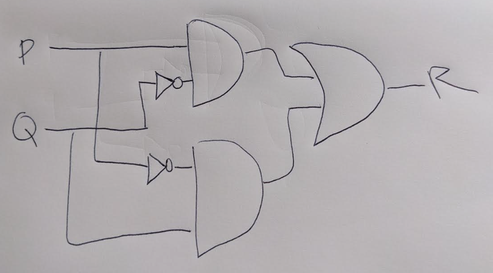

## Question 1

### a

Let $A$ and $B$ be two sets with $|A| = 20$, $|B| = 25$ and $|A \cup B| = 35$. Find $|A \cap B|$

$$
\begin{align}
|A \cap B| &= |A| + |B| - |A \cup B| \\
&= 20 + 25 - 35 \\
&= 10
\end{align}
$$

---

### b

In a group of 100 people, 73 people can speak English and 43 can speak Spanish.

$A = \text{Set of those that can speak English}$
$B = \text{Set of those that can speak Spanish}$

$|A| = 73$
$|B| = 43$
$|A \cup B| = 100$

#### i

How many can speak both English and Spanish?

$A \cap B$ is the set of people who speak both English and Spanish.

$$
\begin{align}
|A \cap B| &= |A| + |B| - |A \cup B| \\
&= 73 + 43 - 100 \\
&= 16

\end{align}
$$

#### ii

How many can speak English only?

$A - B$ is the set of people who speak English only.

$$
\begin{align}
|A - B| &= |A| - |A \cap B| \\
&= 73 - 16 \\
&= 57
\end{align}
$$

#### iii

How many can speak Spanish only?

$B - A$ is the set of people who speak Spanish only.

$$
\begin{align}
|B - A| &= |B| - |A \cap B| \\
&= 43 - 16 \\
&= 27
\end{align}
$$

#### iv

Draw a Venn Diagram to show this information.

.png)

---

### c

Let $A$ and $B$ be two sets. Determine which of the following statements are true and which are false. Prove each statement is true and give a counter example.

#### i

$P(A \cap B) = P(A) \cap P(B)$

The statement $P(A \cap B) = P(A) \cap P(B)$ is **true**

**Proof**

I will show that $P(A \cap B) \subseteq P(A) \cap P(B)$ and $P(A) \cap P(B) \subseteq P(A \cap B)$

Suppose $X \in P(A \cap B)$.
Since $X \in P(A \cap B)$, we infer $X \subseteq A \cap B$.
Therefore, $X \subseteq A$ and $X \subseteq B$.
Therefore, $X \in P(A)$ and $X \in P(B)$.
Therefore, $X \in P(A) \cap P(B)$
Which means, $P(A \cap B) \subseteq P(A) \cap P(B)$.

Suppose $X \in P(A) \cap P(B)$.
Since $X \in P(A) \cap P(B)$, we infer $X \in P(A)$ and $X \in P(B)$
Therefore, $X \subseteq A$ and $X \subseteq B$
Therefore, $X \subseteq A \cap B$
Therefore, $X \in P(A \cap B)$
Which means, $P(A) \cap P(B) \subseteq P(A \cap B)$

This concludes the proof.

#### ii

$P(A \cup B) = P(A) \cup P(B)$

The statement $P(A \cup B) = P(A) \cup P(B)$ is **false**.

**Proof**

I give a proof by counterexample.

$A = \{1\}$
$B = \{2\}$

$A \cup B = \{1, 2\}$

$P(A) = \{\emptyset, \{1\}\}$
$P(B) = \{\emptyset, \{2\}\}$

$P(A \cup B) = \{\emptyset, \{1\}, \{2\}, \{1, 2\}\}$
$P(A) \cup P(B) = \{\emptyset, \{1\}, \{2\}\}$

Therefore, $P(A \cup B) \ne P(A) \cup P(B)$

This concludes the proof.

#### iii

$P(A) \cup P(B) \subseteq P(A \cup B)$

The statement $P(A) \cup P(B) \subseteq P(A \cup B)$ is **true**

**Proof**

I show that $X \in P(A) \cup P(B) \rightarrow X \in P(A \cup B)$

Suppose $X \in P(A) \cup P(B)$
Therefore, $X \in P(A)$ or $X \in P(B)$
Therefore, $X \subseteq A$ or $X \subseteq B$
Therefore, $X \subseteq P(A \cup B)$

This means that $X \in P(A) \cup P(B) \rightarrow X \in P(A \cup B)$

This concludes the proof.

---

## Question 2

### a

Which of the following are functions? If f is not a function explain why.

#### i

$f : \mathbb{R} \rightarrow \mathbb{R} \text { with } f(x) = \frac{1}{1−x^2}$

To be a function, every element in the domain has to have an image in the co-domain.

$-1, 1 \in \mathbb{R}$

However, $f(-1)$ and $f(1)$ don't exist.

$f(1) = \frac{1}{1-1^2} = \text{ Undefined due to divide by 0 }$
$f(-1) = \frac{1}{1-(-1)^2} = \text{ Undefined due to divide by 0 }$

Therefore, this is **not a function**.

#### ii

$f : \mathbb{Z} \rightarrow \mathbb{Z} \text { with } f(x) = \frac{x}{2}$

To be a function, every element in the domain has to have an image in the co-domain.

$3 \in \mathbb{Z}$
$f(3) = 3/2 = 1.5$
$1.5 \notin \mathbb{Z}$

3 and all other odd numbers don't have an image. Therefore, this is **not a function**.

#### iii

$f : \mathbb{R} \rightarrow \mathbb{R}$ with $f(x) = ln(x)$

To be a function, every element in the domain has to have an image in the co-domain.

$0 \in \mathbb{R}$
$f(0) = ln(0) =  \text{Undefined}$

Therefore, this is **not a function**.

---

### b

Let $f : \mathbb{R} \rightarrow \mathbb{R}$ and $g : \mathbb{R} \rightarrow \mathbb{R}$ with $f(x) = x + 2$ and $g(x) = -x$. Find $g \ o \ f$, $(g \ o \ f)^{-1}$, $f^{-1}$, $g^{-1}$

* $g \ o \ f = g(f(x)) = g(x + 2) = -(x + 2) = -x - 2$
* $(g \ o \ f)^{-1} = -x - 2$
    * **Proof**
        * $(g \ o \ f) = y$
        * $-x - 2 = y$
        * $-x = y + 2$
        * $x = -y - 2$
* $f^{-1} = x - 2$
    * **Proof**
        * $f(x) = y$
        * $x  + 2 = y$
        * $x = y - 2$
* $g^{-1} = (-x)^{-1} = -x$

---

### c

Let $f : \mathbb{R}^{*} \rightarrow \mathbb{R}$ with $f(x) = \frac{x + 1}{x}$ where $\mathbb{R}^{*}$ is the set of all real numbers different from 0.

#### i

Determine whether or not f is a one to one function

This function is one to one (injective).

**Proof**

Let $a, b \in \mathbb{R}^{*}$

I will show that $f(a) = f(b) \rightarrow a = b$

$f(a) = f(b)$
$\frac{a + 1}{a} = \frac{b + 1}{b}$
$b(a + 1) = a(b + 1)$
$ba + a = ab + a$
$(ba + b) - ab = (ab + a) - ba$
$b = a$

Therefore, this function is one to one.

This concludes the proof.

#### ii

Determine whether or not $f$ is an onto function.

This function is onto (surjective).

**Proof**

Show that for any element $y \in R$, there exists $x \in R^{*}$ such that $f(x) = y$

$f(x) = y \implies \frac{x+1}{x} = y \implies x+1 = xy \implies x = xy - 1 \in \mathbb{R}$

Hence, for all $y \in \mathbb{R}$ there exists $x \in \mathbb{R}^{*}$ such that $f(x) = y$

This concludes the proof.

---

### d

Given a function $F : P(\{a, b, c\}) \rightarrow \mathbb{Z}$ is defined by $F(A) = |A|$ for all $A \in P(\{a, b, c\})$

#### i

Is F a one-to-one function? Prove or give counter-example.

F is not a one-to-one function, as every element of $P(\{a, b, c\})$ does not have a unique image in $\mathbb{Z}$.

In other words, $f(a) = f(b)$ does not imply $a = b$

**Proof**

I show proof by counterexample.

$A = \{a, b\}$, $B =\{b, c\}$
$A, B \in P(\{a, b, c\})$

$F(A) = 2, F(B) = 2$

$F(A) = F(B), A \ne B$, therefore, this function is not one-to-one.

#### ii

Is F an onto function? Prove or give a counter-example.

F is not an onto (surjective) function.

**Proof by Counter-example**

$100 \in \mathbb{Z}$
$F(X) = 100$

There is no $X$ in the set of $P(\{a, b, c\})$ such that $|X| = 100$. Therefore, this function is not onto (surjective).

---

### e

Let $f : A \rightarrow B$ and $g : B \rightarrow C$ by functions. Prove that if $g \ o \ f$ is one-to-one then $f$ is also one-to-one.

**Proof**

Since $g \ o \ f$ is a one to one function, we show that for all $a, b \in A$ if $a \ne b$ then $f(a) \ne f(b)$

$g \ o \ f$ is a one to one function, hence, given $a, b \in A$ with $a \ne b$ then $(gof)(a) \ne (gof)(b)$

This means that $g(f(a)) \ne g(f(b))$.

This means that $f(a) \ne f(b)$, which implies $f$ is a one to one function.

---

## Question 3

### a

Let $p, q, r, s$ be four propositions.

Assuming that $p$ and $r$ are false and that $q$ and $s$ are true, find the truth value of each of the following propositions:

#### i

$((p \land \neg q) \rightarrow (q \land r)) \rightarrow (s \lor \neg q)$

**Answer**

$((p \land \neg q) \rightarrow (q \land r)) \rightarrow (s \lor \neg q)$
$(F \rightarrow (q \land r)) \rightarrow (s \lor \neg q)$
$(F \rightarrow F) \rightarrow (s \lor \neg q)$
$T \rightarrow (s \lor \neg q)$
$T \rightarrow T$
**True**

#### ii

$((p \lor q) \land (q \lor s)) \rightarrow ((\neg r \lor p) \land (q \lor s))$

**Answer**

$((p \lor q) \land (q \lor s)) \rightarrow ((\neg r \lor p) \land (q \lor s))$
$(T \land T) \rightarrow ((\neg r \lor p) \land (q \lor s))$
$T \rightarrow ((\neg r \lor p) \land (q \lor s))$
$T \rightarrow (T \land T)$
$T \rightarrow T$
**True**

---

### b

Let $p$, $q$ and $r$ be 3 propositions defined as follows:
* $p$ means "Sofia is happy"
* $q$ means "Sofia paints a picture"
* $r$ means "Samir is happy"

Express each of the 3 following compound propositions symbolically by using $p$, $q$ and $r$ and appropriate logical symbols.

#### i

If Sofia is happy and paints a picture then Samir isn't happy.

$(p \land q) \rightarrow \neg r$

#### ii

Sofia is happy only if she paints a picture.

$p \rightarrow q$

#### iii

Sofia either paints a picture or she is not happy.

$q \lor \neg p$

---

### c

Give the contrapositive, the converse and the inverse of each of the following statements:

#### i

$\forall x \in \mathbb{R}$ if $x > 3$ then $x^{2} > 9$

$P(x) = x > 3$
$Q(x) = x^2 > 9$

Contrapositive form

$\forall x \in \mathbb{R}$, if $\neg Q(x)$ then $\neg P(x)$
$\forall x \in \mathbb{R}$, if $x^2 \le 9$ then $x \le 3$

Converse form

$\forall x \in \mathbb{R}$, if $Q(x)$ then $P(x)$
$\forall x \in \mathbb{R}$, if $x^2 > 9$ then $x > 3$

Inverse form

$\forall x \in \mathbb{R}$, if $\neg P(x)$ then $\neg Q(x)$
$\forall x \in \mathbb{R}$ if $x \le 3$ then $x^{2} \le 9$

#### ii

$\forall x \in \mathbb{R}$ if $x(x + 1) > 0$ then $x > 0$ or $x < -1$

$P(x) = x(x + 1) > 0$
$Q(x) = x > 0$ or $x < -1$

Contrapositive form

$\forall x \in \mathbb{R}$ if $\neg Q(x)$ then $\neg P(x)$
$\forall x \in \mathbb{R}$ if ($x \le 0$ and $x \ge -1$) then $x(x + 1) \le 0$

Converse form

$\forall x \in \mathbb{R}$ if $Q(x)$ then $P(x)$
$\forall x \in \mathbb{R}$ if $(x > 0$ or $x < -1)$ then $x(x + 1) > 0$

Inverse form

$\forall x \in \mathbb{R}$ if $\neg P(x)$ then $\neg Q(x)$
$\forall x \in \mathbb{R}$ if $(x(x + 1) \le 0)$ then $(x \le 0$ and $x \ge -1)$

---

### d

A tautology is a proposition that is always is always true. Let $p, q, r$ be three propositions, show that $(p \rightarrow (q \lor r)) \Leftrightarrow ((p \land \neg q) \rightarrow r)$ is a tautology.

I will prove the tautology using truth tables.

| $p$ | $q$ | $r$ | $p \rightarrow (q \lor r)$ | $((p \land \neg q) \rightarrow r)$ | $(p \rightarrow (q \lor r)) \Leftrightarrow ((p \land \neg q) \rightarrow r)$ |
| --- | --- | --- | -------------------------- | ---------------------------------- | ----------------------------------------------------------------------------- |
| 0   | 0   | 0   | 1                          | 1                                  | 1                                                                             |
| 0   | 1   | 0   | 1                          | 1                                  | 1                                                                             |
| 0   | 0   | 1   | 1                          | 1                                  | 1                                                                             |
| 1   | 0   | 0   | 0                          | 0                                  | 1                                                                             |
| 1   | 1   | 0   | 1                          | 1                                  | 1                                                                             |
| 1   | 0   | 1   | 1                          | 1                                  |1                                                                               |

As you can see from the truth table, $(p \rightarrow (q \lor r)) \Leftrightarrow ((p \land \neg q) \rightarrow r)$ is a tautology, as the statements on either side of the material equivalence operator are equivalent.

---

## Question 4

### a

Let P(x, y) by a boolean function. Assume that $\exists x \ \forall y \ P(x, y)$ is True and the domain of discourse is nonempty. Which of the following must also be true? If the statement is true, explain your answer; otherwise, give a counter-example.

#### i

$\forall x \ \exists y \ \neg P(x, y)$

**False**

We know the negation of $\forall x \exists y \neg P(x, y)$, which is $\exists x \ \forall y \ P(x, y)$ is true, therefore the statement must be false.

#### ii

$\forall x \ \forall y \ P(x, y)$

**False**

We give an example to show that this statement can be False while the given statement is true.

Let $P(x, y)$ be the propositional function $x \le y$ with domain of discourse as the natural numbers.

$\exists x \ \forall y \ P(x, y)$ is True when $x = 1$ since $1 \le y$ for all $y \in N$

However, $\forall x \ \forall y \ P(x, y)$ is False as we can find a counter-example like $x = 3, y = 1$ ($3 \le 1$) which is false.

#### iii

$\exists x \ \exists y \ P(x, y)$

**True**

Since $\exists x \ \forall y \ P(x, y)$ is True, we know there is an $x$ value where, for all $y$, $P(x, y)$ is True.

Therefore, the same $x$ value clearly has at least one $y$ value where $P(x, y)$.

Therefore, $\exists x \exists y P(x, y)$ is true.

---

### b

Given the following argument:

* "The football game will be cancelled only if it rains."
* "It rained, therefore the football game was cancelled."

Assume $p$ means "it rains" whereas $q$ means "football game cancelled"

#### i

Translate this argument to symbolic form.

$q \rightarrow p$
$p$
$\therefore q$

#### ii

Construct the truth table.

| $q$ | $p$ | $q \rightarrow p$ | $(q \rightarrow p) \land p$ | $((q \rightarrow p) \land p) \rightarrow q$ |
| --- | --- | ----------------- | --------------------------- | ------------------------------------------- |
| 0   | 0   | 1                 | 0                           | 1                                           |
| 0   | 1   | 1                 | 1                           | 0                                           |
| 1   | 0   | 0                 | 0                           | 1                                            |
| 1   | 1   | 1                 | 1                           | 1                                            |

#### iii

Determine if this argument is a valid argument or not.

**This argument is not valid.**

The proposition $((q \rightarrow p) \land p) \rightarrow q$ is not a tautology, because it is False when $q$ is False and $p$ is True.

This is an incorrect argument using the fallacy of affirming the consequent.

---

### c

Say whether or not the following argument is a valid argument. Explain your answer.

a) Successful candidates for this job must have either a Master's degree or five years of work experience.
b) Johny has a Master's degree.
c) Johnny got the job
d) $\therefore$ Johnny does not have five years of work experience.

$p$: means the candidate was successful.
$q$: means the candidate has a masters degree.
r: means the candidate has five years of work experience.

$p \rightarrow (q \lor r)$
$q$
$p$
- - -
$\therefore \neg r$

We can represent as a true table:

| p   | q     | r   | $p \rightarrow (q \lor r)$ | $(p \rightarrow (q \lor r)) \land q \land p$ | $\neg r$ | $((p \rightarrow (q \lor r)) \land q \land p) \rightarrow \neg r$ |
| --- | ----- | --- | -------------------------- | -------------------------------------------- | -------- | -------------------------------------------- |
| 0   | 0     | 0   | 1                          | 0                                            | 1        |  1                                            |
| 0   | 1     | 0   | 1                          | 0                                            | 1        |  1                                            |
| 0   | 0     | 1   | 1                          | 0                                            | 0        |  1                                            |
| 0   | 1     | 1   | 1                          | 0                                            | 0        |  1                                            |
| 1   | 0     | 0   | 0                          | 0                                            | 1        |  1                                            |
| 1   | **1** | 0   | 1                          | 1                                            | 1        |  1                                            |
| 1   | 0     | 1   | 1                          | 0                                            | 0        |   1                                           |
| 1   | 1     | 1   | 1                          | 1                                            | 0        |   0                                           |

From this, we can see **this is not a valid argument** as the proposition $((p \rightarrow (q \lor r)) \land q \land p) \rightarrow \neg r$ is not a tautology.

There is an example where the premise is true but the conclusion is false.

---

### d

Let $P(x)$ and $Q(x)$ be two predicates and suppose $D$ is the domain of $x$.

For the statement forms in each pair, determine whether the have the same truth value for every choice of $P(x)$, $Q(x)$, $D$ or not.

#### i

$\forall x \in D, (P(x) \land Q(x))$, and $(\forall x \in D, P(x)) \land (\forall x \in D, Q(x))$

**These two statements have the same truth value.**

**Proof**

In the first statement, we see that for all $x \in D$, $P(x) \land Q(x)$ is true.
This means for all $x \in D$, $P(x)$ is true. It also means for all $x \in D$, $Q(x)$ is true.
This means $(\forall x \in D, P(x)) \land (\forall x \in D, Q(x))$

Therefore, these statements have the same truth value.

#### ii

$\forall x \in D, (P(x) \lor Q(x))$, and $(\forall x \in D, P(x)) \lor (\forall x \in D, Q(x))$

**These two statements do not have the same truth value.**

**Proof**

I prove that these statements do not have the same true value with a counterexample.

$D = \{1, 2\}$
$P(1) = T$
$P(2) = F$

$Q(1) = F$
$Q(2) = T$

The statement $P(x) \lor Q(x)$ is true for all $x \in D$: $P(1) \lor Q(1)$, $P(2) \lor Q(2)$

However, it is not true that $\forall x \in D, P(x)$, as $P(2) = F$. It is also not true that $\forall x \in D, Q(x)$ as $Q(1) = F$.
This means that $(\forall x \in D, P(x)) \lor (\forall x \in D, Q(x))$ is false.

Therefore, these statements do not have the same truth value.

## Question 5

### a

Use rules of boolean algebra to simplify the following boolean expressions:

#### i

$\overline{ab}(\overline{a} + b)(\overline{b} + b)$

$$
\begin{align}
\overline{ab}(\overline{a} + b)(\overline{b} + b) &= \overline{ab}(\overline{a} + b)1 \text{ -- Complement law} \\
&= \overline{ab}(\overline{a} + b) \text{ -- Idempotent} \\
&= \overline{ab}\overline{a} + \overline{ab}b \text{  -- Distributive} \\
&= (\overline{a} + \overline{b})\overline{a} + (\overline{a} + \overline{b})b \text{ -- De Morgan's} \\
&= \overline{a}\overline{a} + \overline{a}\overline{b} + \overline{a}b + \overline{b}b \text{ -- Distributive} \\
&= \overline{a} +\overline{a}\overline{b} + \overline{a}b + 0 \text{ -- Idempotent and Complement} \\
&= \overline{a} + \overline{a}(\overline{b} + b) + 0 \text{ -- Distributive} \\
&= \overline{a} + \overline{a}.1 + 0 \text{ -- Idempotent} \\
&= \overline{a} + \overline{a} \text{ -- Identity} \\
&= \overline{a} \text{ -- Idempotent}
\end{align}
$$

---

#### ii

$\overline{a}(a + b) + (b + aa)(a + \overline{b})$

$$
\begin{align}
\overline{a}(a + b) + (b + aa)(a + \overline{b}) &= \overline{a}(a + b) + (b + a)(a + \overline{b}) \text{ -- Idempotent law} \\
&= \overline{a}(a + b) + (a + b)(a + \overline{b}) \text{ -- Commutative law} \\
&= (a + b) . (\overline{a} + (a + \overline{b})) \text{ -- Distributive law (factorise (a+b))} \\
&= (a + b) . ((\overline{a} + a) + b) \text{ -- Associative law} \\
&= (a + b) . (1 + \overline{b}) \text{ -- Complement law} \\
&= (a + b) . 1 \text{ -- Tautology} \\
&= (a + b) \text{ -- Identity}

\end{align}
$$

---

### b

Use the duality principle to find out the dual of the following equation:

$ab + c\overline{d} = (a + c)(a + \overline{d})(b + c)(b + \overline{d})$

**Answer**

The dual was determined using these steps:

* changing each **OR (+)** sign to an **AND (.)** sign
* changing each **AND (.)** sign to an **OR (+)** sign.
* changing each 0 to 1 and each 1 to 0

$(a + b) . (c + \overline{d}) = (a . c) + (a . \overline{d}) + (b . c) + (b . \overline{d})$

---

### c

The lights in a classroom are controlled by two switches: one at the back and one at the front of the room.

Moving either switch to the opposite position turns the light off if they were on and on if they were off.

Assume the lights have installed so that when both switches are in the down position, the lights are off. Let P and Q be the input to switches and R be the output (light on/off), design a circuit to control the switches and give its corresponding truth table.

The boolean expression that can represent the circuit is:

$R = P\overline{Q} + \overline{P}Q$

The truth table is:

| P   | Q   | R   |
| --- | --- | --- |
| 0   | 0     | 0     |
| 0   | 1    |  1   |
| 1   | 0   |   1  |
| 1    | 1    |  0   |

Circuit:

---

### d

#### i

Fill in the K-map for the Boolean function

$F(x, y, z) = \overline{x}.\overline{y}.\overline{z} + \overline{x} . \overline{y} . z + x . \overline{y} . \overline{z} + x . \overline{y} . z$

| xy  | 00  | 01  | 11  | 10  |
| --- | --- | --- | --- | --- |
| z   | --- | --- | --- | --- |
| 0   | 1   |  0  |  0  |  1   |
| 1   | 1   |  0  | 0   |  1   |

---

#### ii

Use the previous K-map and find a minimisation, as the sum of three terms, of the expression.

$F(x, y, z) = \overline{x}\overline{y} + x\overline{y}$
