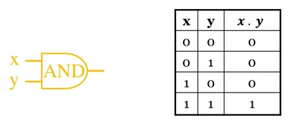

## 5.201 Logic gates

* [Logic Gate](../../../../permanent/logic-gate.md)
    * Implementation of a boolean operation.
    * Basic element of an implementation of a Circuit.
* [Basic Gates](../../../../permanent/basic-gates.md)
    * Most basic logic circuits:
        * **OR** gates
        * **AND** gates
        * **NOT** gates
    * All Boolean functions can be written in terms of these 3 logic operations.
    * [AND Gate](../../../../permanent/and-gate.md)
        * Produces HIGH output (value 1) when all inputs are HIGH otherwise, output is LOW (value 0).
        * For a 2-input gate, AND gate is represented by electrical notation and truth table:

          

        * The AND operations is written as $f = x . y$ or $f = xy$
    * [OR Gate](../../../../permanent/or-gate.md)
        * Produces HIGH output (value 1) when any of 2 inputs if HIGH, otherwise, output is LOW (value 0).
        * For a 2-input gate, OR gate is represented by electrical notation and truth table:

          

        * The OR operation is written as $f = x + y$
    * [Inverter Gate](../../../../permanent/inverter-gate.md)
        * Produces opposite of the input.
        * Also known as NOT gate.
        * When input is LOW (0), output is HIGH (1) and vice versa.
        * The **inverter** gate is represented by the following electrical notation and truth table:

          

          * Not operation is written as $f = \overline{x}$
* Other gates:
  * You can combine the basic gates to create 4 additional gates:
      * [XOR Gate](XOR Gate)
          * True only when values of inputs differ
            

      * [NAND Gate](NAND Gate)
          * [AND Gate](AND Gate) followed by an inverter.
          
          * Equivalent to not AND
      * [NOR Gate](NOR Gate)
          * Equivalent to "not OR"
          * [OR Gate](OR Gate) followed by an inverter.
            

    * [XNOR Gate](XNOR Gate)
        * Equivalent to not XOR.
        
* Multiple input gates
    * AND, OR, XOR and XNOR operations are all **commutative** and **associative**
    * They can be extended to more than 2 inputs.
    * For example:
        * The [XNOR Gate](XNOR Gate) can be applied to 3 inputs:
            
        * NAND and NOR operations are both commutative but not associative.
        * Extending number of inputs is less obvious here.
        * When writing cascaded NAND and NOR operations, must use correct parentheses.
* Representing De Morgan's laws
    * Theorem 1
        * Complement of the product of variables, is equal to the sum of the complements of variables.
        * $\overline{x . y} = \overline{x} + \overline{y}$
        
    * Theorem 2
        * Complment of the sum of variables, is equal to the product of the compliment of variables
        * $\overline{x + y} = \overline{x} . \overline{y}$
        

## 5.203 Combinational circuits

* Outlines
    * Definition of a circuit
    * Building a circuit from a function
    * Writing Boolean expressions from a circuit
    * Building a circuit to model a problem
* Definition of a circuit
    * [Combination Circuits](Combination Circuits) (aka logic networks)
        * combination of [Logic Gate](Logic Gate)s designed to model Boolean functions.
        * circuit that implements a Boolean function.
        * logic values assigned to output signals is a Boolean function of current config of input signals.
* Building a circuit from a function
    * Given a Boolean function, we can implement a logic circuit representing all states of the function.
    * Want to minimise the # of gates used to minimise the cost of the circuit.
    * We can implement Boolean functions in different ways.
    * Consider Boolean function $f$:
        * $f(x, y, z) = x + y' z$
        * $f$ can be represented by this circuit:
          
* Writing a Boolean expression from a circuit
    * Given a logic network, we can work out its corresponding Boolean function:
        * 1. label all gate outputs that are a function of the input variables.
        * 2. express the Boolean functions for each gate in the first level.
        * 3. repeat the process until all the outputs of the circuit are written as Boolean expressions.
    * Example
        * 1. Label input of the circuit with symbols
        * 2. Express boolean functions for first level.
        * 3. Repeat for 2nd and third levels.
* Building a circuit to model a problem
    * Combinational circuits are useful for desiging systems to solve specific problems, like addition, multiplication, decoders and multiplexers.
    * Steps for building combinational circuit are:
        * 1. labelling the inputs and outsput using variables.
        * 2. modelling the problem as a Boolean expression
        * 3. replacing each operation by the equivalent logic gate.
* Building an adder circuit
    * Consider building an adder for 2 one-digit binary bits x and y.
    * From the truth table of this Boolean function, we know that:
        * $sum = xy' + x'y = x \oplus y$
        * $carry = xy$
        * 
    * Can be designed as a **half adder**
      
  * Half adder has limitations:
      * no provision for carry input.
      * circuit is not useful for multi-bit additions.
* Building a full adder circuit
    * To overcome its limitations, transform half adder into a full adder by including gates for processing the carry bit.
    * sum = x $\oplus$ y $\oplus$ carry in
    * carry out = xy + carry in. (x $\oplus$ y)
    
    * 2 Boolean expression can be designed in as follows:
      
          * We can hide some of the comlexity of a circuit by using a **box diagram** as a simple abstraction representing just the inputs and outputs.

## 5.205 Simplification of circuits

* Outline
    * Benefits of simplification and Algebraic simplification
        * Show how Boolean Algebra Theorem or rules can be used to represent and simplify Boolean functions.
    * Introduce [Karnaugh Map](../../../../permanent/karnaugh-map.md) of Boolean functions.
* Benefits of simplification
    * We know that every function can be written in [Sum-of-Products Form](Sum-of-Products Form)
        * Not necessarily optimal in terms of number of gates and depth of circuit.
    * Why circuits must be simplified:
        * Reduces global cost of circuits, by reducing number of logic gates used
        * Might reduce time computation cost of circuits
        * Allows more circuits to be fitted on same chip
* Algebraic simplification
    * Based on the use of Boolean algebra theorems to represent and simplify the behaviour of [Boolean Function](Boolean Function)s.
    * To produce a sum-of-product expression, need to use one or all of following theorems:
        * De Morgan's laws and involution
        * Distributive laws
        * Commutative, idempotent and complement laws
        * Absorption law
    * Example
        * Consider this Boolean expression: $E = ((xy)'z)'((x'+ z)(y' + z'))'$
        * Using De Morgan's laws and involution:
            * $$

        \begin{align}
        E &= (xy)'' + z')((x' + =z)'+(y' + z')') \\
        &= (xy + z')((x'' . z') +y'' . z'') \\
        &= (xy + z')(xz' + yz)
        \end{align}

        $$
        * Can be further simplified using **distributive** laws: $E = xyxz' + xyyz + z'xz' + z'yz$
       * Using **commutative**, **idempotent** and **complement** laws: $E = xyz' + xyz + xz' + 0$
       * Using **absorption** law: $E = xyz + xz'$

 * Example 2
       * Consider **full adder** circuit from last week.
       * Using truth table, we can build a sum-of-products form for the 2 functions:
       * 
* Karnaugh Maps
    * A Karnaugh map (or K-Map) is a graphic representation of a Boolean function and differs from a truth table.
        * It can be used for expressions with 2, 3, 4 or 5 variables.
    * A K-Map is shown in an **array of cells** and cells differing by only one variable are adjacent.
    * The number of cells in a K-Map is the total number of possible input variable combinations which is $2^k$.
    
    * Example
        * Consider the Boolean function described in the truth table shown here:
            * We have 3 variables, we need a 3-input K-Map for which we identify all the 1's first.
            * Group each 1 value with the maximum possible number of adjacent 1's to form a rectangle, power of 2 long (1, 2, 4, 8)
            * Then, write a term for this rectangle.
            * In this case, it's the minimised expression of $f$ is: $x + yz$
              
              

## 5.211 Domino logic gates simulation

* Learn about logic gates and how to represent them using dominoes.
* Logic gates are basic element of electronic circuitts, implementing a boolean operation.
* Computers are made of billions of these tiny electrical components. Depending on characteritics of eahc gate, logic gates take information coming in and output the processed information accordingly.
* It is difficult to visualise this rpcoess in computers as the info they get is in electrical signals. The signal can either be on or off. It depends on the voltage registered.
* Can break down complex system using dominoes.
* The info is dicated by whether a chain of dominoes is falling or not, representing high voltage and low voltage respectively.
* The next exercise wil simulate different types of logic

## 5.208 Summative quiz

Questions I did not understand

Which of the following expressions is a sum-of-products form of the Boolean expression: $F(x, y, z) = (x+\overline{y}).z$

$F(x, y, z) = x.y.\overline{z} + x.\overline{y}.\overline{z} + x.y.\overline{z}$
$F(x, y, z) = xyz+x\overline{y}z+\overline{x}.\overline{y}$
$F(x, y, z) = \overline{x}.y.\overline{z} + x.y.z + \overline{x}.y.z$

Why is it 3 variables in each product term?

By distributivity: $F(x, y, z) = (x+\overline{y}).z = xz+\overline{y}z$
By identity: $xz+\overline{y}z=x(y+\overline{y})z+(x+\overline{x})\overline{y}z$
By distributivity: $x(y+\overline{y})z+(x+\overline{x})\overline{y}z=xyz+x\overline{y}z+x\overline{y}z+\overline{x}.\overline{y}z$
By idempotent law: $xyz+x\overline{y}z+x\overline{y}z+\overline{x}.\overline{y}z= xyz+x\overline{y}z+\overline{x}.\overline{y}z$

Find the simplification of the expression represented by the following K-map.

I accidentally got it right.

$\overline{x}+z$

## Assignment

## Question

Given the Boolean function $F(x, y, z) = (x + \overline{y}) . z$, write the sum-of-products expansion of $F$ where all the variables $x, y, z$ are used.

## Answer

1. Distributive law: $F(x, y, z) = xz + (\neg y)z$
2. Identity law: $F(x, y, z) = x.1.z + 1.\overline{y}.z$
3. Complement law: $F(x, y, z) = x . (y + \overline{y}) . z + (x + \overline{x}) . \overline{y} . z$
4. Distributive law: $F(x, y, z) = x.y.z + x.\overline{y}.z + x.\overline{y}.z + \overline{x} .\overline{y}.z$
5. Idempotent law: $F(x, y, z) = x.y.z + x.\overline{y}.z + \overline{x} . \overline{y} . z$

## Problem Sheet

1. What is the output for each of the logic circuits?

1. $\overline{A} + B$
2. $\overline{A . \overline{(B . C)}}$

How can I know the output if I don't know what the input is? Maybe some kind of algebraic reduction?

Looks like my initial answer was correct, I just didn't include the NOT part of the circuit after $B . C$

2. Write down the truth table for the output Q of the following circuit.

| A   | B   | (A + B) | $\neg$ (A + B) | $\neg$ (A + B) + B | $\neg$ ( $\neg$ (A + B) + B) |
| --- | --- | ------- | -------------- | ------------------ | ---------------------------- |
| 0   | 0   | 0       | 1              | 1                  | 0                            |
| 0   | 1   | 1       | 0              | 1                  | 0                            |
| 1   | 0   | 1       | 0              | 0                  | 1                            |
| 1   | 1   | 1       | 0              | 1                  | 0                             |

3. Simplify each Boolean expression to one of the following expressions: $0, 1, A, B, AB, A+B, \overline{AB}, \overline{A} + \overline{B}, \overline{A}B, A\overline{B}$
    1. $\overline{\overline{A} + \overline{B}}$
        1. $\overline{\overline{A . B}}$ -- DeMorgan's law
        2. A.B -- involution theorem
    2. $A (A + \overline{A}) + B$
        1. $(A + A.\overline{A}) + B$ -- distributivity
        2. (A + 0) + B -- complements
        3. A + B -- identity
    3. $(A + B)(\overline{A} + B)\overline{B}$
        1. $(A + B) (\overline{A} \ \overline{B} + B\overline{B})$-- Distributivity
        2. $(A + B) (\overline{A} \ \overline{B} + 0)$ -- Involution
        3. $(A + B)(\overline{A} \ \overline{B})$
        4. $(A.  \overline{A} \ \overline{B} + B. \overline{A} \ \overline{B})$ -- Distributivity
        4. $(A.  \overline{A} \ \overline{B} + B . \overline{B} \ \overline{A})$ -- Commutativity
        5. $(0\overline{B} + 0\overline{A})$
        6. 0 + 0
        7. 0
4. Use the laws of Boolean Algebra to simplify the boolean expression: $a + \overline{a}b = a + b$
    1. $a + \overline{a}b = a + b$
        1. $a.1 + \overline{a}b = a + b$ -- identity law
        2. $a . (1 + b) + \overline{a}b$
        3. $a1 + ab + \overline{a}b$ -- Distributive law
        4. $a.1 + b(a + \overline{a})$ -- Distributibe law
        5. $a1 + b1$ -- Complements
        6. a + b
    2. Use a truth table to prove that $a + \overline{a}b = a + b$

| a   | b   | a + b | $a + \overline{a}b$ |
| --- | --- | ----- | ------------------- |
| 0   | 0   | 0     | 0                   |
| 0   | 1   | 1     | 1                   |
| 1   | 0   | 1     | 1                   |
| 1   | 1   | 1     | 1                   |

    3. Simplified circuit is just $a + b$
5. What is the output of the following logical circuit?
    1. 
        $p . q . r + p.  \overline{q} r + p . q . \overline{r}$
    2. $p.p.p + r . r . \overline{r} + q . \overline{q} .q$
        1. $p(q + r)$
6. Use the truth table to prove De Morgan's laws:

$\overline{ab} = \overline{a} + \overline{b}$

| a   | b   | ab  | $\overline{ab}$ | $\overline{a}$ | $\overline{b}$ | $\overline{a} + \overline{b}$ |
| --- | --- | --- | --------------- | -------------- | -------------- | ----------------------------- |
| 0   | 0   | 0   | 1               | 1              | 1              | 1                             |
| 0   | 1   | 0   | 1               | 1              | 0              | 1                             |
| 1   | 0   | 0   | 1               | 0              | 1              | 1                             |
| 1   | 1   | 1   | 0               | 0              | 0              | 0                              |

$\overline{a + b} = \overline{a} . \overline{b}$

| a   | b   | a + b | $\overline{a + b}$ | $\overline{a}$ | $\overline{b}$ | $\overline{a} . \overline{b}$ |
| --- | --- | ----- | ------------------ | -------------- | -------------- | ----------------------------- |
| 0   | 0   | 0     | 1                  | 1              | 1              | 1                             |
| 0   | 1   | 1     | 0                  | 0              | 0              | 0                             |
| 1   | 0   | 1     | 0                  | 0              | 1              | 0                             |
| 1   | 1   | 1     | 0                  | 0              | 0              | 0                              |

7. Use the laws of boolean algebra to simplify:

$\overline{ab}(\overline{a} + b)(\overline{b} + b)$

$\overline{ab}(\overline{a} + b)(1)$ -- Complement
$\overline{ab}(\overline{a} + b)$ -- Idempotent
$\overline{ab}\overline{a} + \overline{ab}b$ -- Distributive law

$(\overline{a} + \overline{b}) \overline{a} + (\overline{a} + \overline{b})b$ -- De Morgan's law
$\overline{a}.\overline{a} + \overline{b}.\overline{a} + b\overline{a} + b\overline{b}$ -- Distributive law
$\overline{a}.\overline{a} + \overline{b}.\overline{a} + b\overline{a} + 0$ -- Complement
$\overline{a}.\overline{a} + \overline{b}.\overline{a} + b\overline{a} + 0$ -- Idemptotent
$\overline{a} + \overline{b}.\overline{a} + b\overline{a} + 0$ -- Idemptotent
$\overline{a} + \overline{a}(b + \overline{b}) + 0$ -- Distributive
$\overline{a} + \overline{a}(b + \overline{b}) + 0$ -- Complement
$\overline{a} + \overline{a}(1) + 0$ -- Complement
$\overline{a} + \overline{a} + 0$ -- Identity
$\overline{a} + \overline{a}$ -- Identity
$\overline{a}$ -- Idempotent

8. Use laws of boolean algebra to simplify the boolean expression

$\overline{a}(a + b) + (b + aa)(a + \overline{b})$

$\overline{a}(a + b) + (b + a)(a + \overline{b})$ -- idempotent laws
$\overline{a}(a + b) + (a + b)(a + \overline{b})$ -- commutative laws

Even the answers don't make sense here.

9. Prove that in a boolean algebra $a^2 = a$ You are required to explain your answer by making a reference to a boolean algebra axioms (laws)

a.a = a
a = a -- Idempotent laws.

The answer should be:

$$
\begin{align}
a &= a.1 \\
&= a . (a + \overline{a}) \\
&= a . a + a . \overline{a}  \\
&= a^2 + 0 \\
&= a^2 \\
\end{align}
$$

10. The following diagram shows a circuit with three inputs and two outputs, $u$ and $v$

1. List the logic gates used

3 OR gates and 2 AND gates

2. Describe each output u and v as a Boolean expression in terms of x, y and z

$u = (x + y) + z$

$v = ((x + y) . z) + (x . y)$
$v = zx + zy + xy$

11. Derive the Boolean expression for the following logic circuit shown below

$((((a + b) . c) . d) . e)$

12. Write down a boolean expression for the following input/output behaviour

| x   | y   | z   | u   |
| --- | --- | --- | --- |
| 0   | 0   | 0   | 1   |
| 0   | 0   | 1   | 0   |
| 0   | 1   | 0   | 0   |
| 0   | 1   | 1   | 1   |
| 1   | 0   | 0   | 0   |
| 1   | 0   | 1   | 0   |
| 1   | 1   | 0   | 1   |
| 1   | 1   | 1   | 0   |

1. Write a boolean expression for input/output behaviour.

    $u = \overline{x}.\overline{y}.\overline{z} + \overline{x}.y.z + x.y.\overline{z}$

2. Construct the corresponding circuit of the above expression using not-games, and-gates and or-gates only
