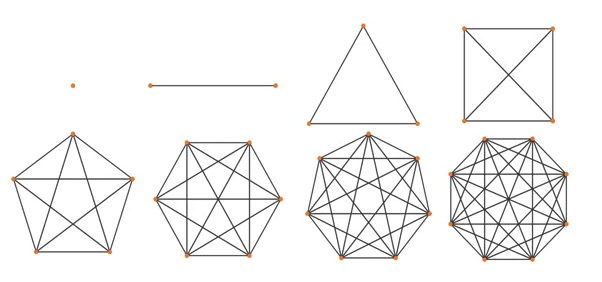

## 7.1 - Introduction to graph theory: basic concepts

* Computer scientists create abstractions of real world problems for representing and manipulating with a computer.
* One example, is logic which is used to define a computer circuits.
* Scheduling final exams is another example:
    * Has to take into account associations between courses, students and rooms.
    * These associations (connections) between items are modelled by graphs.
* Graphs are discrete structures consisting of vertices (nodes) and edges connecting them.
* Graph theory is an area in discrete math which studies these type of discrete structure.
* What is a graph?
    * Graphs are discrete structures consisting of vertices (nodes) and edges connecting them.
    * Graph theory is an area that studies these structures.
* Origins of graph theory:
    * First problem in graph theory is Seven Bridges of Konigsbert problem solved by Loenhard Euler in 1735.
        * 2 islands are connected by 7 bridges.
        * Can you walk across all 7 bridges only once.
    * In a paper published in 1726, he showed that it is impossible.
* Applications of graphs
    * Used in a variety of disciplines.
    * Examples:
        * Networks.
        * Road maps.
        * Solving shortest path problems between cities.
        * Assigning jobs to employees in an organisation.
        * Distinguishing chemical compound structures.

## Lesson 7.103 - Definition of a graph

* [Graph](../../../../permanent/graph.md)
    * Discrete structures consisting of vertices and edges connecting them.
* Formal definition:
    * $G$ is an ordered pair $G=(V, E)$.
    * $V$ is a set of nodes, or vertices.
    * $E$ is a set of edges, lines or connections.
* [Vertex](../../../../permanent/graph-vertex.md)
    * Basic element of a graph.
    * Drawn as a node or a dot.
    * Set of vertices of G is usually denoted by V(G) or V.

        

* [Edge](../../../../permanent/graph-edge.md)
    * A is a link between 2 vertices.
    * Drawn as a line connecting two vertices.
    * A set of edges in a graph $G$ is usually denoted by $E(G)$ or $E$.

        

* [Adjacency](permanent/graph-adjacency.md)
    * Two vertices are said to be adjacent if they are endpoints of the same edge.
    * Two edges are said adjacent if they share the same vertex.
    * If a vertex v is an endpoint of an edge e, then we say that e and v are incident.

        

* $v_1$, $v_2$ are endpoints of the edge $e_1$. We say that $v_1$ and $v_2$ are adjacent.
* The edges $e_1$ and $e_7$ share the same vertex $v_1$. We say that $e_1$ and $e_7$ are adjacent.
* The vertex $v_2$ is an endpoint of the edge $e_1$. We say that $e_1$ and $v_2$ are incident.
* Loops and parallel edges
    * Consider this graph:

        

    * $v_2$ and $v_5$ are linked with 2 edged: (e_6 and e_8). e_6 and e_8 are considered [Parallel Edges](permanent/parallel-edges.md).
    * $v_1$ is linked by $e_9$. We call the edge $e_9$ a [Loop](permanent/graph-loop.md).
* [Directed Graphs](../../../../permanent/directed-graphs.md)
    * Aka digraph.
    * Graph where edges have a direction.

      

 * $e_1$ is a connection from $v_1$ to $v_2$ but not from $v_2$ to $v_1$
 * $e_6$ is a connection from $v_2$ to $v_5$ whereas $e_8$ is a connection from $v_5$ to $v_2$.

## Lesson 7.105 Walks and paths in a graph

* Definition of a [Graph Walk](permanent/graph-walk.md)
    * Sequences of vertices and edges of a graph.
        * Vertices and edges can be repeated.
    * A walk of length k in a graph is a succession of $k$ (not necessarily different) edges of form:
        * $uv$, $vw$, $wx$, ..., $yz$
    * Example

      

      * Example 2

        

* [Graph Trail](permanent/graph-trail.md)
    * A trail is a walk where no edge is repeated.
    * In a trail, vertices can be repeated but no edge is repeated.

      

* [Graph Circuit](permanent/graph-circuit.md)
    * A circuit is a closed trail.
    * Circuits can have repeated vertices only.

      

* [Graph Path](permanent/graph-path.md)
    * A path is a trail in which neither vertices nor edges are repeated.
    * Length of path is given in number of edges it contains.
* [Graph Cycle](permanent/graph-cycle.md)
    * Closed path consisting of edges and vertices where a vertex is reachable from itself.
      

* Seven Bridges of Koenigsberg
    * Is there a walk that passes each of the 7 bridges once.
    * He made a network linked with lines that shows:
        * No walk that uses each edge exactly once (even if we allow the walk to start and finish in diff places)
* [Euler's Path](permanent/eulers-path.md)
    * A Eulerian path in a graph is a path that uses each edge precisely once.
        * If the path exists, the graph is called traversable.

          

* Hamiltonian path
    * Hamiltonian path (aka traceable path) is a path that visits each vertex exactly once.
    * A graph that contains a Hamiltonian path is called a traceable graph.

      

* Hamiltonian cycle
    * A Hamilton cycle is a cycle that visits each vertex exactly once (except for the starting vertex, which is visited once at the start and once again at end).

      

    * Connectivity
        * An undirect graph is connected if
              * You can get from any node to any other by following a sequence of edges OR
              * any two nodes are connected by a path.
        * Example of connected graph:

          

      * Unconnected graph

        

    * Strong connectivitiy
        * A directed graph is strongly connected if there is a directed path from any node to any other node.

          

    * Example of a graph that's not strongly connected

      

      * No direct path from v_4 to any of the other 3 vertices.
* [Transitive Closure](permanent/transitive-closure)
    * Given a digraph G, the transitive closure of G is the digraph G* such that: G* has the same verticies as G
    * If G has a directed path from $u$ to $v$ ($u \ge v$), G* has a directed edge from $u$ to $v$.

      

      * Transitive closure provides reachability information about a digraph.

## Lesson 7.107 - The degree sequence of a graph

* [Degree of Vertices](permanent/degree-of-vertices.md)
    * The number of edges incident on v.
    * A loop contributes twice to the degree.
    * An isolated vertex has a degree of 0.

      

  * For directed graphs:
      * In-deg (v): number of edges for which v is the terminal vertex.
      * Out-deg (v): number of edges for which v is the initial vertex.
      * deg(v) = Out-deg(v) + In-deg(v)
      * A loop contributes twice to the degree, as it contributes 1 to both in-degree and out-degree.
* [Degree Sequence of a Graph](permanent/degree-sequence-of-a-graph.md)
    * Given an undirected graph G, a degree sequence is a monotonic nonincreasing sequence of the vertex degress of all the vertices G.

      

    * Properties of graph degree sequence:
        * Degree sequence property 1
            * The sum of degree sequence of a graph is always even.
                * It is impossible to construct a graph where the sum of degree sequence is odd.
        * Degree sequence property 2
            * Given a graph G, the sum of the degree sequence of G is twice the number of edges in G.
            * Number of edges(G) = (sum of degree sequences of G) / 2

              

    * Exercise: which of the 2 degree sequences below is it possible to construct a graph with?
        * 3, 2, 2, 1
            * Sum of sequence = 3 + 2 + 2 =1 = 8
            * Can build a graph with this.
            * Number of edges = 8/2 = 4
        * 3, 3, 2, 1
            * Sum of sequence = 3 + 3 + 2 + 1 = 9
            * Can't build a graph with this.

## 7.109 - Special graphs: simple, r-regular and complete graphs

* [Simple Graph](permanent/simple-graph.md)
    * A graph without loops and parallel edges.

      

    * Given a simple graph G with n vertices, then the degree of each vertex of G is at most equal to n-1.
    * Proof
        * Let $v$ be a vertex of G such that deg(v) > n-1
        * However, we have only n-1 other vertices for v to be connected to.
        * Hence, the other connections can only be a result of parallel edges or loops
* Exercise
    * Can we draw a simple graph with the following degree sequences?
        * 4, 2, 2, 2
            * Sum(deg sequence) is even so we can construct a graph
            * However, no other vertex has degree of 4. There are only 3 other vertices to be connected to, so it has to contain a loop or parallel edges.
        * 4, 3, 3, 2, 2
            * Yes, it can be done.
              

* [Regular Graph](permanent/regular-graph.md) and [R-Regular Graph](permanent/r-regular-graph.md)
    * A graph is regular if all local degrees are the same number.
    * A graph G where all vertices the same degree, $r$, is called a r-regular graph.

      

    * Given a r-regular G with n vertices, then the following is true:
        * Degree sequence of $G = r, r, r, ..., r (\text{n times})$
        * Sum of degree sequence of $G = r \ x \ n$
        * Number of edges in $G = \frac{r \ x \ n}{2}$

        

* Special regular graphs: cycles

  

* Exercise
    * Can we construct a 3-regular graph with 4 vertices?
    * Can we construct a 4-regular graph with 5 vertices?
        * 3x5 = 15
        * Sum is odd, so cannot great a regular graph.
* [Complete Graph](permanent/complete-graph.md)
    * A [Simple Graph](permanent/simple-graph.md) where every pair of vertices are adjacent (linked with an edge).
    * A vertex on its own is a complete graph.

      

    * A complete graph with n vertices, k_n, has these properties:
        * Every vertex has a degree $(n-1)$
        * Sum of degree sequence $n(n-1)$
        * Number of edges $n(n-1)/2$
