## 7.201 Isomorphic Graphs

* [Isomorphism](../../../../permanent/graph-isomorphism.md)
    * Two graphs $G_1$ and $G_2$ are isomorphic if there is a bijection (invertible function) $f: G_1 \rightarrow G_2$ that preserves adjacency and non-adjacency.
        * if $uv$ is in $E(G_1)$ then $f(u)f(v)$ is in $E(G_2)$

        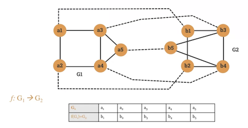

    * Two graphs with different degree sequences can't be ismorphic.
* Properties of isomorphic graphs
    * 2 graphs with different degree sequence can't be isomorphic.

      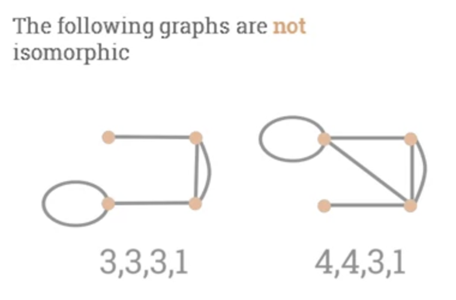

    * 2 graphs with the same degree sequence may not be isomorphic.

      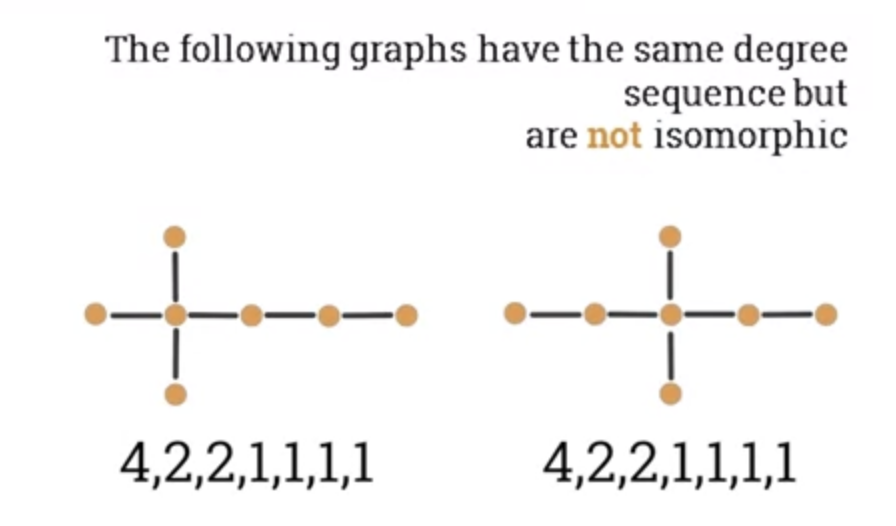

## 7.203 Bipartite graphs

* [Bipartite Graph](permanent/bipartite-graph.md)
    * A graph $G(V, E)$ is called a bi-partite graph.
    * If the set of vertices V can be partitioned in 2 no-empty disjoint sets $V_1$ and $V_2$ in such a way that each edge $e$ in $G$ has one endpoint in $V_1$ and another endpoint in $V_2$.
    * Example:

      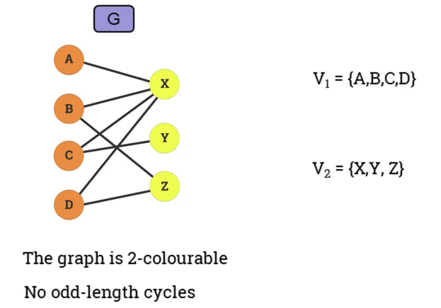

      * Graph is 2-colourable.
      * No odd-length cycles.
* Matching
    * A set of pairwise non-adjacent edges, none of which are loops.
        * ie no 2 edges share a common endpoint.
    * A vertex is matched (or saturated) if it is an endpoint of one of the edges in the matching.
        * Otherwise the vertex is unmatched.

        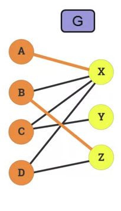

* Maximum matching
    * A maximum matching is a matching of maximum size so that if any edge is added, it's no longer matching.
    * In a bitpartite graph, there can be multiple maximum matching.
* The Hopcroft-Kaft Algorithm
    * An algorithm for solving the maximum matching problem in a bipartite graph.
    * Concepts:
        * Augmenting path: starts on a free node and alternate between unmatched unmatched edges ending on a free node
            * "augments the cardinality of the current machine"
        * Breadth-first search:
            * Traverses the graph level by level
        * Depth-first search:
            * Traverses graph all the way to a leaf before starting another path.
    * Example:

      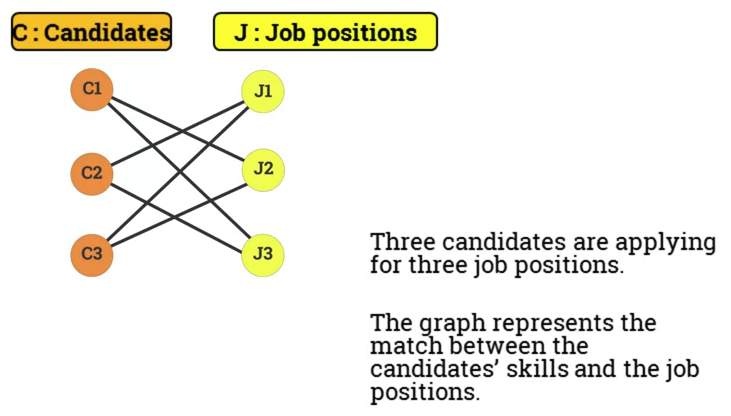

    * Pseduo code:
        * Initialise M = {}
        * While there exists an Augmenting Path p
            * 1. Use BFS to build layers that terminate at free vertices.
            * 2. Start at the free vertices in C, use DFS.
        * Return M

## 7.205 The adjacency matrix of a graph

* [Adjaceny List](permanent/adjaceny-list.md) of a graph.
    * So far a graph has been represented by a set of vertices and a set of edges.
    * Adjaceny list of a graph G is a list of all vertices in G and their corresponding individual adjacent vertices.

    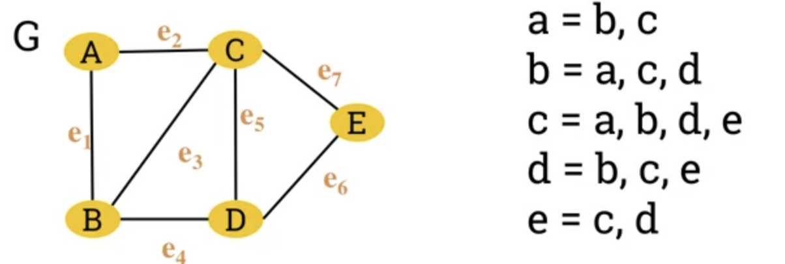

* [Adjacent Matrix](permanent/adjacent-matrix.md) of a graph.
    * A graph can also be represented by its adjacency matrix.

    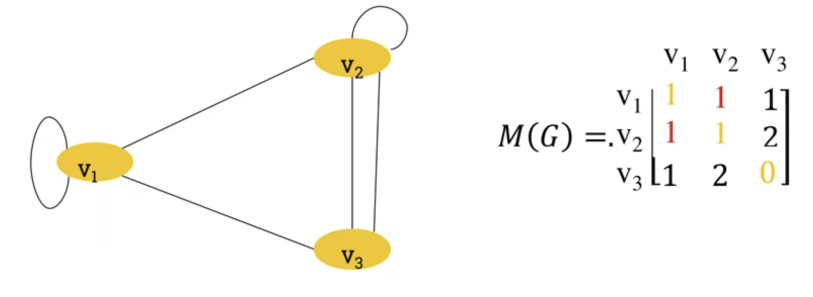

    * Apparent from the loops, ever other edge is represented twice (ie v1 -> v3 and v3->v1)
    * So we can multiply the diagonal by 2 to represent loops consistently.
* Properties of the adjaceny matrix.
    * Adjaceny matrix of an undirected graph is symmetric.
    * Number of edges in undirected graph equals half the sum of all elements ($\mathbf{m_ij}$) of its corresponding adjaceny matrix.

      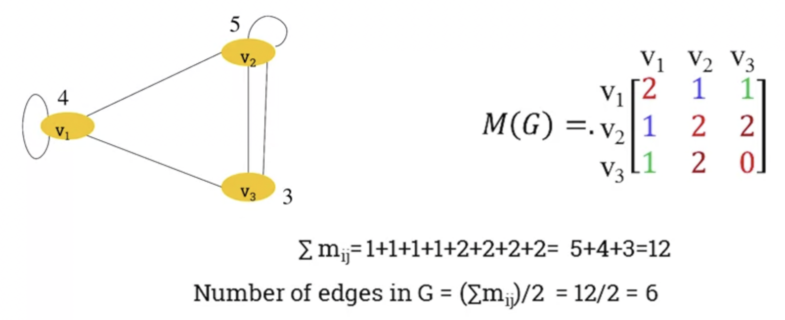

    * In a directed graph, the adjaceny matrix only counts an edge pointing in a certain direction once.

## 7.207 Dijkstra's algorithm

* [Weighted Graphs](permanent/weighted-graphs.md)
    * A weighted graph is a graph where each edge is assigned a numerical weight.

      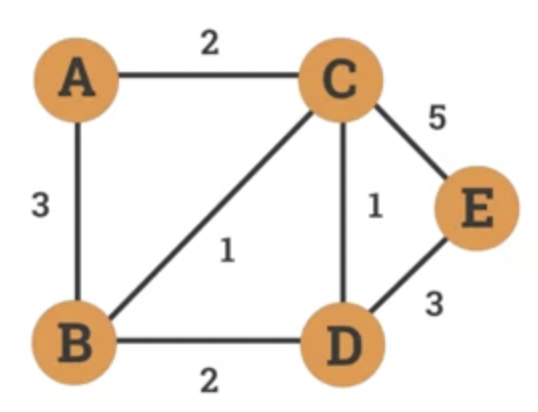

      * Can be used to model:
          * Distance between cities.
          * Response time in communication network.
          * Cost of transaction.
* Dijkstra's algorithm
    * An algorithm designed by Edsger W. Dijkstra in 1956.
    * Find shortest path between nodes in weighted graph.
* Example

    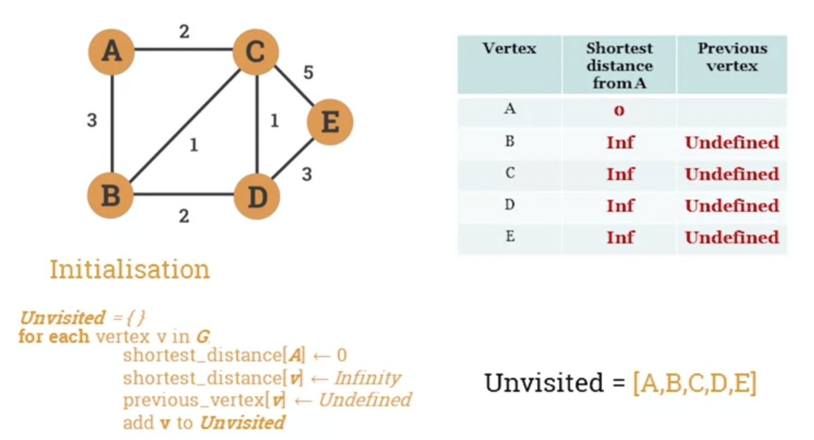
    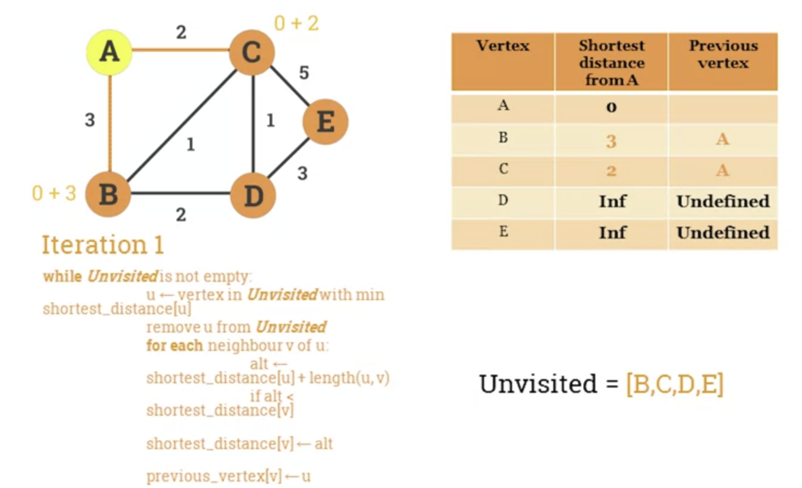
    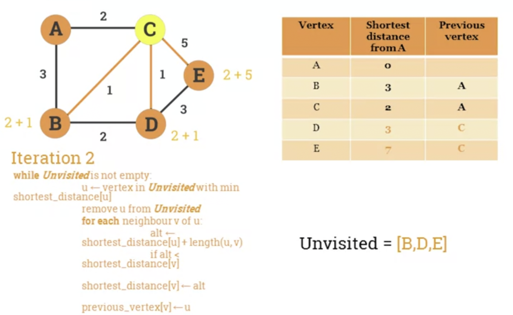

* Algorithm's pseudocode.
    * Let G be a graph and s a source vertex.
    * The following pseudocode calculates the shortest distance and previous vertex from s to every other node in the graph.

```
Unvisited = {}
for each vertex v in G:
    shortest_distanced[v] = Infinity
    previous_vertex[v] = Undefined
    add v to Unvisited
    shortest_distance[s] = 0
while Unvisited is not empty:
    u = vertex in Unvisited with min shortest_distance[u]
    remove u from Unvisited
    for each neighbour v of u:
        alt = shortest_distance[u] + length(u, v)
        if alt < shortest_distance[v]:
            shortest_distance[v] = alt
            previous_vertex[v] =u
    return shortest_distance, previous_vertex
```

## Problem Sheet

### Question 1

Given the following graph $G := (V, E)$

$V = \{ v1, v2, v3, v4, v5, v6 \}$
$E = \{ \{v1, v2\}, \{v2, v5\}, \{v5, v3\}, \{v3, v4\}, \{v2, v4\}, \{u6, u6\} \}$

1. Draw the graph G

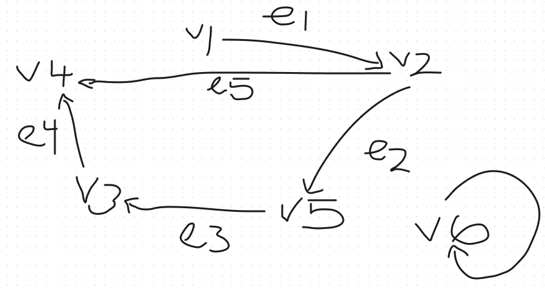

2. List the set of vertices adjacent to v2

v1, v4, v5

3. List the set of edges incident with v3.

(v3, v4), (v5, v3)

4. Give an example of a path of length 3 starting at the vertex v2 and ending at v5.

v2, v4, v3, v5

5. Give an example of a cycle length 4.

v2, v4, v3, v5, v2

## Question 2

Given the following graph:

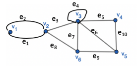

Determine which of the walks are trails, paths or circuits.

1. v1 e1 v2 e3 v3 e4 v3 e5 v4

* Is a trail as no edge is repeated.
* Is NOT a path as v3 is repeated.
* Is NOT a circuit as it is not closed.

2. e1 e3 e5 e5 e6

* Is NOT a trail as e5 is repeated.

3. v2 v3 v4 v5 v3 v6 v2

v2 e3 v3 e5 v4 e10 v5 e5 v3 e7 v6 e8 v2

* Is a trail as no edge is repeated.
* Is NOT a path as v3 is repeated.
* Is a circuit as it's a closed trail.

4. v2 v3 v4 v5 v6 v2

v2 e3 v3 e5 v4 e10 v5 e9 v6 e8 v2

* Is a trail as no edge repeated.
* Is NOT a path as v2 is repeated
* Is a circuit from v2 to v2

5. v1 e1 v2 e1 v1

* Not a trail as e1 is repeated.

## Question 3

Which of the following undirected graphs have a Euler circuit? Which of those that do not have an Euler circuit have a Euler path?

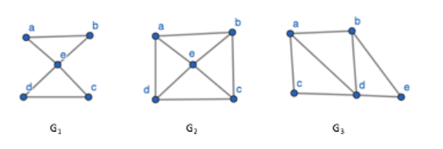

* Euler path
    * A graph that has a path that uses each edge of the graph exactly once. If the path exists, the graph is considered traversable.
* Euler Circuit
    * A graph with a circuit (starts and ends on same vertice) containing all edges.
    * If a graph has a Euler circuit, then every vertex of the graph has a positive even integer degree.

1. G1 has a Euler Circuit. Is has a closed trail that uses each edge exactly

ab, bd, dc, ce, ea

2. G2 does not have Euler Circuit. It does not have a Euler path.
3. G3 does not have a Euler Circuit. However, it does have a Euler path.

ab, bd, da, ac, cd, de, eb

## Question 4

Which of the following directed graphs has an Euler circuit? Which of those that do not have a Euler path?

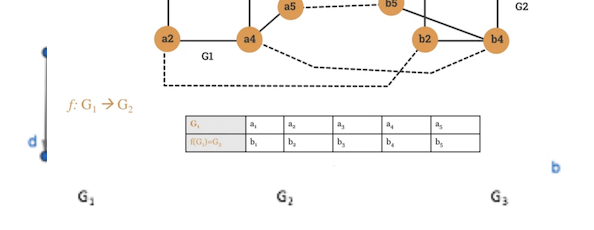

1. Does not have a Euler circuit, or path.
2. Does have a Euler circuit

ag, gc, cb, bg, ge, ed, df, fa

3. Does not have a Euler circuit, but does have a path.

ca, ab, bc, cd, db

## Question 5

In each of the following either construct a graph with the specified properties or say why it is not possible to do it.

1. A graph with degree sequence 4, 3, 3, 1

The degree sequence here adds to 11. The sum of a degree sequence must be even.

2. A simple graph with degree sequence 4, 3, 3, 2, 2

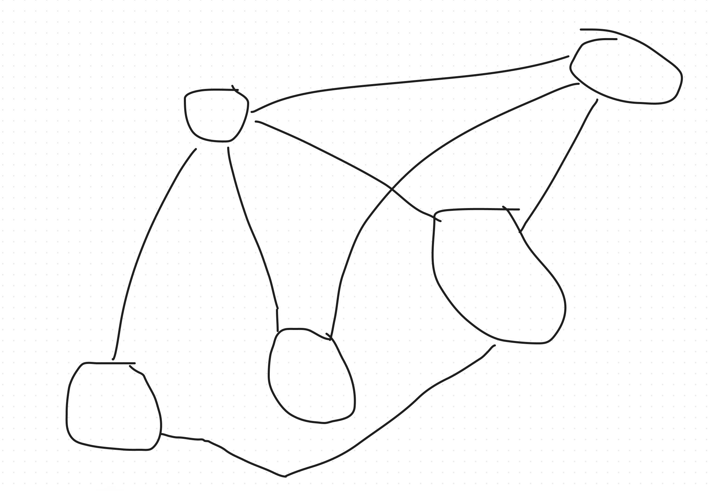

3. A simple 3 regular graph with 6 vertices

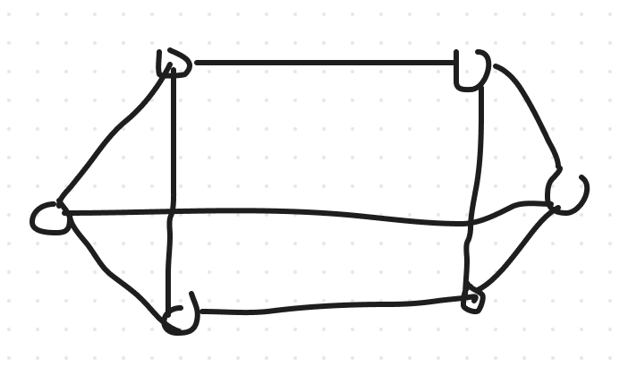A

## Question 6

In a group of 25 people, is it possible to each shake hands with exacty 3 other people.

I think it's not, as in order to have a degree sequence of 3 with 25 vertices, you would end up with an odd sum.

## Question 7

Find a Hamiltonian circuit in the following graph:

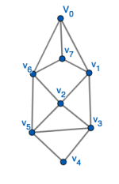


## Question 8

Given the following directed graph:

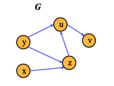

Find the transitive closure, G*, of the graph G.

To find the [Transitive Closure](permanent/transitive-closure.md) of G, we need to add missing edges if there are any. It's constructed like this:

1. Take the starting point as the graph G.
2. Check if there is a directed path between and 2 vertices of G. For example, a directed path from vertex u to v.
3. Then add a direct path if it's not already in the graph.

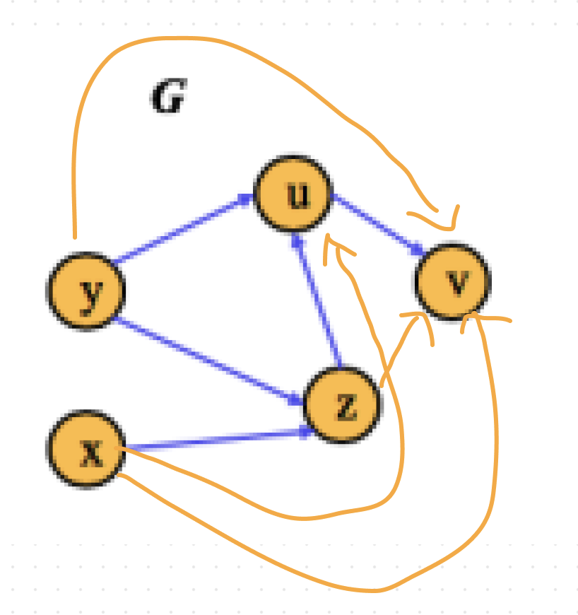

## Question 9

Suppose that 7 sites are connected in a network. The number of other sites to which each site has a direct connection is given by the following sequence:

1, 2, 2, 3, 3, 4, 7

1. This might describe some kind of remote office, with a head office with direct connectivity to each suboffice, then 3 countries with 1-3 sites. Each country has connectivity to other offices and head office.
2. It has 7 vertices.
3. The sum of degrees is twice the number of edges: $\frac{7 + 4 + 3 + 3 + 2 + 2 +1}{2} = 11$
4. It is impossible to construct a [Simple Graph](permanent/simple-graph.md), as there are n vertices and for a simple graph, the degree of each vertices is at most n-1 or 6. We have a vertice with 7 connections.
5. It is impossible to construct a network with 9 sites, with 5 connections as that would result in $9 \ x \ 5 = 45$ which is an odd number. A degree sequence must be even.

## Question 10

1. What is a [Complete Graph](permanent/complete-graph.md)?

   A graph where each vertice is adjacent (linked with an edge)

2. What is the degree of each vertex of the complete graph $K_8$? Calculate the number of edges in $K_8$. Draw $K_8$

Degree of each vertex = n - 1 = 7
Number of edges = 8 * 7 / 2 = 28

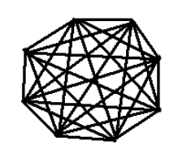

3. The degree of each vertex of complete graph K_n = n -1. It will have n(n-1) / 2 edges.

## Question 11

Construct 3 non isomorphic graphs with 5 vertices and 5 edges. Give one property for each graph that neither of the others has, which makes it non-isomorphic.
