## 8.101 Introduction

* Trees are usually represented upside down in Computer Science.

    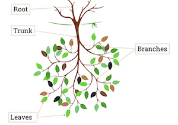

* Trees have many use cases:
    * Organisation charts.
    * Computer file systems.
    * Used to find shortest path in graph.
    * Used to construct efficient algorithms to locate items in a list.
    * Used in games such as checkers and chess to determine winning strategies.
    * Use to model procedures carried out as a sequence of decisions.
    * Binary tree is fundamental data structure in high-level programming.

## 8.103 Definition of a tree

* [Acyclic Graph](permanent/acyclic-graph.md)
    * A graph G is called an acyclic graph if and only if G has **no cycles**.
        * No loops and no parallel edges.
    * $G_1$ contains a cycle B, C, D, E
    * $G_2$ contains no cycle

      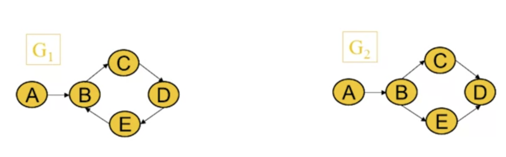

* Definition of a tree
    * A tree is a connected acyclic undirected graph.
    * Hence, a tree can have neigher loops nor edges.

      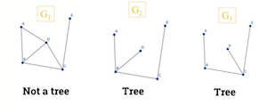

* A disconnected graph containing no cycles is called a forest.

  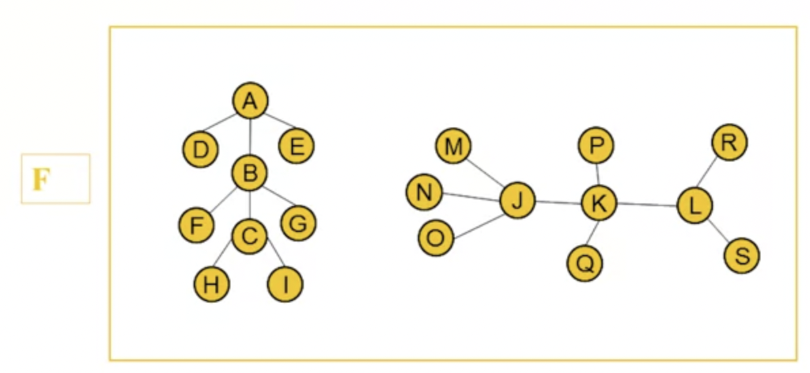

* Theorem 1
    * An undirected graph is a tree if and only if there is a unique simple path between any 2 of its vertices.
    * We can prove by contradiction
    * In this example, we show that if there exists a 2nd path P2 between B and I, we can see that this results in a cycle. Hence, it is not a tree.

      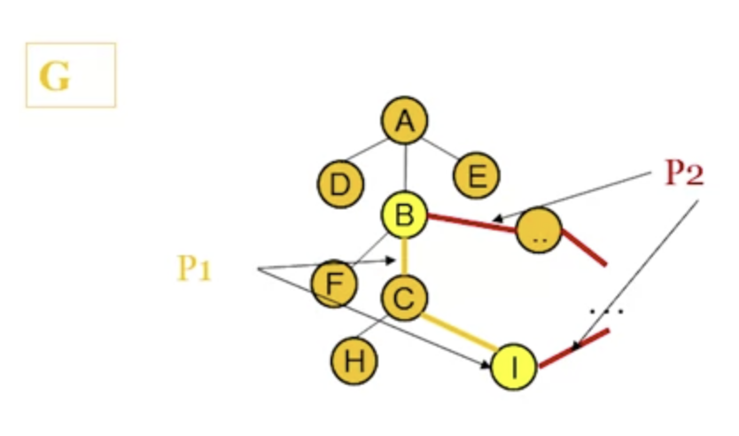

  * Theorem 2
      * A tree with n vertices has n-1 edges.

        

* Rooted trees
    * A rooted tree is when one vertex has been designated as the root, and every edge is directed away from the root.

## 8.105 Spanning trees of a graph

* [Spanning Trees](permanent/spanning-trees.md)
    * In many real-life problems like Internet multicasting, we need to identify trees that exist within a graph.
    * A spanning tree of graph G is a connected sub graph of G which contains all vertices of G, but with no cycles.
    * Example
        * $G$ is a connected graph, $T_1$, $T_2$, $T_3$ and $T_4$ are spanning trees.

          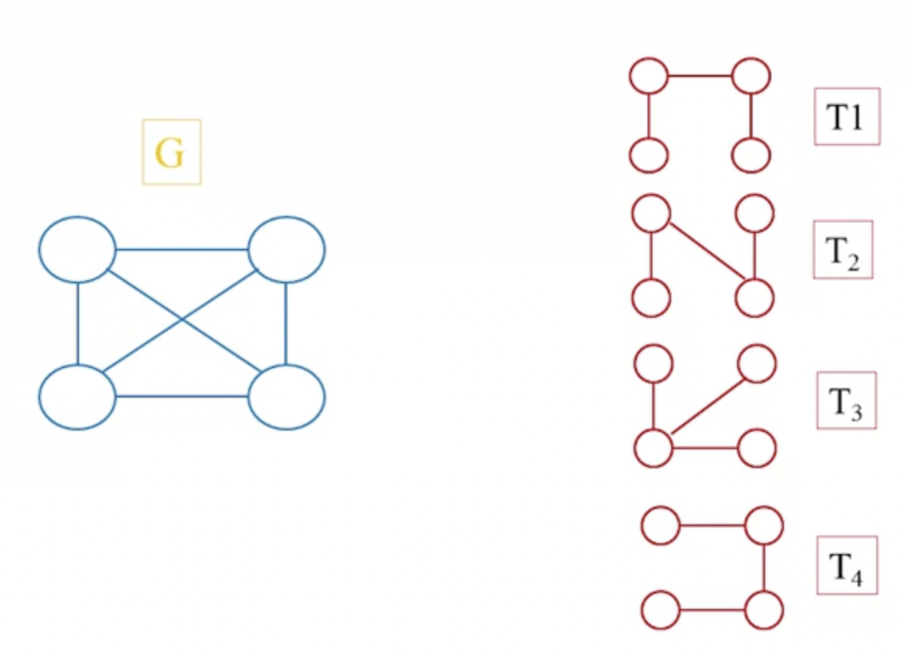

      * To get a spanning tree of graph G.
          * 1. Keep all verticies of G.
          * 2. Break all cycles but keep the tree connected.
      * Examples of spanning trees

        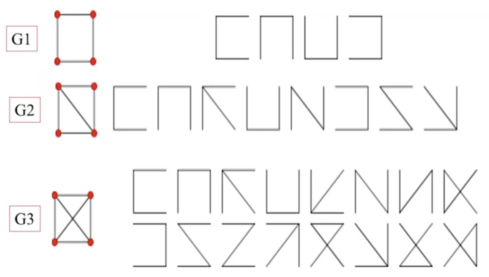

* Two spanning trees are said to be isomorphic if there is a bijection preserving adjaceny between the two trees.
* Some spanning trees of a graph might be isomorphic to each other: ie they're the same.

  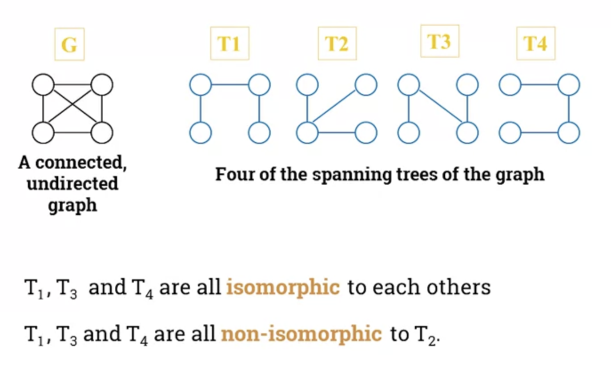

    * In this example, we would only draw $T_1$ and $T_2$, or $T_3$ and $T_2$ or $T_4$ and $T_2$ if we were asked for non-isomorphic trees.

## 8.107 Min Spanning Tree

* Example of a use case.
    * Suppose you want to supply houses with:
        * electric power
        * water pipes
        * sewage lines
        * telephone lines
    * To keep costs down, you could connect with spanning tree (power lines, for example)
    * However, houses are not equal distance apart.
    * To reduce costs even further, connect the houses with a minimum-cost spanning tree.
* Spanning trees costs
    * Suppose you have a connected undirected graph with a **weight** (or cost) associated with each edge.
    * The cost of a spanning tree would be the sum of the costs of its edges.
* Weight of a spanning tree
    * In this image, there are 3 spanning trees of graph $G$ each with separate costs

      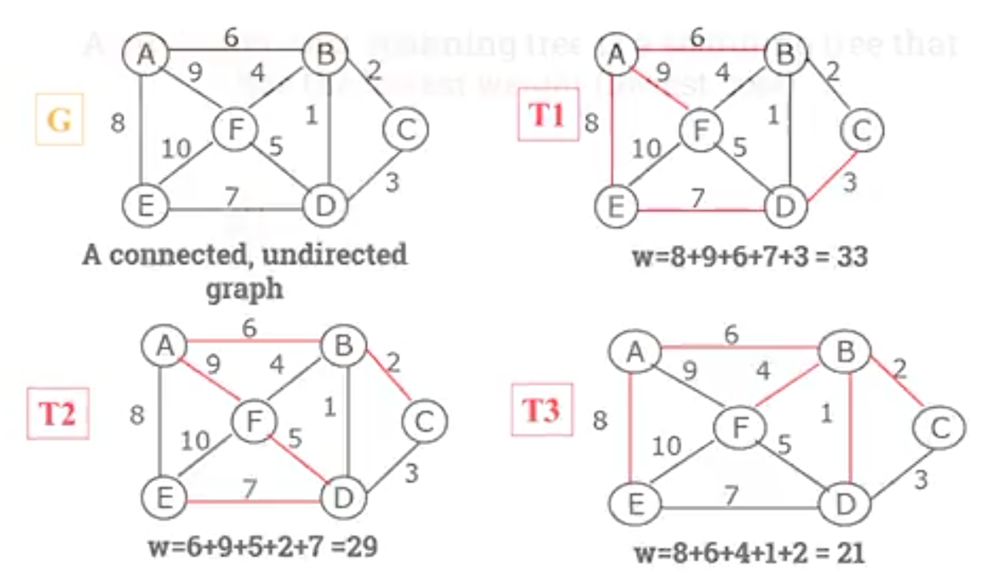

* Minimum spanning trees
    * Minimum-cost spanning tree is a spanning tree that has the lowest weight (lowest cost).
* Finding spanning trees
    * There are 2 algorithms for finding minimum-cost spanning trees, and both are greedy algorithms:
        * Kruskal's Algorithm
        * Prim's Algorithm
* [Kruskal's Algorithm](permanent/kruskals-algorithm.md)
    * Start with cheapest edge in spanning tree.
    * Repeatedly: keep adding cheapest edge that does not create a cycle.
    * Step 1.

      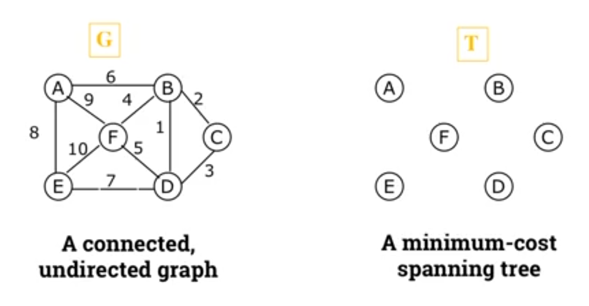

    * Step 2.

      

    * And so on...
* [Prim's Algorithm](permanent/prims-algorithm.md)
    * Start with any node in spanning tree.
    * Repeatedly add the cheapest edge, and the node it leads to, for which the node is not already in that spanning tree.

    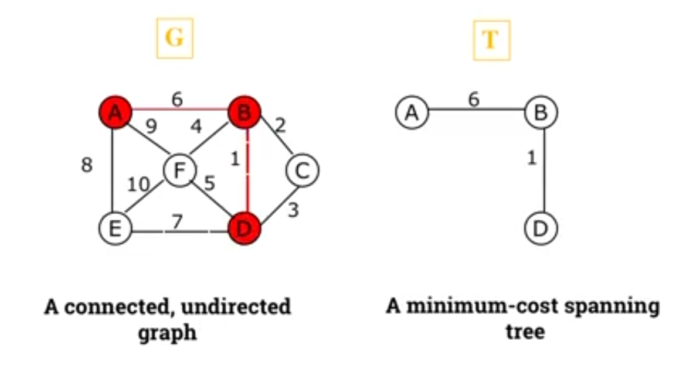
