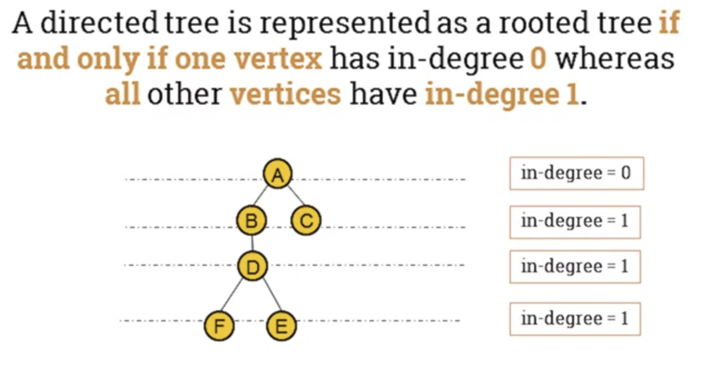

## 8.201 Rooted trees

* Rooted Trees
    * A rooted tree is a directed tree with a distinguished vertex $r4, called a root. Such that, for every vertex v there is a directed path from r to v.

        

    * A directed tree is represented as a rooted tree if and only if one vertex has in-degree 0 whereas all other vertices have in-degree 1.
    * 
* Terminology of rooted trees.
    * In the image above:
        * A is the root of the tree.
        * B is called the parent of D.
        * E and F are the children of D.
        * B and A are ancestors of E and F (E and F are siblings)
        * B and D are called internal nodes.
        * C, E and F are called external nodes.
* Depth and height in a tree
    * Depth or path length of a node in a tree is the number of edges from root to that node.

      

    * Height of a node in a tree is the longest path from that node to the leaf.

      

    * The depth or the height of a tree is the maximum path length across all nodes.
    * The depth (height) of this tree is 4.
* Special trees
    * [Binary Tree](../../../../permanent/binary-tree.md) is a rooted tree in which every vertex has 2 or fewer children.

        

    * Ternary tree is a rooted tree in which every vertex has 3 or fewer children.

      

    * m-ary tree is a rooted tree in which every vertex has m or fewer children.
* Regular rooted trees
    * A regular m-ary tree is regular if everyone of its node has exactly m children.

      

      * Properties
          * m-ary tree has at most $m^h$ vertices as level h.

            

* [Isomorphic Trees](permanent/isomorphic-trees.md)
    * 2 trees $T_1$ and $T_2$ are isomorphic if there is a bijection: $f: V(T_1) \rightarrow V(T_2)$ which preserves adjacency and non-adjacency.
    * That is, if uv is an edge in $E(T_1)$ and $f(u)f(v)$ is in $E(T_2)$
    * Notation
        * $T_1 \cong T_2$ means that $T_1$ and $T_2$ are isomorphic.
    * Example

    

* Properties
    * The properties of graphs also apply to trees.
    * 2 trees with different degree sequences are not isomorphic.
    * 2 trees with the same degree sequence are not necessarily isomorphic.
* Isomorphic rooted trees
    * Two isomorphic trees are isomorphic as rooted trees if and only if there is a bijection that maps the root of one tree to the root of the other.

    

## 8.203 Binary search trees

* A binary search tree with labels where they're larger on the right-hand side of the subtree and smaller on the left-hand side.

  

* Applications
    * It's useful when we want to store a modifiable collection in a memory and be able to search, insert or remove elements from the collection efficiently.
* Binary search trees can be used to solve these kinds of problems.
* Example
    * Build a binary search tree to store 15 records

      

  * Height of a bst
      * 2 methods for finding the height:
              * Method #1
                  $2^{h-1} < 1 + N \leq 2^h$
                  $\equiv$
                  $h-1 < log2(1 + N) \leq h$
              * Method #2
                  $h = [log_2 (N + 1)]$
 * Binary search algorithm
     * Starts by comparing the search element to the middle term in the list.
     * The list is then split into 2 smaller sub-lists of the same size, or where one of these smaller lists has one fewer term than the other.
     * Search continues by restricting the search to appropriate sub-list.

## Peer Review

### Question 1

Consider the following graph, G, with 4 vertices, $x$, $y$, $z$ and $w$.

1. Find the degree sequence of the graph $G$.

4, 3, 3, 2

2. Draw two non-isomorphic spanning trees of G.

3. Let $A$ be the adjacency matrix of $G$. Write down $A$.

$$
A = \begin{bmatrix}
\ & w & x & y & z \\

w & 0 & 1 & 1 & 2 \\
x & 1 & 0 & 1 & 0 \\
y & 1 & 1 & 0 & 1 \\
z & 2 & 0 & 1 & 0 
\end{bmatrix}
$$

4. What information does the sum of elements in A tell you about G?

The sum of elements is: $1 + 1 + 2 + 1 + 1 + 1 + 1 + 1 + 2 + 1 = 12$
From that information, we know that the numbers of edges is 12 / 2 = 6
