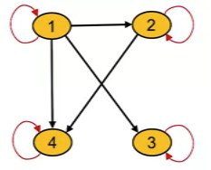

## Lesson 9.1 Understanding the concept of relations

### 9.101 Introduction

* Relationships between elements of sets occur in many contexts.
* We deal with relationships in a daily basis:
    * A relationship between a person and a relative.
    * A relationship between an employee and their salary.
    * A relationship between a business and its telephone number.
    * A relationship between a computer language and a valid statement in this language will often arise in computer science.
* In maths, we study relationships like:
    * the relation between a positive integer and one it divides.
    * relation between a real number and one that is larger than it.
    * relation between a business and its telephone number.
    * relation between a computer language and a valid statement
    * relation between a real number x and the value f(x) where f is a function, and so on.
* Relations in maths
    * We can define relationship between elements of 2 sets
    * We can also define the relationship between 2 elements of a set.

### 9.103 Definition of a relation: relation versus function

* [Relation](../../../../permanent/relation.md)
    * A relation can be defined between elements of set A and elements of another set B.
    * Can also be defined between elements of the same set.
    * We use the letter $R$ to refer to relation.
    * Let $A$ and $B$ be two sets.
    * Let $R$ be a relation linking elements of set $A$ to elements of set $B$.
    * Let $x \in A$ and $y \in B$
        * We say that $x$ is related to $y$ with respect to relation $R$ and we write $x \ R \ y$
    * A relation can also be between elements of the same set.
    * A relation is a link between two elements of a set
        * For example
            * A person x is a SON OF' a person y.
            * SON OF is a relation that links x to y
        * Usually use the letter $R$ to refer to a relation:
            * In this case $R$ = 'SON OF'
            * If $x$ is SON OF $y$ we write $x \ R \ y$
            * If $y$ is NOT a SON OF $x$ we write $y \ \not R \ x$
    * A relation can be defined as a link or connection between elements of set A to set B.
    * Example
        * A is the set of students in a Comp Science class
            * $A = \{Sofia, Samir, Sarah\}$
        * B is the courses the department offers
            * $B = \{Maths, Java, Databases, Art\}$
        * Let $R$ be a relation linking students in set $A$ to classes they are enrolled in: A student is related to the course if the student is enrolled in the course.
        * Examples:
            * Sofia is enrolled in Math and Java
            * Samir is enrolled in Java and Databases
            * Sarah is enrolled in Math and Art
            * Sofia is not enrolled in Art
        * Notations:
            * Sofia $R$ Maths
            * Sofia $R$ Java
            * Samir $R$ Java
            * Samir $R$ Databases
            * Sarah $R$ Maths
            * Sarah $R$ Art
            * Sofia $\not R$ Art
* Cartesian product
    * Let $A$ and $B$ be 2 sets.
    * The Cartesian product A x B is defined by a set of pairs (x, y) such that $x \in A$ and $y \in B$
        * $A \ x \ B = \{(x, y): x \in A \text{ and } y \in B \}$
    * For example:
        * $A = \{ a_1, a_2 \}$ and $B = \{b_1, b_2, b_3\}$
        * $A \ x \ B = \{(a_1, b_1), (a_1, b_2), (a_1, b_3), (a_2, b_1), (a_2, b_2), (a_2, b_3)\}$
* Definition of relation
    * Let $A$ and $B$ be two sets.
    * A binary relation from A to B is a subset of a Cartesian product $A \ x \ B$
        * $R \subseteq A \ x \ B$ means $R$ is a set of ordered pairs of the form (x, y) where $x \in A$ and $y \in B$.
        * $(x, y) \in R$ means $x \ R \ y$ (x is related to y)
    * For example:
        * $A = \{a, b, c\}$ and $B = \{1, 2, 3\}$
        * The following is a relation defined from A to B:
            * $R = \{(a, 1), (b, 2), (c, 3)\}$
            * This means that: $a\ R \ 1$, $b \ R \ 2$ and $c \ R \ 3$
* Relations on a set
    * When A = B
    * A relation R on the set A is a relation from A to A
        * $R \subseteq A \ x \ A$
    * We will be studying relations of this type.
    * Example
        * A = {1, 2, 3, 4}
        * Let R be a relation on the set A:
            * $x, y \in A$, $x \ R \ y$ **if and only if** $x < y$
        * We have 1 R 2, 1 R 3, 1 R 4, 2 R 3, 2 R4, 3 R 4
        * $R = \{(1,2), (1,3),(1,4), (2, 3), (2, 4), (3, 4)\}$

### 9.105 Matrix and graph representatins of a relation

* Relations using matrices
    * Given a relation R from a set A to set B.
    * List the elements of sets A and B in a particular order
    * Let $n_a = |A|$ and $n_b = |B|$
    * The matrix of R is an $n_a \ \text{x} \ n_b$ matrix.
        * $M_r = [m_{ij}] n_a \ x \ n_b$
    * In matrix store a 1 if $(a_i, b_j) \in R$ otherwise, 0
* Example 1
    * Let A = {Sofia, Samir, Sarah}
    * Let B = {CS100, CS101, CS102, CS103}
    * Consider the relation of who is enrolled in which class
    * R = { (a,b) | person a is enrolled in course b }

|       | CS100 | CS101 | CS102 |
| ----- | ----- | ----- | ----- |
| Sofia | x     | x     |       |
| Samir |       | x     | x     |
| Sarah | x     |       | x      |

$$
M_r = \begin{bmatrix}
1 & 1 & 0 \\
0 & 1 & 1 \\
1 & 0 & 1
\end{bmatrix}
$$

* Example 2
    * Let A = { 1, 2, 3, 4, 5 }
    * Consider a relation: $< (x, y) \in R \text{ if and only if } x < y$
    * Every element is not related to itself (hence the diagonal 0s).

$$
M_r = \begin{bmatrix}
0 & 1 & 1 & 1 & 1 \\
0 & 0 & 1 & 1 & 1 \\
0 & 0 & 0 & 1 & 1 \\
0 & 0 & 0 & 0 & 1 \\
0 & 0 & 0 & 0 & 0 \\
\end{bmatrix}
$$

* Example 3
    * Let A = { 1, 2, 3, 4, 5 }
    * Consider a relation : $\leq (x, y) \in R$ if and only if $x \leq y$
    * Note the diagonal is all 1s.

$$
M_r = \begin{bmatrix}
1 & 1 & 1 & 1 & 1 \\
0 & 1 & 1 & 1 & 1 \\
0 & 0 & 1 & 1 & 1 \\
0 & 0 & 0 & 1 & 1 \\
0 & 0 & 0 & 0 & 1 \\
\end{bmatrix}
$$

* Combining relations
    * Union
        * The [Union](../../../../permanent/union.md) of 2 relations is a new set that contains all of the pairs of elements that are in at least one of the two relations.
        * The union is written as $R \ U \ S$ or "R or S".
        * $R \ U \ S$ = { $(a, b): (a, b) \in R$ or $(a, b) \in S$ }
    * Intersection
        * The intersection of 2 relations is a new set that contains all of the pairs that are in both sets.
        * The intersection is written as $R \cap S$ or "R and S"
        * $R \cap S$ = { $(a, b): (a, b) \in R$ and $(a, b) \in S$ }
    * Combining relations: via Boolean operators
        * Let $M_{R} = \begin{bmatrix}1 & 0 & 1 \\ 1 & 0 & 0 \\ 0 & 1 & 0 \end{bmatrix} \\ M_{s} = \begin{bmatrix} 1 & 0 & 1 \\ 0 & 1 & 1 \\ 1 & 0 & 0 \end{bmatrix}$
        * Join $M_{R \cup S} = M_R \vee M_S = \begin{bmatrix}1 & 0 & 1 \\ 1 & 1 & 1 \\ 1 & 1 & 0\end{bmatrix}$
        * Meet $M_{R \cap S} = M_R \land M_S = \begin{bmatrix} 1 & 0 & 1 \\ 0 & 0 & 0 \\ 0 & 0 & 0 \end{bmatrix}$
* Representing relations using directed graphs
    * When a relation is defined on a set, we can represent with a digraph.
    * Building the digraph
        * First, the elements of A are written down,
        * When $(a, b) \in R$ arrows are drawn from a to b.
    * Example 1
        * A = { 1, 2,3 ,4}
        * Let R be relation on A defined as follows:
            * R = { $(x, y)$ | x divides y}
            * R can be represented by this digraph
            * 
                * Each value divides itself, hence the loop at each vertex.
                * One divides all other elements, so it has a link to each elements.
                * 2 only divides into 4
                * So on...
    * Example 2
        * Let A = { 1, 2, 3, 4, 5 }
        * Consider relation: $\leq (x, y) \in R$ if and only if $x \leq y$
        * 
            * Each element is equal to itself.
            * One is less than or equal to all elements.
            * 5 is greater than all elements except itself.
            * So on.

### 9.107 The properties of a relation: reflexive, symmetric and anti-symmetric

* Reflexivity
    * A relation R in a set S is said to be reflexive if and only if $x \ R \ x$, $\forall x \in S$
        * Or, for all x in the set, if the pairs (x, x) is in the relation, then it's reflexive.
    * Example 1 (reflexive example)
        * Let R be a relation of elements in Z:
            * $R = \{ (a, b) \in Z^2 | a \leq b \}$
        * For all x elements of Z, we have $x \leq x$, hence $x \ R \ x$
        * This implies that R is reflexive.
    * Example 2 (non-reflexive)
        * $R = \{ (a, b) \in Z^2 | a \lt b \}$
    * Digraph of reflexive relation
        * Every element will have a loop.
        * In this example, S = {1, 2, 3, 4} and R is a relation of elements S $R = \{ (a, b) \in S^2 | a \leq b \}$
          
    * Matrix of reflexive relation
        * Same example as above.
        * Note that all the values in the diagonal are 1.
          
* Definition of [Symmetry](Symmetry)
    * A relation is said to be symmetric if and only if:
        * $\forall a, b \in S$, if $a \ R \ b$ then $b \ R \ a$.
    * Proof: let $a, b \in Z$ with $a \ R \ b$:
        * a mod 2 = b mod 2
        * b mod 2 = a mod 2
        * b R a
    * R is symmetric
* Diagram of a symmetric relation
* Example
    * Let S = {1, 2, 3, 4} and R be relation of elements in S
        * R = { (a,b) \in S^2 | a mod 2 = b mod 2 }
         
* Matrix of symmetric relation
    * Example
        * Let S = {1, 2, 3, 4} and let R be relation of elements in S
            * R = { (a, b) \in S^2 | a mod 2 = b mod 2 }
        * $M_R = \begin{bmatrix}1 & 0 & 1 & 0 \\ 0 & 1 & 0 & 1 \\ 1 & 0 & 1 & 0 \\ 0 & 1 & 0 & 1\end{bmatrix}$
* Definition of anti-symmetric
    * A relation R on a set S is said to be anti-symmetric if and only if $\forall a, b \in S$, if $a \ R \ b$ and $b \ R \ a$ then $a = b$
        * In other words, no 2 diff elements are related both ways.
    * Examples
        * Let R be a relation on elements in Z:
            * $R = \{ (a, b) \in Z^2 | a \leq b \}$
        * Let $a, b \in Z$, $a \ R \ b$ and $b \ R \ a$
            * $a \leq b$ and $b \leq a$
            * $a = b$
        * R is anti-symmetric
* Digraph of anti-symmetric relation
    * Digraph contains no parallel edges between any 2 different vertices.
    * Example
        * Let S = {1, 2, 3, 4} and R be relation on elements in S
            * $R = \{ (a, b) \in S^2 | \text{ a divides b } \}$
        
* Matrix of an anti-symmetric relation
 
* Exercise
* Let R be the relation defined by the Matrix M_r
    * $M_r = \begin{bmatrix} 0 & 0 & 1 \\ 1 & 1 & 1 \\ 0 & 0 & 1 \end{bmatrix}$
* Is R reflexive? Symmetric? Anti-symmetric?
* Clearly R is not reflexive: $m_{1,1} = 0$
* It is not symmetric because $m_{2,1}=1, m_{1, 2}=0$
* However, it is anti-symmetric.

### 9.109 Relation properties: transitivity

* Definition of transitivty
    * A relation $R$ on a set S is called transitive if and only if:
        * $\forall a, b, c \in S$, if ($a \ R \ b$ and $b \ R \ c$) then $a \ R \ c$
* Examples of transitive relations
    * $R = \{ (x , y) \in N^{2} | x \leq y \}$
        * It is transitive as $\forall x, y, z \in \mathbf{N}$ if $x \leq y$ and $y \leq z$ then $x \leq z$
    * R = { (a, b) | a is an ancestor of b }
        * It is transitive because if a is an acestory of b and b is an ancestor of c, then a is an ancestor of c.
* Example of non-transitive relations
    * R = { (2, 3), (3, 2), (2, 2) }
        * It is not transitive because 3 R 2 and 2 R 3 but 3 \not R 3
    * 
        * Not transitive as:
            * $a \ R \ c$ and $b \ R \ c$, however $a \ \not R \ c$
            * Also: $b \ R \ c$ and $c \ R \ d$ however $b \ \not R \ d$
    * What edges need to be added to make it transitive?
        * 
            * The result enhanced relation is called the "transitive closure of the original relation"
