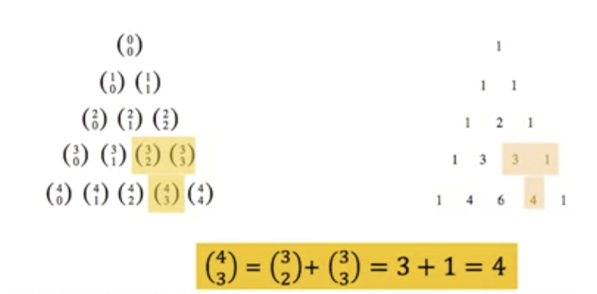

## 10.201 Binomial coefficients and identities

* [Binomial Theorem](../../../../permanent/binomial-theorem.md)
    * An expression consisting of 2 terms, connected by a + or - sign.
    * Examples:
        * $x + a$
        * $2x - y$
        * $x^2 - y^2$
        * $x2 - 3y$
    * As we increase power of binomials, expanding them becomes more complicated:
        * $(x + y)^1 = x + y$
        * $(x + y)^2 = x^2 + 2xy + y^2$
        * $(x + y)^3 = x^3 + 3x^2y + 3xy^2 + y^3$
    * At very high orders, like $(x + y)^{30}$ binomial theorem becomes very useful.
    * Theorem:
        * Let x and y be variables, and n a non-negative integer.
        * The expansion of $(x + y)^n$ can be formalised as:
            * $(x + y)^n = \sum\limits_{k=0}^{n} \binom{n}{k} x^ky^{n-k}$
    * Example:
        * What is the coefficient of $x^8y^7$ in the expansion of $(3x - y)^{15}$?
        * Solution:
            * We can view the expression as $(3x + (-y))^{15}$
            * By the binomial theorem:
                * $(3x + (-y))^{15} = \sum\limits_{k=0}^{15} \binom{15}{k} (3x)^k(-y)^{15-k}$
            * Consequently, the coeeficient of $x^8y^7$ in the expansion is obtained when k = 8:
                * $\binom{15}{8} (3)^8 (-1)^7 = -3^8 \frac{15!}{8!7!}$
* Application of the binomial theorem
    * Prove the identity: $2^n = \sum\limits_{k=0}^{n} \binom {n}{k}$
    * Using binomial theorem:
        * With x = 1 and y = 1, from the binomial theorem we see that the identity is verified.
    * Using sets:
        * Consider the subsets of a set with n elements.
        * There are subsets with zero elements, with one element, with two elements and so on...with n elements.
        * Therefore the total number of subsets is $\sum\limits_{k=0}^{n} \binom{n}{k}$
        * Also, since we know that a set with n elements has $2^n$ subsets, we can conclude that: $2^n = \sum\limits_{k=0}^{n} \binom{n}{k}$
* Pascal's identity
    * If n and k are integers with $n \geq k \geq 1$, then:
        * $\binom{n}{k} + \binom{n}{k-1} = \binom{n+1}{k}$
    * Proof:
        * Let T be a set where $|T| = n + 1$, $a \in T$, and $S = T - {a}$
        * There are $\binom{n+1}{k}$ subsets of T containing k elements. Each of these subsets either:
            * contains a with k - 1 other elements, or
            * contains k elements of S and not a
        * There are
            * $\binom{n}{k-1}$ subsets of k elements that contain a
            * $\binom{n}{k}$ subsets of k elements of T that don't contain a
        * Hence, $\binom{n+1}{k} = \binom{n}{k-1} + \binom{n}{k}$
    * It's the basis for geometic arrangements of the binomial coefficients in a triangle. This is called [Pascal's Triangle](permanent/pascals-triangle.md).
    * Pascal's triangle is a number triangle with numbers arranged in staggered rows such that $a_{n,r}$ is the binomial coefficients of $\binom{n}{r}$

      

      Using Pascal's identity, we can show the result of adding 2 adjacent coefficients in the triangle is equal to the binomial coefficient in the next row between these 2 coefficients.

## Video: 10.204 Generalised permutations and combinations

* Permutations with repetition
    * The number of r-permutations for a set of n objects when repitition allowed is $n^r$
    * Proof:
        * Since we always have n choices each time:
            * n possibilities for 1st choice.
            * n possibilities for 2nd choice.
            * ...
            * n possibilities when choosing the last number.
        * By product rule, multiplying each time:
            * (do this r times) $n \times n \times n \times ... \times n = n^r$
    * Example:
        * How many strings of length r can be formed if we are using only uppercase letters in the English alphabet?
        * Solution:
            * The number of such strings is $26^r$, which is the number of r-permutations with repetition of a set with 26 elements.
* Permutations without repetition
    * When we have permutations without repetition, we reduce the number of choices available each time by 1.
    * So, the number of r-permutations of a set with n objects without reps is:
        * (do this r times) $n \times n-1 \times n-2 \times ... \times n-r+1$
        * $P(n, r) = n(n -1)(n -2) ... (n - r + 1) = \frac{n!}{(n - r)!}$
    * Example
        * 10 runners take part in running competition. How many different ways can the 1st and 2nd place be awarded?
        * Solution:
            * $P(10, 2) = P^2_{10} = \frac{10!}{(10 -2)!} = \frac{10!}{8!} = 90$
* Combination with repetition
    * The number of ways in which k objects can be selected from n categories of objects, with repetition permitted, can be calculated as: $\binom{k+n-1}{k} = \frac{(k+n-1)!}{k!(n-1)!}$
    * It is also the total numebr of ways to put k identical balls into n distinct boxes.
    * It is also the total number of functions from a set of k identical elements to a set of n distinct elements.
    * Example
        * Find all multisets of size 3 from the set {1, 2, 3, 4}
        * Solution:
            * Using bars and crossed, think of the values 1, 2, 3, 4 as four categories.
            * Denote each multiset of size 3 by placing 3 crosses in the various categories.
            * For example, the multiset {1, 1, 3} is represented by x x | | x |
            * This countining problem can be modelled as distributing the 3 crosses among the 3+4-1 positions, with the remaining positions occupied by bars
            * Therefore, the number of multisets of size 3 is: $C(6, 3) = \frac{6!}{3!3!} = 20$
* Combination without repetition
    * The number of ways in which k objects can be selected from n categories of objects with repetition not permitted can be calculated as: $\binom{n}{k} = \frac{n!}{k!(n-k)!}$
    * Counting problem is the same as the number of ways to put k identitcal balls into n distinct boxes, where each box receives at most one ball.
    * It is also the number of one-to-one functions from a set of k identical elements into a set of n distinct elements.
    * It is also the number of k-element subsets of an n-element set.
* Choice of formulas
    * We have discussed four ways of selecting k objects from a set with n elements:
        * the order in which choices are made may or may not matter.
        * repetition may or may not be alloed.
    * This table summarises the formula in each case:

|                             | Order matters       | Order does not matter         |
| --------------------------- | ------------------- | ----------------------------- |
| Repetition is not permitted | $\frac{n!}{n - k!}$ | $\frac{n!}{k!(n-k)!}$         |
| Repetition is permitted     | $n^{k}$               | $\frac{(k + n - 1)!}{k!(n-1)!}$ |

* Example
    * John is a chair of a committee. In how many ways can a committee of 3 be chosen from 10 people, given that John must be one of the people selected?
    * Solution:
        * Since John is already chosen, we need to choose another 2 out of 9 people
        * In choosing a committee, the order doesn't matter, so we need to apply the combination without repetition formula: $C(9, 2) = \frac{9!}{2!(9-2)!} = 36$ ways.

## Video: 10.206 Distinguishable objects and boxes

* Many counting problems can be reduced into finding the number of ways objects can be placed into boxes.
* Distributing objects into boxes.
    * We can phrase counting problems in terms of distributing k objects into n boxes, under various conditions:
        * The objects can be distinguishable or indistinguishable.
        * The boxes can be either distinguishable or indistinguishable.
        * The distribution can be done either with exclusion or without exclusion.
    * Distinguishable means they are marked in someway that allows you to distinguish from each other.
        * Indistinguishable means objects or boxes are identical so you can't tell them apart.
        * When placing indistinguishable objects into distinguishable boxes, it makes no difference which object is placed into which box.
    * The term "with exclusion" means no box can contain more than one object.
        * "without exclusion" means box can contain more than one object.
* Distinguishable objects into distinguishable boxes **with exclusion**
    * We want to distribute k balls, numbered from 1 to k, into n boxes, numbered from 1 to n, so that no box gets more than one ball.
    * Equivalent to making an **ordered selection of k boxes** from **n boxes**, where the balls do the selecting for us:
        * the ball labelled 1 chooses the first box.
        * ball labelled 2 gets 2nd box.
        * etc
    * Theorem:
        * Distributing $k$ distinguishable balls into n distinguishable boxes, with exclusion, is equivalent to forming a permutation of size $k$ from a set of size $n$.
        * Therefore, the number of ways of placing k distinguishable balls into n distinguishable boxes is as follows:
            * $P(n, k) = n(n - 1)(n - 2) ... (n - k + 1) = \frac{n!}{(n-k)!}$
* Distinguishable objects into distinguishable boxes **without exclusion**
    * In this case, we want to distribute **k balls**, numbered from 1 to k, into n boxes, numbered from 1 through n, **without restrictions on the number of balls in each box**
    * This is equivalent to making an **ordered selection of k boxes from n**, with repetition, where the balls do the selecting for us:
        * the ball labelled 1 chooses the first box.
        * the ball labelled 2 chooses the 2nd box.
        * so on...
    * Theorem:
        * Distributing k distinguishable balls into n distinguishable boxes, without exclusion, is **equivalent to forming a permutation of size k from a set of size n, with repetition.**
        * Therefore, there are:
            * $n^k$ different ways
* **Indistinguishable objects** into distinguishable boxes **with exclusion**.
    * In this case, we want to distribute k balls, into n boxes, numbered from 1 through n, in such a way that no box receives more than one ball.
    * Theorem:
        * Distributing k indistinguishable balls into n distinguishable boxes, with exclusion, is equivalent to forming a combination of size k from a set of size n.
        * Therefore, there are:
            * $\binom{n}{k} = \frac{n!}{k!(n-k)!}$ different ways.
* Indistinguishable objects into distinguishable boxes **without exclusion**.
    * Want to distribute k balls, into n boxes, numbered from 1 through n, without restrictions on the number of balls in each box.
    * Theorem:
        * Distributing k indistinguishable balls into n distinguishable boxes, without exclusion, is equivalent to forming a combination of size k from a set of size n, with repetition.
        * Therefore, there are:
            * $\binom{n+k-1}{k} = \frac{n+k-1}{k!(n-1)!}$ different ways.
    * Example
        * How many ways are there of placing 8 indistinguishable balls into 6 distinguishable boxes?
            * $\binom{8+6-1}{8} = \binom{13}{8} = \frac{13!}{8!5!} = 1287$

# Week 20 - Peer-graded Assignment: 10.208 Combinatorics

## Question

Find the number of positive integers not exceeding 2310.

Find the number of positive integers not exceeding 2310 that are either the square or the cube of an integer.
Hint: use the subtraction rule, also known as the principle of inclusion-exclusion.

Let $A$ be the set of all positive integers not exceeding 2310.

And $A_1$ the set of all positive integers, perfect square and not exceeding 2310.

And $A_2$, the set of all positive integers, perfect cube and not exceeding 2310

## Answer

Let $A$ be set of all positive integers not exceeding 2310.

$A = \{1, 2, 3 ... 2310\}$
$|A| = 2310$

Let $A_1$ be the set of all positive integers that are a perfect square and not exceeding 2310.

$A_1 = \{1, 4, 9 ... 2304\}$
$|A_1| = 48$

Let $A_2$ be the set of all positiev integers that are a perfect cube and not exceeding 2310.

$A_2 = \{1, 8, 27...2197\}$
$|A_2| = 13$

To find the number of positive integers not exceeding 2310 that are either the square or the cube of an integer, we want to find: $|A_1 \cup A_2|$

Using the inclusion-exclusion rule, we know that:

$|A_1 \cup A_2| = |A_1| + |A_2| - |A_1 \cap A_2|$

We know that:

$A_1 \cap A_2 = \{1, 64, 729\}$
$|A_1 \cap A_2| = 3$

Therefore:

$|A_1 \cup A_2| = 48 + 13 - 3$
$|A_1 \cup A_2| = 58$
