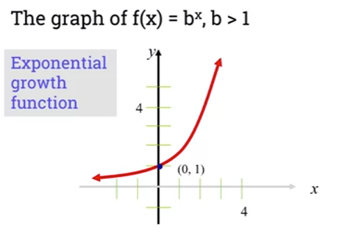

## 2.101 Introduction

* [Variable](../../../../permanent/variable.md)
    * In everyday life, many quantities depend on change in variables:
        * Plant's growth depends on sunlight and rainfall.
        * A runner's speed == how long it takes to run a distance.

## 2.102 The definition of a function

* [Function](../../../../permanent/function.md)
    * A function is a rule that relates how one quantity depends on another.
    * It's central to programming and Computer Science.
    * It's a relationship between a set of inputs and a set of outputs, where inputs map to exactly one output.
    * Function is a "well-behaved relation"
        * Given a starting point, we have just one ending point.
    * A function $f$ from a set of $A$ to a set of $B$ is an assignment of exactly one element of $B$ to each element of $A$.
        * If $f$ is the function from A to B, we write: $f: A \rightarrow B$
        * We can read this as f maps A to B:
            * $x \in A: \ \ x \rightarrow f(x) = y \ \ \ (y \in B)$
    * Domain of a Function
        * Given the function above, $A$ is the set of all inputs and called the "domain" of $f$.
            * Written as $D_f = A$
    * Co-Domain of Function
        * $B$ is the set containing the outputs and called the co-domain of $f$.
            * Written as $\text{co-}D_f = B$
        * The set of all outputs is called the range of f and is written as $R_f$.
        * $y$ is called the image of $x$.
        * $x$ is called the pre-image of $y$.

            

        * Example: a set mapping characters to a length.
            * $f(\text{Sea}) \rightarrow 3$ (contains 3 characters)
            * $f(Land) \rightarrow 4$ (contains 4 characters)
            * $f(on) \rightarrow 2$
                * 2 is the image of "on"
                * "on" is the pre-image of 2.
* Conditions under which a relation is not a function:
    * Some inputs do not have an image.
    * Some inputs have more than one image.
* Exercise 1
    * Given the following function: $f: Z \rightarrow Z$ with $f(x) = |x|$, what is domain, co-domain and range for function $f$?
        * Domain: $Z$
        * Co-domain: $Z$
        * Range: $Z^{+}$
* Exercise 2
    * Given the following function: $g: R \rightarrow R$ with $g(x) = x^2 + 1$
        * Domain: R
        * Co-domain: R
        * Range: $\{1, 5, 9 ...\}$
        * Pre-images(5) = {-2, 2}

## 2.104 Plotting functions

* [Linear Function](../../../../permanent/linear-function.md)
    * Linear function is of form: $f(x) = ax + b$
        * Where $a$ and $b$ are real numbers.
        * Straight-line function that passes through point (0, b).
        * $a$ is the gradient of the function. Where $a > 0$ the function is increasing.
            * That is: $x_1 \leq x_2$ then $f(x_1) \leq f(x_2)$.
        * Example of increasing linear function:

          

        * When the gradient is < 0, the function is decreasing.
    * $f: R \rightarrow R$
        * $f(x) = ax +b$
            * If $a > 0$ then function is increasing.
            * If $x_1 \leq x_2$ then $f(x_1) \leq f(x_2)$

                

* [Quadratric Functions](../../../../permanent/quadatric-functions.md)
    * Quadratic functions: $f(x) = ax^2 + bx + c$
        * Where $a$, $b$ and $c$ are real numbers and $a \ne 0$.

            

        * Domain of function f(x) is set of real numbers.
        * Range of function is set of positive numbers.
* [Exponential Functions](permanent/exponential-functions.md)
    * If base $b$ in $f(x) = b^x$, $b > 1$ then function is increasing and represents growth shown in this graph:

      

        * Graph also shows that the point $(0,1)$ is a "common point".
        * Domain is equal to set of all real numbers.
        * Range is equal to set of all real positive numbers.
        * X-axis is horizontal asymtot to curve of function.
    * If base 0 < b < 1, then function is decreasing:

        

        * Domain and range are the same as previous function.
* [Laws Of Exponential Functions](../../../../permanent/laws-of-exponential-functions.md)
    * $b^xb^y = b^{x + y}$
    * $\frac{b^x}{b^y} = b^{x-y}$
    * $(b^x)^y = b^{xy}$
    * $(ab)^x = a^xb^x$
    * $(\frac{a}{b})^x = \frac{a^x}{b^x}$
    * $b^{-x} = \frac{1}{b^x}$

## 2.106 Injective and surjective functions

* [Injective Function](../../../../permanent/injective-function.md)
    * A function is considered *injective* or *one-to-one* if and only if:
        * any 2 distinct inputs will lead to 2 distinct outputs.
        * In other words:
            * for all $a, b \in A, \text{ if } a \ne b \text{ then } f(a) \ne f(b)$
            * same as saying: $a, b \in A, \text{ if } f(a) = f(b) \text{ then } a = b$
        * Example on the left is an injective function, as every element of $A$ has a unique image in B.
        * Example on the right is not injective. 2 or 4 in A have the same image 0. 1 and 3 have the same image 1.

        

    * You can show a function is not injective by finding two different inputs $a$ and $b$ with the same [Function Image](permanent/function-image.md).
    * An example with a linear function:
        * To show function $f: R -> R$ with $f(x) = 2x + 3$ is an injective function, we must show that $\text{ if } f(a) = f(b) \text{ then } a = b$
            * $f(a) = f(b)$ => $2a + 3 = 2b + 3$ => $2a = 2b$ => $a = b$ => f is injective.
        * Proof 2:
            * Let $a, b \in R$, show that $\text{ if } a \ne b \text{ then } f(a) \ne f(b)$
                * $a \ne b$ => $2a \ne 2b$ => $2a + 3 \ne 2b+3$ => $f(a) \ne f(b)$ => f is injective
    * An example quadratic function that is not injection.
        * Show function $f: R -> R$ with $f(x) = x^2$ is not an injective function
        * Example with 2 counter examples that have the same image.
            * One example is 5 and -5 have the same image.
                * $f(5) = (5)^2 = (-5)^2 = f(-5)$
                    * Since: $-5 \ne 5$ it's not injective.
                    * If we change domain to $R^{+}$, the function becomes injective.
            * Proof 1:
                * Let $a, b \in R^{+}$ show that if $f(a) = f(b)$ then $a = b$.
                    * Let $a, b \in R^{+}$ show that if $f(a) = f(b)$ then $a = b$
            * Proof 2:
                * Let $a, b \in R^{+}$ show that if $a \ne b$ then $f(a) \ne f(b)$
                * $a \ne b => a^2 \ne b^2$ as $a, b \in R+ => f(a) \ne f(b) => f$ is injective.
* [Surjective Function](../../../../permanent/surjective-function.md)
    * A function is said to be a *surjective* (onto) function if and only if every element of the co-domain of $f$, $B$, has at least one pre-image in the domain of $f, A$.
        * In other words, every element in the output domain has some input that will return it.
    * for all $y \in B$ there exists $x \in A$ such that $y = f(x)$
        * Equivalent to saying range and co-domain of surjective function are the same.
            * $\text{ CO}-D_f = R_f$
        * Examples:

            

    * An example [Linear Function](../../../../permanent/linear-function.md)
        * Show that the function $f: R -> R$ with $f(x) = 2x+3$ is a surjective (onto) function.
        * Need to show that for any element $y \in R$, there exists $x \in \mathbb{R}$ such that $f(x) = y$
    * Proof:
        * $f(x) = y$ => $2x + 3 = y$ => $2x = y - 3$ => $x = \frac{y-3}{2} \in R$
        * Hence, for all $y \in R$, there exists $x = \frac{y-3}{2} \in R$ such that $f(x) = y$
    * An example quadratic function that is not surjective
        * Show that function $f: R-> R$ with $f(x) = x^2$ not a surjective (onto) functions
        * Proof:
                * Let $y \in R$, show that there exists $x \in R$ such that $f(x) = y$
                * $R_f (\text{ set images }) = [0, + \infty [\ne R(co-D_f) = R$
                    * We know the range of $Rf$ is positive integers only: all negative images have no pre-images.
* Examples:
    * Injective, not surjective
      
        * Injective because each element in the domain has a unique image.
        * Not surjective because the element 2 in the co-domain has no pre-image.
    * Surjective but not injective
        
        * Not injective because a and d are different but have the same image.
    * Injective and surjective
        
        * Each element has a unique image.
        * Each element in co-domain has at least one pre-image.
    * Neither injective nor surjective
    
        * Not injective because a and c have the same image.
        * Not surjective because the 4 element of co-domain has no pre-image.
    * Not a valid function
      
      * Input a has 2 outputs. In a function, an input can only have a single output.

## 2.109 Functions (Peer-graded Assignment)

### Part 1

* *$f_1 : \mathbb{R} \rightarrow \mathbb{R}$ where $f(x) = x^{2} + 1$
    * Claim: This function is not injective.
    * Proof:
        * Let $a = 2$, $b = -2$
        * $f(2) = (2)^2 + 1 = 5$
        * $f(-2) = (-2)^2 + 1 = 5$
        * $f(2) = f(-2)$ therefore the function is not injective.
    * Claim: This function is not surjective.
    * Proof:
        * $f(x) = y$
        * $x^2 + 1 = y$
        * $x^2 = y - 1$
        * $x = \sqrt{(y - 1)}$
        * $R \sqrt{(y - 1)}  = [1, + \infty [$
        * $[1, + \infty [ \ \ne \mathbb{R}$ therefore, this function is not surjective.
* *$f_2 : \mathbb{R} \rightarrow [1, + \infty [ \text{ where } f(x) = x^{2} + 1$
    * Claim: This function is not injective.
    * Proof:
        * Let $a = 2$, $b = -2$
        * $f(2) = (2)^2 + 1 = 5$
        * $f(-2) = (-2)^2 + 1 = 5$
        * $f(2) = f(-2)$ therefore the function is not injective.
    * Claim: This function is surjective.
    * Proof:
        * $f(x) = y$
        * $x^2 + 1 = y$
        * $x^2 = y - 1$
        * $x = \sqrt{(y - 1)}$
        * $R _{\sqrt{(y - 1)}}  = [1, + \infty [$ therefore, this function is surjective.
* $f_3: \mathbb{R} \rightarrow \mathbb{R} \text{ where } f(x) = x^3$
    * Claim: This function is injective.
    * Proof:
        * $f(a) = f(b)$
        * $f(a) = a^3$
        * $f(b) = b^3$
        * $a^3 = b^3$
        * $(a^3)^{1/3} = (b^3)^{1/3}$
        * $a = b$ for all $a, b \in \mathbb{R}$ there the function is injective.
    * Claim: This function is surjective
    * Proof:
        * $f(x) = y$
        * $x^3 = y$
        * $x = \sqrt[3]{y}$
        * $\sqrt[3]{y} \in \mathbb{R}$ therefore, the function is surjective.
* $f_4 : \mathbb{R} \rightarrow \mathbb{R} \text{ where } f(x) = 2x + 3$
    * Claim: This function is injective.
    * Proof:
        * $f(a) = f(b)$
        * $2a + 3 = 2b + 3$
        * $2a = 2b$
        * $a = b$ therefore f is injective.
    * Claim: This function is surjective.
    * Proof:
        * $f(x) = y$
        * $2x + 3 = y$
        * $2x = y - 3$
        * $x = \frac{y-3}{2} \in \mathbb{R}$ therefore the function is surjective.
* $f_5: \mathbb{Z} \rightarrow \mathbb{Z} \text{ where } f(x) = 2x + 3$
    * Claim: This function is injective.
    * Proof:
        * $f(a) = f(b)$
        * $2a + 3 = 2b + 3$
        * $2a = 2b$
        * $a = b$ therefore $f$ is injective.
    * Claim: This function is not surjective
    * Proof:
        * $f(a) = 2a + 3$
        * $f(x) = y$
        * $2x + 3 = y$
        * $2x = y - 3$
        * $x = \frac{y-3}{2} \notin \mathbb{Z}$ for all $x$ therefore this function is not surjective.

### Part 2

Let $f : \mathbb{R} \rightarrow ]1, +\infty[$ with $f(x) = e^{x} + 1$

1. Show that $f(x)$ is bijection.
    * Claim: $f(x)$ is a bijective as it is both injective and surjective.
    * Proof of injective:
        * $f(a) = f(b)$
        * $f(a) = e^a + 1$
        * $f(b) = e^b + 1$
        * $e^a = e^b$
        * $a = b$ therefore the function is injective.
    * Proof of surjective:
        * $R \ {e^x} =  [1, +\infty[$
        * $\text{Co-D } e_x = [1, +\infty[$
        * $R \ {e^x} = \text{Co-D } e_x$ therefore the function is surjective.

2. Find the inverse function $f^{-1}$.
    * $f(x) = y$
    * $e^x + 1 = y$
    * $e^x = y - 1$
    * $x = \log_e(y - 1)$
    * $f^{-1}(x) = log_e(x - 1)$

3. Plot the curve of $f$ and $f^{-1}$ in the same graph.
     
4. What can you say about these two curves?

The curves are symmetric with respect to the line $y = x$.
