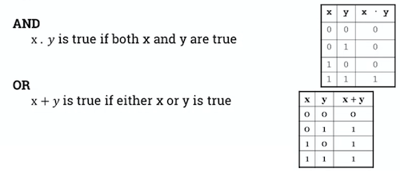
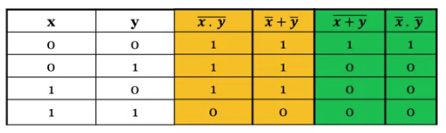
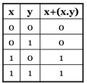
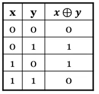
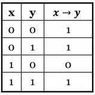

## Lesson 5.1 The basics

### Video: 5.101 Introduction to Boolean algebra

* [Boolean Algebra](../../../../permanent/boolean-algebra.md)
    * History
        * 384-322 BC: Aristotle develops the foundations of logic.
        * 1854: George Boole published *An investigation of the laws of thought*
        * 1904: H.E. Huntington wrote *Sets of independent postulates for the algebra of logic*.
        * 1938: Claude Shannon wrote a thesis: *A symbolic analysis of relay switching*
    * Boolean algebra is the foundation of computer circuit analysis.
        * Basic building block for designing transistors, basic elements in processors.
        * Consider IoT fire system: when high heat is detected, spray water.
    * Two-valued Boolean Algebra
        * Most well-known form of Boolean algebra is 2 valued system:
            * variables take value in set `{0, 1}`
            * operators `+` and `.` correspond to `OR` and `AND`.
        * Used to describe and design digital circuits.
* [Operations of Boolean Algebra](../../../../permanent/operations-of-boolean-algebra.md)
    * Based on 3 fundamental operations:
        * AND
            * logical product, intersection or conjunction
            * represented as x . y, $x \cap y$ or $x \wedge y$.
        * OR
            * logical sum, union or disjunction
            * represented as $x + y$, $x \cup y$, $x \lor y$
        * NOT
            * logical complement or negation
            * represented as $x'$, $\overline{x}$ or $\neg x$
    * When parentheses are not used, orperators have order of prefs: NOT > AND > OR.
* Operations of Boolean algebra
    * The truth tables for the 3 operations can be represented as follows:
     

### 5.103 Postulates of Boolean algebra

* [Huntington's Postulates](../../../../permanent/huntingtons-postulates.md)
    * Huntington's posulates define 6 axioms that must be satisfied by any Boolean algebra:
        * closure with respect to the operators:
            * any result of logical operation belongs to the set {0, 1}
        * identity eleements with respect to the operators:
            * $x + 0 = x$
            * $x \ . \ 1 = x$
        * commutativity with respect to the operators (dot and .):
            * $x + y = y + x$
            * $x . y = y . x$
        * distributivity:
            * $x(y + z) = (x . y) + (x . z)$
            * $x + (y . z) = (x + y) . (x + z)$
        * commutativity
            * $x + y = y + x$
            * $x . y = y. x$
        * distributivity
            * $x(y + z) = (x . y) + (x . z)$
            * $x + (y . z) = (x + y) . (x + z)$
        * complements exist for all elements
            * $x + x' = 1$
            * $x . x' = 0$
        * distinct elements
            * $0 \ne 1$
* [Basic Theorems of Boolean Algebra](permanent/basic-theorems-of-boolean-algebra)
    * Using the 6 axioms of Boolean algebra, we can find these useful theorems for analysing and designing circuits
        * theorem 1: idempotent laws
            * $x + x = x$
            * $x . x = x$
        * theorem 2: tautology and contradiction
            * $x + 1 = 1$
            * $x . 0 = 0$
        * theorem 3: involution
            * $(x')' = x$
        * theorem 4: associative laws
            * $(x + y) +z = x + (y + z)$
            * $(x . y) . z = x . (y . z)$
        * theorem 5: absorption laws
            * $x + (x . y) = x$
            * $x . (x + y) = x$
        * theorem 6: uniqueness of complement
            * if $y + x = 1$ and $y . x = 0$ then $x = y'$
        * theorem 7: inversion law
            * $0' = 1$, $1' = 0$
    * De Morgan's Theorems
        * **Theorem 1**
            * The complement of a product of variables is equal to the sum of the complements of the variables: $\overline{x. y} = \overline{x} + \overline{y}$
        * **Theorem 2**
            * The complement of a sum of variables is equal to the product of the complements of the variables: $\overline{x + y} = \overline{x} . \overline{y}$

            

    * Proof of distributivity of + over .
        * A truth table to prove the distributivity of + over . using truth tables.
          
    * Principle of duality
        * Starting with a Boolean relation, we can build another equivalent Boolean relation by:
            * changing each **OR (+)** sign to an **AND (.)** sign
            * changing each **AND (.)** sign to an **OR (+)** sign.
            * changing each 0 to 1 and each 1 to 0.
        * Example
            * Since A + BC = (A + B)(A + C) (by distributive law), we can build another relation using the duality principle: $A(B + C) = AB + AC$
        * Examples
            * Consider the boolean equations:
                * $e1: (a . 1) . (0 + \overline{a}) = 0$
                * e2: $a + \overline{a} . b = a + b$
            * Dual equations of e1 and e2:
                * Dual of e1: $(a + 0) + (1 . \overline{a}) = 1$
                * Dual of e2: $a . (\overline{a} + b) = a . b$
* Ways of proving theorems
    * 4 ways in general to prove equivalence of Boolean relations:
        * **perfect induction** by showing 2 expressions have identical truth tables: tedious if more than 2 vars.
        * **axiomatic proof** by applying Huntington's postulates or theorems to the expressions, until identical expressions are found.
        * **duality principle** every theorem in Boolean algebra remains valid if we interchange all ANDs and ORs and interchange all 0s and 1s.
        * **contradiction** by assuming the hypothesis is **false** then proviing that the conclusion is false.
    * Examples
        * Proving **absorption** theorem
            * The absorption theorem can be proved using perfect induction, by writing a truth table.
              
            * It can also be proved directly:
                 * From $x + (x . y) = x$, if we apply the duality principle, we can deduce: $x . (x + y) = x$

$$
\begin{align}
x + (x . y) &= (x . 1) + (x . y) \text{ by } x .1 = x \\
&= x . (1 + y) \text{ by distributivity } \\
&= x . (y + 1) \text{ by commutativity } \\
&= x . 1 \text{ by } y + 1 = 1 \\
&= x \text{ by } x.1 = x \\
\end{align}
$$

### 5.105 Boolean functions

* [Boolean Function](permanent/boolean-function.md)
    * A boolean function defines a mapping from one or multiple Boolean input values to a Boolean output value.
    * For $n$ Boolean input values, there are $2^n$ possible combinations.
        * For example, a 3-input function $f$ can be completely defined with an 8-row truth table.
    * Algebraic forms
        * There is only one way to represent a Boolean function in a truth table.
        
        * In algebraic form, a function can be expressed in a variety of ways:
            * For example these are both algebraic representations of the same truth table:
                * $f(x) = x + x' . y$
                * $f(x) = x + y$
    * Standardised forms of a function
        * The two most common standardised forms:
            * sum-of-products form
            * product-of-sums form
            * [Sum-of-Products Form](permanent/sum-of-products-formm.md):
                * Variables built using the `AND` operator, are summed together using the `OR` operator.
                * Example: $f(x, y, z) = xy + xz + yz$
            * [Product-of-Sums Form](permanent/product-of-sums-form.md)
                * Variables built using the `OR` operator, are multiplied together using the `AND` operator.
                * Example: $f(x, y, z) = (x + y)(x + z)(y + z)$
            * The sum-of-products form is easier to use so it's used by the course.
* Building a sum-of-products form
    * 1. Focus on the values of the variable that make the function equal to $1$.
    * 2. If an input equals $1$, it appear *uncomplemented* in the expression.
    * 3. If an input equals 0, it appears *complemented* in the expression (and its corresponding complete is used).
    * 4. the function f is then expressed as the sum of products of all the terms for which f = 1
    * Example
        * Let's consider the function f represented by the following truth trable.
            * Can be expressed as:
                * $f(x, y) = x ' y + xy' + xy$
* Useful functions
    * The "exclusive-or" function: $x \oplus y$:
        * defined as "true if either x or y is true, but not both"
        * represented by this truth table:
                      
        * can be expressed as:
            * $x \oplus y = x ' y + xy'$
    * The "implies" function: $x \rightarrow y$:
        * defined as "if x then y"
        * represented by this truth table:
                      
        * can be expressed as:
            * $x \rightarrow y = x' + y$
