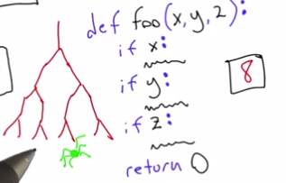

# Lesson 2: Coverage Testing

* Partioning the Input Domain
  * Create a class of inputs that proves some output is correct
* Test coverage
  * "Measure of proportion of program exercised during testing"
  * Pros
    * Objective score
    * When coverage is < 100%, we are given meaninful tasks
  * Cons
    * Not good at finding errors of omission
    * Difficult to interpret scores < 100%
    * 100% coverage doesn't mean all bugs are found
* Function coverage
  * how many functions are executed during test run?
* Statement coverage
  * More fine grained than line coverage
* Branch coverage
  * You get 100% branch coverage if call ```if``` statements both ways.
  * Example
    * ```if x == 0: print 'Hello'``` would need
    * You get 100% coverage if your test runs when x is 0 and when it isn't.
* 8-Bit Address (exercise)
  * How it works:
    * Until all numbers are exhausted:
      * Start at lowest-order bit in both numbers
        * If both numbers are the same, carry bit is True so next order bit is True (1 + 1 = 2)
      * If next bits are True and last carry bit is True, next carry bit is True. Else carry bit is False.
  * My solution:
    * 255 + 255 == every branch except first is executed.
    * 0 + 1 == first branch is executed and nothing else.
* Other metrics
  * Loop metrics:
    * "Execute each loop 0 times, one time and more than once"
* Modified condition/decision (MC/DC coverage)
  * Branch coverage + conditions take all possible values + every condition independently affects the outcome of a decision

  </img>

  * Used for avionics and things where lives are at stake.
  * Allows you to discover conditionals that don't affect outcome of decision.
  * Large amount of work: only for certain industries.
* Path coverage
  * "Cares how you get somewhere"
  * Can't test all but but you'd like to test majority cases.
  * Can cause exponential sized tests

  </img>

* Boundary value coverage
  * No tight technical definition
  * Test values close to some number boundary, where behaviour changes based on values
  * Looks to trigger off-by-one errors
* Concurrent testing
  * Difficult, specialised skill
  * Synchronisation testing
    * Uses lock functions
  * Interleaving functions
    * Functions are called in truely concurrent fashion
* What does code that doesn't get covered mean?
  * Infeasible Code
    * Tell coverage tool that some lines don't need to be in coverage report
  * Code not worth covering
  * Test suite inadequate
* SQLite
  * very, well tested!
    * 77.6k lines of code
    * 91,392k lines of test code
    * 100% branch coverage
    * 100% mc/dc coverage
    * random testing
    * boundary value testing
* Automated whitebox testing
  * Can automatically generate good test inputs
  * Example: [Klee](http://klee.llum.org)
* How to use coverage
  * Use coverage feedback to improve test suite
  * Poor coverage -> rethink tests (if necessary for problem domain)

## Exercise 2

* Splay tree
  * Has methods: ```insert(key)```, ```delete(key)```, ```lookup(key)```
  * Left child - always has a key ordered before the parent node.
  * Right child - always has a key after

  ```
    5
   |  |
   3  6
  | |  |
  2 4  7
  ```

  * As you add elements, it balances tree.
  * When you access node, it moves to the root.
    * Frequently accessed elements become faster to access.
  * ```find(key)``` -- lookup operation
