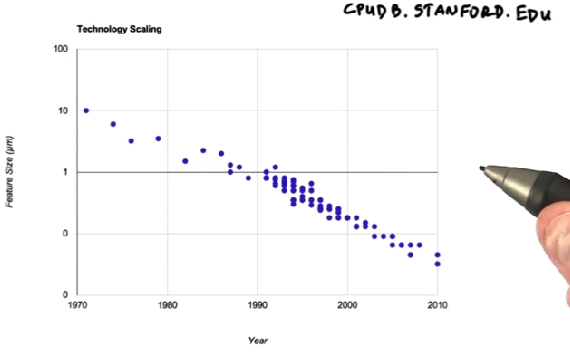

# Lesson 1: The GPU Programming Model

* "How to dig a hole faster"
    * dig faster
    * buy more productive shovel
    * hire more diggers
* Parallel: methods for building faster processor
    * Run with a faster clock
        * Shorter amount of time on each step of computation
    * Do more work per clock cycle
    * However, power comsumption of chip is at the limit
    * Add more processes
* Modern GPU
    * thousands of ALUs (arithmetic units)
    * hundreds of processors
    * tens of thousands of concurrent threads
* CPU speed remaining flat
    * feature size of processor == minimal size of transistor or wire on a chip 
    * as feature size gets smallers, transistors get
        * smaller
        * faster
        * use less power
    </img>
    * we've generally stopped increasing clock speed
        * mostly because of heat and power related limitations
    </img>
    * Instead:
        * more and smaller processors
* Optimisation types
    * Latency (time) - CPUs optimise for this
    * Throughput (stuff/time) - GPUs optimise for this
        * Examples: Pixels matched per second
* CUDA Program Diagram
    * Computers are "heterogenous": they have two different processors in them
    * Host: part of program runs on CPU
    * Device: part of program that runs on GPU - extensions for parallelism
    * Assume host and device have separate memories to store data (DRAM)
    * *CPU is in charge!* Does the following:
        1. Move data from CPU memory to GPU
        2. Move data from GPU back to CPU
            * ```cudaMemcpy``` is the command to do this
        3. Allocate GPU memory
            * ```cudaMalloc```
        4. Launch kernel on GPU
        </img>
* Big Idea of GPU Computation
    * When you write a kernel (a function to run on GPU), write as if a single thread, then GPU will run on many threads
* GPU is good at:
    * launching lots of threads
    * running lots of threads in parallel
* Squaring numbers using CUDA:
  * ```__global__``` is a "declaration spec", a C-language specifier.
    * How CUDA knows it's a 'kernel' as opposed to CPU code.
  * Code looks like this:
  ```
  __global__ void square(float *d_out, float *d_in) {
    int idx = threadId.x; # A c-struct with 3 members: x, y and z
    float f = d_in[idx];
    d_out[idx] = f * f;
  }
  ```
* Cubing numbers exercise was a fairly trivial exercise of copy and paste. Very helpful to begin to grasp the concepts though.
* Kernel Launch Parameters
  * Basic syntax looks like this: ```func_name<<<1, 64>>>(d_out, d_in)```
  * blocks of threads:
    * ```<<<1, 64>>>```
      * 1 == number of blocks
      * 64 == threads per block
    * can run many blocks at once
    * there is a maximum number of threads/blocks (512 older GPUs, 1024 on newer)
    * to launch 128 threads either: ```<<<2, 64>>>``` or ```<<<1, 128>>>```
    * each thread knows the index of its block and thread
    * these are 1-dimensional examples
    * 2/3-dimensional blocks:
      * ```square<<<grid_of_blocks, block_of_threads, shmem>>>```
      * launched like this: ```kernel<<<dim3(1, 1, 1), dim(64, 1, 1)>>>```
      * where: ```dim3(x, y, z)```
  * Within the kernel call, we can access the thread within the block using the ```threadIdx``` variable: ```threadIdx.y```
  * ```blockDim``` - size of block (how many threads in block?)
  * ```blockIdx``` - "which block am I in within the grid"
  * ```gridDim``` - size of grid
* Map
  * Run a function on a set of elements
  * Key building block of GPU programming
  * GPUs are good at Map because:
    * GPUs have many parallel processes
    * GPUs optimize for throughput, not latency
* How pixels are represented:
  * R (red) G (green) B (blue) values:
    * ```R = 0``` - red is fully absent
    * ```R = 255``` - red is fully saturated

## Project 1

* Pixels are represented as follows:

```
struct uchar4 {
  " red
  unsigned char x;
  " green
  unsigned char y;
  " blue
  unsigned char z;
  " alpha
  unsigned char w;
}
```

* Converting color to black and white  
  * ```I = .299f * R + .587f * G + .114f * B```
