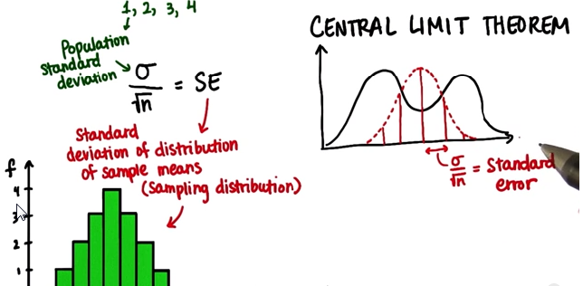

# Lesson 7: Sampling Distributions

* Overview:
    1. Start with a population of any shaped distribution
    2. Take all possible samples of size n and find the sample means
    3. Graph distribution of sample mean
* Result:
    * Normal distribution
    * Mean == population mean
    * standard deviation = SE = pop_standard_deviation / sqrt(sample_size)

</img>

* Central Limit Theorem
    * given any population shape, if you take a sample from it and calculate the mean enough times, you'll get a normal distribution

</img>
