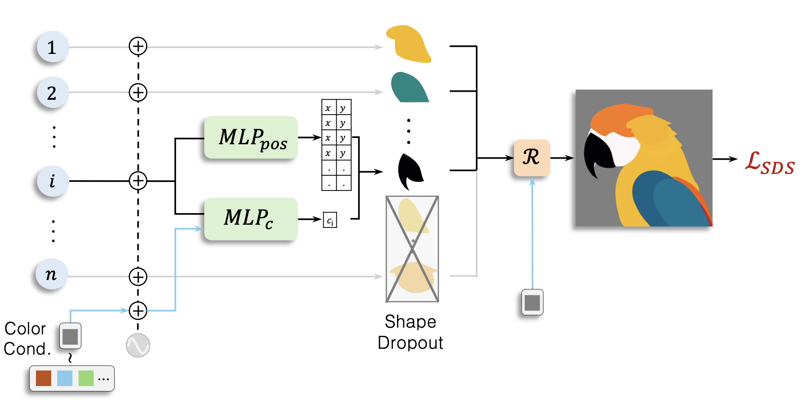
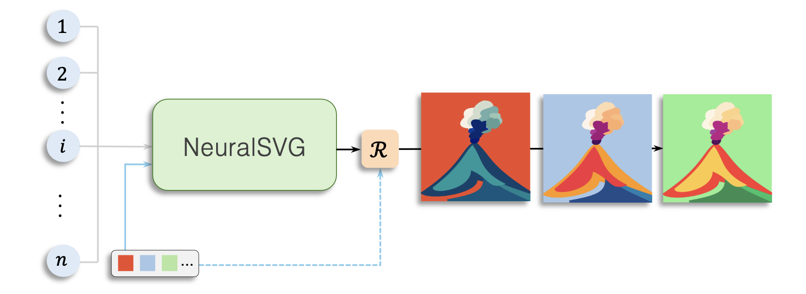
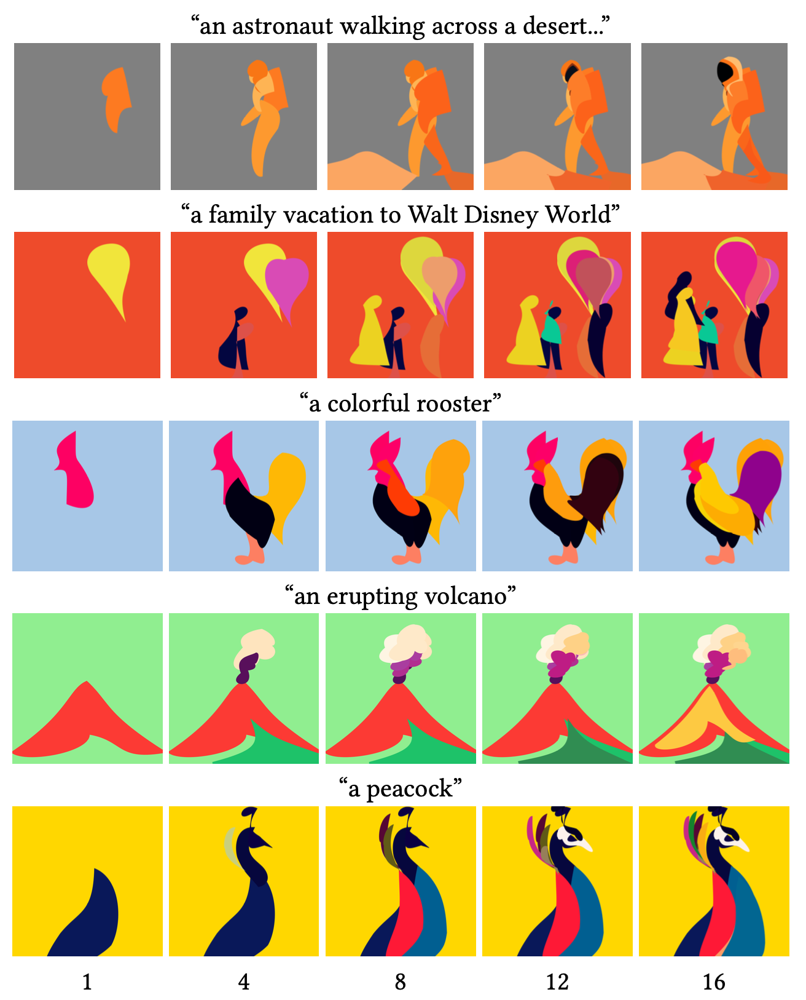
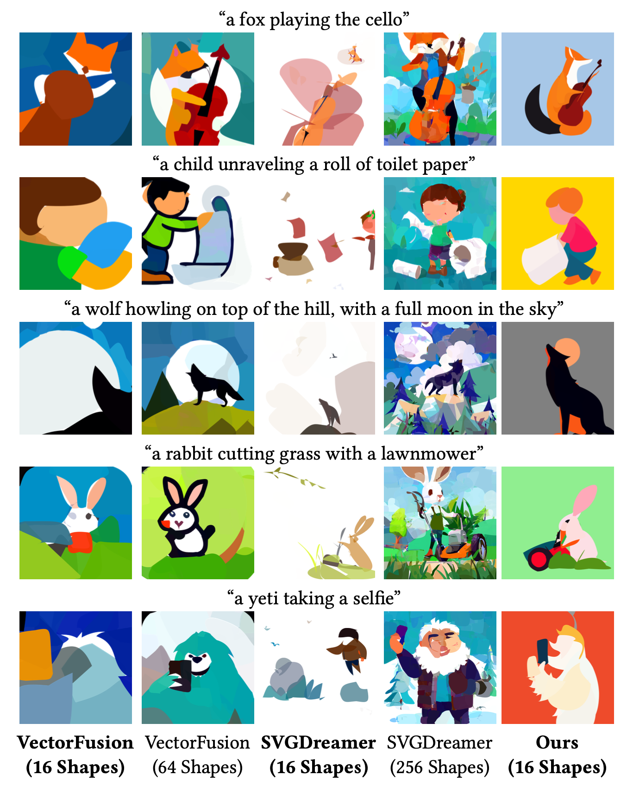
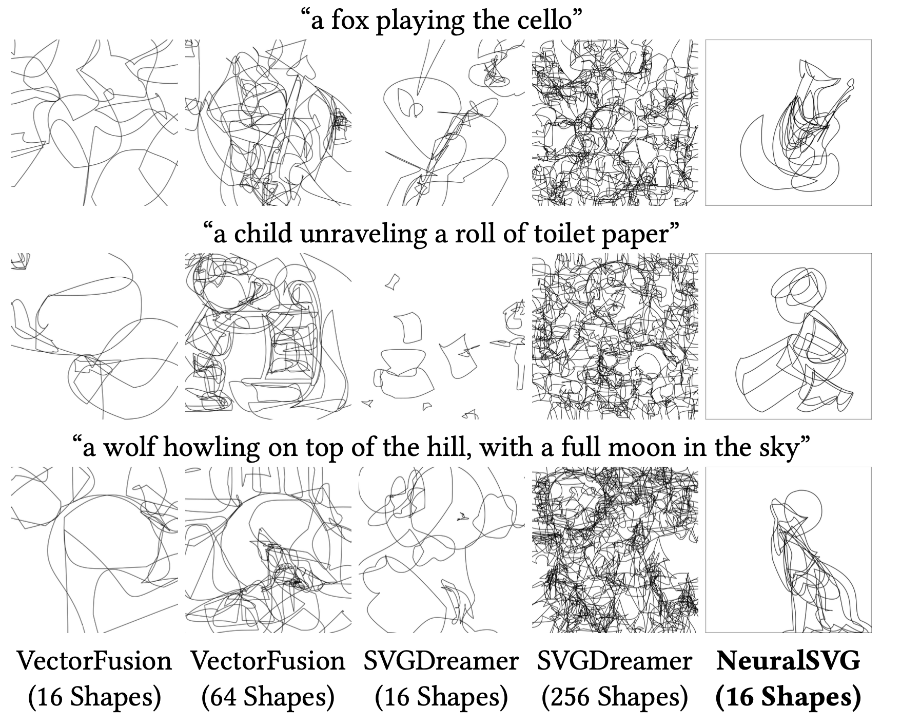

*These are my notes from the paper [NeuralSVG: An Implicit Representation for Text-to-Vector Generation](https://arxiv.org/abs/2501.03992) (Jan 2025) by Sagi Polaczek, Yuval Alaluf, Elad Richardson, Yael Vinker, Daniel Cohen-Or*

## Overview

This paper proposes [NeuralSVG](../../../permanent/neuralsvg.md), a new approach for generating [Vector Graphics](../../../permanent/vector-graphics.md) from text prompts. Where previous attempts have over-parameterised outputs and treat layered structure as a secondary goal, NeuralSVG, an approach inspired by [Neural Radiance Fields](../../../permanent/Neural%20Radiance%20Fields.md), encodes the entire scene into the weights of a small neural network and uses a dropout-based regularisation to encourage a meaningful layout structure. It also supports inference-time control, allowing users to adapt the generated SVG using prompts.

## Key Details

### 1. Neural Representation

- SVG is encoded as weights of a small MLP network, where the weights are optimised using [Score Distillation Sampling](../permanent/score-distillation-sampling.md).
- Network maps indices $(1 \ \text{to} \ n)$ to shape parameters and colours.
- Each index corresponds to a shape defined by control points and RGB values.

### 2. Dropout Regularisation:

Uses [Dropout-based Techniques](../../../permanent/Dropout-based%20Techniques.md):

- Random truncation of shapes during training
- Encourages meaningful ordering and standalone semantic meaning
- Earlier shapes capture core structure, later shapes add details

### 3. Dynamic Controls:

- Background colour conditioning enables adaptive colour palettes
- Aspect ratio control allows different formats from single representation
- Number of shapes can be varied at inference time

## Background

Recent research has targetted the generation of vector graphics. However, approaches to text-to-vector generation suffer some fundemental issues, making the output graphics less useful:

- Produce over-parameterised outputs with pixel-like shapes (e.g., SVGDreamer requiring 512 shapes).
- Treat layered structure as a secondary goal requiring post-processing (e.g., Text-to-Vector).
- Rely on pixel-space intermediate representations that can introduce artefacts (e.g., NIVeL).

In Figure 2, we can see an example of an SVG composed of ordered simple layers, where the components are all easily edited, vs an SVG that looks appealing, but the individiual components are difficult to edit.

> [!question] What is the key difference between NeuralSVG and previous text-to-vector approaches?
> a) NeuralSVG uses more shapes than previous methods
> b) NeuralSVG operates directly in pixel space
> c) NeuralSVG encodes the entire SVG in network weights and learns layered structure during training
> d) NeuralSVG requires post-processing to generate layers
> > [!success]- Answer
> > c) NeuralSVG encodes the entire SVG in network weights and learns layered structure during training
> > This represents the fundamental difference - encoding the SVG implicitly and incorporating layered structure directly in the generation process rather than as a post-processing step.

# Method

### Architecture

Inspired by Neural Radiance Fields, where 3D pixel coordinates are mapped to spatial points through a
compact mapping network, they represent an SVG as a set of indices, {1, 2, . . . , 𝑛}, where each shape is defined by four concatenated cubic Bézier curves, with their first and last control points being identical to form a closed shape. Each shape is defined by its control points and fill color: 𝑧𝑖 = (𝑝𝑖, 𝑐𝑖).

1. Input indices (1 to n) are processed through [Positional Encoding](../permanent/positional-encoding.md),
2. Two parallel MLP networks:
    - **MLPpos**: Predicts 12 control points for Bézier curves.
    - **MLPc**: Predicts RGB colours for shapes.
3. [[Differentiable Rasterizer]] combines shapes into final SVG.

### Training

They train it on a dataset 

1. Initialise using saliency-based sampling from text-to-image model.
2. Optimise using Score Distillation Sampling (SDS) loss.
3. Apply dropout-based regularization during training.
4. Fine-tune with LoRA adapter on vector art dataset.

> [!question] What are the two parallel branches in NeuralSVG's architecture?
> a) Shape encoder and color encoder
> b) MLPpos for control points and MLPc for colors
> c) Background branch and foreground branch
> d) Texture branch and structure branch
> > [!success]- Answer
> > b) MLPpos for control points and MLPc for colors
> > The architecture uses two separate branches: MLPpos predicts shape control points while MLPc predicts RGB colors.

# Experiments

### Datasets

- 128 prompts from VectorFusion evaluation set
- 1,600 high-quality vector art images for LoRA fine-tuning

### Metrics

1. CLIP-space cosine similarity
2. R-Precision
3. Cumulative CLIP similarity across shape subsets

### Results

- Outperforms baselines when using same number of shapes (16)
- Achieves comparable quality to methods using 4-16x more shapes
- Produces more meaningful and editable individual shapes
- Successfully generates ordered representations that build complexity progressively

> [!question] What key advantage does NeuralSVG demonstrate in the experiments?
> a) It requires more shapes than other methods
> b) It needs fewer shapes to achieve comparable quality
> c) It only works with simple prompts
> d) It generates only black and white images
> > [!success]- Answer
> > b) It needs fewer shapes to achieve comparable quality
> > NeuralSVG achieves similar or better results with just 16 shapes compared to methods using 64-256 shapes.