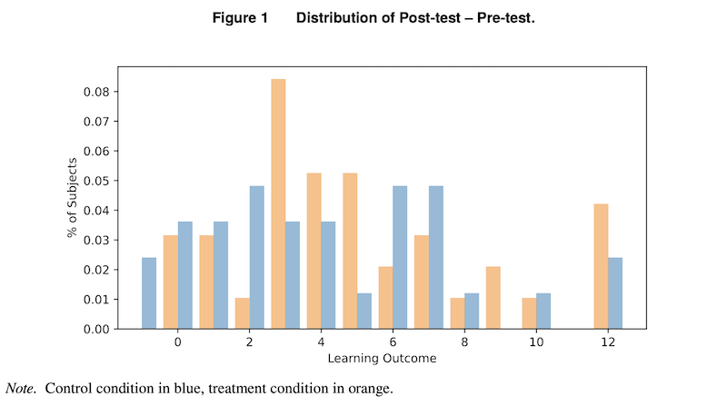

*My notes from the paper [AI Meets the Classroom: When Does ChatGPT Harm Learning?](https://arxiv.org/abs/2409.09047) by Matthias Lehmann, Philipp B. Cornelius, Fabian J. Sting.*

---

## Summary

This paper covers one observational and two experimental studies on the effects of LLM access on students learning to code.

Key findings:

1. Using LLMs as personal tutors by asking them for explanations improves learning outcomes
2. Asking LLMs to generate solutions impairs learning. The use of copy-and-paste encourages this behaviour.
3. Total beginners benefit more from LLM usage.
4. LLM access increases students' perceived learning beyond their actual learning outcome, i.e. students think it's a lot more helpful than it is.

---

In the experimental study, they compare students' work with a number of solutions generated by ChatGPT as a proxy for the use of LLMs. They call this [ChatGPT Similarity](../../permanent/chatgpt-similarity.md).

To calculate this, they generate 50 ChatGPT solutions and then take the maximum similarity with a student's code:

$$
\text{ChatGPT Similarity}_{iq} = \max \left( \text{sim}( \text{Code}_{iq}, \text{Code}^{LLM}_{jq} ) \mid j = 1, \dots, 50 \right)
$$

for student $i$ and question $q$, where $\text{Code}_{iq}$ is the final student code, $\text{Code}^{LLM}_{jq}$ is one of the 50 ChatGPT generated solutions, $j = 1, \dots, 50$, and $\text{sim}(\cdot, \cdot)$ is [Damerau Levenshtein](../../permanent/damerau-levenshtein.md) similarity.

---

Figure 1. from the source shows the distribution of learning outcomes, measured as the difference between post-test and pre-test scores, for both the control group (blue) and the treatment group (orange). The treatment group had access to ChatGPT during the learning phase of the experiment.

The figure shows that the treatment group brought forth more high performers. Seven subjects in the treatment group surpassed a learning outcome score of 8, compared to only three in the control group.

For the remaining 85% of participants, the distribution is more condensed for the treatment group, indicating a compressing effect.

This observation is quantitatively supported by Levene's test (𝑝 = 0.069) and the Brown-Forsythe test (𝑝 = 0.094), which show that the variance of learning outcomes is significantly lower in the treatment group compared to the control group when not considering the high performers, suggesting that access to ChatGPT may have led to a more homogeneous distribution of learning outcomes, with fewer students performing poorly but also potentially fewer students achieving exceptionally high scores.

