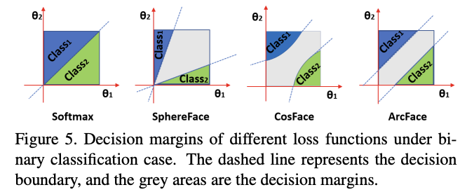

These are my notes from the paper [ArcFace: Additive Angular Margin Loss for Deep Face Recognition](https://arxiv.org/pdf/1801.07698.pdf) by Jiankang Deng, Jia Guo, Niannan Xue, Stefanos Zafeiriou.

## Abstract

The key to face recognition is a loss function with strong discriminative power.

[Centre loss](https://arxiv.org/abs/1707.07391) penalises the distance between features and a set of learned class centres.

[SphereFace](https://arxiv.org/abs/1704.08063) lets the linear transformation matrix in the last fully connected layer represent class-center and penalise the angle between deep features and their corresponding weights.

A recently popular idea is incorporating "margins" to maximise face class separability.

This paper proposes [Additive Angular Margin Loss](../../permanent/additive-angular-margin-loss.md) (ArcFace), which creates "highly discriminative features" for face recognition.

ArcFace has a "clear geometric interpretation" due to its correspondence to "geodesic distance" (a curve representing the shortest path between 2 points) on the hypersphere.

This paper studies the results of ArcFace on ten face recognition benchmarks and shows that ArcFace continually outperforms other algorithms.

The authors released all their training code and metadata.

## 1. Intro

The method of choice right now for face recognition is to represent faces using an [Embedding](../../permanent/embedding.md) generated by a [Convolutional Neural Network](../../permanent/convolutional-neural-network.md).

The embedding has a small distance to other examples in the same class (intra-class) and a large distance to different classes (inter-class).

A pose normalisation step (aligning faces) typically occurs before generating embeddings.

There are two main tracks of research for training these embeddings:

1. Train a multi-class classifier and use the embedding generated by the network as the representation.
2. Directly learn an embedding, for example, Triplet Loss.

Both have their drawbacks.

The linear transformation matrix $W$ size increases linearly with every identity `n` for softmax loss.

The learned features are separable enough for closed-set classification but not for open-set problems.

For triplet loss, there's a combinatorial explosion in the number of face triplets for large-scale datasets.

Semi-hard sample mining is quite a complex problem to engineer.

Others have proposed some variants of Softmax loss to enhance the discriminative power of Softmax loss.

Wen et al. l. pioneered centre loss. It captures the distance between each feature vector and class centre and requires joint penalisation of softmax loss for intra-class dispersion. However, it is challenging to update class centres when there are a lot of classes.

Instead, enforcing intra-class closes and inter-class separateness at every step should lead to better models.

That's the idea behind Sphereface, which introduced an angular margin. However, the loss function needs a series of approximations to be computed, resulting in unstable training. They fix this by proposing a hybrid loss function that includes softmax loss.

CosFace adds a cosine margin penalty to the target logits:

`logits` + `some margin penalty`

This method provides better performance and is easier to train.

ArcFace is just a slight alternative to CosFace. It gets its name from the use of arc-cosine.

In this paper, they propose Additive Angular Margin Loss (ArcFace) to improve the discriminative power of CosFace.

Since we know the dot product between the CNN feature and the last fully connected layer is equal to cosine distance after feature and weight normalisation.

They utilise the arc-cosine function to calculate the angle between the current feature and target weight.

Then, add an additive angular margin to the target angle and get the target logit back by a cosine function. They rescale all logits by a fixed feature norm, and subsequent steps are the same as Softmax loss.

Its:

* Engaging - optimises the geodesic distance margin by exact correspondence between angle and arc in the normalised hypersphere.
* Effective - achieves state-of-the-art performance on ten face rec datasets.
* Easy - Only needs several lines of code to implement.
* Efficient - negligible computational overhead.

## 2. Proposed Approach

### 2.1 ArcFace

Firstly, the function for [Softmax Loss](../../permanent/softmax-loss.md).

$$L_1 = -\frac{1}{N} \sum\limits_{i=1}^{N} \log \frac{e^{W^{T}_{y_i} x_i + b_{yi}}}{\sum_{j=1}^{n} e^{W^{T}_{j} x_i + b_j}}$$

In this expression, $x_i$ is a deep feature of the $i$th sample, belonging to the $y_i$ class. The author sets the embedding feature dimension to 512.

$W_j$ denotes the jth column of the weight $W$, and $b_j$ is the bias term. The batch size and class numbers are $N$ and $n$.

Softmax loss does not explicitly optimise the feature embedding to enforce higher similarity for intra-class samples and diversity for inter-class samples.

We can set the bias $b_j = 0$ then change the logit $W^{T}_{j} x_i = ||W_j|| \ ||x_i|| \cos \theta_j$. If we l2 norm $W_j$ and $x_i$, re-scale it to $s$. The normalisation step on features and weights makes the prediction only dependent on the angle between features and thus distributed on a hypersphere with a radius of $s$.

$$L_2 = -\frac{1}{N} \sum\limits_{i=1}^{N} \log \frac{e^{s \cos \theta_{y_i}}}{e^{s \cos \theta_{y_i}} + \sum_{j=1,j \ne y_i}^{n} e^{s \cos \theta_{j}}}$$

As we distribute embedding features around each feature centre on the hypersphere, we add an additive angular margin penalty $m$ between $x_i$ and $W_{ji}$ to enhance intra-class compactness and inter-class discrepancy.

The method is named ArcFace since the additive angular margin penalty is equal to the geodesic distance margin penalty in the normalised hypersphere,

$$L_3 = -\frac{1}{N} \sum\limits_{i=1}^{N} \log \frac{e^{s (\cos \theta_{y_i} + m ) }}{e^{s (\cos \theta_{y_i} + m) } + \sum_{j=1,j \ne y_i}^{n} e^{s \cos \theta_{j}}}$$

The authors demonstrate the idea of ArcFace using a 2D feature embedding network—Softmax on the left and ArcFace on the right. The "geodesic distance gap" is evident here.

### 2.2 Comparison with SphereFace and CosFace

SphereFace, ArcFace and CosFace propose three different kinds of margin penalty:

* multiplicative angular margin $m_1$
* additive angular margin $m_2$
* additive cosine margin $m_3$

All of them enforce inter-class diversity by penalising the target logit.

This plot shows the angle between the target class and another class. As you can see, the angle between the target and the correct feature is around 20° ArcFace and 100°.

In this plot, we see the angle between the feature and target centre at different stages of training.

Combining all margin penalties, we can implement SphereFace, ArcFace, and CosFace in a unified framework with $m_1$, $m_2$, and $m_3$ as the hyperparams. Unifying penalties like this should give us target logit curves with high performance.

$$L_4 = -\frac{1}{N} \sum\limits_{i=1}^{N} \log \frac{e^{s (\cos ( m_1 \theta_{y_i} + m_2 ) - m_3 ) }}{e^{s (\cos (m_1 \theta_{y_i} + m_2) - m_3 ) } + \sum_{j=1,j \ne y_i}^{n} e^{s \cos \theta_{j}}}$$

#### Geometric Difference

Though similar, ArcFace has a better geometric attribute as the angular margin corresponds directly to Geodesic distance.

ArcFace has a "constant linear, angular margin" throughout the interval. By contrast, SphereFace and CosFace only have a nonlinear angular margin.

Minor margin differences can have a "butterfly effect" on model training. For example, the original SphereFace employs an annealing optimisation strategy. They tried implementing a new version of SphereFace without the integer requirement on the margin. $m = 1.35$ can perform similarly to SphereFace without convergence difficulty.

### 2.3 Comparison with Other Losses

Other loss functions can be designed based on the angular representation of features and weight vectors.

We can design a loss to enforce intra-class compactness and inter-class discrepancy on the hypersphere. Here's the comparison with three other losses:

**Intra-Loss**

They designed them to improve the intra-class compactness by decreasing the angle/arc between a sample and the ground truth centre.

$$L_5 = L2 + \frac{1}{\pi N} \sum\limits_{i=1}^{N} \theta_{yi}$$

**Inter-Loss**

Targets enhance inter-class discrepancy by increasing the angle/arc between different centres.

$$L_6 = L2 - \frac{1}{\pi N (n - 1)} \sum\limits_{i=1}^{N} \sum\limits_{j=1, j \ne y_i}^{n} \arccos(W^{T}_{y_i} W_{j})$$

We can think of Inter-Loss as a particular Minimum Hyper-spherical Energy (MHE) case. With this loss, we regularise hidden and output layers by MHE. In the MHE paper, the authors propose a special case of loss function by combining the SphereLoss with MHE loss on the network's last layer.

**Triplet-loss**

It aims to increase the angle arc between triple samples. In Facenet, the Euclidean margin is applied to the normalised features. Here we employ the triplet-loss by the angular representation of our features as $\arccos(x_{i}^{\text{pos}} x_i) + m \leq \arccos (x_i^{\text{neg}} x_i)$

## 3. Experiments

### 3.1. Implementation Details

#### Datasets

Use [CA-SIA](https://arxiv.org/abs/1411.7923), [VGGFace2](https://arxiv.org/abs/1710.08092), [MS1MV2, and DeepGlint-Face (including MS1M-DeepGlint and Asian-DeepGlint)](http://trillionpairs.deepglint.com/overview) as training data to conduct a fair comparison with other methods.

MS1MV2 is a refined semi-automatic version of the MS-Celeb-1M dataset. Authors use ethnicity-specific annotators for large-scale face annotations.

Use face verification datasets (LFW, CFP-FP, and AgeDB-30) to check improvements from different settings. Report performance on large-pos and large-age datasets (CPLFW and CALFW). Test ArcFace on large-scale image datasets (MegaFace, IJB-B, IJB-C, Trillion-Pairs, and video dataset (iQIYI-VID))

#### Experimental Settings

* Generate normalized face crops (112 x 112) utilizing five facial points.
* For embedding networks, use CNN architectures ResNet50 and ResNet100.
* After the last conv layer, use the BN-Dropout-FC-BN structure to get the final 512-D embedding feature.
* Paper used ([training_dataset, network structure, loss]) for understanding experimental settings.
* Set feature scale to $s = 64$ and choose angular margin $m$ of ArcFace at 0.5.
* Use batch size 512 and train on 4 NVIDIA Tesla P40 (24GB) GPUs.
* On CASIA, the learning rate starts from 0.1 and is divided by ten at 20K and 28K iterations. Training finished at 32K iterations. On MS1MV2, divide the learning rate at 100K, 160K, and 180K iterations. We set the momentum to 0.9 and weight decay to 5e-4. During testing, keep the feature embedding without the FC layer, with extra 5120D features for each face.
* Remove overlap identities between the training and test sets and use only one crop for testing.

### 3.2 Ablation Study on Losses

* The best margin observed in experiments was 0.5.
* Using the combined margin framework in Eq. 4, it is easier to set the margin of SphereFace and CosFace, found to have optimal performance at 1.35 and 0.35
* Implementations for SphereFace and CoseFace can lead to strong performance without issue converging.
* ArcFace achieves the highest verification accuracy on all 3 test sets.

*Refer to the paper for comprehensive testing results.*

## 4. Conclusions

* Paper proposed an Additive Angular Margin Loss function, which can enhance the discriminative power of feature embeddings learned with CNNs for face recognition.
* Paper demonstrates that the method consistently outperforms the state-of-the-art.

## 5. Appendix

### 5.1 Parallel Acceleration

* ArcFace and other margin loss rely on Center ($W$), but the param size of Centre is proportional to the number of classes.
* When there are millions of identities in training, ArcFace can cause GPU memory to run out.
* They solve it with a strategy called "parallel acceleration":
    1. Get feature $x$ (face embeddings are aggregated into one feature matrix (batch size 8 * 64 (as there are 8 GPUs) $\times$ feat dim 512))
        * The size of the feature matrix is only 1MB, so the communication cost between GPUs is negligible.
    2. Get similarity score matrix ($score = xW)$. They copy the feature matrix into each GPU and concurrently multiply the feature matrix by the centre sub-matrix (1M/8) to get the similarity score submatrix
    3. Get the gradient on Centre ($dW$). Transpose the feature matrix on each GPU and multiply the transposed feature matrix by the gradient sub-matrix of the similarity score.
    4. Get the gradient on the feature ($x$) by concurrently multiplying the gradient sub-matrix of similarity score by the transposed centre sub-matrix and sum up the outputs from 8 GPU cards to get the gradient on feature x.

### 5.2 Feature Space Analysis

* 512-d hypersphere space should be large enough for large-scale identities.
