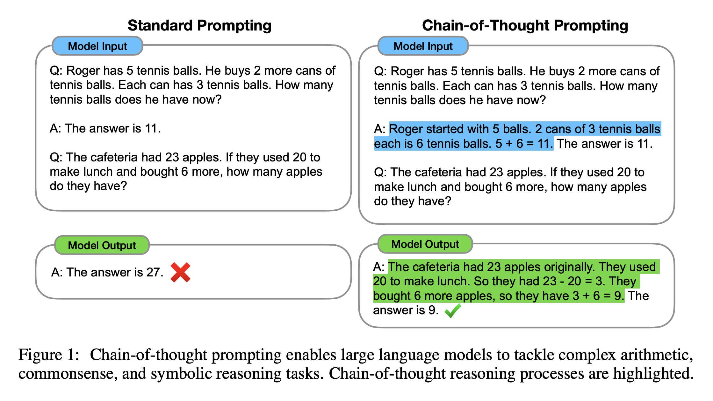
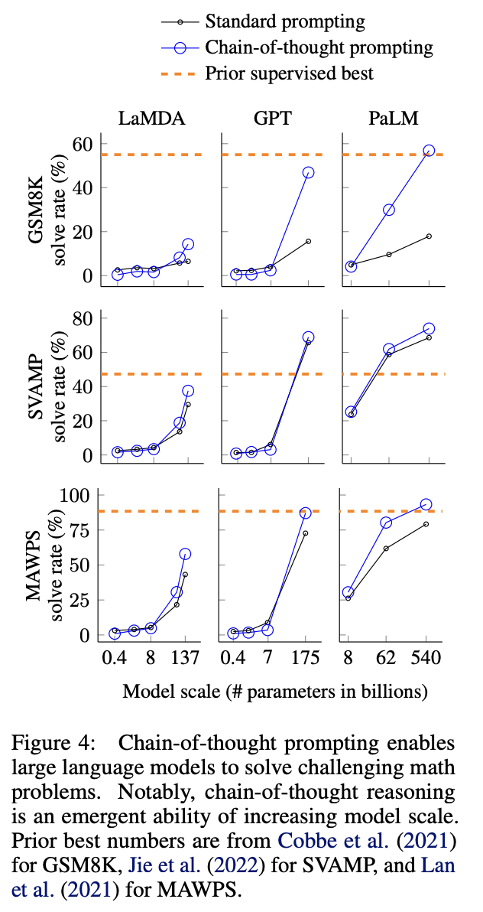
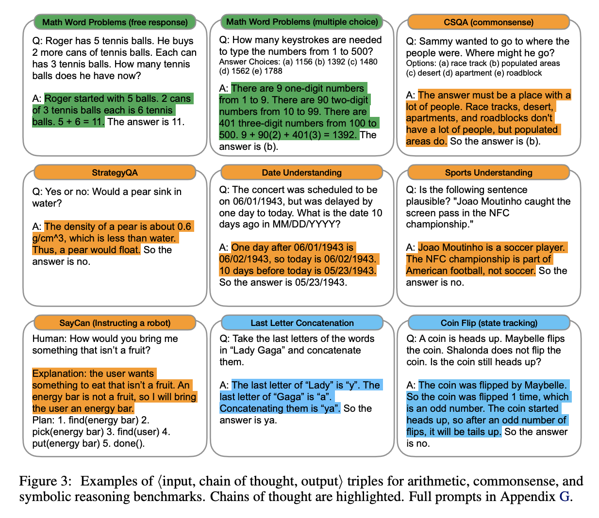

This paper from Google, first released in January 2022, introduced [Chain-of-Thought Prompting](../../permanent/chain-of-thought-prompting.md). Instead of giving the model few-shot examples of questions and answers, you give it examples that show the working: a series of intermediate reasoning steps before the answer. The model then does the same for the new question [@weiChainofThoughtPromptingElicits2022].

No fine-tuning, no new architecture, just better examples. With eight chain-of-thought examples, PaLM 540B achieved state-of-the-art accuracy on the GSM8K benchmark of maths word problems, beating a fine-tuned GPT-3 with a verifier.

*Figure 1: Standard prompting versus chain-of-thought prompting, from the paper.*

The catch is that it only works on big models. The authors describe chain-of-thought reasoning as an emergent ability of model scale. For small models it didn't help, and sometimes made things worse, because they produced fluent but illogical reasoning. The gains only showed up at around 100B parameters.

*Figure 4: Chain-of-thought prompting only helps at large model scale.*

The same idea works beyond maths, including commonsense questions, date understanding and symbolic tasks like concatenating the last letters of words.

*Figure 3: Examples of input, chain of thought and output for arithmetic, commonsense and symbolic reasoning benchmarks.*

## Abstract

> We explore how generating a chain of thought, which is a series of intermediate reasoning steps, significantly improves the ability of large language models to perform complex reasoning.
>
> In particular, we show how such reasoning abilities emerge naturally in sufficiently large language models via a simple method called chain-of-thought prompting, where a few chain of thought demonstrations are provided as exemplars in prompting.
>
> Experiments on three large language models show that chain-of-thought prompting improves performance on a range of arithmetic, commonsense, and symbolic reasoning tasks.
>
> The empirical gains can be striking. For instance, prompting a PaLM 540B with just eight chain-of-thought exemplars achieves state-of-the-art accuracy on the GSM8K benchmark of math word problems, surpassing even finetuned GPT-3 with a verifier.

See [LLM Reasoning](../../permanent/llm-reasoning.md) for what came next.
