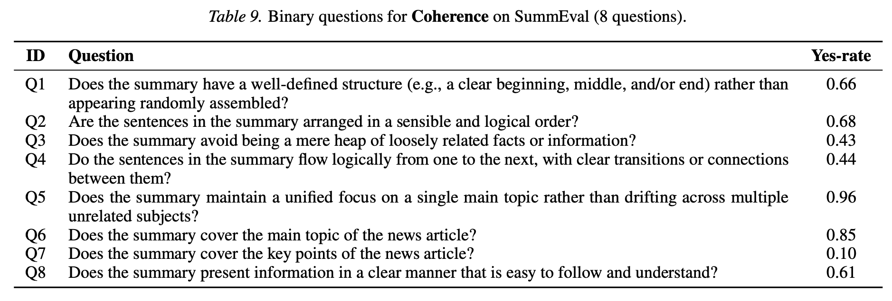
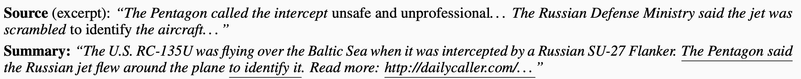
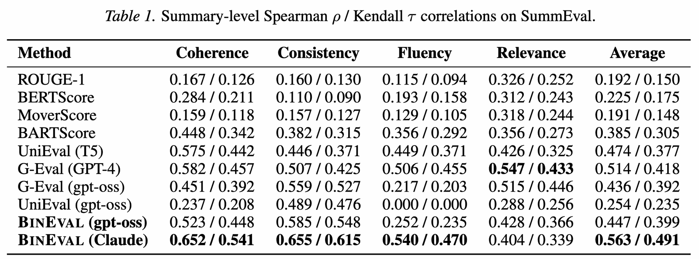
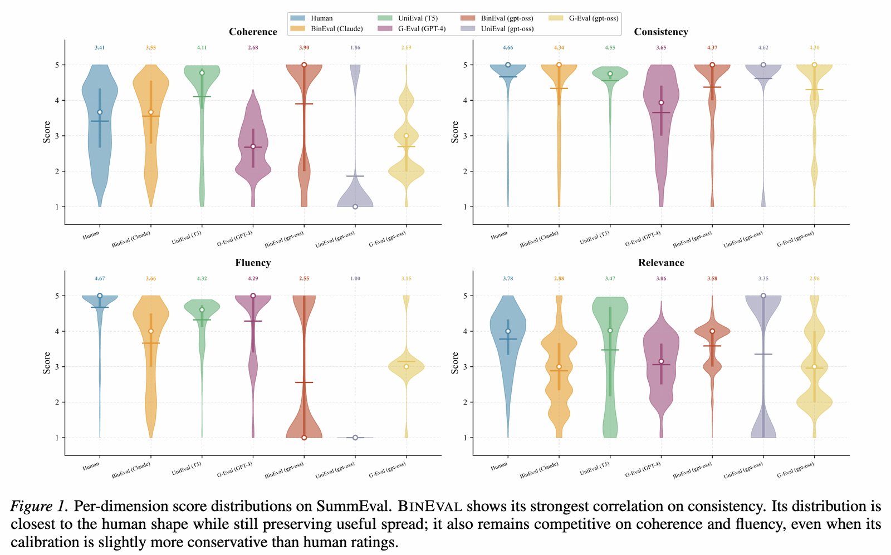
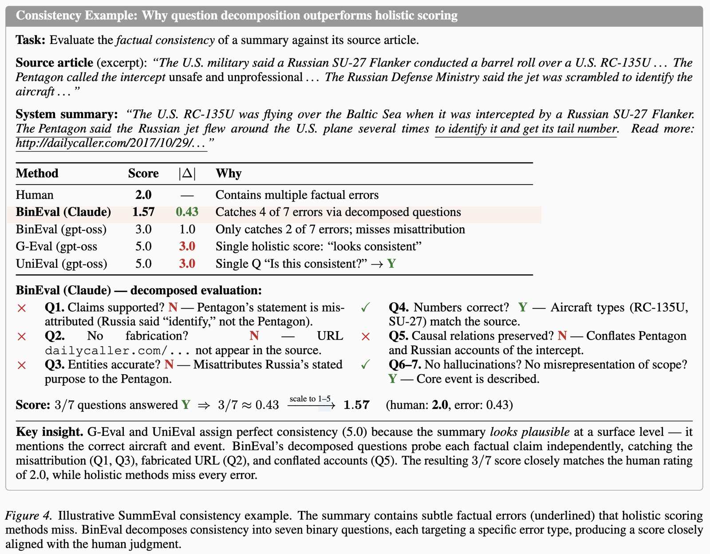

This paper introduces an LLM-judge evaluation framework called [BinEval](../../permanent/bineval.md), based on decomposing each criterion into binary (yes/no) questions.

The framework focuses on text tasks like summarisation, dialogue, and instruction following, but in theory it could apply to any LLM-judge evaluation task.

The approach targets a familiar weakness of your standard judge approaches. When your judge outputs a single score per criterion, it can be opaque and not clear how to act on it, especially at the higher end: what should you change to get a 5 instead of a 4.5? Also, LLMs can be biased by writing style, word choice, and length, which can result in misaligned scores.

BinEval fixes this by decomposing the criterion into a series of yes/no questions, so you get informative, actionable feedback about your criteria. Plus, because you aggregate the yes/no answers into a single number, you still get one clean score that's easy to communicate.

On top of evaluation, they also demonstrate how question-level feedback can be used to optimise system prompts and even the questions themselves.

There are three parts:

1. A meta-prompt that decomposes the task prompt into a set of questions per dimension.
2. An evaluator that answers each question independently, then aggregates the answers per dimension into a score.
3. A two-phase optimisation loop that improves the evaluator and generator prompts (and, through them, the questions) from question-level feedback.

*My own diagram of the BinEval pipeline.*

The authors are motivated by prior work showing that hard tasks get easier when you break them into simpler sub-problems, like [Large Language Models Are Human-Level Prompt Engineers](https://arxiv.org/abs/2211.01910) and [Decomposed Prompting](https://arxiv.org/abs/2210.02406).

## Method

There is math in the paper, but it doesn't add much, so I've only included it in this summary where there's actual math to do.

### Question generation

The prompt that describes your task is called the **"task prompt"**.

The prompt that decomposes the criterion into questions is called the **"meta-prompt"**.

They generate the questions in two steps:

In the first step, they summarise the task prompt into an explicit set of requirements. Each requirement captures a distinct evaluation criterion, which helps the model build a representation of the task.

In the second step, they decompose each requirement into binary questions.

The questions are grouped into evaluation dimensions (like coherence or fluency), which is what lets you score each dimension separately later.

The meta-prompt is task-agnostic: only the task prompt changes from one task to the next.

### Scoring

Since the questions are grouped by dimension, a dimension's score is just the fraction answered yes:

$$S_d(x, y) = \frac{1}{|Q_d|} \sum_{q_i \in Q_d} f_E(x, y, q_i)$$

The overall score is the same thing, but across all $N$ questions:

$$S(x, y) = \frac{1}{N} \sum_{i=1}^{N} f_E(x, y, q_i)$$

And if you want to map the scores from $[0, 1]$ to some other interval $[a, b]$, you can do it via affine scaling:

$$S'(x, y) = S(x, y) \cdot (b - a) + a$$

## Experiments and Results

They run two experiments: do BinEval's scores agree with human judgement (evaluation quality), and can its question-level feedback actually improve prompts (iterative updating)?

For evaluation quality, they check how well each method's scores correlate with human ratings (Spearman, Kendall, Pearson) across three benchmarks:

- [SummEval](../../permanent/summeval.md): summarisation, rated on fluency, coherence, consistency, and relevance (1-5).
- [Topical-Chat](../../permanent/topical-chat.md): dialogue responses, rated on qualities like naturalness, coherence, engagingness, and groundedness.
- [QAGS](../../permanent/qags.md): factual consistency (hallucination) in summaries.

They compare BinEval against a spread of older metrics and LLM judges:

- [ROUGE-1](../../permanent/rouge-1.md): a simple overlap metric.
- [BERTScore](../../permanent/bertscore.md): matches contextual BERT token embeddings.
- [MoverScore](../../permanent/moverscore.md): similar to BERTScore, but uses Earth Mover's Distance.
- [BARTScore](../../permanent/bartscore.md): scores text by how likely a language model is to generate it.
- [UniEval](../../permanent/unieval.md): an LLM-judge precursor to BinEval that asks a single yes/no per dimension.
- [G-Eval](../../permanent/g-eval.md): an LLM-judge approach that scores via chain-of-thought, but still gives one opaque number.

Overall, BinEval outperforms the other approaches (otherwise, I guess they wouldn't upload it to arXiv) on most criteria but not all.

One clean win is **factual consistency**. On QAGS, splitting "is this faithful to the source?" into several targeted yes/no questions beats a single holistic score or one yes/no judgement by a wide margin, and consistency is also where it gains the most on SummEval. Breaking a fuzzy judgement into concrete checks is exactly where decomposition pays off, presumably because each yes/no is easier to answer, averaging several of them cancels noise, and the questions explicitly cover known failure modes.

It's a better-behaved evaluator in general, too. On SummEval, BinEval (Claude) has the best average correlation with humans ([Spearman Correlation](../../permanent/spearman-correlation.md) and Kendall), winning coherence, consistency, and fluency. And it transfers: on Topical-Chat it again gets the best average, even on subjective dialogue qualities like naturalness and engagingness.

It also tracks the *shape* of human scores more faithfully and avoids the ceiling effects that squash prior judges into a narrow band, so it draws sharper distinctions between borderline and clearly bad outputs. Even on a weaker backbone (gpt-oss), it beats G-Eval and UniEval, where UniEval's single yes/no collapses on fluency (near-zero correlation), a sign that one question per dimension is too coarse.

And because every answer is kept, you can see *which* questions failed, not just a final number.

The clear weak spot is **relevance**: G-Eval (GPT-4) still beats it there, and it's the one dimension that didn't improve under the iterative update either. A broad, holistic judgement like "is this relevant to the source?" doesn't cleanly break into independent yes/no checks, so decomposition loses its edge. The pattern holds in general: concrete criteria decompose well, inherently subjective ones less so.

### Improving prompts with the feedback

The second experiment tests whether the question-level feedback can improve prompts, not just score with them. They try two modes on SummEval:

- **Self-update**: one model (`gpt-oss-120b`) improves its own evaluator prompt from its failures against human judgements.
- **Cross-model update**: a stronger model (Claude Sonnet 4) acts as the reference, and disagreements are used to update the weaker target model's prompt.

Both improved three of the four dimensions (fluency +0.119 via self-update, consistency +0.136 via cross-model update), with relevance again the holdout. The same loop can also optimise a generation prompt on IFBench, where a programmatic checker verifies the outputs. The catch is that iteration only helps when the failure is unclear instructions, not a capability ceiling. If the model simply can't do it, better questions won't save it.

## Summary

Decomposition is a promising approach for people looking for LLM-Judge scores that are interpretable and actionable. In the experiments, it works best on concrete criteria like factual consistency and not as well on subjective ones like relevance. But even where it isn't the single best score, it's the most interpretable.

---

*Cover: a photo of a sculpture by Swiss artist Markus Raetz.*