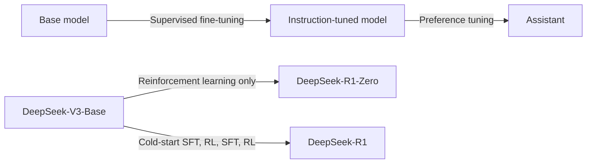

DeepSeek train a model, [DeepSeek-R1-Zero](../../permanent/deepseek-r1-zero.md), using large-scale reinforcement learning (RL) *without* supervised fine-tuning (SFT) as a preliminary step, and find it demonstrates remarkable reasoning capabilities [@deepseek-aiDeepSeekR1IncentivizingReasoning2025].

However, R1-Zero has problems like poor readability and language mixing. So they build DeepSeek-R1, which adds multi-stage training and cold-start data before RL. DeepSeek-R1 achieves performance comparable to OpenAI-o1-1217 on reasoning tasks.

They open-source:

- DeepSeek-R1-Zero
- DeepSeek-R1
- six dense models (1.5B, 7B, 8B, 14B, 32B, 70B) distilled from DeepSeek-R1, based on Qwen and Llama

*The usual steps for creating an LLM (top), compared with DeepSeek-R1-Zero, which goes straight from the base model to reinforcement learning, and DeepSeek-R1, which alternates supervised fine-tuning and RL.*

## DeepSeek-R1-Zero

They use DeepSeek-V3-Base as the base model and train it with [Group Relative Policy Optimisation](../../permanent/group-relative-policy-optimisation.md). Pure reinforcement learning, no supervised fine-tuning. Incredible.

The rewards are simple and rule-based: an accuracy reward for getting the right answer, and a format reward for putting the reasoning between `<think>` tags (section 2.2.2). Nobody shows the model how to reason.

- Achieved 71.0% accuracy on AIME 2024, up from 15.6% at the start of training
- Learned to generate longer chains of thought as training went on
- Developed self-verification and reflection, including an "aha moment" where it learns to stop and re-evaluate its approach

However, the model had trouble with readability and language mixing, which led to its successor.

## DeepSeek-R1

DeepSeek-R1 uses a multi-stage training pipeline:

1. Cold start: fine-tune the base model on thousands of long chain-of-thought examples
2. Reasoning-oriented RL, with an extra reward for language consistency
3. Rejection sampling to create new SFT data, then fine-tune again
4. A second round of RL covering all scenarios, including helpfulness and harmlessness

DeepSeek-R1 matches or exceeds OpenAI-o1-1217 across multiple benchmarks:

- 79.8% on AIME 2024
- 97.3% on MATH-500
- 90.8% on MMLU
- 96.3 percentile on Codeforces

## Distillation

They also show the reasoning can be distilled into smaller models, by fine-tuning them on data generated by DeepSeek-R1:

- DeepSeek-R1-Distill-Qwen-7B achieves 55.5% on AIME 2024
- The 32B variant reaches 72.6%

Interestingly, distilling from R1 worked better than running large-scale RL on the smaller model directly.

## What didn't work

They also share their unsuccessful attempts:

- Process Reward Models (PRMs) were hard to scale and prone to reward hacking
- Monte Carlo Tree Search (MCTS) struggled with the huge search space of token generation

## Future work

- Improving general capabilities, like function calling and multi-turn interactions
- Fixing language mixing
- Reducing sensitivity to prompts (few-shot prompting made it worse)
- Improving software engineering performance

## Takeaways

This paper shows that reinforcement learning can be the main driver of reasoning in language models, reducing the need for large supervised datasets. And because DeepSeek open-sourced the models and shared the recipe, we can finally see how a reasoning model is trained.
