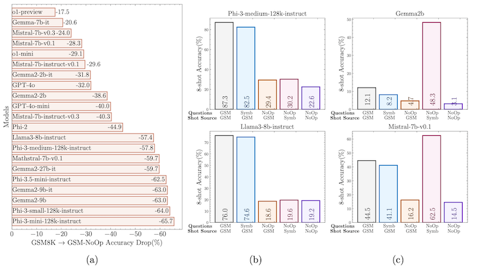
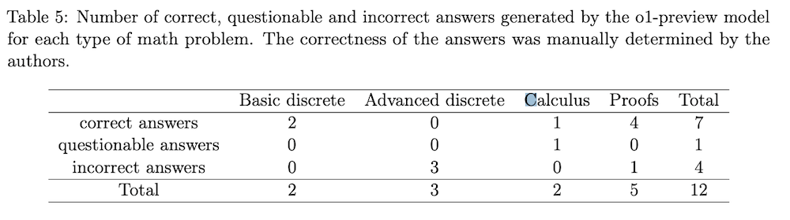

*My notes on paper [Evaluation of OpenAI o1: Opportunities and Challenges of AGI](https://arxiv.org/abs/2409.18486) by Tianyang Zhong, Zhengliang Liu, Yi Pan, Yutong Zhang, Yifan Zhou, Shizhe Liang, Zihao Wu, Yanjun Lyu, Peng Shu, Xiaowei Yu, Chao Cao, Hanqi Jiang, Hanxu Chen, Yiwei Li, Junhao Chen, Huawen Hu, Yihen Liu, Huaqin Zhao, Shaochen Xu, Haixing Dai, Lin Zhao, Ruidong Zhang, Wei Zhao, Zhenyuan Yang, Jingyuan Chen, Peilong Wang, Wei Ruan, Hui Wang, Huan Zhao, Jing Zhang, Yiming Ren, Shihuan Qin, Tong Chen, Jiaxi Li, Arif Hassan Zidan, Afrar Jahin, Minheng Chen, Sichen Xia, Jason Holmes, Yan Zhuang, Jiaqi Wang, Bochen Xu, Weiran Xia, Jichao Yu, Kaibo Tang, Yaxuan Yang, Bolun Sun, Tao Yang, Guoyu Lu, Xianqiao Wang, Lilong Chai, He Li, Jin Lu, Lichao Sun, Xin Zhang, Bao Ge, Xintao Hu, Lian Zhang, Hua Zhou, Lu Zhang, Shu Zhang, Ninghao Liu, Bei Jiang, Linglong Kong, Zhen Xiang, Yudan Ren, Jun Liu, Xi Jiang, Yu Bao, Wei Zhang, Xiang Li, Gang Li, Wei Liu, Dinggang Shen, Andrea Sikora, Xiaoming Zhai, Dajiang Zhu and Tianming Liu*

---

This report comprehensively analyses the o1-preview across many tasks and domains. In short, o1-preview significantly improves over gpt4 in all areas, albeit at the cost of inference performance. There are some areas where it continues to struggle, particularly advanced reasoning, creativity and understanding nuanced human-language, however, it is clearly a leap forward, and there's a lot of evidence to suggest it will continue to improve.

A recent paper [GSM-Symbolic: Understanding the Limitations of Mathematical Reasoning in Large Language Models](gsm-symbolic-understanding-the-limitations-of-mathematical-reasoning-in-large-language-models.md) has found that by modifying the GSM test set, i.e. by adding distracting information, or modifying the numbers used in the equation, they see a considerable drop in performance in all LLM models, which people have suggest means that LLMS "can't reason". However, notably o1-preview is the most robust to these perturbations in the test set.

*Figure 8. from [GSM-Symbolic: Understanding the Limitations of Mathematical Reasoning in Large Language Models](gsm-symbolic-understanding-the-limitations-of-mathematical-reasoning-in-large-language-models.md)*

## Categories tested

Note that I haven't included all the areas tested in the paper, just a few of interest.

### High School Level Math

o1-preview achieves 100% accuracy in high school-level mathematical reasoning tasks (although these are likely in the training set according to [GSM-Symbolic: Understanding the Limitations of Mathematical Reasoning in Large Language Models](gsm-symbolic-understanding-the-limitations-of-mathematical-reasoning-in-large-language-models.md)).

### College Level Math

o1-preview answers 7 out of 12 questions right. Mostly had difficulty with advanced discrete mathematics problems and proof-writing.

### Logical Reasoning

o1-preview consistently excels in logical reasoning tasks, successfully solving mathematical puzzles, deducing sequences, and evaluating arguments. The authors note that although the final answer is not always accurate, the analysis and reasoning process is "truly convincing".

### Natural Language Inference

Across diverse NLI datasets, o1-preview demonstrated high accuracy, successfully analysing complex logical relationships between sentences, signifying advanced reasoning capabilities and a strong grasp of domain-specific knowledge.

### Quantitative Investing

o1-preview exhibits a strong understanding of financial knowledge and statistical modelling techniques, enabling it to perform well in quantitative investing tasks. The model demonstrates a comprehensive knowledge and clear explanations of complex concepts like mean reversion, ARIMA models, and stochastic oscillators.

### Educational Q&A

o1-preview excels in answering educational questions, highlighting its potential as a valuable tool in academic settings. Its ability to accurately select the correct answer from a set of options reflects a robust comprehension of scientific concepts and the capacity to navigate misleading distractors.

### Medical Genetics and Genomics Reasoning

o1-preview consistently demonstrates strong reasoning abilities in genomics and medical genetics. It can generate reliable conclusions and provide detailed, step-by-step explanations when gene and disease descriptions are provided. The model employs a chain-of-thought process based on factual information to make decisions.

### Medical Knowledge Question Answer

o1-preview displays impressive accuracy in answering medical knowledge questions, particularly those found in real-world medical exams. It effectively retrieves key information from the questions, providing accurate answers and offering detailed explanations. While occasional gaps in information or illogical reasoning may occur, the overall reasoning process aligns with factual data. It may choose the correct option but miss key conditions while evaluating incorrect options.

### Chip Design

In chip design, o1-preview consistently outperforms ChipNeMo, a specialised model designed for this domain. o1-preview exhibits superior problem-solving capabilities, a deeper level of analysis, and practical relevance across tasks such as Engineering Assistant Chatbot, EDA Script Generation, and Bug Summary and Analysis. The model's ability to optimise code, handle intricate netlist structures, and offer insightful suggestions for power optimisation and task prioritisation demonstrates its advanced reasoning and potential to significantly benefit chip design automation.

### Student Writing

While proficient in student writing, o1-preview tends to generate responses that adhere to a rigid, machine-like template, lacking citations; this could encourage students to adopt such structures passively, potentially hindering their writing's creativity and effectiveness.

### Social Media Analysis

Although o1-preview demonstrates strong overall performance in social media analysis, it sometimes makes errors in sentiment analysis and emotion recognition. It might misinterpret neutral sentiment as negative or struggle to differentiate between positive and negative sentiment when both are present. The sources attribute these errors to the model's difficulty understanding subtle emotional cues, such as sarcasm and tone.

### Code Generation

While o1-preview performs well in code generation, optimising solutions for more complex problems is difficult, especially under time constraints. It got 10 out of 12 correct. It's still good.

### Radiology Report Generation

Although o1-preview achieves high ROUGE scores in Radiology report generation, indicating good performance, it also has the longest average generation time compared to other models.
