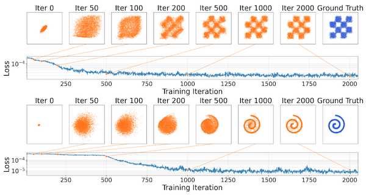
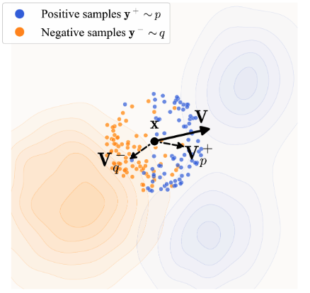
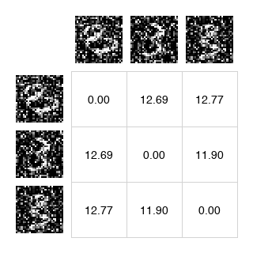
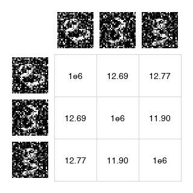
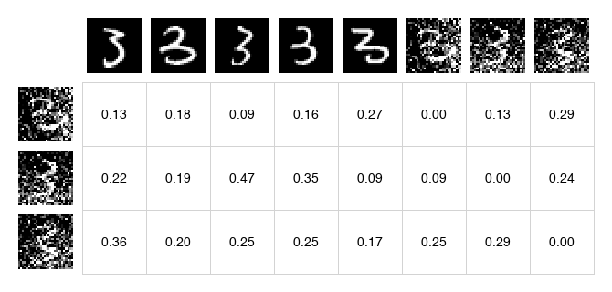
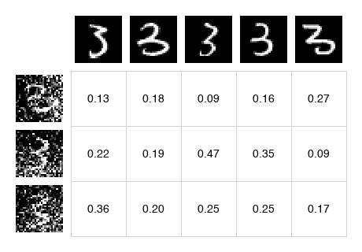
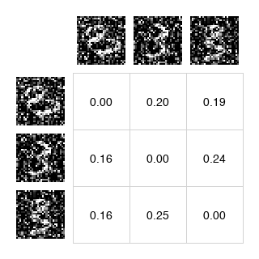
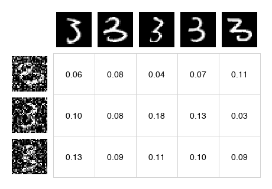
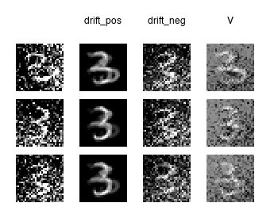

This paper introduces a new paradigm for single-step generative modelling called [Drifting Models](../../permanent/drifting-models.md) [^1]

Where Diffusion/Flow Matching performs iterative denoising at inference time, Drifting Models shift the iterative process into training.



The core of the algorithm is the computation of a "drift field", which is a vector for each generated sample that points toward the direction of the real distribution. The goal is to calculate a drift field where when model's output distribution matches the real distribution, the drift is zero.

The drift field is calculated using positive and negative samples. Positive samples are real examples from the same class in the training data. Negative samples are other model outputs in the batch (though other negatives, such as real examples from other classes, are also tested). We want the drift field to attract toward positives, repel from negatives, but at equilibrium, attraction and repulsion balance out: $\mathbf{V} = \mathbf{V}^+ - \mathbf{V}^- = 0$



Leaving aside computing the drifting field for a second, the loss computation is straightforward.

We compute a drifting vector for each output sample and train the model so its output moves toward its drifted version, indirectly minimising the magnitude of the drift. We use stop-gradient to avoid back-propagating through the drift computation.

```python
noise = rand([N, C])

x = model(noise)
y_neg = x
y_pos = training_data

V = compute_V(x, y_pos, y_neg)

x_drifted = stopgrad(x + V)

loss = mse_loss(x - x_drifted)
```

 The drifting can occur in raw pixel space or in feature space via an image encoder such as SimCLR or MoCo-v2. Outside of toy examples like MNIST, the authors were unable to achieve strong ImageNet without a feature encoder. However, they did test on robotics control tasks and successfully used raw representations without a feature space.

## Computing the Drift Vector - V

The computation for the Drift Vector - V can be broken down into a couple of steps

```python
def compute_V(samples, y_pos, y_neg):
    # ...
    return V  # A batch of drift vectors, each in dimension to the input samples
```

### 1. Compute L2 Distances

We first compute the distance between the model samples and the positive samples (a batch of training examples) and negative examples (the model samples themselves). The paper uses the L2 norm, which is available in scipy as cdist:

```python
from scipy.spatial.distance import cdist

# compute_V

dist_pos = cdist(samples, y_pos)
dist_neg = cdist(samples, y_neg)
```

So we have two matrices that represent the distance between each sample.

<table style="border: 0">
<tr>
<td>
<strong>dist_pos</strong><br>
Distance to positive samples
</td>
<td>
<strong>dist_neg</strong><br>
Distance to negative samples
</td>
</tr>
<tr>
<td></td>
<td></td>
</tr>
</table>

### 2. Mask out self

Since we're using the batch of model outputs as negatives, we want to ensure that the model ignores any self-distances. In practice, we set this to a very large distance, to ensure it's ignored the softmax (nearby generated samples contribute stronger repulsion, so we don't want a sample repelling itself).

```python
# Add a large value to the diagonal so self-distances are ignored in softmax
dist_neg += np.eye(N) * 1e6
```

**dist_neg_masked** - Self-distances are masked so samples don't repel themselves:



### 3. Compute weights via Softmax

We now compute a Softmax operation that performs attention over these distances.

First, we concatenate the distance matrices and convert to logits using temperature scaling:

```python
logit_pos = -dist_pos / temperature
logit_neg = -dist_neg / temperature
logit = np.concatenate([logit_pos, logit_neg], axis=1)  # [N, N_pos + N_neg]
```

[Temperature Scaling](../../permanent/temperature-scaling.md) controls how sharply the model focuses on nearby samples. Lower temperature = winner takes all.

The paper uses **bidirectional normalisation**: softmax over both rows (which y sample to attend to) and columns (which x sample attends). These are combined via geometric mean:

```python
A_row = softmax(logit, axis=1)  # normalize over y samples
A_col = softmax(logit, axis=0)  # normalize over x samples
A = np.sqrt(A_row * A_col)      # geometric mean
```

This bidirectional normalisation helps prevent any single sample from dominating the attention.

**A** - Combined attention matrix (positives on left, negatives on right):



Finally, we split back into positive and negative attention:

```python
A_pos = A[:, :N_pos]  # [N, N_pos]
A_neg = A[:, N_pos:]  # [N, N_neg]
```

<table>
<tr>
<td><strong>A_pos</strong> - Attention to positives</td>
<td><strong>A_neg</strong> - Attention to negatives (self masked)</td>
</tr>
<tr>
<td></td>
<td></td>
</tr>
</table>

### 4. Cross-weighting

Finally, we scale the positive weights by the total repulsion strength, and the negative weights by the total attraction strength:

We sum the negative weights and scale each positive weight:

```python
# attraction scaled by repulsion strength
W_pos = A_pos * np.sum(A_neg, axis=1, keepdims=True)
```

And sum the positive weights to scale each negative weight:

```python
# repulsion scaled by attraction strength
W_neg = A_neg * np.sum(A_pos, axis=1, keepdims=True)
```

This cross-weighting ensures that if you're strongly attracted to positives, you're also strongly repelled from negatives (and vice versa). It maintains the balance needed for the anti-symmetric property.

<table>
<tr>
<td><strong>W_pos</strong> - Cross-weighted positives</td>
<td><strong>W_neg</strong> - Cross-weighted negatives</td>
</tr>
<tr>
<td></td>
<td></td>
</tr>
</table>

### 5. Compute Drift Vectors

These weights are used to compute weighted averages of the positive and negative samples:

```python
drift_pos = W_pos @ y_pos  # [N, D] - weighted sum of positive samples
drift_neg = W_neg @ y_neg  # [N, D] - weighted sum of negative samples
```

The final drift vector is the difference - attraction toward positives minus repulsion from negatives:

```python
V = drift_pos - drift_neg
```



When the generated distribution matches the data distribution, the attraction and repulsion cancel and $\mathbf{V} = 0$. The paper shows this is a necessary condition for equilibrium (though the converse is not strictly proven).

---

## The Anti-Symmetric Property

The theoretical foundation of the method rests on the anti-symmetry property that the drift field satisfies.

$$\mathbf{V}_{p,q}(\mathbf{x}) = -\mathbf{V}_{q,p}(\mathbf{x})$$

 Where:

* $p$ is the target data distribution (positive samples) and
* $q$ is the generated distribution (negative samples)

Swapping $p$ and $q$ flips the sign of the drift, which means that when $q = p$ (the generated distribution matches the data distribution), we have $\mathbf{V}_{p,p} = -\mathbf{V}_{p,p}$, which means $\mathbf{V} = 0$.

With this equilibrium in place, the model naturally stops drifting once it matches the target distribution.

## Multi-Temperature

A single temperature may not capture both local and global structure. The paper uses multiple temperatures summed together (Appendix A.6):

```python
temperatures = [0.02, 0.05, 0.2]
V_total = sum(compute_V(x, y_pos, y_neg, t) for t in temperatures)
```

Lower temperatures (0.02) draw sharp attention to the nearest neighbours. Higher temperatures (0.2) spread attention more broadly. Combining them gives a richer gradient signal.

## Classifier-Free Guidance

Drifting models support CFG naturally. Given a class label $c$, the positive samples become $\mathbf{y}^+ \sim p_{\text{data}}(\cdot|c)$. For guidance, mix in real samples from *other* classes as extra negatives:

$$\tilde{q}(\cdot|c) = (1-\gamma) q_\theta(\cdot|c) + \gamma \, p_{\text{data}}(\cdot|\varnothing)$$

where $p_{\text{data}}(\cdot|\varnothing)$ is the unconditional distribution (samples from any class). This property is baked into training: the model learns to extrapolate from the unconditional distribution toward the class-conditional one.

## Mode Collapse Robustness

Unlike GANs, drifting models are robust to mode collapse. Figure 3 in the paper shows that even when $q$ is initialised collapsed onto a single mode, the method recovers the full distribution, because if $q$ collapses to one mode, the positive samples from *other* modes of $p$ still attract generated samples toward them. The attraction from missing modes pulls samples out of the collapsed state.

## Results

They achieve **1.54 FID** on ImageNet 256×256 with a single forward pass (1-NFE), outperforming all previous single-step methods and somewhat competitive with multi-step diffusion models.

In pixel space (no VAE), they achieve **1.61 FID** - also state-of-the-art for one-step pixel-space generation.

| Method | Space | NFE | FID |
|--------|-------|-----|-----|
| DiT-XL/2 | latent | 250 | 2.27 |
| Drifting Model, L/2 | latent | 1 | **1.54** |
| iMeanFlow-XL/2 | latent | 1 | 1.72 |
| Drifting Model, L/16 | pixel | 1 | **1.61** |

[^1]: Deng, M., Li, H., Li, T., Du, Y., & He, K. (2026). *Generative Modeling via Drifting* (Version 2). arXiv. https://doi.org/10.48550/ARXIV.2602.04770
