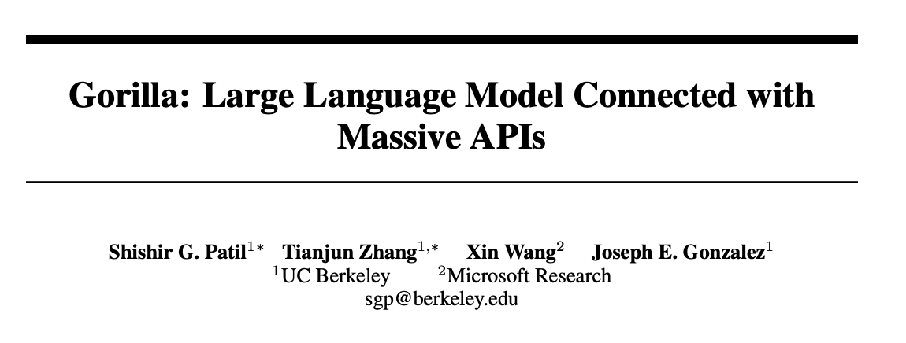
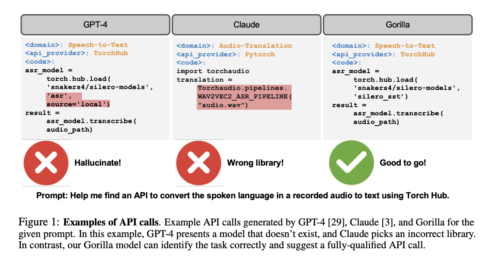
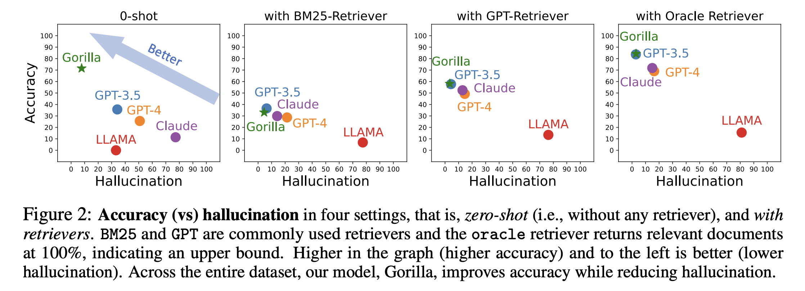
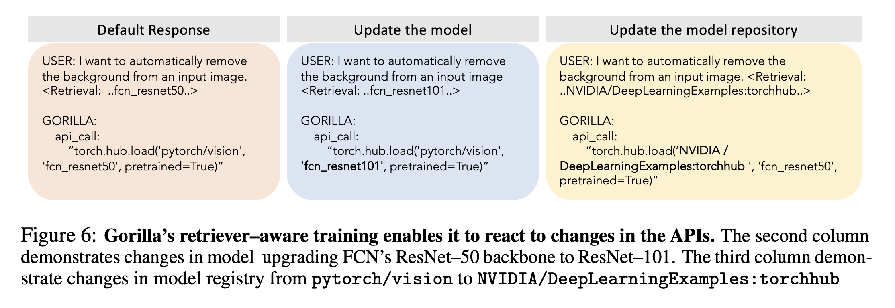
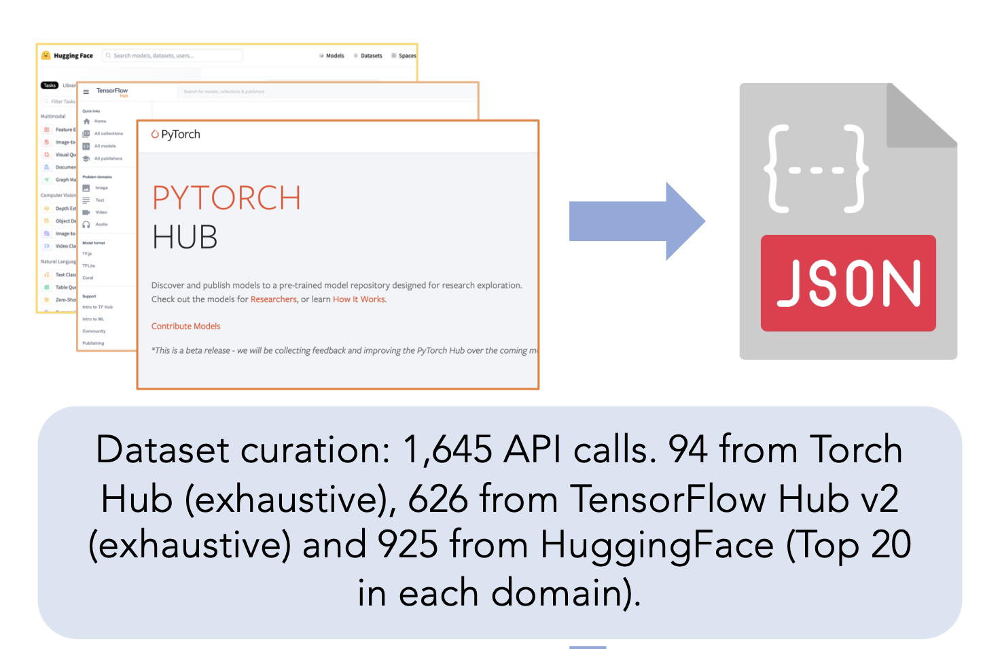
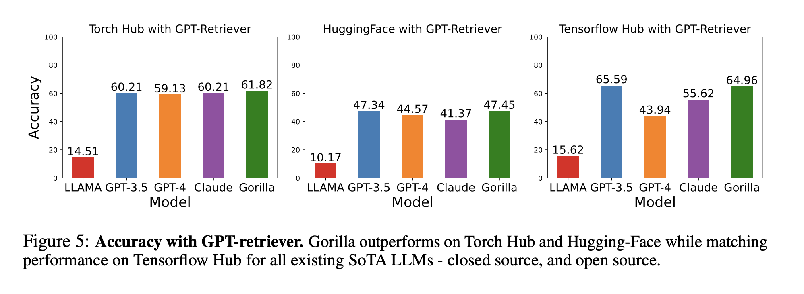
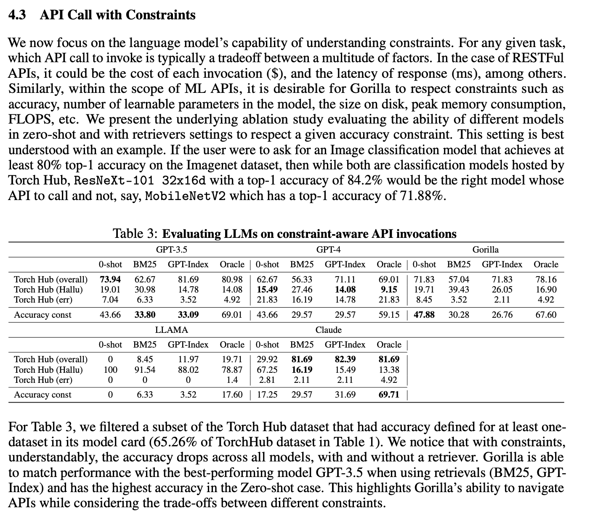
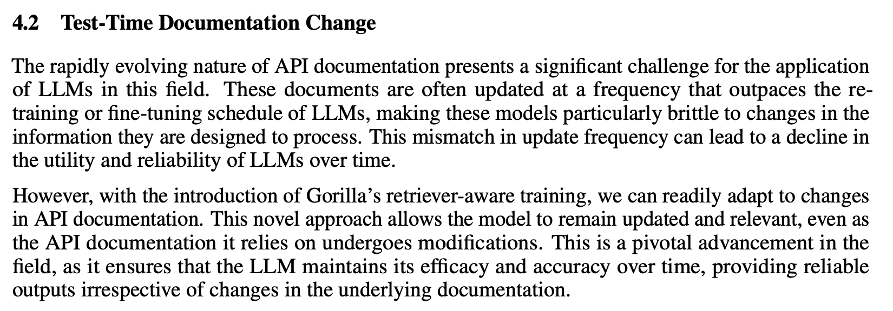
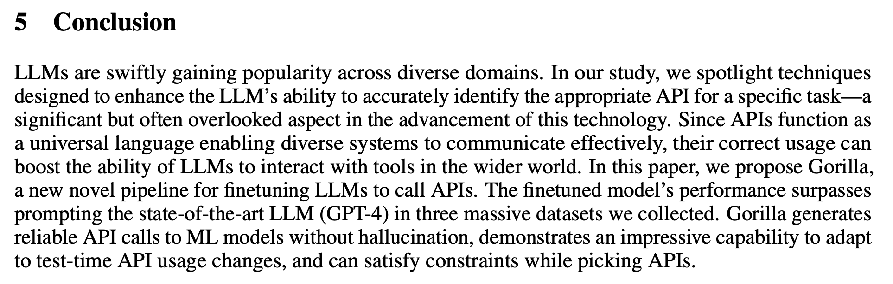

This research paper, first released in May 2023, introduces Gorilla, a language model designed to write accurate API calls.

Part of the [Tool Use](../../permanent/tool-use.md) paradigm within [Agentic Reasoning](../../permanent/agentic-reasoning.md).

Gorilla outperforms GPT-4 in generating API calls, especially in combination with a document retriever, which allows it to adapt to changes in test-time documentation.

To assess Gorilla's capabilities, the researchers created [APIBench](../../permanent/apibench.md), a comprehensive dataset of HuggingFace, TorchHub and TensorFlow Hub APIs.

The paper explores the use of [Self-Instruct](https://arxiv.org/abs/2212.10560) fine-tuning and retrieval to enable LLMs to accurately select from a large, overlapping, and changing set of tools expressed using their APIs and API documentation.

Gorilla outperforms other LLMs in terms of API functionality accuracy and reduces hallucination errors, highlighting its potential for making LLMs more reliable and applicable.

## Retriever-Aware Training

During training, they add retrieved API documentation to the prompt, so the model learns to use whatever documentation it's given at test time. This is what lets it adapt when an API changes.

