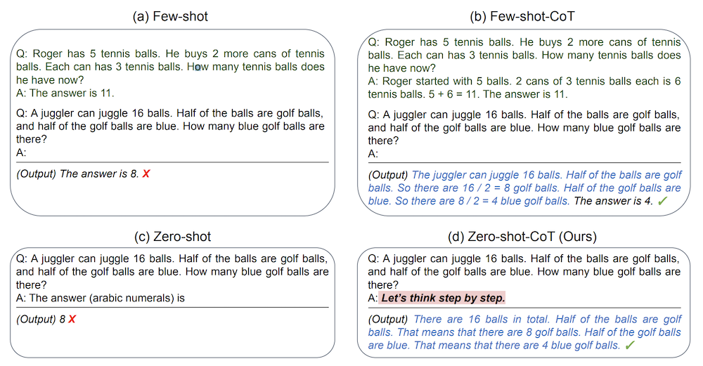
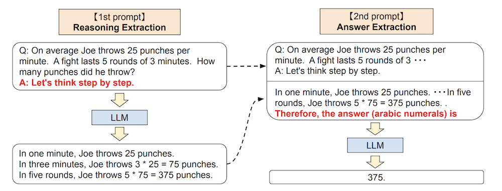

## Overview

Language models have shown impressive capabilities in few-shot learning, where they learn from a handful of examples. However, this paper from early 2023 shows that large language models (LLMs) can perform complex reasoning tasks with zero examples - they just need to be asked to "think step by step."

## Background

Traditional approaches to getting LLMs to solve complex reasoning problems involved showing them several examples with step-by-step solutions (called [Chain-of-Thought Prompting](../../permanent/chain-of-thought-prompting.md) or CoT).

This new research shows that by simply adding the phrase "Let's think step by step" before asking for an answer, LLMs can break down and solve complex problems without any examples.

*Figure 1: Example inputs and outputs of GPT-3 with different prompting techniques.*

> [!question] What is the key difference between few-shot CoT and zero-shot CoT?
> a) Zero-shot CoT uses more examples than few-shot CoT
> b) Few-shot CoT requires no examples while zero-shot CoT needs many
> c) Zero-shot CoT only needs the prompt "Let's think step by step" while few-shot CoT needs example solutions
> d) Zero-shot CoT only works on simple problems
> > [!success]- Answer
> > c) Zero-shot CoT only needs the prompt "Let's think step by step" while few-shot CoT needs example solutions
> > This is the fundamental innovation of the paper - discovering that complex reasoning could be achieved without examples, just by prompting step-by-step thinking.

## Technique - Two Staged-Approach

Let's think step-by-step uses a two-stage prompting process:

### 1. **Reasoning Extraction (First Stage)**

- Input question is formatted as "Q: [Question]. A: Let's think step by step"
- Model generates step-by-step reasoning
   
### 2. **Answer Extraction (Second Stage)**

- Combines original question, generated reasoning, and answer-extraction prompt
- Uses format-specific triggers like "Therefore, the answer is..."
- Extracts final answer in correct format

*Figure 2: Full pipeline of Zero-shot-CoT as described in section 3.*

While this approach requires two prompting steps instead of one, it eliminates the need for carefully engineered examples that traditional few-shot methods require. The method can be used with any decoding strategy, though the researchers used greedy decoding for simplicity. The approach's flexibility comes from its ability to adapt to different answer formats while maintaining the same basic reasoning structure, making it truly task-agnostic.

> [!question] Which statement correctly describes Zero-shot-CoT's prompting process?
> a) It uses a single prompt to generate both reasoning and answer
> b) It requires examples like traditional chain-of-thought prompting
> c) It uses two separate prompts - one for reasoning and one for answer extraction
> d) It only works with numerical answers
> e) It requires fine-tuning the model for each task type
> > [!success]- Answer
> > c) It uses two separate prompts - one for reasoning and one for answer extraction
> > This is correct because Zero-shot-CoT employs a two-stage process:
> > * First stage extracts the reasoning using "Let's think step by step"
> > * Second stage extracts the final answer using a format-specific prompt
> > The other options are incorrect because:
> > * It doesn't use a single prompt
> > * It doesn't need examples
> > * It works with various answer formats
> > * It doesn't require fine-tuning

## Results

The researchers tested this approach on various tasks including:
- Arithmetic reasoning (MultiArith, [[GSM8K]])
- Symbolic reasoning (Last Letter, Coin Flip)
- Commonsense reasoning
- Logical reasoning

The results were remarkable. For example, on the MultiArith dataset, accuracy increased from 17.7% to 78.7% simply by adding the step-by-step prompt. They showed that CoT helped large models the most.

> [!question] What did the results show about model scaling?
> a) Smaller models performed better with zero-shot CoT
> b) Model size had no effect on performance
> c) Larger models showed significantly better performance with zero-shot CoT
> d) Zero-shot CoT only worked on medium-sized models
> > [!success]- Answer
> > c) Larger models showed significantly better performance with zero-shot CoT
> > The paper demonstrated that the effectiveness of zero-shot CoT increased dramatically with model size, suggesting that this capability emerges more strongly in larger models.

## Why This Matters

This discovery has several important implications for [[Large Language Models]].

1. It suggests that LLMs have inherent reasoning capabilities that can be accessed with the right prompting
2. It provides a simpler alternative to few-shot learning for complex tasks
3. It hints at broader cognitive capabilities in LLMs that we might not have fully explored

> [!question] Which of these is NOT a key implication of this research?
> a) LLMs have untapped reasoning capabilities
> b) Complex prompting with examples might be unnecessary
> c) LLMs need to be retrained to achieve better reasoning
> d) Simple prompts can unlock sophisticated behaviors
> > [!success]- Answer
> > c) LLMs need to be retrained to achieve better reasoning
> > This is incorrect because the paper shows that existing LLMs already have these capabilities without retraining - they just need the right prompt to access them.

The research suggests that before investing in creating complex few-shot examples or fine-tuning datasets, we should first explore what capabilities already exist within these models through simple prompting strategies.

This work sets a new baseline for evaluating language models' reasoning capabilities and opens up exciting possibilities for making AI systems more capable through clever prompting rather than just increasing model size or training data.