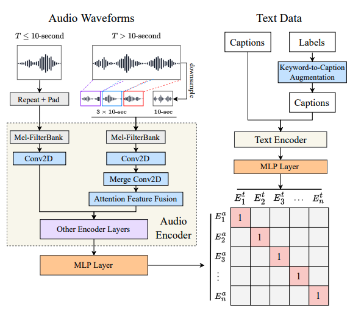
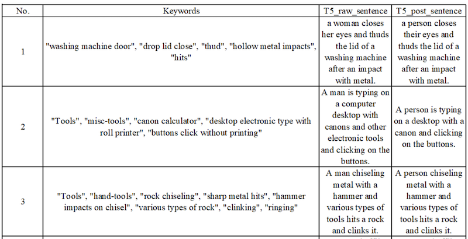
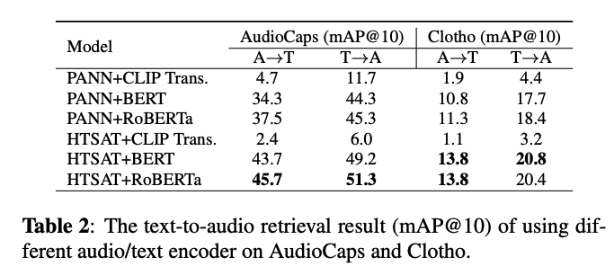
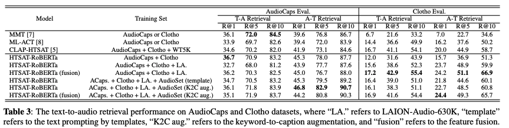
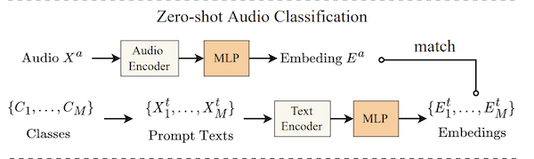
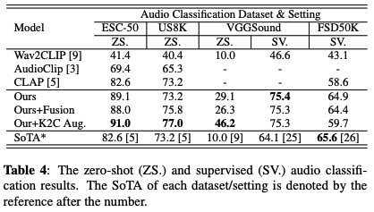
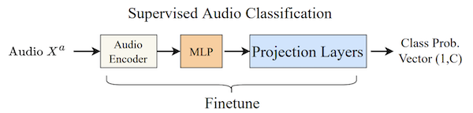

These are my notes from the paper [Large-scale Contrastive Language-Audio Pre-training with Feature Fusion and Keyword-to-Caption Augmentation](https://arxiv.org/abs/2211.06687) by Yusong Wu, Ke Chen, Tianyu Zhang, Yuchen Hui, Taylor Berg-Kirkpatrick, Shlomo Dubnov

## Overview

This paper uses contrastive learning to learn a shared text/audio latent space. Like [CLIP](https://openai.com/research/clip) for audio. It has four main contributions:

### 1. Contrastive Language-Audio Pre-training (CLAP)

CLAP is a pre-training system for learning a shared text/audio latent space from pairs of examples. From this, we can learn representations that allow us to query audio using text or vice versa.

It is trained using [Contrastive Loss](../../permanent/contrastive-loss.md). Hence: <span style="color: red;">Contrastive</span> <span style="color: blue;">Language-Audio</span> <span style="color: green;">Pre-training</span>.

The authors use a text-encoder and audio-encoder to generate respective representations, then feed into an MLP layer to learn a shared latent space. For the text-encoder, they use [RoBERTa](https://arxiv.org/abs/1907.11692), and for the audio-encoder, they use [HTS-AT](https://arxiv.org/abs/2202.00874). The authors also compared several alternatives.



They released the architecture, training code and series of weights trained on different subsets of their datasets [here](https://github.com/LAION-AI/CLAP).

### 2. [Feature-Fusion](../../permanent/feature-fusion.md)

A technique for dealing with variable-length, long audio (> 10 secs). It combines the entire audio downsampled, alongside 10-second clips taken randomly throughout the audio. They pass through several layers to get the final representation.


More information is below.

### 3. [Keyword-to-Caption Augmentation](../../permanent/keyword-to-caption-augmentation.md)

Since the [Audioset](https://research.google.com/audioset/) dataset only has keywords and labels paired with audio, they use a T5 model provided by the [keytotext](https://github.com/gagan3012/keytotext) library to create captions from these keywords.

They also add a de-biasing step to convert references to "woman" or "man" to "person".

Here are some examples of the keywords and the generated captions, followed by their debiased versions.



### 4. [Laion Audio 630K](../../permanent/laion-audio-630K.md)

Finally, Laion Audio 630k was released: a large text/audio dataset scraped from the internet. They collect 633 526 text/audio pairs, amounting to 4,325.39 hours of audio.

Contains:

* human activities
* natural sounds
* audio effects

#### Examples

##### "The sound of a siren"

<audio controls>
  <source src="/_media/the-sound-of-a-siren.mov" type="audio/mpeg">
</audio>

##### "The sounds of wrestling crowd, mezzanine level, huge crowd, p.a., and loop."

<audio controls>
  <source src="/_media/sound-of-wrestling-crowd.mov" type="audio/mpeg">
</audio>

## Related work

[CLIP](../../permanent/contrastive-language-image-pretraining.md)

* Demonstrated how contrastive loss can be used to learn the relationship between text and image by projecting into a shared latent space
* trained on a large-scale internet scrape

Other attempts to use contrastive pre-training on language-audio:

[Text-to-audio retrieval via large-scale contrastive learning](https://dcase.community/documents/challenge2022/technical_reports/DCASE2022_Wu_100_t6b.pdf)

* Pre-trained Audio Neural Network (PANN) as the audio encoder.
* BERT as text encoder.
* Various loss functions to evaluate text-to-audio retrieval.

[Audio Retrieval with WavText5K and CLAP Training](https://arxiv.org/abs/2209.14275)

* Also adds [HTS-AT](https://arxiv.org/abs/2202.00874) and [RoBERTa](https://arxiv.org/abs/1907.11692) into encoder list to enhance performance.
* Uses representation in the downstream task of audio classification.

Other studies extending CLIP for audio:

* [AudioCLIP: Extending CLIP to Image, Text and Audio](https://arxiv.org/abs/2106.13043)
* [Wav2CLIP: Learning Robust Audio Representations From CLIP](https://arxiv.org/abs/2110.11499)

However, they all share limitations:

* Datasets "relatively small."
* Prior work has yet to investigate selections and hyper-parameters thoroughly.
* Can't accommodate varied audio lengths, particularly with [Transformer](../../permanent/transformer.md)-based audio encoder.
* No analysis of representation in the downstream task.

## Training Dataset

[Laion Audio 630K](../../permanent/laion-audio-630K.md)

* 630K+ audio-text pairs.

[AudioCaps](https://audiocaps.github.io/) + [Clotho](https://zenodo.org/records/3490684)

* 55k audio-text pairs.

[Audioset](https://research.google.com/audioset/)

* 1.9 million audio samples with only labels available for each sample.

They exclude overlapping data in evaluation sets, resulting in 2.5 million audio samples.

### Dataset Format and Preprocessing

All audio is converted to mono.

48kHz in FLAC format.

Expand data with only tags or labels using the template: *"the sound of `label-1`, `label-2`, ..., and `label-n`"*

## Model Architecture

* $X^{a}_i$ = audio example i
* $X^{t}_{i}$ = text example i
* $X^{a}_{i}, X^{t}_{i}$ = audio-text pair $i$.
* $\text{faudio}(X^{a}_{i})$ = audio encodings.
* $\text{ftext}(X^{t}_{i})$ = text encodings

Pass the audio and text encodings into another neural network layer to get 512-dimension embeddings.

* $E^{a}_{t} = \text{MLPaudio}(\text{faudio}(X^{a}_{i}))$
* $E^{t}_{i} = \text{MLPtext}(\text{ftext}(X^{t}_{i}))$

Now, you can use the contrastive learning loss function to compare pairs and negative pairs in each batch.

$L = \frac{1}{2N} \Sigma^{N}_{i=1} \ ( \log  \frac{\exp{E^{a}_{i} \cdot E^{t}_{i} / r}}{\Sigma^{N}_{j=1} \exp(E^{a}_{i} \cdot E^{t}_{j} / r)} + \log \frac{\exp{E^{t}_{i} \cdot E^{a}_{i} / r}}{\Sigma^{N}_{j=1} \exp(E^{t}_{i} \cdot E^{a}_{j} / r)} )$

Where:
* $r$ is a learnable temperature parameter for scaling the loss
* N is the batch size.

Note: the two logarithmic terms consider audio-to-text or text-to-audio logits in each bath.

After training, embeddings are then used for upstream tasks:

* **Text-to-Audio Retrieval**: given text, find the closest audio (or vice versa).
* **Zero-shot audio classification**: construct text like: *"the sound of `class name`"*, and use to query your audio. This classification style is useful because it allows you to use any category, provided it is in the training data.
* **Supervised Audio Classification**: take audio embeddings and fine-tune them on a classification task.

### Audio Encoders and Text Encoders

They experiment with two models for audio encoders:

[PANNs](../../../../permanent/PANNs.md)

* a CNN-based audio classification model with seven downsampling CNN blocks and seven upsampling blocks.

[HTS-AT](../../permanent/hts-at.md)

* a transformer-based model with four Swintransformer blocks, achieving SOTAs on three audio classification datasets.

For both, they use the 2nd last layer's output. For PANNs, it's a 2048-sized embedding, and for HTSAT, it's a 768-sized embedding.

For text encoder, they experiment with:

* CLIP transformer (output dimension 512)
* BERT (output dimension 768)
* Roberta (output dimension 768)

### Feature Fusion for Variable-Length Audio

Audio is a natural variable length, unlike image data, which we can resize to "unified resolution" (i.e. 224x224).

A common approach is to average per-frame or per-chunk audio embeddings as output. However, this is not computationally efficient on long audio.

Enter [Feature-Fusion](../../permanent/feature-fusion.md).

It allows them to train on different lengths of audio inputs in constant computation time by combining coarsely global and randomly sampled local information.

For an audio in T seconds and a fixed chunk duration d = 10 seconds:

$T < d$:

* repeat the input, then pad with zero values. For example, 3-second input will be repeated 3 x 3 = 9 seconds and padded with 1-second zero values.

$T > d$:

* First, downsample the input from T to d-second (10 seconds) as global input. These are the global inputs.
* Then, randomly slice three d-second clips: in front 1/3, then middle 1/3 and back 1/3 of the input. These are the local inputs.
* Send these $4 \ x \ d$ inputs to the mel encoder to get the initial features.
* send the three local inputs to the 2D Conv layer with a 3-stride in the time axis to convert to one feature.
* Now fuse the local feature $X^{a}_{local}$ and the global feature $X^{a}_{global}$: $X^{x}_{fusion} = \lambda X^{a}_{global}.+ (1 - \alpha)X^{a}_{local}$, where $α = fAF F (X^{a}_{global}, X^a_{local})$ is a factor obtained by [Attention Feature Fusion](https://arxiv.org/abs/2009.14082).

Code from the repo:

```python
mel = get_mel(audio_data, audio_cfg)

ranges = np.array_split(list(range(0, total_frames - chunk_frames + 1)), 3)
                    
if len(ranges[1]) == 0:
    # if the audio is too short, we use the first chunk
    ranges[1] = [0]
if len(ranges[2]) == 0:
    # If the audio is too short, we use the first chunk
    ranges[2] = [0]

# randomly choose index for each part
idx_front = np.random.choice(ranges[0])
idx_middle = np.random.choice(ranges[1])
idx_back = np.random.choice(ranges[2])

# select mel parts for local inputs
mel_chunk_front = mel[idx_front:idx_front + chunk_frames, :]
mel_chunk_middle = mel[idx_middle:idx_middle + chunk_frames, :]
mel_chunk_back = mel[idx_back:idx_back + chunk_frames, :]

# shrink the mel to create global inputs
mel_shrink = torchvision.transforms.Resize(size=[chunk_frames, audio_cfg['mel_bins']])(mel[None])[0]

# stack
mel_fusion = torch.stack([mel_shrink, mel_chunk_front, mel_chunk_middle, mel_chunk_back], dim=0)
```

Compared with the "slice & vote" method, the feature fusion saves training time as we only process audio slices in the first few layers.

### Keyword-to-Caption Augmentation

See the Main Contributions section.

## Experiments

They evaluated two initial tasks using recall and mean average precision (mAP) on audio-to-text and text-to-audio:

* Experiment with different audio and text encoders to get the best baseline model.
* Experiment with various dataset sizes, using feature fusion and keyword-to-caption augmentation to verify the efficacy of the proposed methods.

Then, they do zero-shot and supervised audio classification experiments to evaluate the generalisation ability of the downstream tasks.

### Hyper-parameters

#### Audio settings

* 10-second input length
* 480 hop size
* 1024 window size
* 64 mel-bins to compute STFTs and mel-spectrograms

So, each input sent to the audio encoder is of the shape $(T = 1024, F = 64)$

When training the model without the feature fusion, the audio longer than 10 seconds will be randomly chunked into a 10-second segment.

#### Text settings

Tokenise the text with a maximum token length of 77

#### Optimiser

Use the [Adam](Adam) optimiser with β1 = 0.99, β2 = 0.9 with a warm-up and cosine learning rate decay at a basic learning rate of 10−4.

#### Batch sizes

* Batch size of 768 on the AudioCaps + Clotho dataset
* 2304 on the training dataset containing LAION-Audio-630K
* 4608 on the training dataset containing the AudioSet

#### Epochs

We train the model for 45 epochs.

### Text-to-Audio Retrieval

They experiment to find the best audio and text encoder for retrieval tasks.

Combine two audio encoders with three text encoders loaded from pre-trained checkpoints.

In this experiment, train on [AudioCaps](https://audiocaps.github.io/) and [Clotho](https://zenodo.org/records/3490684) datasets, and report the best mAP@10 on audio-to-text (A→T) and text-to-audio (T→A) perspectives

Results:

* Audio encoder: [HTS-AT](https://arxiv.org/abs/2202.00874) better than [PANNs](https://arxiv.org/abs/1912.10211) combined with RoBERTa or BERT.
* Text encoder: RoBERTa beats BERT. CLIP transformer worst.



#### Dataset Scale

Now, they use the HTSAT-RoBERTa model to perform text-to-audio retrieval experiments across the datasets.

This task uses the same metrics to compute recall scores at different ranks.

In the training set, they gradually increase the scale of the dataset.

They find that scaling up the dataset from "AudioCaps + Clotho" to "LA." does not improve the result on the AudioCaps evaluation set but gets better performance on the Clotho evaluation set.

One reason is that AudioCaps contains audio similar to AudioSet, on which the audio encoder's loaded checkpoint is pre-trained.

When the model receives more data from other sources, it increases its generalisation but moves the distribution out of AudioSet data.

Therefore, the performance on AudioCaps drops, but that on Clotho increases a lot, demonstrating a trade-off of the model to keep the performance among different types of audio.

#### Keyword-to-Caption and Feature Fusion

They observe performance improvements when adding the feature fusion mechanism and keyword-to-caption augmentation to the model.

Feature fusion is effective, especially in the Clotho dataset, because it contains longer audio data (> 10 seconds).

When they add AudioSet into the training set with either template prompting or keyword-to-caption augmentation, we can see the performance increases again on AudioCaps while decreasing on Clotho.

This result further confirms the trade-off performance between AudioCaps and Clotho datasets mentioned above.

Also, keyword-to-caption augmentation works better than the template text prompting method on most metrics.

As a result, our best model outperforms previous methods on most metrics (mainly R@1=36.7% on AudioCaps and R@1=18.2% on Clotho) in the text-to-audio retrieval tasks.

We show that training on large-scale datasets (LAION-Audio-630K and AudioSet with keyword-to-caption augmentation) and feature fusion can improve model performance.



### Zero-shot Audio Classification

To study the model generalisation and robustness, they conducted zero-shot audio classification experiments on three top-performing models in previous experiments.

They evaluate models on three audio classification datasets: [ESC50](https://www.cs.cmu.edu/~alnu/tlwled/esc50.htm), [VGGSound](https://arxiv.org/abs/2004.14368), and [Urbansound8K](https://urbansounddataset.weebly.com/urbansound8k.html). They use top-1 accuracy as the metric.

They classify audio by performing audio-to-text retrieval with each text corresponding to the text prompt converted from class label via "This a sound of the *label*.".

There's some dataset overlap between the training data and the zero-shot dataset. They excluded all the overlap samples and performed a zero-shot evaluation on the remaining dataset.



As shown in Table 4, the models achieve new SoTAs of zero-shot audio classification across all three datasets.

Keyword-to-caption augmentation increases the performance of VGGsound and US8K by adding more text captions to "enrich" the text embedding space.



### Supervised Audio Classification

They perform supervised audio classification by fine-tuning the audio encoder on [FSD50K](https://paperswithcode.com/dataset/fsd50k) and [VGGSound](https://arxiv.org/abs/2004.14368) datasets. They do not run experiments on [ESC50](https://github.com/karolpiczak/ESC-50) or [Urbansound8K](https://urbansounddataset.weebly.com/urbansound8k.html) due to data leakage concerns. mAP is used as an evaluation metric.

Feature-fusion enables the model to handle variable-length input and performs better than previous models.

They outperform the current state-of-the-art on the VGGSound dataset, close to the state-of-the-art on the FSD50K dataset.



## Future Work

They want to collect an even larger dataset.

Apply representations to other downstream tasks like audio synthesis and separation.
