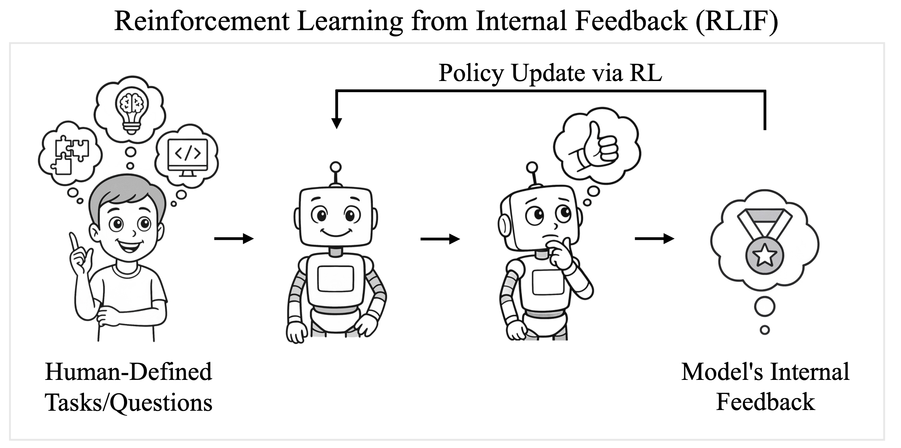
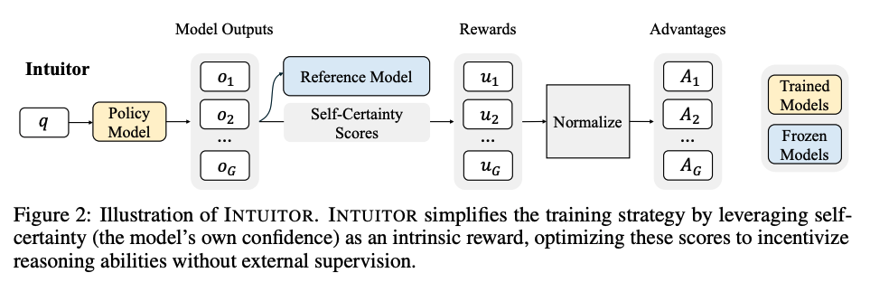

*My summary of [Learning to Reason without External Rewards](https://arxiv.org/abs/2505.19590v1) by Xuandong Zhao, Zhewei Kang, Aosong Feng, Sergey Levine, Dawn Song.*

Another very interesting paper on the topic of reward modelling, that continues to turn assumptions on their head about how to train reasoning LLMs.

This paper proposes a new RL training method that doesn't rely on reward models ([RLHF](../../permanent/reinforcement-learning-from-human-feedback.md)) like ChatGPT, selected high-quality ground truth examples (RLVR) like DeepSeek R1, or even verifiable generated data (Self-Play) like [AbsoluteZero](absolute-zero-reinforced-self-play-reasoning-with-zero-data.md), to develop complex reasoning capability (thinking mode).

Turns out we can just use the model's internal sense of confidence as the reward signal to train a reasoning model 🤯

The authors take GRPO (from Deepseek R1) and replace the verifiable reward signal with a "self-certainty score" (specifically the KL divergence between the model's output distribution and a uniform distribution), then train on a collection of prompts relative to the evaluated domains. They demonstrate reasoning performance comparable to GRPO on math while exceeding it on coding tasks.

They introduce a new paradigm, "Reinforcement Learning from Internal Feedback" (RLIF) and call their approach [INTUITOR](../../permanent/intuitor.md).

If this approach scales, it could unlock the ability to generally improve reasoning LLMs in domains where high-quality ground truth isn't available or not verifiable (i.e., any domain other than math and code) and provide evidence that pre-trained LLMs "possess richer latent behavioural priors than previously recognised."

Interesting, indeed.