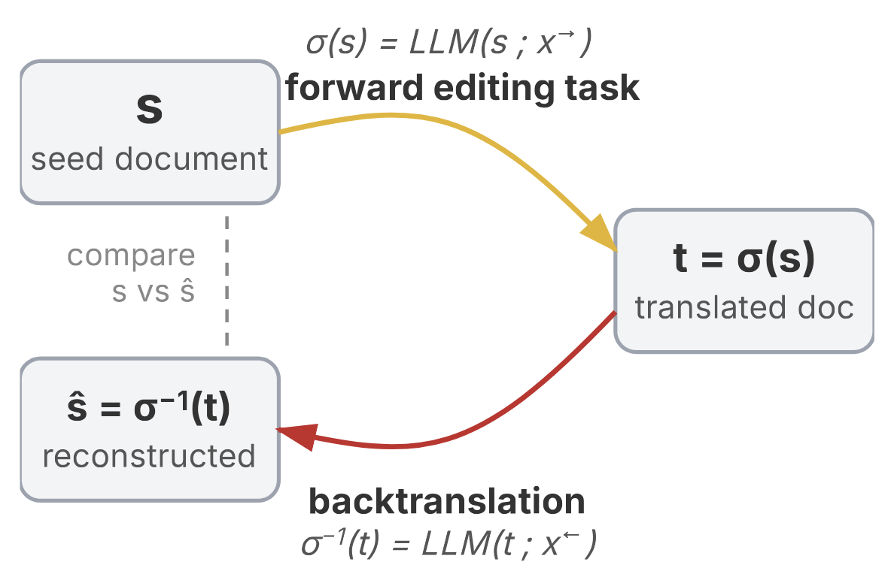

*My notes on [LLMs Corrupt Your Documents When You Delegate](https://arxiv.org/pdf/2604.15597) by Philippe Laban, Tobias Schnabel and Jennifer Neville from Microsoft Research.*

An interesting paper from 3 researchers at Microsoft.

They found that when delegating document manipulation tasks to an LLM (things like splitting a CSV into separate files based on categories, transposing the key of a music score) in almost all cases, the information in the document would degrade over time. Even with the latest frontier models, users would see an average of 25% document corruption by the end of a long workflow, with all tested models averaging 50% corruption [@labanLLMsCorruptYour2026].

Surprisingly, this isn't something that gradually decays over time - models would typically fail catastrophically after a certain number of tasks, with frontier models just delaying the step at which the degradation occurs.

Interestingly, they also found that agentic tools don't help prevent degradation and tend to have their own unique failure modes.

*Figure 1 from [@labanLLMsCorruptYour2026] shows examples of document degradation across different domains*

## Measuring Document Corruption

How did they measure document corruption?

Firstly, they introduce a domain-specific document similarity measure that parses documents into components. For a recipe, that means ingredients (name, quantity, unit), steps, and tips; for Python code, it's functions, classes, and imports.

*Figure 5 from [@labanLLMsCorruptYour2026] - the domain-specific parsing pipeline, with a concrete recipe example showing how ingredients, steps and tips are extracted and compared*

Then they used a [Backtranslation](../../permanent/backtranslation.md)-inspired approach - which is an approach of translating and un-translating a document (used in data augmentation and machine translation evaluation), where they would perform some task that transforms a document and then undo it. Imagine splitting a CSV into separate files by expense category, then merging them back together. Or converting all dollar amounts in an accounting ledger to euros, then converting back.

They use a round-trip relay simulation method in which they assume every task is reversible, defined by a forward instruction and its inverse.

*Figure 2 from [@labanLLMsCorruptYour2026] - the backtranslation round-trip primitive: apply a forward edit to get a transformed document, then apply the inverse to reconstruct the original*

They also tested distractor documents and found that they harm documents more as the interaction length increases.

Degradation severity is exacerbated by document size, interaction length, or the presence of distractor files.

### DELEGATE-52

The paper also contributes a benchmark called [DELEGATE-52](../../permanent/delegate-52.md) which demonstrated [Long-Horizon Workflow](../../permanent/long-horizon-workflow.md) tasks requiring in-depth document editing across 52 professional domains (see Figure 3).

The benchmark consists of seed documents and other content transformed through a sequence of complex editing tasks, designed to resemble the kinds of tasks a worker might delegate to an LLM.

*Figure 3 from [@labanLLMsCorruptYour2026] - the 52 domains across five categories: Code & Configuration, Science & Engineering, Creative & Media, Structured Records, and Everyday*

Example of one of the documents, with its tasks.

*Figure 4 from [@labanLLMsCorruptYour2026] - a work environment from the accounting domain, using a Hack Club ledger as the seed document, with forward/backward edit pairs like splitting by expense category and merging back*

### Results

They tested 19 models across the benchmark. Every single model degraded documents over the course of the simulation. The top performers like Gemini 3.1 Pro, Claude 4.6 Opus, GPT 5.4, still corrupted an average of 25% of document content after 20 interactions. Weaker models averaged 50% degradation.

*Table 1 from [@labanLLMsCorruptYour2026] - round-trip relay results for 19 LLMs across 20 interactions, colour-coded by degradation severity. Every model declines monotonically; frontier models delay but don't avoid the collapse.*

Python was the only domain where models were genuinely ready for delegation, with 17 of 19 models achieving near-lossless manipulation. Outside of that, models were considered "ready" (>=98% reconstruction score) in fewer than 11 of 52 domains, even for the best model.

The failure mode is also worth noting: it's not a slow bleed. Models maintain near-perfect reconstruction for several rounds, then experience a sudden catastrophic failure, typically losing 10–30 points in a single round-trip. These sparse critical failures account for about 80% of the total observed degradation.

---

One takeaway is that we need to be careful not to extrapolate model capabilities from one area to all domains. Models follow a [Jagged Frontier of LLM Capability](../../permanent/jagged-frontier-of-llm-capability.md) where they can excel in some tasks while making serious errors in others. In particular, they perform really well at Python coding and really poorly at 3D object manipulation.

It also raises interesting questions about whether we need to decouple the reasoning engine from the state management system. In a lot of ways, the way LLMs build mini-scripts to perform analysis and manipulate documents is an example of this - LLMs are just not a good solution when you need to retain precise information in memory.
