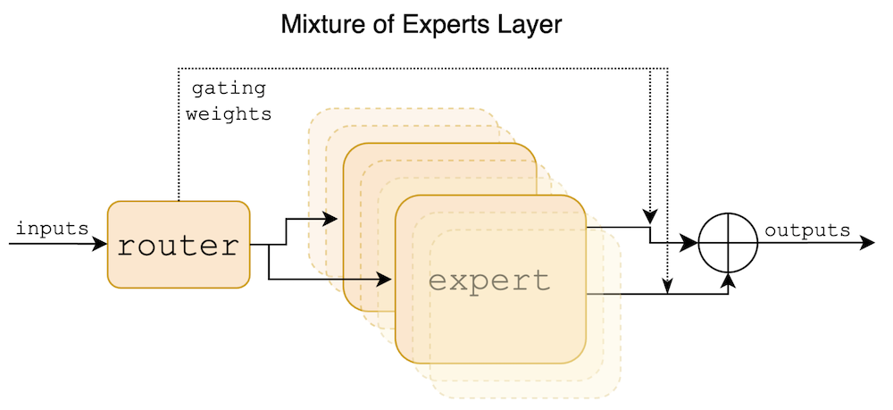
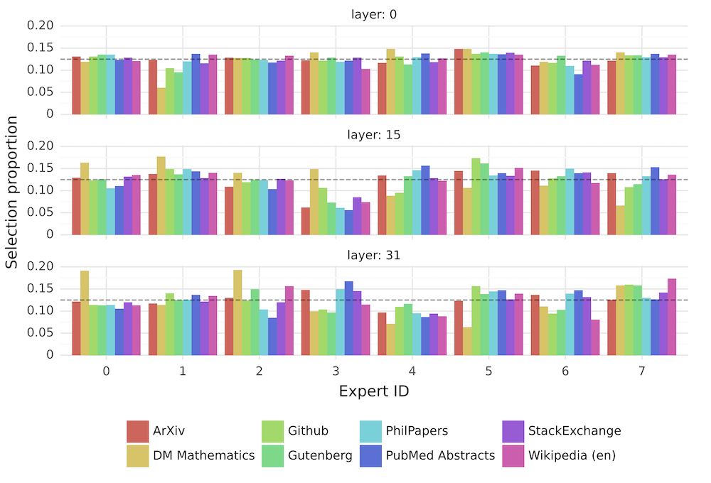
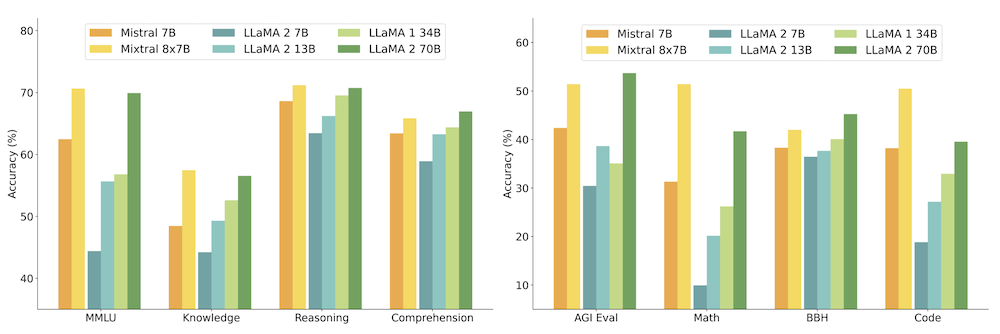

*These are my notes for paper [Mixtral of Experts](https://arxiv.org/abs/2401.04088) (8 Jan 2024) by Albert Q. Jiang, Alexandre Sablayrolles, Antoine Roux, Arthur Mensch, Blanche Savary, Chris Bamford, Devendra Singh Chaplot, Diego de las Casas, Emma Bou Hanna, Florian Bressand, Gianna Lengyel, Guillaume Bour, Guillaume Lample, Lélio Renard Lavaud, Lucile Saulnier, Marie-Anne Lachaux, Pierre Stock, Sandeep Subramanian, Sophia Yang, Szymon Antoniak, Teven Le Scao, Théophile Gervet, Thibaut Lavril, Thomas Wang, Timothée Lacroix, William El Sayed.*

---

This paper introduces [Mixtral 8x7B](../../permanent/mixtral-8x7B.md), a [Sparse Mixture of Experts Model](../../permanent/sparse-mixture-of-experts-model.md) (SMoE) language model.

The model uses an SMoE approach where each layer comprises eight "experts", and a router network selects two experts to process each token. Thanks to this, despite having 47B parameters, it only uses 13B active parameters during inference, which makes it more computationally efficient than other models (although it doesn't save any memory).

It outperforms Llama 2 70B and GPT-3.5 on many benchmarks, particularly in mathematics, code generation, and multilingual tasks.

They also present [Mixtral 8x7B – Instruct](../../permanent/mixtral-8x7B-instruct.md), a chat model fine-tuned to follow instructions, which outperforms other chat models like GPT-3.5 Turbo and Llama 2 70B – chat.

The base and instruct models are released under the Apache 2.0 license, making them freely available for academic and commercial use.

**Architecture**

Mixtral is based on a [Transformer](../../permanent/transformer.md) architecture. It uses the same modifications as Mistral 7b, except each layer comprises 8 Mixture-of-Expert layers, which replace typical feedforward blocks.

At each layer, a router selects two experts for every token to process the request.



*Figure 1: Mixture of Experts Layers. Each input vector is assigned to 2 of the 8 experts by a router. The layer's output is the weighted sum of the outputs of the two selected experts (using Softmax weights). In Mixtral, an expert is a standard feedforward block as in a vanilla transformer architecture*.

In code:

```python
def moe_layer(x, Wg):  # x: input token, Wg: gating network weights
  top2_logits = top_k(x @ Wg, k=2)  # Get top 2 expert activations
  gating_weights = softmax(top2_logits)  # Weights for each expert
  expert_outputs = [expert_i(x) for expert_i in experts]  # Run chosen experts
  return sum(gating_weights[i] * expert_outputs[i] for i in range(2))

y = moe_layer(x, Wg)
```

Mixtral supports a fully dense context length of 32k tokens.

Architecture details

| Parameter     | Value |
| ------------- | ----- |
| dim           | 4096  |
| n_layers      | 32    |
| head_dim      | 128   |
| hidden_dim    | 14336 |
| n_heads       | 32    |
| n_kv_heads    | 8     |
| context_len   | 32768 |
| vocab_size    | 32000 |
| num_experts   | 8     |
| top_k_experts | 2     |

**Routing Analysis**

Surprisingly, the experts don't specialise in particular domains or topics based on different datasets.



*Figure 7: Proportion of tokens assigned to each expert on different domains from The Pile dataset for layers 0, 15, and 31. The gray dashed vertical line marks 1/8, i.e. the proportion expected with uniform sampling..*

Also, the router exhibits temporal locality - it's more likely to assign the same experts to consecutive tokens - the router is recognising and leveraging the sequential nature of language.

## Evaluation

Mixtral outperforms or matches Llama 2 70B on a wide range of benchmarks, including commonsense reasoning, word knowledge, reading comprehension, math, and code generation.


Mixtral is particularly strong in mathematical and coding tasks, significantly surpassing Llama 2 70B.

**MMLU and MT Bench**: Mixtral performs similarly or better than GPT-3.5 on MMLU and MT Bench despite its smaller size. Although some differences in evaluation protocols between Mixtral and Llama 2 may affect direct comparisons.

**Multilingual Proficiency**: Mixtral significantly outperforms Llama 2 70B in French, German, Spanish, and Italian, demonstrating its strong multilingual capabilities.

**Long Context Handling**: Mixtral can effectively process long sequences, achieving 100% accuracy on the passkey retrieval task regardless of context length or passkey position.

**Bias Mitigation**: Compared to Llama 2, Mixtral exhibits less bias on the BBQ and BOLD benchmarks, indicating improved fairness and reduced bias in its responses.

**Positive Sentiment**: Mixtral consistently displays more positive sentiments than Llama 2, suggesting a more optimistic and encouraging tone in its generated text.
