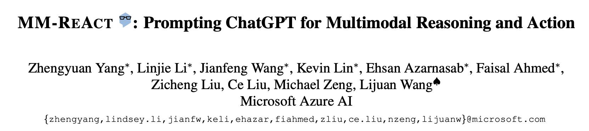
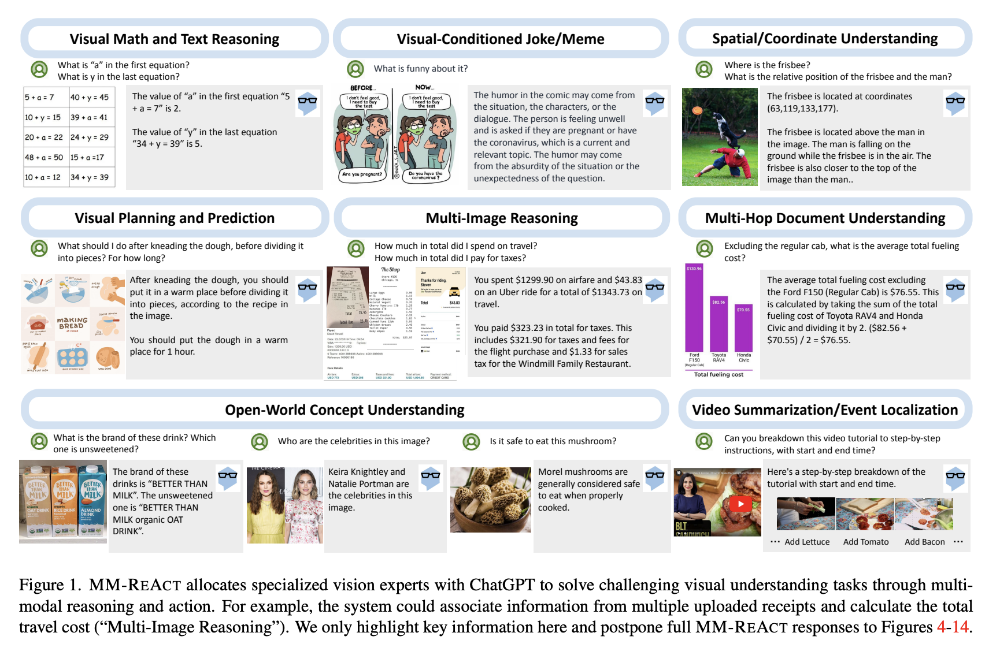
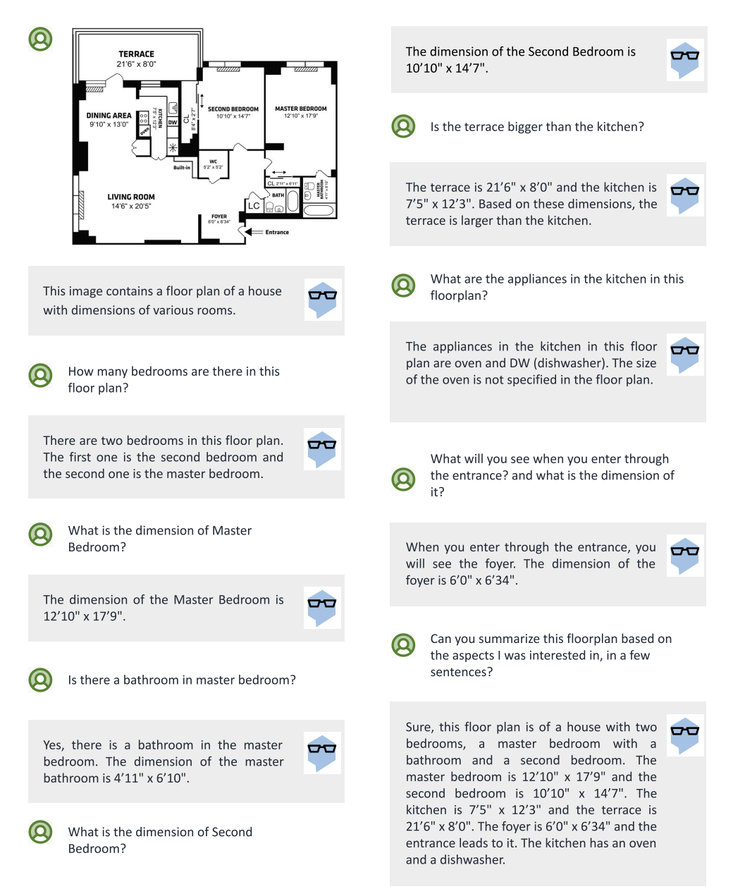
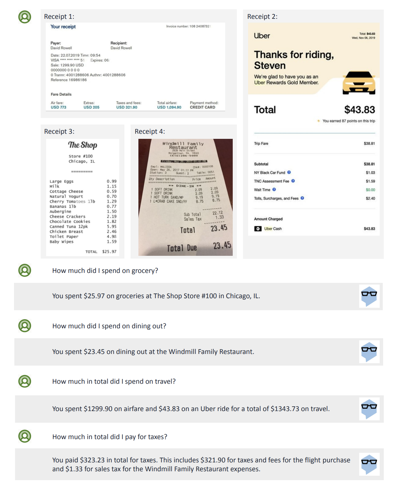
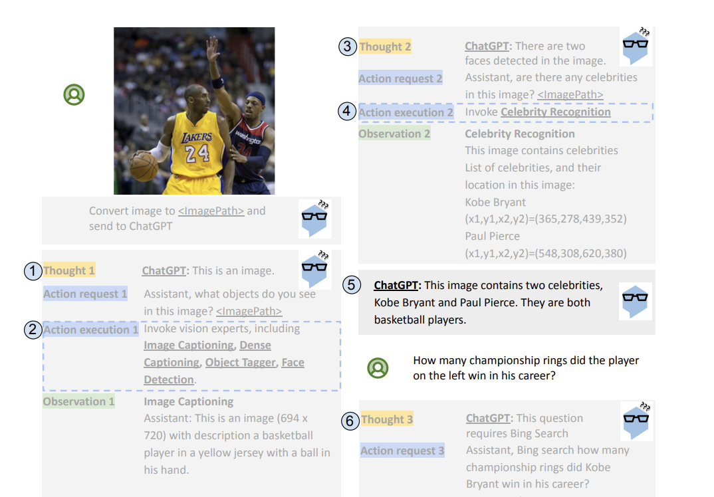
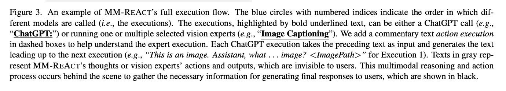

The paper, first released in March 2023, proposes **MM-REACT**, a system that integrates ChatGPT with a collection of computer vision models to solve complicated visual understanding tasks.

Unlike existing vision-language models, which require joint fine-tuning, MM-REACT uses ChatGPT's reasoning abilities to select and invoke specific computer vision models, making it a flexible, training-free approach. As the name suggests, it builds on the [ReAct: Synergizing Reasoning and Acting in Language Models](../../permanent/react-synergizing-reasoning-and-acting-in-language-models.md) pattern of interleaving reasoning with actions.

The paper highlights the capabilities of MM-REACT in various scenarios, such as visual maths and text reasoning, multi-image understanding and video summarisation, demonstrating its potential to address complex visual intelligence problems.

