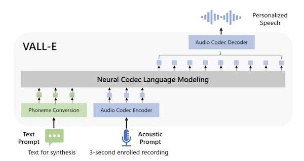
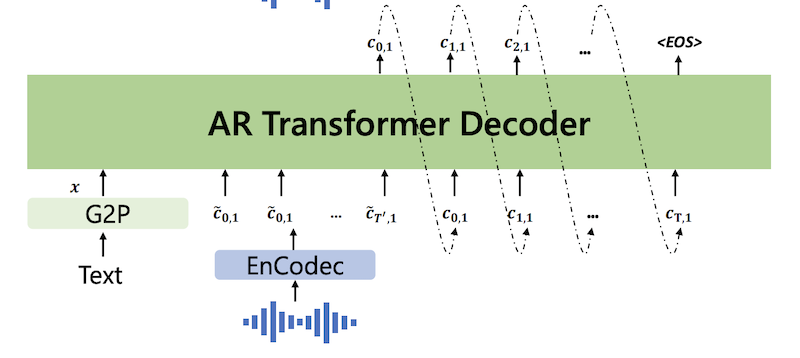
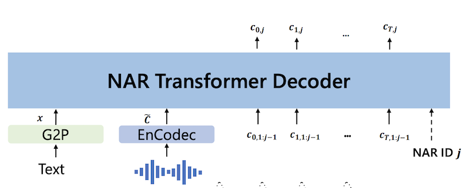
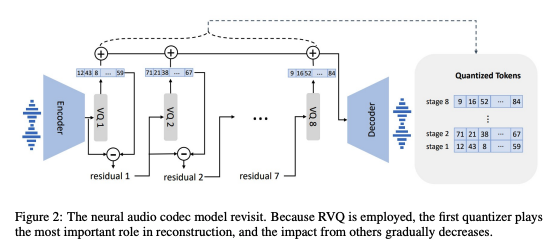
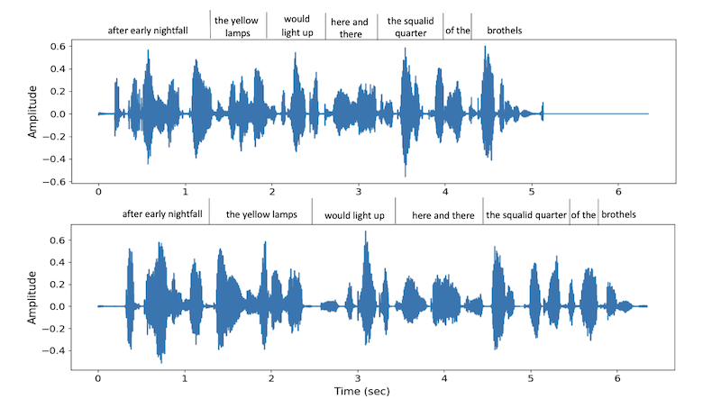

*These are my notes from the paper [Neural Codec Language Models are Zero-Shot Text to Speech Synthesizers](https://arxiv.org/abs/2301.02111) by Chengyi Wang, Sanyuan Chen, Yu Wu, Ziqiang Zhang, Long Zhou, Shujie Liu, Zhuo Chen, Yanqing Liu, Huaming Wang, Jinyu Li, Lei He, Sheng Zhao, Furu Wei*

---

## Overview

This paper describes a state-of-the-art (Jan 2023) text-to-speech (TTS) language model called [VALL-E](../../permanent/vall-e.md).

VALL-E can generate speech in anyone's voice with only a 3-second sample of the speaker and some text - this capability is known as zero-shot TTS. It is the speech equivalent of GPT's *in-context learning* capability.

*Fig 1. from Neural Codec Language Models are Zero-Shot Text-to-Speech Synthesizers*

## Key Details

**Use RVQ tokens as an intermediate representation of speech**

VALL-E uses an intermediate representation of speech instead of modelling audio directly, which makes it a *cascading TTS system*. The key insight in this paper, as was the theme of many audio papers in 2023, is utilising a [RVQ](../public/notes/permanent/residual-vector-quantisation.md) audio codec, which compresses audio into discrete *"acoustic"* tokens (they use the [Encodec](https://github.com/facebookresearch/encodec) RVQ implementation).

**TTS as a language model problem**

Thanks to the discrete representation, they can take advantage of a [Language Model](../../permanent/language-model.md) - a first for a TTS problem.

These first two details are where the paper gets its name: Neural Codec Language Models are Zero-Shot Text-to-Speech Synthesizes.

By treating TTS as a language model problem, they can take advantage of large, noisy datasets, which is a step toward reliable zero-shot TTS.

**Train on 60k hours of unannotated speech from the Libri-Light dataset**

The [Libri-Light](https://github.com/facebookresearch/libri-light) dataset has over 60k hours of unannotated speech, hundreds of times more than existing TTS papers. Since most of Libri-Light is unannotated, they train a speech recognition model to generate textual annotations (HDNN-HMM) for the raw speech.

**Model tokens hierarchically**

The authors note that the quantising approach in RVQ has a hierarchical structure: tokens from the first quantiser can recover acoustic properties like speaker identification, whereas the later quantiser learns fine acoustic details.

They exploit this insight by splitting the language model into two parts:

1\. An *autoregressive* Transformer that is used to predict codes for the first codebook.

*Partial of Figure 3 from Neural Codec Language Models are Zero-Shot Text to Speech Synthesisers*

2\. A *non-autoregressive* Transformer that predicts the subsequent codes from the first code.

*Partial of Figure 3 from Neural Codec Language Models are Zero-Shot Text to Speech Synthesisers*

Proposing VALL-E as a [Hierarchical Model](../../permanent/hierarchical-model.md) provides a good trade-off between flexibility with the length of returned speech and inference performance, as the NAR can operate at $O(1)$ instead of $O(T)$ where $T$ is the sequence length of the tokenised audio.

## Comparison to Previous Work

In the past, a [Mel Spectrogram](../../permanent/mel-spectrogram.md) has been commonly used as the intermediary representation for TTS, relying on a Vocoder (like [HiFi-GAN](https://arxiv.org/abs/2010.05646)) to the decoder. There have also been some successful end-to-end TTS approaches. However, all these problems are typically formulated as continuous signal regression problems, which so far have needed high-quality, clean audio to train on - not data scraped from the internet. Without the larger datasets, reliable zero-shot TTS on unseen speakers is very difficult. The capacity for *in-context* learning enjoyed by GPT is a powerful capability and is now available for speech synthesis.

Table 1 summarises the difference between VALL-E and previous TTS systems.

<table class="table-border">
    <tr>
        <th></th>
        <th>Current Systems</th>
        <th>VALL-E</th>
    </tr>
    <tr>
        <td><strong>Intermediate representation</strong></td>
        <td>Mel Spectrogram</td>
        <td>Audio Codec Code</td>
    </tr>
    <tr>
        <td><strong>Objective function</strong></td>
        <td>Continuous Signal Regression</td>
        <td>Language Model</td>
    </tr>
    <tr>
        <td><strong>Training Data</strong></td>
        <td>&le; 600 hours</td>
        <td>60k hours</td>
    </tr>
    <tr>
        <td><strong>In-Context Learning</strong></td>
        <td>&#10008;</td> <!-- Represents a cross mark -->
        <td>&#10004;</td> <!-- Represents a check mark -->
    </tr>
</table>

*Table 1 from Neural Codec Language Models are Zero-Shot Text to Speech Synthesisers*

## Architecture

### AR / NAR Models

Both the AR model and the NAR model have the same [Transformer](../../permanent/transformer.md) architecture, which contains:

* 12 layers
* 16 attention heads
* an embedding dimension of 1024
* a feed-forward layer dimension of 4096
* dropout of 0.1.

Both the AR and NAR models received the phoneme sequence as a prompt.

### Encodec

They use eight codebooks, each with 1024 code dimensionality. The encoder produces an embedding sequence at 75 Hz for input waveforms at 24 kHz. So, For a 10-second audio waveform, the discrete representation would be $750 \times 8$ ( $750 = \frac{24000 \times 10}{320}$ ).

*Figure 2 from Neural Codec Language Models are Zero-Shot Text to Speech Synthesizers*

### Attention

The AR model can attend to all previous tokens in the sequence, whereas the NAR model can attend to all previously predicted tokens.

### Embeddings and decoding

They use a sinuous position embedding for the prompt and input tokens and share the output projection layer parameters with acoustic embedding parameters.

### Decoding

For the AR model, they found beam-search could lead the model to an infinite loop, so they used sampling-based decoding conditioned on the prompts. For the NAR model, they use greedy decoding to choose the token with the highest
probability.

## Training Settings

<table class="table-border">
  <tr>
    <td><strong>GPU</strong></td>
    <td>16 NVIDIA TESLA V100 32GB GPUs</td>
  </tr>
  <tr>
    <td><strong>Batch size</strong></td>
    <td>6k acoustic tokens per GPU</td>
  </tr>
  <tr>
    <td><strong>Steps</strong></td>
    <td>800k</td>
  </tr>
  <tr>
    <td><strong>Optimiser</strong></td>
    <td>AdamW Optimizer</td>
  </tr>
  <tr>
    <td><strong>Learning rate</strong></td>
    <td>Warm up for the first 32k, peak at 5 x 10-4, then linear decay</td>
  </tr>
<tr>
    <td><strong>Data preprocessing</strong></td>
    <td>Randomly crop the waveform to a random length between 10 secs and 20 secs.</td>
</tr>
</table>

## Evaluation

### Baseline Models

#### TTS

[YourTTS](https://github.com/Edresson/YourTTS),

SOTA zero-shot TTS model trained on VCTK, LibriTTS, TS-Portuguese.

#### Speaker to Speaker

[GSLM](https://arxiv.org/abs/2102.01192)

GSLM HuBERT codes as input and reconstructs the waveform with the Tacotron2 model and the WaveGlow vocoder. HuBERT codes discard speaker identity, so it tends to achieve a poor speaker score.

[AudioLM](https://arxiv.org/abs/2209.03143)

An audio-to-audio model that also uses RVQ codes. They use the word error score reported in their paper, which a Conformer Transducer model obtained.

### Datasets

[LibriSpeech](https://www.openslr.org/12)

Since there's no overlap between LibriLight and LibriSpeech, they can use it for Zero-Shot TTS evaluation.

They use the samples from LibriSpeech test-clean with lengths between 4 and 10 seconds, resulting in a 2.2-hour subset.

For each sample synthesis, they randomly chose another utterance of the same speaker and cropped a 3-second speech segment as the enrolled speech, giving them 40 test cases. Each experiment runs three times, and the average score is reported.

[VCTK](https://paperswithcode.com/dataset/vctk)

VCTK consists of 108 speakers, none in the training set. VCTK is more challenging than LibriSpeech as it contains speakers with various accents.

YourTTS has seen 97 speakers in VCTK as training. So, they evaluate YourTTS performance on the full 107 speakers and 11 unseen speakers, respectively.

For each speaker, they randomly selected three utterances of 3s/5s/10s as the prompts and the text of another utterance as the text prompt.

### Metrics

#### Automated

**Speaker Similarity**

They use a SOTA speaker verification model, WaLM-TDNN, to check the speaker similarity between audio prompt and synthesised speech.

**Word Error Rate**

They run speech recognition on the generated audio and calculate the [Word Error Rate (WER)](../../permanent/word-error-rate.md) concerning the original transcriptions (using the HuBERT-Large model fine-tuned on LibriSpeech 960h as the ASR model)

#### Human evaluation

**CMOS** is an indicator of speech naturalness.

**SMOS** measures where speech is similar to the original speaker's voice.

They also use crowd-sourcing to calculate the comparative mean option score (CMOS) and similarity mean option score (SMOS) by inviting 12 and 6 native speakers as CMOS and SMOS contributors.

The scale of SMOS is from 1 to 5 with 0.5-point increments.

CMOS ranges from -3 to 3 with intervals of 1.

### Results

Table 2 shows the objective evaluation results on the automatic metrics. VALL-E does much better than YourTTS at speaker similarity and robustness. For GSLM, since the HuBERT codes discard the speaker identity, it achieves a poor speaker score. There is no open-source implementation of AudioLM, so they use the results from the paper.

**Automatic Metric results (Table 2)**

<table class="table-border">
  <tr>
    <th>Model</th>
    <th>Word Error Rate</th>
    <th>Speaker Identity</th>
  </tr>
  <tr>
    <td>GroundTruth</td>
    <td>2.2</td>
    <td>0.754</td>
  </tr>
  <tr>
    <td>GSLM</td>
    <td>12.4</td>
    <td>0.126</td>
  </tr>
  <tr>
    <td>AudioLM (model is not open source)</td>
    <td>6</td>
    <td></td>
  </tr>
  <tr>
    <td>YourTTS</td>
    <td>7.7</td>
    <td>0.337</td>
  </tr>
  <tr>
    <td>VALL-E</td>
    <td>5.9</td>
    <td>0.580</td>
  </tr>
  <tr>
    <td>VALL-E continual</td>
    <td>3.8</td>
    <td>0.508</td>
  </tr>
</table>

---

VALL-E is very close to ground truth regarding SMOS, indicating the synthesised speech is similar to the given unseen
speaker in testing. It significantly outperforms the baseline with +0.93 SMOS, demonstrating the effectiveness of VALL-E in zero-shot scenarios. Regarding naturalness, VALL-E beats the baseline with +0.12 CMOS, indicating the proposed method could synthesise more natural and realistic speech against baselines.

**Human evaluations (Table 3)**

<table class="table-border">
  <tr>
    <th>Model</th>
    <th>SMOS</th>
    <th>CMOS (vs VALL-E)</th>
  </tr>
  <tr>
    <td>YourTTS</td>
    <td>3.45</td>
    <td>-0.12</td>
  </tr>
  <tr>
    <td>VALL-E</td>
    <td>4.38</td>
    <td>0.0</td>
  </tr>
  <tr>
    <td>GroundTruth</td>
    <td>4.5</td>
    <td>+0.17</td>
  </tr>
</table>

---

Table 6 shows the results for the VCTK dataset. VALL-E outperforms the baseline even though it has seen 97 speakers in training. The performance gap becomes larger compared to the baseline in a fair setting (11 speakers).

**Table 6: Automatic evaluation of speaker similarity with 108 speakers on VCTK. **

*97 speakers in VCTK as training*

<table class="table-border">
  <tr>
    <th></th>
    <th>3s prompt</th>
    <th>5s prompt</th>
    <th>10s prompt</th>
  </tr>
  <tr>
    <td>YourTTS</td>
    <td>0.357</td>
    <td>0.337</td>
    <td>0.394</td>
  </tr>
  <tr>
    <td>VALL-E</td>
    <td>0.382</td>
    <td>0.423</td>
    <td>0.484</td>
  </tr>
  <tr>
    <td>GroundTruth</td>
    <td>0.546</td>
    <td>0.591</td>
    <td>0.620</td>
  </tr>
</table>

*11 unseen speakers*

<table class="table-border">
  <tr>
    <th></th>
    <th>3s prompt</th>
    <th>5s prompt</th>
    <th>10s prompt</th>
  </tr>
  <tr>
    <td>YourTTS</td>
    <td>0.331</td>
    <td>0.337</td>
    <td>0.334</td>
  </tr>
  <tr>
    <td>VALL-E</td>
    <td>0.389</td>
    <td>0.380</td>
    <td>0.414</td>
  </tr>
  <tr>
    <td>GroundTruth</td>
    <td>0.528</td>
    <td>0.556</td>
    <td>0.586</td>
  </tr>
</table>

---

Table 7 shows a comparison of their method against baseline and ground truth. VALL-E has better speaker similarity than the baseline, even if the baseline has seen some speakers in training. The side-by-side CMOS evaluation shows that VALL-E is +0.23 over YourTTS, indicating a significantly better performance speaking of naturalness. VALL-E also achieves +0.04 CMOS over ground truth, demonstrating no statistically significant difference from human recordings.

**Table 7: Human evaluation with 60 speakers on VCTK with a 3-second enrolled recording for each.**

<table class="table-border">
  <tr>
    <th></th>
    <th>SMOS</th>
    <th>CMOS (v.s. VALL-E)</th>
  </tr>
  <tr>
    <td>YourTTS</td>
    <td>3.70 (+0.09)</td>
    <td>0.23</td>
  </tr>
  <tr>
    <td>VALL-E</td>
    <td>3.81 (+0.09)</td>
    <td>0.00</td>
  </tr>
  <tr>
    <td>GroundTruth</td>
    <td>4.29 (+0.09)</td>
    <td>-0.04</td>
  </tr>
</table>

### Ablation

**NAR Ablation**

They train three NAR models with different numbers of prompts:

* **NAR-no prompt** - trained without any prompts.
* **NAR-phn prompt** - trained with only phoneme sequence as prompt
* **NAR-2 prompts** - uses phoneme prompt and acoustic token prompt as conditions

They use ground-truth first-level acoustic tokens as the model input and compute the WER and speaker similarity scores.

Results:
The model, without any prompts, performs poorly on both ASR and speaker similarity evaluations, even though the acoustic input token is ground truth.
When adding the phoneme prompt, the WER is reduced by a large margin from 19.6 to 3.0.
It shows the phoneme prompt mainly contributes to the content of the generation.

In the NAR-2 prompts, the model can learn speaker information from the acoustic token prompt and thus improve the speaker evaluation quality.

**Ablation study of the NAR model. The inputs of the NAR models are the ground truth for the ablation study. (Table 4)**

<table class="table-border">
  <tr>
    <th></th>
    <th>NAR-no prompt</th>
    <th>NAR-phn prompt</th>
    <th>NAR-2 prompts</th>
  </tr>
  <tr>
    <td>WER</td>
    <td>19.6</td>
    <td>3.0</td>
    <td>2.8</td>
  </tr>
  <tr>
    <td>SPK</td>
    <td>0.518</td>
    <td>0.541</td>
    <td>0.732</td>
  </tr>
</table>

**AR Ablation**

They always use the NAR-2 prompts setting in these experiments as the NAR model.

They try removing the acoustic prompt (**w/o acoustic prompt**). After that, it can only obtain a speaker similarity score of 0.236, showing the prompt is extremely crucial for speaker identity. Even if the NAR model could see the prompt, the prompt for the AR model also contributes a lot to speaker similarity.

**Ablation study of the AR model (Table 5)**

<table class="table-border">
  <tr>
    <th></th>
    <th>WER</th>
    <th>SPK</th>
  </tr>
  <tr>
    <td>VALL-E</td>
    <td>5.9</td>
    <td>0.585</td>
  </tr>
  <tr>
    <td>w/o acoustic prompt</td>
    <td>5.9</td>
    <td>0.236</td>
  </tr>
</table>

## Qualitative Analysis

**Diversity**

Previous TTS systems had a strong one-to-one mapping between input text and output waveform because mel spectrogram generation was based on reconstruction for each step without randomness. On the other hand, VALL-E uses the sampling-based method to generate discrete tokens so that the output can be diverse for the same input text.

Given a sentence and an enrolled recording, they run the inference process twice and visualise its waveform.

They observed the two samples having different lengths and phrase durations, where the first has a faster speech rate.

They observe that the accents of the two samples are different. The second output emphasises the word "must" with a larger amplitude, whereas the first does not.

The diversity may be useful for downstream scenarios, particularly generating pseudo-data for speech recognition.

*Partial Figure 4. from Neural Codec Language Models are Zero-Shot Text to Speech Synthesisers*

**Acoustic environment maintenance**

They find acoustic environment consistency between the acoustic prompt and the generation. VALL-E could also synthesise speech with reverberation when the acoustic prompt reverberates, whereas the baseline outputs clean speech.

They explain that VALL-E is trained on a large-scale dataset consisting of more acoustic conditions than the data used by the baseline.

VALL-E could learn acoustic consistency instead of a clean environment only during training.

**Speaker's emotion maintenance**

Emotional TTS is a classic subtopic of speech synthesis, synthesising speech with a required emotion.

Traditional methods always train a model on a supervised emotional TTS dataset, where the speech corresponds to a transcription and an emotion label.

They find that VALL-E can preserve the emotion in the prompt at a zero-shot setting.

They select acoustic prompts from EmoV-DB, a dataset containing speech with five emotions; VALL-E can keep the same emotion of the prompt in speech synthesis, even if the model is not fine-tuned on an emotional TTS dataset.

## Future Work

The authors note four future directions for this research.

**1\. Improve synthesis robustness**

The pronunciation isn't always clear, and occasional words are duplicated. They think it's mainly due to the phoneme-to-acoustic being an autoregression model, where disordered attention alignments exist with no constraints. They could modify the attention mechanism or apply more non-autoregression models to solve.

**2\. Data coverage**

Due to dataset limitations, VALL-E does not work for everyone's voice, especially those with accents. More data scale-up is likely the answer to improve this.

**3\. Model structure**

One possible direction is to predict codes with a large universal model. Using NAR models to speed up inference is another.

**4\. Risk mitigation**

Since a zero-shot TTS model like this carries a large potential for misuse, they want to consider building a model to detect where AI-synthesised audio.
