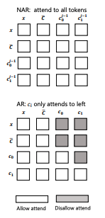
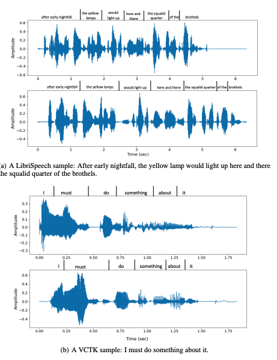

*These are my notes from the paper [Neural Codec Language Models are Zero-Shot Text to Speech Synthesizers](https://arxiv.org/abs/2301.02111) by Chengyi Wang, Sanyuan Chen, Yu Wu, Ziqiang Zhang, Long Zhou, Shujie Liu, Zhuo Chen, Yanqing Liu, Huaming Wang, Jinyu Li, Lei He, Sheng Zhao, Furu Wei*

---

## Overview

This paper describes a state-of-the-art (Jan 2023) text2speech (TTS) language model called [VALL-E](../../permanent/vall-e.md).

VALL-E can generate speech in anyone's voice with only a 3-second sample of the speaker and some text - this capability is known as zero-shot TTS. It is the speech equivalent of GPT's *in-context learning* capability.

*Fig 1. from Neural Codec Language Models are Zero-Shot Text-to-Speech Synthesizers*

## Key Details

**Use RVQ tokens as an intermediate representation of speech**

VALL-E uses an intermediate representation of speech instead of modelling audio directly, which makes it a *cascading TTS system*. The key insight in this paper, as was the theme of many audio papers in 2023, is utilising a [RVQ](../public/notes/permanent/residual-vector-quantisation.md) audio codec, which compresses audio into discrete *"acoustic"* tokens (they use the [Encodec](../../permanent/encodec.md) RVQ implementation).

**TTS as a language model problem**

Thanks to the discrete representation, they can take advantage of language models, which is a first for a text2speech problem.

These first two details are where the paper gets its name: Neural Codec Language Models are Zero-Shot Text-to-Speech Synthesizes.

By treating TTS as a language model, they can take advantage of large, noisy datasets, which is the key to reliable zero-shot TTS.

**Train on 60k hours of unannotated speech from the Libri-Light dataset**

[Libri-Light](https://github.com/facebookresearch/libri-light) dataset has over 60k hours of unannotated speech, hundreds of times more than existing TTS papers. Since most of Libri-Light is unannotated, they train a speech recognition model to generate textual annotations (HDNN-HMM) for the raw speech.

**Model tokens hierarchically**

The tokens returned from RVQ have a hierarchical structure: tokens from the first quantiser can recover acoustic properties like speaker ID, whereas the later quantiser learns fine acoustic details. Therefore, they split the language model into two parts:

1\. An [Autoregressive](Autoregressive) Transformer that is used to predict codes for the first codebook.

*Partial of Figure 3 from Neural Codec Language Models are Zero-Shot Text to Speech Synthesisers*

2\. An [Non-Autoregressive](Non-Autoregressive) Transformer that predicts the subsequent codes from the first code.

*Partial of Figure 3 from Neural Codec Language Models are Zero-Shot Text to Speech Synthesisers*

This configuration is a good trade-off between flexibility with the length of returned speech and inference performance, as the NAR can operate at $O(1)$ instead of $O(T)$ where $T$ is the sequence length of the tokenised audio.

## Comparison to Previous Work

In the past, a [Mel Spectrogram](../../permanent/mel-spectrogram.md) has been commonly used as the intermediary representation, which relies on a Vocoder (like [HiFi-GAN](../../permanent/hifigan.md)) to the decoder. This problem is typically formulated as continuous signal regression. There have also been some successful end-to-end approaches. However, all these architectures typically need high-quality, clean audio to train on. And they don't tend to benefit from training on data scraped from the internet. Without the larger datasets, reliable zero-shot TTS on unseen speakers is very difficult.

Past TTS papers have typically trained on much smaller datasets with hundreds of hours of single speakers. VALL-E's dataset is noisy and has more inaccurate transcriptions but more diverse speakers and prosodies.

The capacity for in-context learning enjoyed by GPT is now available for speech synthesis.

Table 1 summarises the difference between VALL-E and previous TTS systems.

|                             | Current Systems              | VALL-E           |
| --------------------------- | ---------------------------- | ---------------- |
| Intermediate representation | Mel Spectrogram              | Audio Codec Code |
| Objective functioni         | Continuous Signal Regression | Language Model   |
| Training Data               | <= 600 hours                 | 60k hours        |
| In-Context Learning                            | ☒                             | ☑                  |

*Table 1 from Neural Codec Language Models are Zero-Shot Text to Speech Synthesisers*

## Architecture

### AR / NAR Models

Both the AR model and the NAR model have the same [Transformer](../../permanent/transformer.md) architecture, which contains:

* 12 layers
* 16 attention heads
* an embedding dimension of 1024
* a feed-forward layer dimension of 4096
* dropout of 0.1.

Both the AR and NAR models received the phoneme sequence as a prompt. 

### Encodec

They use eight codebooks, each with 1024 code dimensionality. The encoder produces an embedding sequence at 75 Hz for input waveforms at 24 kHz. So, For a 10-second audio waveform, the discrete representation would be $750 \times 8$ ( $750 = \frac{24000 \times 10}{320}$ ).

*Figure 2 from Neural Codec Language Models are Zero-Shot Text to Speech Synthesizers*

### Attention

The AR model can attend to all previous tokens in the sequence, whereas the NAR model can attend to all previously predicted tokens.

### Embeddings and decoding

They use a sinuous position embedding for the prompt and input tokens and share the output projection layer parameters with acoustic embedding parameters.

### Decoding

For the AR model, we use sampling-based decoding conditioned on the prompts since they find that beam search can lead the language model into an infinite loop. For the NAR model, they use greedy decoding to choose the token with the highest
probability.

### Data Processing

The average length of the waveform in LibriLight is 60 seconds. During
training, they randomly crop the waveform to a random length between 10 seconds and 20 seconds. The corresponding phoneme alignments are used as the phoneme prompt. They remove the consecutive
repetitions in the force-aligned phoneme sequence. For the NAR acoustic prompt tokens, they select a random segment waveform of 3 seconds from the same utterance.

## Training Settings

|  |  |
| ---- | ---- |
| **GPU** | 16 NVIDIA TESLA V100 32GB GPUs |
| **Batch size** | 6k acoustic tokens per GPU |
| **Steps** | 800k |
| **Optimiser** | AdamW Optimizer |
| **Learning rate** | Warm up for the first 32k , peak at 5 x 10-4, then linear decay |
|  |  |
|  |  |

## Evaluation

### Datasets

#### LibriSpeech

Since there's no overlap between LibriLight and LibriSpeech, they use LibrisSpeech for Zero-Shot TTS evaluation.

They use the samples from LibriSpeech test-clean with lengths between 4 and 10 seconds, resulting in a 2.2-hour subset. 

For each sample synthesis, they randomly chose another utterance of the same speaker and cropped a 3-second speech segment as the enrolled speech. Each experiment runs three times, and the average score is reported.

### Base line

### TTS

[YourTTS](https://github.com/Edresson/YourTTS), 

SOTA zero-shot TTS model trained on VCTK, LibriTTS, TS-Porugeuse.

VALL-E is significantly better in robustness and speaker similarity, showing that our generated speech is close to the given text and the enrolled speech. Furthermore, the word error rate can be further reduced in the VALL-E-continual setting because the acoustic tokens for the first 3 seconds are extracted from the ground truth.

### Speaker to Speaker

#### GSLM and AudioLM

GSLM uses HuBERT code as input and reconstructs the waveform with the Tacotron2 model and the WaveGlow vocoder. HuBERT codes discard speaker identity, so they achieve a poor speaker score.

For AudioLM, they use the word error score reported in their paper, which was obtained by a Conformer Transducer model. 

VALL-E is better than other speech-to-speech LM-based generative systems in terms of robustness. One major reason is VALL-E trained with pseudo-phoneme instead of HuBERT/w2v-BERT codes,
which enjoys better alignment quality with the input text.

VALL-E-continual uses the first 3 seconds of the ground-truth speech as enrolled speech.

### Metrics

#### Speaker Similar

They use a SOTA speaker verification model, WaLM-TDNN, to check the speaker similarity between audio prompt and synthesised speech.

#### Word Error rate

They run speech recognition on the generated audio and calculate the word error rate (WER) concerning the original transcriptions (using the HuBERT-Large model fine-tuned on LibriSpeech 960h as the ASR model)

---

Table 2 shows the objective evaluation results.

They first compute the WER score and the speaker similarity score of the ground truth speech as the upper bound. They used speech pairs from the same speaker in the test set to compare their similarity. 

**Table 2. Automatic Metric results** 

| model                              | Word Error Rate | Speaker Identity |
| ---------------------------------- | ---------------- | ---------------- |
| GroundTruth                        | 2.2              | 0.754            |
| GSLM                               | 12.4             | 0.126            |
| AudioLM (model is not open source) | 6                |                  |
| YourTTS                            | 7.7              | 0.337            |
| VALL-E                             | 5.9              | 0.580            |
| VALL-E continual                                   | 3.8                 | 0.508                 |

### Human evaluation

They also use crowd-sourcing to calculate the comparative mean option score (CMOS) and similarity mean option score (SMOS), as follows:

- invite 12 and 6 native speakers as CMOS and SMOS contributors.
The scale of SMOS is from 1 to 5 with 0.5-point increments.
- CMOS ranges from -3 to 3 with intervals of 1.

CMOS is an indicator of speech naturalness. SMOS measures where speech is similar to the original speaker's voice.

**Table 3. Human evaluations**

| model                              | SMOS | CMOS (vs VALL-E |
| ---------------------------------- | ---------------- | ---------------- |
| YourTTS                            | 3.45              | -0.12            |
| VALL-E                             | 4.38              | 0.0            |
| GroundTruth                        | 4.5              | +0.17            |

### Ablation

#### NAR Ablation

They train three NAR models with different numbers of prompts:

- **NAR-no prompt**  - trained without any prompts.
- **NAR-phn prompt** - trained with only phoneme sequence as prompt
- **NAR-2 prompts** - uses phoneme prompt and acoustic token prompt as conditions

They use ground-truth first-level acoustic tokens as the model input and compute the WER and speaker similarity scores.

The results are listed in Table 4.

The model, without any prompts, performs poorly on both ASR and speaker similarity evaluations, even though the acoustic input token is ground truth.

When adding the phoneme prompt, the WER is reduced by a large margin from 19.6 to 3.0. It shows the phoneme prompt mainly contributes to the content of the generation.

In the NAR-2 prompts, the model can learn speaker information from the acoustic token prompt and thus improve the speaker evaluation quality.

Table 4: Ablation study of the NAR model. The inputs of the NAR models are the ground truth for the ablation study.

|     | NAR-no prompt | NAR-phn prompt | NAR-2 prompts |
| --- | ------------- | -------------- | ------------- |
| WER | 19.6          | 3.0            | 2.8           |
| SPK | 0.518         | 0.541          | 0.732         |

#### AR Ablation

They always use the NAR-2 prompts setting in these experiments as the NAR model.

They try removing the acoustic prompt (**w/o acoustic prompt**). After that, it can only obtain a speaker similarity score of 0.236, showing the prompt is extremely crucial for speaker identity. Even if the NAR model could see the prompt, the prompt for the AR model also contributes a lot to speaker similarity.

|                     | WER | SPK   |
| ------------------- | --- | ----- |
| VALL-E              | 5.9 | 0.585 |
| w/o acoustic prompt | 5.9 | 0.236      |

### VCTK Evaluation

They evaluated our model on VCTK consisting of 108 speakers, where none of the speakers were observed during training.

YourTTS has seen 97 speakers in VCTK as training. They evaluated YourTTS' performance on the full 107 speakers and 11 unseen speakers, respectively.

For each speaker, they randomly selected three utterances of 3s/5s/10s as the prompts and the text of another utterance as the text prompt.

97 speakers in VCTK as training

|             | 3s prompt | 5s prompt | 10s prompt |
| ----------- | --------- | --------- | ---------- |
| YourTTS     | 0.357     | 0.337     | 0.394      |
| VALL-E      | 0.382     | 0.423     | 0.484      |
| GroundTruth | 0.546     | 0.591     | 0.620      |

11 unseen speakers

|             | 3s prompt | 5s prompt | 10s prompt |
| ----------- | --------- | --------- | ---------- |
| YourTTS     | 0.331     | 0.337     | 0.334      |
| VALL-E      | 0.389     | 0.380     | 0.414      |
| GroundTruth | 0.528     | 0.556     | 0.586      |

**Table 6: Automatic evaluation of speaker similarity with 108 speakers on VCTK. **

The first evaluate two models with the speaker verification metric, as described before

They see that VALL-E outperforms the baseline even if the baseline has seen 97 speakers in training, indicating our model can synthesise speech with higher speaker similarity. When we compare it with the baseline in a fair setting (11 speakers), the performance gap becomes larger, especially when only three prompts are available.

By comparing different lengths of the prompt, the model can generate more similar speech when the prompt becomes longer, which is consistent with our intuition.

We sample 60 speakers for human evaluation, one utterance for each, where 11 are unseen speakers, and 49 speakers have been seen for YourTTS.

VALL-E do not see any of the 60 speakers.

During model synthesis, each speaker has a 3-second enrolled recording.

Table 7 shows a comparison of our method against baseline and ground truth. The comparison of SMOS shows that VALL-E has better speaker similarity than the baseline, even if the baseline has seen some of the speakers in training. The side-by-side CMOS evaluation shows that VALL-E is +0.23 over YourTTS, indicating a significantly better performance speaking of naturalness. Furthermore, VALL-E achieves +0.04 CMOS over ground truth, demonstrating no statistically significant difference from human recordings on this dataset. Compared to the evaluation results on LibriSpeech, VALL-E shows a better CMOS 10

Table 7: Human evaluation with 60 speakers on VCTK with a 3-second enrolled recording for each.

|             | SMOS         | CMOS (v.s. VALL-E) |
| ----------- | ------------ | ------------------ |
| YourTTS     | 3.70 (+0.09) | 0.23               |
| VALL-E      | 3.81 (+0.09) | 0.00               |
| GroundTruth | 4.29 (+0.09) | -0.04                   |

VCTK is more challenging as it contains speakers with various accents, while the training data and LibriSpeech test data do not include multiple accent speakers.

## Qualitative Analysis

**Diversity**

Previous TTS systems have a strong one-to-one mapping between input text and output waveform because mel spectrum generation is based on reconstruction for each step without randomness.

Since VALL-E uses the sampling-based method to generate discrete tokens, its output is diverse for the same input text due to the randomness in inference.

Given a sentence and an enrolled recording, they run the inference process twice and visualise its waveform in Figure 4.

They observed the two samples having different lengths and phrase durations, where the first has a faster speech rate.

In Figure 4(b), they observe that the accents of the two samples are different. The second output emphasises the word "must" with a larger amplitude, whereas the first does not.

The diversity is important for some downstream scenarios; for example, speech recognition benefits from diverse inputs with different speakers and acoustic environments, which the previous TTS system could not meet.

Considering the diversity feature of VALL-E, it is an ideal candidate to generate pseudo-data for speech recognition.

Acoustic environment maintenance: Another interesting finding is the acoustic environment consistency between the acoustic prompt and the generation. VALL-E could also synthesise speech with reverberation when the acoustic prompt reverberates, whereas the baseline outputs clean speech. They explain that VALL-E is trained on a large-scale dataset consisting of more acoustic conditions than the data used by the baseline. VALL-E could learn acoustic consistency
instead of a clean environment only during training. We show consistency on our demo page.

**Speaker's emotion maintenance**

Emotional TTS is a classic subtopic of speech synthesis, synthesising speech with a required emotion. Traditional methods always train a
model on a supervised emotional TTS dataset, where the speech corresponds to a transcription and an emotion label.

They find that VALL-E can preserve the emotion in the prompt at a zero-shot setting.

They select acoustic prompts from EmoV-DB, a dataset containing speech with five emotions; VALL-E can keep the same emotion of the prompt in speech synthesis, even if the model is not fine-tuned on an emotional TTS dataset. We put audio samples on our demo page.

## Future Work

The authors note four future directions this research could take:

1\. Improve synthesis robustness

The pronunciation isn't always clear, and occasional words are duplicated. They think it's mainly due to the phoneme-to-acoustic being an autoregression model, where disordered attention alignments exist with no constraints. They could try modifying the attention mechanism or applying more non-autoregression models to solve.

2\. Data coverage:

Due to dataset limitations, VALL-E does not work for everyone's voice, especially those with accents. More data scale-up is likely the answer to improve this.

3\. Model structure:

One possible direction is to predict codes with a large universal model. Using NAR models to speed up inference is another.

4\. Risk mitigation

Since a zero-shot TTS model like this carries a large potential for misuse, they want to consider building a model to detect where AI-synthesised audio.