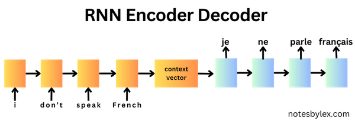
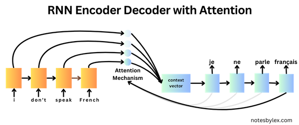

*These are my notes from the paper [Neural Machine Translation by Jointly Learning to Align and Translate](https://arxiv.org/abs/1409.0473) (2014) by Dzmitry Bahdanau, Kyunghyun Cho, Yoshua Bengio.*

## Overview

This paper proposed an improvement to the [RNN Encoder-Decoder](../../permanent/rnn-encoder-decoder.md) [^1] network architecture, introducing an "attention mechanism" to the decoder, which significantly improved performance over longer sentences. The concept of attention went on to become extremely influential in Machine Learning.

At the time, neural networks had emerged as a promising approach to machine translation, where researchers were aiming for an end-to-end translation model, in contrast to the state-of-the-art statistical phrase-based translation methods, which involved many individually trained components. The RNN Encoder-Decoder approach would encode an input sentence into a fixed-length context vector. A decoder would then output a translation from the context vector. The system is *jointly* trained to maximise the probability of a correct translation given a source sentence. 

*Note: for simplicity, I do not show the context vector being passed at each decoder step in the diagram - technically it's optional).*

However, this approach struggled with longer sentences, as the encoder has to compress information into a fixed-length context vector.

The authors proposed freeing the encoder from representing information in a fixed-length vector by outputting a sequence, and add a "soft-"search mechanism to the decoder, which allows it to *focus* on the most relevant information in the input for predicting each word in the output sequence.
 

They related the modification to the human notion of "attention", calling it an [Attention Mechanism](../../permanent/attention-mechanism.md). Though not the first Machine Learning paper to propose applying human-like attention to model architectures [^2], this approach was very influential in NLP, leading to many further alternatives to the attention mechanism, eventually converging on an entirely attention-based architecture called the [Transformer](../../permanent/transformer.md).

## Architecture Details

The authors propose an [RNNSearch](../../permanent/rnnsearch.md) model: an Encoder / Decoder model with an attention mechanism. For comparison, they train a model called **RNNencdec**, which follows the standard RNN Encoder / Decoder architecture [^2] with the encoder returning a fixed-length context vector. 

To demonstrate the ability to handle longer sequences, they train each model twice: first with sentences of length up to 30 words and then with sentences of size up to 50.

 * (RNNencdec-30, RNNsearch-30)
 * (RNNencdec-50, RNNsearch-50)

### Encoder

For the RNN, they use a Bidirectional RNN: a [Gated Recurrent Unit](../../permanent/gated-recurrent-unit.md) (GRU), where the forward and backward pass tokens are concatenated to make a single representation for each token $h_j$ containing information about the preceding and following words.

*Figure 1: The graphical illustration of the proposed model trying to generate the t-th target word $y_t$ given a source sentence ($x_1, x_2, \ldots, x_T$)*

### Decoder

For the decoder, they use a uni-directional [Gated Recurrent Unit](../../permanent/gated-recurrent-unit.md).

For each prediction step, they calculate the word probability as:

$p(y_i|y_1, \ldots, y{i−1}, x) = g(yi−1, s_i, c_i)$

The context vector, $c_i$ is calculated as follows:

$c_i = \sum\limits_{j=1}^{T_x}\alpha_{ij}h_j$

The weights, $\alpha_{ij}$, are calculated in the alignment (Attention) model.

#### Alignment Model

The alignment scores are calculated by combining a projection of the decoder's previous state and a projection of the encoder output, then applying a hyperbolic tanh activation followed by a linear combination with another weight vector.

$$
e_{ij} = v_a^{T} \tanh(W_as_{i-1} + U_{a}h_{j})
$$

This function gives us an output score for each token in the input sequence. Finally, we can perform a Softmax calculation to convert the weights to probability distribution:

$$
\sigma_{ij} = \frac{\exp(e_{ij})}{\sum_{k=1}^{T_x}\exp(e_{ij})}
$$

### Maxout

The final layer, which returns the probabilities for each word, uses a [Maxout](../../permanent/maxout.md) layer to generate the final probabilities. A Maxout layer projects a linear layer into two buckets, takes the max, and is a form of regularisation.

## Training

* **Algorithm**: [Stochasic Gradient Descent](../../permanent/stochasic-gradient-descent.md) (SGD)
* **Optimiser**: Adadelta (Zeiler, 2012)
* **Batch Size**: 80 sentences
* **Training Duration**: Approximately 5 days per model
* **Inference method**: Beam search
* **Task**: English-to-French translation
* **Dataset**: bilingual, parallel corpora provided by ACL WMT 14.
    * Word count: 850 (reduced to 348M)
    * Components:
        * Europarl (61M words)
        * News Commentary (5.5M)
        * UN (421M)
        * two crawled corpora of 90M and 272.5M words, respectively
* **Metric**: [[BLEU Score]].
* **Tokeniser**: from open-source machine translation package Moses.
* **Comparisons**: They compare RNNsearch with a standard RNN Encoder-Decoder, RNNenc and Moses, the state-of-the-art translation package.
* **Test Set**: For the test set, they evaluate `news-test-2014` from WMT'14, which contains 3003 sentences not in training
* **Valid Set**: They concat `news-test-2012` and `news-test-2013`.
* **Initialisation**: Orthogonal for recurrent weights, Gaussian (0, 0.01²) for feed-forward weights, zeros for biases.

## Results

### Quantitative Results

* The RNNsearch-50 model achieved a BLEU score of 34.16 on sentences without unknown tokens, significantly outperforming the RNNencdec-50 model, which scored 26.71, highlighting the superiority of RNNsearch.
* RNNsearch was much better at longer sentences. 

*Figure 2: The BLEU scores of the generated translations on the test set with respect to the lengths of the sentences.**

### Limitations

The paper shows that neural networks struggle with unknown tokens, with a significant drop in BLEU scores observed when sentences contain such tokens.

For each metric, they created one set with sentences that included unknown `[UNK]` tokens and another where they excluded them.

<table class="table-border">
  <thead>
    <tr>
      <th>Model</th>
      <th>All</th>
      <th>No UNK</th>
    </tr>
  </thead>
  <tbody>
    <tr>
      <td>RNNencdec-30</td>
      <td>13.93</td>
      <td>24.19</td>
    </tr>
    <tr>
      <td>RNNsearch-30</td>
      <td>21.50</td>
      <td>31.44</td>
    </tr>
    <tr>
      <td>RNNencdec-50</td>
      <td>17.82</td>
      <td>26.71</td>
    </tr>
    <tr>
      <td>RNNsearch-50</td>
      <td>26.75</td>
      <td>34.16</td>
    </tr>
    <tr>
      <td>RNNsearch-50*</td>
      <td>28.45</td>
      <td>36.15</td>
    </tr>
    <tr>
      <td>Moses</td>
      <td>33.30</td>
      <td>35.63</td>
    </tr>
  </tbody>
</table>

They outperformoutperform state-of-the-art only when unknown tokens are excluded.

*Note: RNNsearch-50\* was trained much longer until the performance on the development set stopped improving.

## Interpreting Attention

One benefit of calculating attention weights for each output word is that they are interpretable, allowing us to visualise word alignments.

*Figure 3. Four sample alignments that were found by RNNsearch-50.*

As we can see, typically, words are aligned to similarly positioned words in a sentence, but not always.

[^1]: Cho, K., van Merrienboer, B., Gulcehre, C., Bahdanau, D., Bougares, F., Schwenk, H., & Bengio, Y. (2014). Learning phrase representations using RNN encoder-decoder for statistical machine translation. arXiv. https://arxiv.org/abs/1406.1078
[^2]: Brauwers, G., & Frasincar, F. (2023). A general survey on attention mechanisms in deep learning. IEEE Transactions on Knowledge and Data Engineering, 35(4), 3279–3298. https://doi.org/10.1109/tkde.2021.3126456