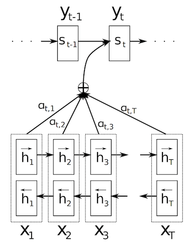
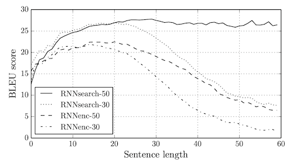
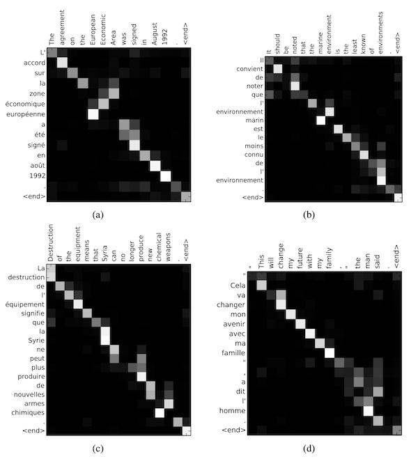

*These are my notes from paper [Neural Machine Translation by Jointly Learning to Align and Translate](https://arxiv.org/abs/1409.0473) (2014) by Dzmitry Bahdanau, Kyunghyun Cho, Yoshua Bengio.*

## Overview

This paper proposed a change to the [RNN Encoder-Decoder](../../permanent/rnn-encoder-decoder.md) architecture, which had recently emerged as a promising approach to machine translation using neural network end-to-end. The state-of-the-art at the time was statistical phrase-based translation methods, which involved many components, each trained separately.

The conventional approach to building an encoder-decoder was to use an RNN model (LSTM and GRUs were typically proposed) as an encoder, which would output a fixed-length **context vector**. The context vector would then be input to the **decoder** when outputting and predicting the output sequence.


*Diagram by DeepLearning.ai from [Natural Language Processing with NLP](../moocs/coursera/attention-models-in-nlp/attention-models-in-nlp.md)*

However, they conjectured that the fixed-length context vector is problematic for translating long sentences and forces the encoder to drop information. Instead, they proposed modifying the encoder to return a sequence, freeing it to "spread information throughout the sequence", and the decoder would contain a "soft-"search mechanism that would allow it to focus on the most relevant information in encoded sequence, to predict each output word.


*Diagram by DeepLearning.ai from [Natural Language Processing with NLP](../moocs/coursera/attention-models-in-nlp/attention-models-in-nlp.md)*

They related this modification to the human notion of "attention", calling it an [Attention Mechanism](../../permanent/attention-mechanism.md), which led to further research into optimal styles of attention, eventually converging on the non-recurrent attention-based network the [Transformer](../../permanent/transformer.md).

## Architecture

They propose [RNNSearch](../../permanent/rnnsearch.md), an Encoder / Decoder with an attention mechanism.

They compare it to **RNNenc**, an Encoder / Decoder architecture where the encoder outputs a fixed-length vector, representing the typical approach.



*Figure 1: The graphical illustration of the proposed model trying to generate the $t$-th target word $y_t$ given a source sentence ($x_1, x_2, \ldots, x_T$)*

### Encoder

They use a [Bidirectional RNN](../../../../permanent/Bidirectional%20RNN.md), with a [Gated Recurrent Unit](../../../../permanent/gated-recurrent-unit.md) (GRU).

A bidirectional RNN computes a sequence of hidden states forwards through the sequence, then does the same backwards. The forward and backward token is concatenated for each token, meaning each input token's hidden state $h_j$ contains information about preceding and following words.

We can achieve this in PyTorch using `nn.GRU` with `bidirectional=True`.

```
python
import torch
from torch import nn

embed_size = 620
hidden_size = 1000
maxout_size = 500
vocab_size = len(tokenizer)

token_ids = torch.tensor([ [0, 1, 2, 3] ]).long()  # Batch, Sequence
encoder_embedding = nn.Embedding(vocab_size, embed_size)
encoder = nn.GRU(embed_size, hidden_size, batch_first=True, bidirectional=True)

embedding = encoder_embedding(token_ids)
embedding.shape  # Batch, Sequence, Embedding Dimension

encoder_out, hidden = encoder(embedding) 
encoder_out.shape  # Batch, Sequence, Hidden Dimension x 2 (forward + backwards)
```

### Decoder

In the decoder for **RNNenc**, a fixed length vector is given as context for the decoder. In **RNNsearch**, we replace the vector with a context vector $c_i$.

The context vector $c_i$ is, then, computed as a weighted sum of the sequence $h_i$:

$c_i = \sum\limits_{j=1}^{T_x}\alpha_{ij}h_j$

The weights, $\alpha_{ij}$, are calculated using the "alignment" model.

#### Alignment Model

The alignment model is a single-layer multilayer perceptron such that $T_x \times T_y$ times for each sentence pair of lengths $T_x$ and $T_y$. So to save computation, they use a single-layer multilayer perceptron such that:

$$
e_{ij} = v_a^{T} \tanh(W_as_{i-1} + U_{a}h_{j})
$$

Where:

* $W_a \in R^{n \times n}$
* $U_a \in R^{n \times 2n}$
* $v_a \in R^{n}$

We then do a Softmax calculation to convert the weights to probability.

$$
α_{ij} = \frac{\exp(e_{ij})}{\sum_{k=1}^{T_x}\exp(e_{ij})}
$$

## Code

"`python
hidden_layer = nn.Linear(hidden_size, hidden_size) # W_a
encoder_out_layer = U_a = nn.Linear(hidden_size * 2, hidden_size) # U_a
attention_alignment = nn.Linear(hidden_size, 1) # v_a

context_proj = attention_context(encoder_outputs)
hidden_proj = attention_hidden(decoder_hidden)
attention_vector = torch.tanh(hidden_proj + context_proj)

attention_scores = attention_alignment(attention_vector).squeeze(2)

```

## Maxout

With the decoder state $s_{i−1}$, the context $c_i$ and the last generated word $y_{i−1}$, they use a [Maxout](../../permanent/maxout.md) layer to generate the final probabilities.

#### Code

```python
class MaxoutLayer(nn.Module):
    def __init__(self, in_features, out_features, num_pieces=2):
        super().__init__()
        self.in_features = in_features
        self.out_features = out_features
        self.num_pieces = num_pieces
        self.linear = nn.Linear(in_features, out_features * num_pieces)
    
    def forward(self, x):
        shape = [x.shape[0], self.out_features, self.num_pieces]
        x = self.linear(x) # B, F
        x = x.view(*shape)  # B, F, P
        x, _ = torch.max(x, -1) # B, F
        return x # B, F
```

## Training

### Parameter Initialisation

They initialized the Recurrent Weight Matrices *U*, *U₂*, *U₃*, *Ū₁*, *Ū₂*, *Ū₃*, *Ū₄*, *Ū₅* and *Ū₆* as Random Orthogonal Matrices.

For $W_{3}$ and $U_6$, they Initialised Them by Sampling Each Element from the Gaussian Distribution of Mean 0 and Variance 0.01². All the Elements of *V₃* and All the Bias Vectors Were Initialised to Zero. Any Other Weight Matrix Was Initialised by Sampling from the Gaussian Distribution of Mean 0 and Variance 0.01².

### Dataset and Task

Task: English-to-French translation
Dataset: bilingual, parallel corpora provided by ACL WMT 14.

They compare results with a standard RNN Encoder-Decoder.

WMT '14 contains the following English-French parallel corpora:

* Europarl (61M words)
* News Commentary (5.5M)
* UN (421M)
* two crawled corpora of 90M and 272.5M words respectively,

WMT '14 has a total size of 850M words. They then reduce to 348M words using the data selection method by [Axelrod et al. (2011)](../../../../permanent/Axelrod%20et%20al.%20(2011).md).

They concat `news-test-2012` and `news-test-2013` for the validation set.
For the test set, they evaluate `news-test-2014` from WMT'14, which contains 3003 sentences not in training.

### Tokenisation

They used the tokenisation script from the open-source machine translation package, Moses.

## Results

They matched state-of-the-art phrase-based systems.

BLEU Scores:
* RNNsearch-50: 34.16 (without UNK)
* Phrase-based Moses: 35.63

<table class="table-border">
  <thead>
    <tr>
      <th>Model</th>
      <th>All</th>
      <th>No UNK</th>
    </tr>
  </thead>
  <tbody>
    <tr>
      <td>RNNencdec-30</td>
      <td>13.93</td>
      <td>24.19</td>
    </tr>
    <tr>
      <td>RNNsearch-30</td>
      <td>21.50</td>
      <td>31.44</td>
    </tr>
    <tr>
      <td>RNNencdec-50</td>
      <td>17.82</td>
      <td>26.71</td>
    </tr>
    <tr>
      <td>RNNsearch-50</td>
      <td>26.75</td>
      <td>34.16</td>
    </tr>
    <tr>
      <td>RNNsearch-50*</td>
      <td>28.45</td>
      <td>36.15</td>
    </tr>
    <tr>
      <td>Moses</td>
      <td>33.30</td>
      <td>35.63</td>
    </tr>
  </tbody>
</table>

*Note: RNNsearch-50\* was trained much longer until the performance on the development set stopped improving. "No UNK" refers to scores on sentences without any unknown words in themselves and in the reference translations. Models were disallowed from generating [UNK] tokens for this evaluation.*

Long Sentences: Maintained performance even with 50+ word sentences



**Attention Visualisation**

One benefit of calculating attention weights for each output word is that they are interpretable, and we can visualise word alignments.



As we can see, typically, words are aligned to similarly positioned words in a sentence, but not always.

## Background

Most of the proposed neural machine translation models belong to a family of encoder–decoders (Sutskever et al., 2014; Cho et al., 2014a), with an encoder and a decoder for each language, or involve a language-specific encoder applied to each sentence whose outputs are then compared (Hermann and Blunsom, 2014).

Papers:

* [Recurrent Continuous Translation Models (2013)](../../../../permanent/recurrent-continuous-translation-models.md) by Kalchbrenner and Blunsom (2013).
* [Sequence to sequence learning with neural networks](../../../../permanent/Sequence%20to%20sequence%20learning%20with%20neural%20networks.md) - Sutskever, I., Vinyals, O., and Le, Q. (2014).
* [On the properties of neural machine translation: Encoder-Decoder approaches](On%20the%20properties%20of%20neural%20machine%20translation:%20Encoder%E2%80%93Decoder%20approaches) - Cho, K., van Merrienboer, B., Bahdanau, D., and Bengio, Y. (2014b)
* [Multilingual distributed representations without word alignment](Multilingual%20distributed%20representations%20without%20word%20alignment)

Prior approaches to machine translation involved complicated multi-model systems.

* [Statistical Phrase-Based Translation (2003)](statistical-phrase-based-translation-2003.md)
