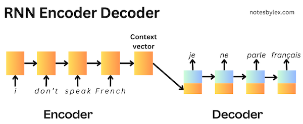
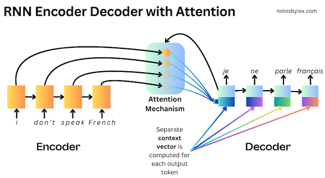

*These are my notes from the paper [Neural Machine Translation by Jointly Learning to Align and Translate](https://arxiv.org/abs/1409.0473) (2014) by Dzmitry Bahdanau, Kyunghyun Cho, Yoshua Bengio.*

## Overview

This paper proposed an improvement to the [RNN Encoder-Decoder](../../permanent/rnn-encoder-decoder.md) [^1] network architecture, introducing an "attention mechanism" to the decoder, which significantly improved performance over longer sentences. The concept of attention went on to become extremely influential in Machine Learning.

At the time, neural networks had emerged as a promising approach to machine translation, where researchers were aiming for an end-to-end translation model, in contrast to the state-of-the-art statistical phrase-based translation methods, which involved many individually trained components. The RNN Encoder-Decoder approach would encode an input sentence into a fixed-length context vector; a decoder would then output a translation using the context vector. The encoder and decoder are jointly trained on a dataset of text pairs, where the goal is to maximise the probability of the target given the input.

However, this approach struggles with longer sentences, as the encoder has to drop information to compress it into a fixed-length context vector.

The authors proposed modifying the encoder to output a sequence with one hidden representation per input word, then adding a search mechanism to the decoder, allowing it to find the most relevant information in the input sequence to predict each word in the output sequence.

They likened the modification to the human notion of "attention", calling it an [Attention Mechanism](../../permanent/attention-mechanism.md). Though not the first Machine Learning paper to propose applying human-like attention to model architectures [^2], this approach was very influential in NLP, leading to a lot of research eventually converging on an entirely attention-based architecture called the [Transformer](../../permanent/transformer.md).

## Architecture Details

The authors propose an [RNNSearch](../../permanent/rnnsearch.md) model: an Encoder / Decoder model with an attention mechanism. For comparison, they train **RNNencdec**, which follows the standard RNN Encoder / Decoder architecture [^2] with the encoder returning a fixed-length context vector.

To demonstrate the ability to handle longer sequences, they train each model twice:

* First, with sentences of length up to 30 words: `RNNencdec-30`, `RNNsearch-30`
* Next, with sentences of size up to 50 words: `RNNencdec-50`, `RNNsearch-50`

### Encoder

For the RNN, they use a Bidirectional RNN: a [Gated Recurrent Unit](../../permanent/gated-recurrent-unit.md) (GRU).

Each input token is fed into an embedding layer, $x_i$, and then a GRU encodes into a forward and backward "annotation" per token, concatenated to make a single representation, $h_i$.

The idea is to allow each annotation to summarise the preceding and the following words, providing the most possible representation for the attention mechanism.

*Figure 1: The graphical illustration of the proposed model trying to generate the t-th target word $y_t$ given a source sentence* ( $x_1, x_2, \ldots, x_T$ )

### Decoder

For the decoder, they use a uni-directional [Gated Recurrent Unit](../../permanent/gated-recurrent-unit.md).

The initial hidden state $s_0$ is computed as an initialisation layer, which comprises a linear layer followed by a `tanh` activation function.

$s_0 = \tanh \left( W_s \overleftarrow{h}_1 \right)$ where $W_s \in \mathbb{R}^{n \times n}$.

For each prediction step, they calculate the word probability as:

$p(y_i|y_1, \ldots, y_{i−1}, x) = g(y_{i−1}, s_i, c_i)$

Where

* $y_{i-1}$ is the embedding of the token from the previous step.
* $s_i$ is the hidden state output from the previous layer.
* $c_i$ is the context vector.

The context vector, $c_i$ is calculated at each step as follows:

$c_i = \sum\limits_{j=1}^{T_x}\alpha_{ij}h_j$

The weights, $\alpha_{ij}$, are calculated by the alignment (Attention) model.

#### Alignment Model (Attention)

The **alignment scores** are calculated by combining a projection of the decoder's previous state and a projection of the encoder output, then applying `tanh` activation followed by a linear combination with another weight vector.

$$
e_{ij} = v_a^{T} \tanh(W_as_{i-1} + U_{a}h_{j})
$$

This function gives us an output score for each token in the input sequence. Finally, we can perform a Softmax calculation to convert the weights to probability distribution:

$$
\sigma_{ij} = \frac{\exp(e_{ij})}{\sum_{k=1}^{T_x}\exp(e_{ij})}
$$

### Maxout

The final layer, which returns the probabilities for each word, uses a [Maxout](../../permanent/maxout.md) layer to generate the final probabilities. A Maxout layer acts as a form of regularisation. It projects the input vector onto multiple "buckets" and selects the maximum value from each bucket. This process introduces non-linearity and helps prevent overfitting, akin to dropout.

## Training Params

* **Algorithm**: [Stochasic Gradient Descent](../../permanent/stochasic-gradient-descent.md) (SGD)
* **Optimiser**: Adadelta (Zeiler, 2012)
* **Batch Size**: 80 sentences
* **Training Duration**: Approximately 5 days per model
* **Inference method**: Beam search
* **Task**: English-to-French translation
* **Dataset**: bilingual, parallel corpora provided by ACL WMT 14.
    * Word count: 850 (reduced to 348M)
    * Components:
        * Europarl (61M words)
        * News Commentary (5.5M)
        * UN (421M)
        * two crawled corpora of 90M and 272.5M words, respectively
* **Metric**: [BLEU Score](../../permanent/bleu-score.md).
* **Tokeniser**: from open-source machine translation package Moses. They shortlist the most frequent 30k words and map everything else to `[UNK]`.
* **Comparisons**: They compare RNNsearch with a standard RNN Encoder-Decoder, RNNenc and Moses, the state-of-the-art translation package.
* **Test Set**: For the test set, they evaluate `news-test-2014` from WMT'14, which contains 3003 sentences not in training
* **Valid Set**: They concat `news-test-2012` and `news-test-2013`.
* **Initialisation**: Orthogonal for recurrent weights, Gaussian ($0, 0.01^2$) for feed-forward weights, zeros for biases.

## Results

They record results on all test data with only examples that don't contain unknown tokens.

The RNNsearch-50 model achieved a BLEU score of 34.16 on sentences with unknown tokens excluded, significantly outperforming the RNNencdec-50 model, which scored 26.71 and training RNNsearch-50 to convergence beat the state-of-the-art Moses. However, when unknown tokens are included, the model performs considerably worse.

RNNsearch was much better at longer sentences than RNNenc.

*Figure 2: The BLEU scores of the generated translations on the test set with respect to the lengths of the sentences.*

<table class="table-border">
  <thead>
    <tr>
      <th>Model</th>
      <th>All</th>
      <th>No UNK</th>
    </tr>
  </thead>
  <tbody>
    <tr>
      <td>RNNencdec-30</td>
      <td>13.93</td>
      <td>24.19</td>
    </tr>
    <tr>
      <td>RNNsearch-30</td>
      <td>21.50</td>
      <td>31.44</td>
    </tr>
    <tr>
      <td>RNNencdec-50</td>
      <td>17.82</td>
      <td>26.71</td>
    </tr>
    <tr>
      <td>RNNsearch-50</td>
      <td>26.75</td>
      <td>34.16</td>
    </tr>
    <tr>
      <td>RNNsearch-50*</td>
      <td>28.45</td>
      <td>36.15</td>
    </tr>
    <tr>
      <td>Moses</td>
      <td>33.30</td>
      <td>35.63</td>
    </tr>
  </tbody>
</table>

*Note: RNNsearch-50\* was trained much longer until the performance on the development set stopped improving.

## Interpreting Attention

One benefit of calculating attention weights for each output word is that they are interpretable, allowing us to visualise word alignments.

*Figure 3. Four sample alignments that were found by RNNsearch-50.*

As we can see, typically, words are aligned to similarly positioned words in a sentence, but not always.

[^1]: Cho, K., van Merrienboer, B., Gulcehre, C., Bahdanau, D., Bougares, F., Schwenk, H., & Bengio, Y. (2014). Learning phrase representations using RNN encoder-decoder for statistical machine translation. arXiv. https://arxiv.org/abs/1406.1078
[^2]: Brauwers, G., & Frasincar, F. (2023). A general survey on attention mechanisms in deep learning. IEEE Transactions on Knowledge and Data Engineering, 35(4), 3279–3298. https://doi.org/10.1109/tkde.2021.3126456
