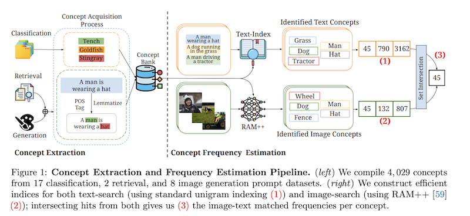
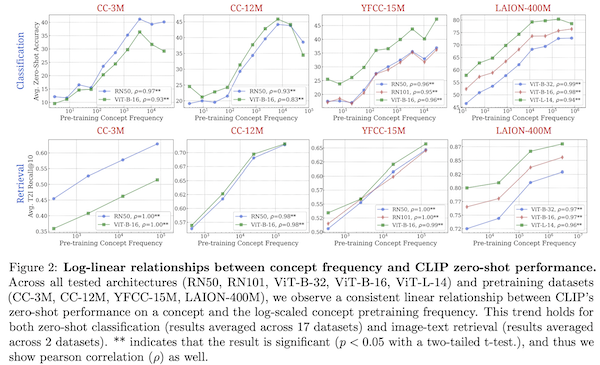

#Data

Notes from paper [No "Zero-Shot" Without Exponential Data: Pretraining Concept Frequency Determines Multimodal Model Performance](https://arxiv.org/abs/2404.04125) by Vishaal Udandarao, Ameya Prabhu, Adhiraj Ghosh, Yash Sharma, Philip H.S. Torr, Adel Bibi, Samuel Albanie and Matthias Bethge.

## Overview

The authors analyse 30GB of data from multimodal datasets (CC-3M, CC-12M, YFCC-15M, LAION-400M, LAION-Aesthetics) used to train models like [CLIP](../../permanent/contrastive-language-image-pretraining.md) and Stable-Diffusion and build a pipeline to extract "concepts" (nouns like "man", "hat", "fish").

They determine a log-linear relationship between concept frequency and zero-shot performance: The model needs to see exponentially more examples in training to achieve a linear zero-shot performance increase for a concept.

They also find some interesting discoveries in these web-scraped datasets:

* Concept Distribution: Across all pre-training datasets, concepts are long-tailed: a large fraction of concepts are rare, and the rare concepts are not properly learned during multimodal pretraining.
* Concept Correlation across Pre-training Datasets: The distribution of concepts across different pretraining datasets is strongly correlated, suggesting different web crawl datasets mostly contain the same stuff and share similar problems.
* Image-Text Misalignment between Concepts in Pre-training Data: They identify a wide-scale misalignment problem between pairs where concepts can appear in one modality but not the other. In some cases, up to 36% of pairs are misaligned in publicly available datasets.

They curate a dataset called [Let It Wag](../../permanent/let-it-wag.md) that identifies the least frequent concepts across the web scrapes (examples: A310 aircraft, a worm snake, and a tropical kingbird). It was found that performance across classification models and image generation tasks is considerably worse (as compared to ImageNet) on this dataset.
