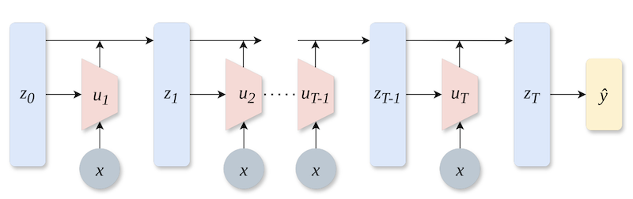

---
title: "NoProp: Training Neural Networks Without Back-Propagation or Forward-Propagation"
date: 2025-05-15 00:00
modified: 2025-05-15 00:00
category: reference/papers
summary: "an alternative training method to backprop that does local layer learning"
tags:
- MachineLearning
---

*My summary of [NoProp: Training Neural Networks without Back-propagation or Forward-propagation](https://arxiv.org/abs/2503.24322) by Qinyu Li, Yee Whye Teh, Razvan Pascanu.*

This paper proposes a "back-propagation-free" (kinda) approach to training a denoising (Diffusion / Flow Matching) model.

The main difference between the backprop approach and NoProp is that each block (layer) is optimised to denoise independently instead of propagating errors throughout the entire network, think: gradient descent per block. They also don't need to do a forward pass through the whole network. Each block is given a copy of the input data embeddings and a noised version of the label, meaning blocks can be sampled randomly throughout training, effectively allowing for much better ability to parallelise training.

At inference time, the noised label is replaced with the output of the preceding layer.

In theory, NoProp could reduce the memory needed to train models, as activations wouldn't need to be stored for all layers at once. Also, since it doesn't depend on the preceding block's output, nor does it have to propagate gradients through the whole network, it should be much easier to parallelise the network's training. A final selling point is that the model isn't necessarily learning a hierarchical representation, or at least is learning a different type of hierarchy than backprop.

Each layer is trained using the sum of multiple loss functions:

* Cross-entropy loss on the final prediction.
* KL divergence between the initial noise and standard normal.
* L2 loss between the block output and the label embedding (scaled by SNR change).

They experiment with a continuous version with a continuous trajectory over time, instead of discrete blocks, similar to Flow Matching or score-based diffusion.

They test on MNIST, CIFAR-10, and CIFAR-100. There's not much to improve upon those problems in 2025, but they get comparable or even slightly better results than traditional backprop while using about half the GPU memory.
