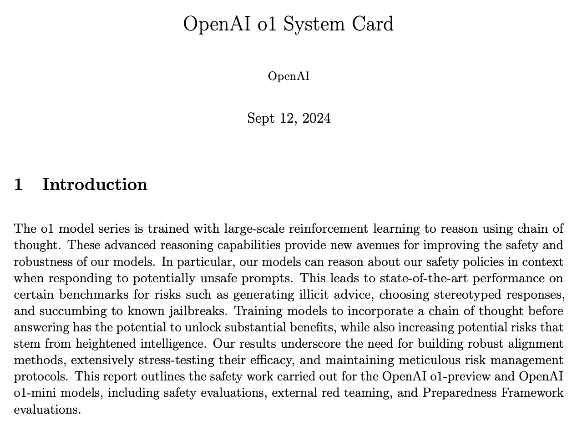
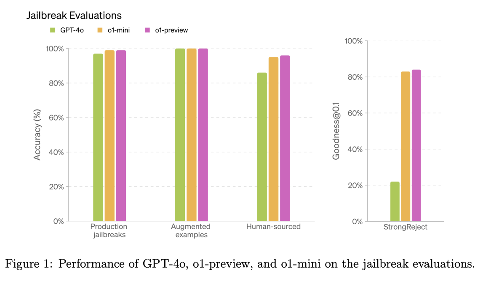

Notes from the [OpenAI o1 System Card](https://assets.ctfassets.net/kftzwdyauwt9/67qJD51Aur3eIc96iOfeOP/71551c3d223cd97e591aa89567306912/o1_system_card.pdf), released on 12 September 2024 alongside o1-preview and o1-mini.

The key line is the first sentence: "The o1 model series is trained with large-scale reinforcement learning to reason using chain of thought." That's what made o1 different. [LLM Reasoning](../../permanent/llm-reasoning.md) was no longer just something you prompted for; the model was trained to do it [@openaiOpenAIO1System2024].

The rest of the card is mostly about safety. OpenAI argue that reasoning helps here, because the model can reason about its safety policies in context before responding to a potentially unsafe prompt. They report state-of-the-art results on benchmarks for resisting jailbreaks, avoiding illicit advice and avoiding stereotyped responses. But they also say the same capabilities increase "potential risks that stem from heightened intelligence".

The biggest jump is on StrongReject, a jailbreak benchmark, where o1-preview and o1-mini score above 80% compared to around 20% for GPT-4o.

*Figure 1: Performance of GPT-4o, o1-preview and o1-mini on the jailbreak evaluations.*

The card also covers external red teaming and OpenAI's Preparedness Framework evaluations. A later revision, covering the full o1 release, is on arXiv as [2412.16720](https://arxiv.org/abs/2412.16720).
