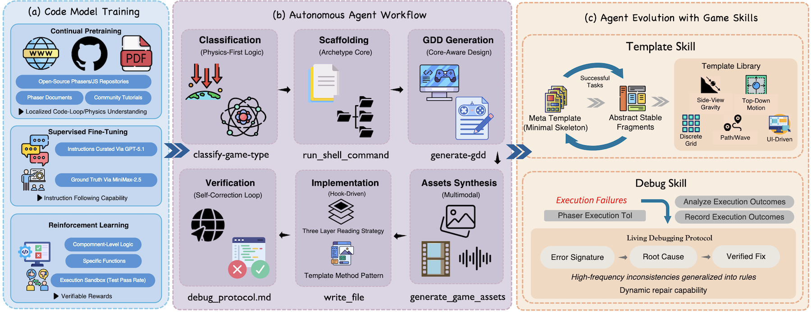

*My notes on [OpenGame: Open Agentic Coding for Games](https://arxiv.org/abs/2604.18394v1) by Yilei Jiang, Jinyuan Hu, Qianyin Xiao, Yaozhi Zheng, Ruize Ma, Kaituo Feng, Jiaming Han, Tianshuo Peng, Kaixuan Fan, Manyuan Zhang, Xiangyu Yue*

A paper very relevant to my interests right now.

Paper describes **OpenGame**, an agentic framework designed for end-to-end web game creation. [@jiangOpenGameOpenAgentic2026]

The paper argues that to build products as complex as games, the field needs to move beyond *generalist code agents* to *specialist frameworks*.

The paper basically throws the kitchen sink at the problem of game design: a base model, a code agent, a new collection of [Agent Skills](../../permanent/agent-skills.md) for game development, and a new benchmark and evaluation framework.

*Figure 2. [@jiangOpenGameOpenAgentic2026]*

### Base Model

They build a new foundation model based on a Qwen3.5-27B backbone, called **GameCoder-27B**, via a three-stage pipeline:

[Continual Pre-Training (CPT)](../../permanent/continual-pre-training-cpt.md) on a corpus of open-source Phaser and JavaScript/TypeScript game repositories from GitHub, with docs and tutorials, to build strong priors over game loops, physics systems, asset usage, and state management.

[Supervised Fine-Tuning](../../permanent/fine-tuning.md) on game generation prompts using `gpt-codex5.1`, with solutions from `minimax2.5`. For example: *"Implement a 2D platformer character controller with double-jump and sprite animations."*

[Reinforcement Learning (RL)](../../permanent/reinforcement-learning.md) at the component level: execution grounded, rewarding unit test pass rate and execution success on single-file gameplay logic and targeted functional modules (e.g., collision detection, state-machine transitions). Getting the model strong at the component level works because a downstream agent assembles those building blocks into a full multi-file project.

### Code Agent Design

To produce a complete game, the authors argue you need [Structured Long-Horizon Workflows](Structured%20Long-Horizon%20Workflows.md).

OpenGame orchestrates the agent through six operational phases, using a persistent `todo_write` tool that lets the agent plan, execute, and transition across phases in a controlled manner.

#### 1. Classification

The agent invokes `classify-game-type`, which applies a Physics-First Classification rule. Rather than relying on ambiguous genre labels, it categorises the task by physical constraints and spatial mechanics (e.g. "falling without ground support" == platformer archetype, "snapping to a grid" == `grid_logic`). This sets the macro-level execution plan.

#### 2. Scaffolding

Once the game archetype is known, the agent runs `run_shell_command` to copy the shared scaffolding codebase and relevant architectural documentation into the workspace, giing the model a baseline to operate from.

#### 3. GDD Generation

The agent invokes `generate-gdd` to produce a technical Game Design Document. This tool dynamically loads archetype-specific API constraints from the scaffolded documentation, ensuring the proposed mechanics are feasible under the selected framework. The agent extracts the implementation roadmap from the GDD and uses `todo_write` to refine its high-level plan into granular, file-specific actions.

#### 4. Multimodal Asset Synthesis

The agent reads `asset_protocol.md` to ensure parameter compliance, then invokes `generate-game-assets`, leveraging multimodal generation models to synthesise backgrounds, character animations, static items, and audio assets from the GDD's asset registry. For tile-based games, `generate-tilemap` converts ASCII layouts into structured JSON tilemaps. The agent then reads the produced `assetpack.json` to record exact texture and asset keys needed during implementation, substantially reducing downstream asset-reference hallucinations.

#### 5. Context-Aware Code Implementation

Before writing gameplay logic, the agent merges GDD parameters into `gameConfig.json`, enforcing a data-driven interface between design and code.

To mitigate context overflow during implementation, they introduce a **Three-Layer Reading Strategy**: using `read_file`, the agent progressively loads (1) an API summary for the template system, (2) the target source file (`_Template*.ts`) to be modified, and (3) the implementation guide, loaded last to maximise immediate salience.

Code generation follows a **Template Method Pattern**: rather than writing the project from scratch, the agent copies template files and overrides designated hook methods (e.g., `setupCustomCollisions`) to inject game-specific logic while preserving the deterministic lifecycle management of base classes.

#### 6. Verification and Self-Correction

The agent reads `debug_protocol.md` to perform a static self-review over common generative failure modes, then uses `run_shell_command` to execute `npm run build` and `npm run test` under headless browser evaluation.

When build or test failures occur, the agent parses compiler output, localises the faulty script, and iteratively repairs the project until a playable game is obtained. This phase provides the operational substrate for the Debug Skill described below.

### Agent Evolution with Game Skills

**Game Skill** is a "reusable, evolving capability" composed of two components: Template Skill and Debug Skill. Together, they let the agent scaffold stable architectures and systematically repair integration errors, rather than patching isolated bugs.

#### Template Skill

Grows an evolving library of specialised project skeletons $L$, starting from a game-agnostic meta template $M_0$ and expanding into specialised template families like gravity-based side-view and top-down continuous motion.

$M_0$ intentionally assumes no genre, physics regime, or gameplay mechanic, just the universal structure required for a playable game: project layout, initialisation, asset loading, scene loops, and configuration interfaces.

As the agent completes games, reusable fragments are extracted and merged back into $L$. This sharply reduces the search space of generation and stabilises project-wide structure across diverse requests.

#### Debug Skill

Maintains a living debugging protocol $P$, updated from observed build, test, and runtime outcomes. Each new failure pattern is appended as a verified `(error signature, root cause, verified fix)` triple. This lets the agent accumulate verified fixes and systematically resolve high-frequency integration failures across games, rather than re-diagnosing the same classes of error from scratch.

### OpenGame-Bench

A new evaluation pipeline for agentic game generation, scoring output across three metrics:

* Build Health: whether the project compiles and runs without errors under headless browser execution.
* Visual Usability: whether the game is visually coherent and navigable, assessed via VLM judging.
* Intent Alignment: whether the generated game matches the original natural-language specification.

Evaluation uses a combination of headless browser execution and VLM judging across 150 game prompts.

---

They identify three reasons why general-purpose LLMs struggle to produce complete, playable games:

1. **Logical Incoherence**: the model loses track of global state across the game loop, causing freezes, failures to terminate, or mechanics that never materialise.
2. **Engine-Specific Knowledge Gaps**: general models misuse or ignore engine abstractions, reimplementing mechanics from scratch instead of using framework-native physics, scene, and event systems.
3. **Cross-File Inconsistencies**: individual files look plausible, but the overall project breaks due to mismatched asset keys, flawed scene wiring, missing config fields, or broken init order.

The argument is that fixing this requires frameworks that understand the *intrinsic structure* of games, not just better prompting of generalist agents.

---

Reminds me of the [SheetCopilot Agent](../../permanent/sheetcopilot-agent.md), an agentic framework for spreadsheet controls, and systems like [AlphaEvolve](alphaevolve-a-coding-agent-for-scientific-and-algorithmic-discovery.md), a system for algorithmic discovery.
