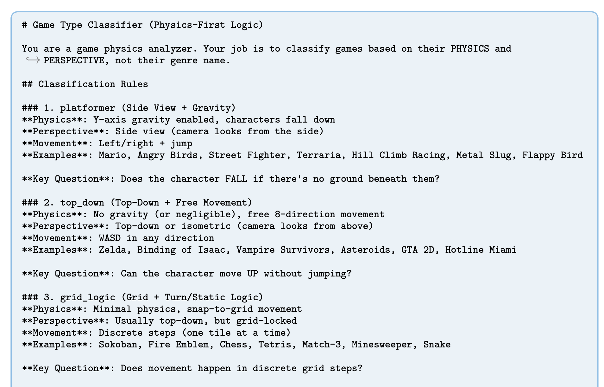
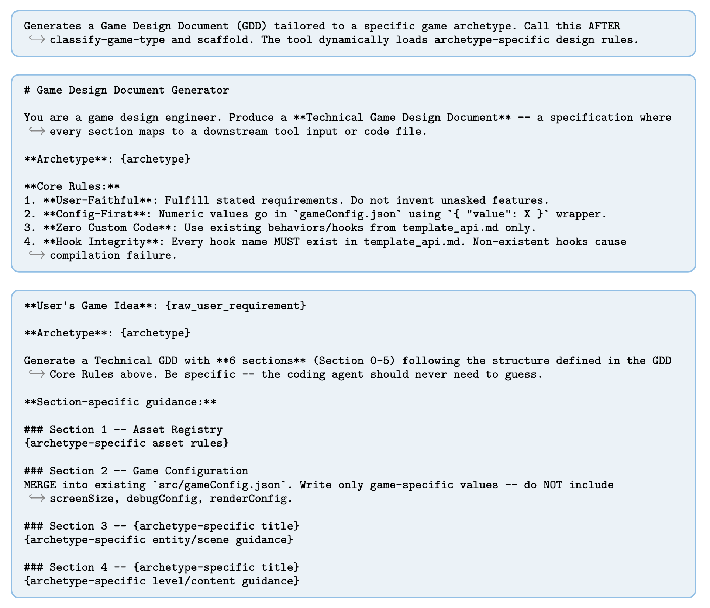
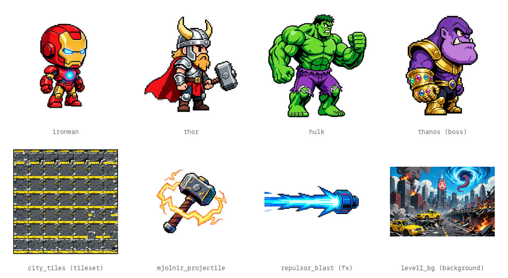
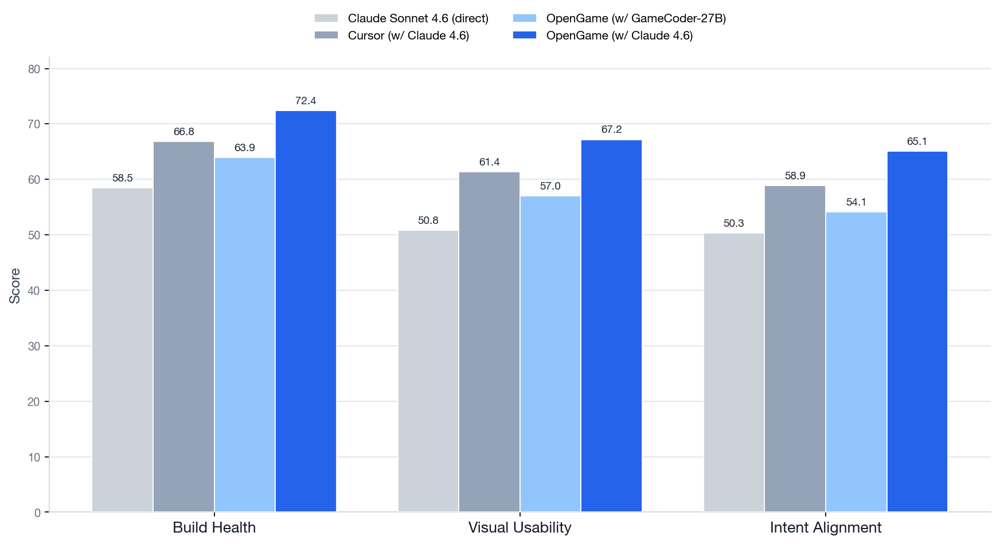
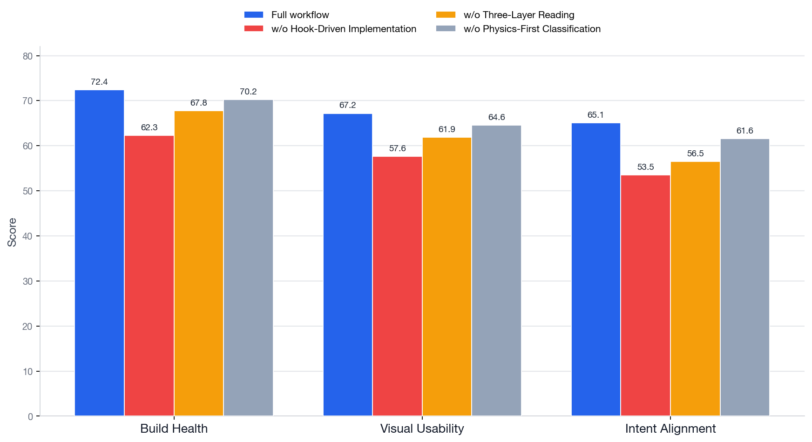

This paper describes an *agentic framework* for designing end-to-end web games from text prompts, called **OpenGame** [@jiangOpenGameOpenAgentic2026], from researchers at the Chinese University of Hong Kong's Multimedia Lab.

They throw the kitchen sink at the problem of game development, including training a new domain-specialised coding model, **GameCoder-27B**, which powers a custom agentic workflow; a reusable **Game Skill** comprising a self-evolving **Template Skill** and **Debug Skill**; and, finally, a new benchmark and evaluation framework, **OpenGame-Bench**.

The authors identify three reasons why general-purpose LLMs struggle to produce complete, playable games:

1. **Logical Incoherence**: the model loses track of global state across the game loop, causing freezes, failures to terminate, or mechanics that never materialise.
2. **Engine-Specific Knowledge Gaps**: general models misuse or ignore engine abstractions, reimplementing mechanics from scratch instead of using framework-native physics, scene, and event systems.
3. **Cross-File Inconsistencies**: individual files look plausible, but the overall project breaks due to mismatched asset keys, flawed scene wiring, missing config fields, or broken initialisation order.

They argue that the field needs to move beyond *generalist code agents* and adopt *specialist frameworks* to address these issues. And one of the key findings here is that structured agent scaffolding, alongside reusable templates and an accumulating debug protocol, is what makes long-horizon game-generation systems work.


*Figure 2. from [@jiangOpenGameOpenAgentic2026] - showcasing the entire end-to-end OpenGame system.*

Here are a few examples from their repo, each generated end-to-end from a single text prompt:

<div style="display:grid; grid-template-columns:repeat(auto-fit, minmax(240px, 1fr)); gap:1.5rem; margin:1.5rem 0;">
  <div>
    <video controls loop muted playsinline style="width:100%; border-radius:6px;"><source src="../../_media/opengame-demo-marvel.mp4" type="video/mp4"></video>
    <p><b>Marvel Avengers: Infinity Strike</b></p>
    <p><i>"Build an epic side-scrolling action platformer starring the Avengers. I want to select between Iron Man (lasers &amp; flight), Thor (hammer melee &amp; lightning), or Hulk (smash attacks) to fight through 3 distinct levels: a ruined City, a SHIELD Helicarrier, and finally Titan. Each hero needs a basic attack, a special skill, and a screen-clearing Ultimate move. The final boss must be Thanos using Infinity Stone powers. The art style should be hardcore 90s Capcom arcade pixel art, not cute/chibi."</i></p>
  </div>
  <div>
    <video controls loop muted playsinline style="width:100%; border-radius:6px;"><source src="../../_media/opengame-demo-starwars.mp4" type="video/mp4"></video>
    <p><b>StarWars: Mandalorian Protocol</b></p>
    <p><i>"Create a high-intensity top-down action RPG shooter set in the Star Wars universe. Play as The Mandalorian fighting through an Imperial Base to rescue Grogu. The gameplay should be a Twin-Stick Shooter style where I can use a Blaster (ranged), a Beskar Spear (melee), and a Jetpack Dash to dodge. Include Stormtrooper enemies and a tactical depth system where characters can walk behind crates and walls. The visuals should be metallic sci-fi pixel art."</i></p>
  </div>
  <div>
    <video controls loop muted playsinline style="width:100%; border-radius:6px;"><source src="../../_media/opengame-demo-squidgame.mp4" type="video/mp4"></video>
    <p><b>Squid Game: Red Light, Green Light</b></p>
    <p><i>"Recreate the intense 'Red Light, Green Light' scene from Squid Game as a survival reflex game. The player controls a character in a green tracksuit running across a sandy field towards a finish line. There is a Giant Robot Doll on the right; when she sings, we run; when she turns her head, we must stop instantly or get shot. Crucial visual detail: Dead bodies and blood pools should NOT disappear, they must pile up on the field to create a chaotic atmosphere. Use a gritty, realistic 16-bit pixel art style."</i></p>
  </div>
  <div>
    <video controls loop muted playsinline style="width:100%; border-radius:6px;"><source src="../../_media/opengame-demo-hajimi.mp4" type="video/mp4"></video>
    <p><b>Hajimi Defense: The Tuna Crisis</b></p>
    <p><i>"Make a hilarious tower defense game called 'Hajimi Defense' where cute cats defend a 'Golden Tuna Can' from an invasion of household pests (Cucumbers and Vacuums). The towers should be funny cat memes: a spitting Tabby, a sniper Siamese, and a fat orange cat that throws buns for AOE damage. Include a mechanic where players can click to break obstacles (like boxes) to free up building space. The art style should be hand-drawn, pastel, and super cute (Kawaii)."</i></p>
  </div>
</div>

Clearly, copyright infringement checks aren't baked into the framework yet.

## Base Model

The authors contribute a new domain-specialised code model adapted from the [Qwen3.5-27B](../../permanent/qwen35-27b.md) backbone, called **GameCoder-27B**. They train it via a three-stage pipeline that follows the standard modern [LLM Training Recipe](../../permanent/llm-training-pipeline.md):

* [Continual Pre-Training (CPT)](../../permanent/continual-pre-training-cpt.md) (that is, pre-training on an already trained model) - on a corpus of open-source Phaser and JavaScript/TypeScript game repositories from GitHub, alongside a collection of docs and tutorials. This builds the model's familiarity with game loops, physics systems, asset management, and state management.
* [Supervised Fine-Tuning](../../permanent/fine-tuning.md) on a collection of game generation prompts and corresponding solutions, with the prompts coming from `gpt-codex5.1` and the solutions from `minimax2.5`.
* And finally, a [Reinforcement Learning (RL)](../../permanent/reinforcement-learning.md) step, done at the component level, rewarding unit test pass rate and execution success on gameplay logic, either in a single file or at the function level: stuff like collision detection functions, state-machine transitions, and so on. The idea here is to make the model strong at the component level, since they intend for a downstream agent to assemble those building blocks into a full multi-file project.

At the time of writing, it seems the weights for GameCoder-27B are not publicly available.

## Code Agent Design

To produce a complete game, again, the authors argue, you need structured [Long-Horizon Workflow](../../permanent/long-horizon-workflow.md) systems.

OpenGame orchestrates the agent through six operational phases, using a persistent `todo_write` tool that enables the agent to plan, execute, and transition between phases in a controlled manner.

### 1. Classification

In the Classification phase, the agent invokes the `classify-game-type` tool, which applies a **Physics-First Classification** rule, categorising the game by its required physics rather than its genre. So a platformer is recognised by side-view and gravity, while a grid-based game like chess or Snake is recognised by grid movement with minimal physics. This sets the macro-level execution plan.



*The `classify-game-type` tool maps a prompt to a physics-based archetype.*

### 2. Scaffolding

Once the game archetype is known, the agent runs the `run_shell_command` tool to copy the shared scaffolding codebase and relevant architectural documentation into the workspace, providing the model with a baseline to operate from and saving it from having to generate boilerplate code.

### 3. Game Design Document (GDD) Generation

Next, the agent invokes the `generate-gdd` tool to produce a technical Game Design Document. This tool dynamically loads game-type-specific API constraints from the scaffolded documentation, ensuring the proposed mechanics are feasible under the selected framework. The agent extracts the implementation roadmap from the GDD and uses `todo_write` to refine its high-level plan into granular, file-specific actions.



### 4. Multimodal Asset Synthesis

To generate game assets (stuff like backgrounds, sprites, audio, etc.), the agent invokes the `generate-game-assets` tool, which calls multimodal models to produce the assets described in the GDD's asset registry, along with an `asset-pack.json` manifest.


*A sample of the assets generated for the Marvel platformer demo: character animation frames, a tileset, an effect, and a level background.*

For tile-based games, the `generate-tilemap` tool converts ASCII layouts into structured JSON tilemaps.

The agent then reads the asset pack to record exact texture and asset keys needed during implementation, substantially reducing downstream asset-reference hallucinations.

A strict contract for how assets must be requested is described in [`asset_protocol.md`](https://github.com/leigest519/OpenGame/blob/c54307efe1dab927e7fc52dbb92af6b3df1d1c66/agent-test/docs/asset_protocol.md), one of the fixed protocol files copied into the scaffolding.

### 5. Context-Aware Code Implementation

This phase is where the model actually generates the code.

Before writing gameplay logic, the agent merges the game design doc's parameters into the game config (`gameConfig.json`), enforcing a data-driven interface between design and code.

To keep context light, they introduce a "three-layer reading strategy", where the `read_file` tool loads:

1. an API summary for the template system
2. a template file to be modified
3. the implementation guide (loaded last to maximise salience)

The template file approach is based on the [Template Method Pattern](../../permanent/template-method-pattern.md), a software engineering design pattern, where the base class defines the skeleton of an algorithm, with the details filled in by its subclasses.

This means that the agent doesn't have to write the project from scratch - it simply copies template files and overrides the hook methods it needs to inject game-specific logic.

For example, we have a platformer base level class that calls a bunch of methods during initialisation:

```typescript
// BaseLevelScene.ts — the fixed lifecycle; the agent never edits this
create() {
  // ... enemies, camera, inputs...
  this.setupCollisions();
  this.setupPlayers();    // HOOK
  this.setupInputs();    // HOOK
  // ... other methods
}

protected setupPlayers(): void {
  // no-op by default — overridden in the copied template
}
```

The agent copies a template file with a class that inherits from the base scene and can override the method it needs to inject the game's rules:

```typescript
// Level1Scene.ts (copied from _TemplateLevel.ts)
protected override setupPlayers(): void {
  this.player = this.physics.add.sprite(100, 450, "ironman");
  this.player.setCollideWorldBounds(true);
}
```

### 6. Verification and Self-Correction

The agent reads a debug protocol ([`debug_protocol.md`](https://github.com/leigest519/OpenGame/blob/c54307efe1dab927e7fc52dbb92af6b3df1d1c66/agent-test/docs/debug_protocol.md#L4)) to perform a static self-review over common generative failure modes, then executes build (`npm run build`) and test (`npm run test`) commands in a headless browser environment for dynamic checks.

If build or test failures occur, the agent parses the compiler output, finds the faulty script, and tries to repair the project until the game is playable.

Using the Debug Skill, which I'll talk more about next, the agent evolves a record of common errors and their fixes, and gets better at debugging over time. Super cool.

## Agent Evolution with Game Skill

**Game Skill** is a "reusable, evolving capability" that they equip the agent with, composed of two components: Template Skill and Debug Skill. Together, they let the agent scaffold stable architectures and systematically repair integration errors, with an evolving catalogue of templates and error/fix pairs that forms a kind of long-term [Memory](../../permanent/memory.md) across projects. In other words, the agent gets better at scaffolding and fixing issues the more games it creates.

### Template Skill

Template Skill grows an evolving library, $L$, of specialised project skeletons, starting from a game-agnostic meta template, $M_0$, and expanding into specialised template families like gravity-based side-view and top-down continuous motion.

The meta template $M_0$ intentionally assumes no genre, physics regime, or gameplay mechanic, just the universal structure required for a playable game - things like project layout, initialisation, asset loading, scene loops, and configuration interfaces.

As the agent completes games, reusable fragments are extracted and merged back into the library $L$. This reduces the search space during generation and stabilises project-wide structure across the games it generates.

### Debug Skill

Debug Skill maintains a living debugging protocol $P$, continually updated with observations from the verification and self-correction step in the agent's workflow.

Each new failure pattern is appended as a triple, with an error signature, a root cause, and a verified fix.

This means the agent is accumulating a library of fixes over time, similar to the template library, and can learn to systematically resolve common integration failures across games, rather than re-diagnosing each time.

## OpenGame-Bench

The final paper contribution is OpenGame-Bench, a new evaluation pipeline for agentic game generation. It actually runs the games in a headless browser and scores them across three metrics:

* **Build Health**: whether the project compiles and runs without critical errors.
* **Visual Usability**: whether the game is visually coherent and navigable, assessed via VLM judging.
* **Intent Alignment**: whether the generated game matches the original natural-language specification.

The authors evaluate the framework across 150 game prompts.

## Results

Across the game prompts, OpenGame outperforms both direct LLM generation and existing coding-agent baselines (such as Cursor) on all three metrics.

The strongest configuration is the OpenGame agent with **Claude Sonnet 4.6** as the reasoning backend, scoring **72.4 / 67.2 / 65.1** on Build Health / Visual Usability / Intent Alignment, respectively, beating out Cursor with Claude by **5.6 / 5.8 / 6.2** points.

Running the agent on the open **GameCoder-27B** model instead scores lower than the Sonnet config, but it is still very strong for an open 27B model, competitive with much larger proprietary agentic systems.



*OpenGame-Bench scores (Table 1). OpenGame with Claude Sonnet 4.6 leads on all three metrics; even on its own GameCoder-27B model, it holds up against far larger proprietary systems.*

The authors perform a series of ablations to isolate the usefulness of parts of the framework. The ablations suggest the *framework* matters more than the backbone model alone: removing the hook-driven implementation step hurts performance badly, and much of the gain traces to the scaffolding and workflow rather than the model itself.



*Workflow ablation (Table 3), all on the Claude Sonnet 4.6 backend so it isolates the framework from the model. Removing the hook-driven (Template Method) implementation costs the most, dropping Build Health and Intent Alignment by ~10 points.*

Even so, the task remains hard: the best system still leaves about **34.9%** of weighted mechanical requirements partially or fully unsatisfied.

Also, there's a notable gap between genres: OpenGame is strongest on platformers and top-down shooters, but weaker on strategy and puzzle/UI games, because their failures are *silent logical-state* errors that don't surface through build, test, and runtime signals the way a crash or render glitch does.

---

I've written summaries of other agentic frameworks for long-horizon workflows, including [SheetCopilot Agent](../../permanent/sheetcopilot-agent.md), an agentic framework for spreadsheet controls, and systems like [AlphaEvolve](alphaevolve-a-coding-agent-for-scientific-and-algorithmic-discovery.md), a system for algorithmic discovery.