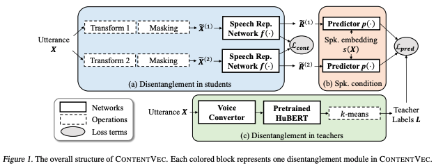
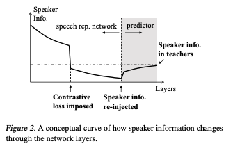

These are my notes from the paper [ContentVec: An Improved Self-Supervised Speech Representation by Disentangling Speakers](https://arxiv.org/abs/2204.09224) by Kaizhi Qian, Yang Zhang, Heting Gao, Junrui Ni, Cheng-I Lai, David Cox, Mark Hasegawa-Johnson, Shiyu Chang

## Abstract

ContentVec is a method for building an [Embedding](../../permanent/embedding.md) representation of speech, that "disentangles" content information from speech. This representation is useful for many downstream tasks like [Voice Conversion](../../../voice-conversion.md).

Typically [Speaker Disentanglement](../../../../permanent/speaker-disentanglement.md) is hard because it causes content loss. ContentVec fixes this. They modify the [HuBERT](../../permanent/hubert.md) framework, and incorporates disentangling mechanisms to regularise the teachers (masked prediction labels) and the student (learned representations).

## Introduction

State-of-the-art for many speech processing problems with low volume of data, is a [Self-Supervised Learning](../../permanent/self-supervised-learning.md) pre-training.

The SSL training aims to build a speech representation using a large-scale unannotated corpora to capture meaning information about speech structures. We can then take the representation and apply to training downstream tasks with a small amounts of data.

The best representations are ones that can disentangle content info in speech, from other interference like speaker variations.

The [HuBERT](../../permanent/hubert.md) representation can achieve a speaker identification accuracy of up to 81.4% on the [SUPERB: Speech processing Universal PERformance Benchmark](papers-superb.md) benchmark. Therefore, it's assumed that the representation might do better if we disentangle speaker information.

But disentangling speakers is hard.

Because we don't have text annotations, removing speaker variations from speech can lead to loss of content info. And generally, that's not what you want for a speech representation.

Papers tries to answer 2 question:

* Can you disentangle speaker variations during SSL without significant content loss?
* Second research question: how much performance gain, if any, can speaker disentanglement in SSL features contribute to downstream tasks?

For the first question, they propose ContentVec, an SSL framework that is adapted from the HUBERT training paradigm.

The key idea of HUBERT is that by having some relatively poor speech representations, such as [Mel-frequency Cepstral Coefficients](Mel-frequency%20Cepstral%20Coefficients), serve as the
teacher labels for the masked prediction task, one can derive speech representations (which are sometimes referred to as students) that are far better than the teachers in many aspects, including content preservation. This inspires us that by combining HUBERT’s teacher-student framework with speaker disentanglement techniques, we could potentially restore the content loss caused by the latter.

This has led us to the design of CONTENTVEC, which incorporates into HUBERT three disentangling mechanisms:

* disentanglement in teachers
* disentanglement in students
* speaker conditioning

Specifically, disentanglement in teachers refers to removing the speaker information
from the teacher labels.

Disentanglement in students refers to introducing a regularization loss that directly enforces speaker invariance on the speech representations.

Speaker conditioning refers to inputting speaker information to the masked prediction task, so that the need for the speech representation to encode speaker information is relieved.

As we will show, all three modules are essential in shaping the speaker information flow across the speech representation network layers, and thereby achieve a superior disentanglement quality while keeping the content information intact.

The second research question we would like to explore is:
How much performance gain, if any, can speaker disentanglment in SSL features contribute to downstream tasks? Our
extensive evaluation shows that speaker disentanglement
can achieve a consistent performance advantage over the
baseline speech representations on content-related applications. The findings of this paper can shed some light on
next-generation speech representations that can supply more
targeted information to the downstream tasks and enable
more powerful content processing directly on speech.

* Our extensive evaluation shows that speaker disentanglement can achieve a consistent performance advantage over the baseline speech representations on content-related applications. The findings of this paper can shed some light on next-generation speech representations that can supply more targeted information to the downstream tasks and enable more powerful content processing directly on speech.

### 2. Related Work

[Voice Conversion](../../../voice-conversion.md) is among the first research areas where speaker disentanglement is explored.

The general trend follows the analysis-synthesis framework, where the analysis stage learns a speaker-independent speech representation that only preserves the content, and the synthesis stage uses the speaker-independent speech representation and the speaker-related variations to synthesize the conversion results.

Much research focuses on learning better linguistic representations during the analysis stage and/or injecting speaker variations better during the synthesis stage.

VAE-VC (Hsu et al., 2016) is an early attempt of directly using VAE for voice conversion.

Afterward, Chou et al. (2018) disentangles more speaker variations from the latent representation by discouraging the latent representation to be classified as the source speaker using an auxiliary speaker classifier on the latent representation.

In contrast, ACVAE-VC (Kameoka et al., 2019) indirectly encourages more speaker disentanglement by encouraging the conversion output to be correctly classified as the source speaker.

Inspired by image style transfer, StarGAN, VC (Kameoka et al., 2018), StarGAN-VC2 (Kaneko et al.,
2019b), CycleGAN-VC (Kaneko & Kameoka, 2018), and
CycleGAN-VC2 (Kaneko et al., 2019a) adapted StarGAN
(Choi et al., 2018) and CycleGAN (Zhu et al., 2017) respectively for voice conversion.

AutoVC (Qian et al., 2019)
disentangles speakers and content by directly tuning the
bottleneck dimensions of a vanilla autoencoder

The following AutoVC-F0 (Qian et al., 2020a) improves pitch disentanglement by conditioning the synthesis stage on pitch representations.

VoiceMixer (Lee & Kim, 2021) improves the content loss of AutoVC using similarity-based downsampling as the bottleneck.

AdaIN-VC (Chou et al., 2019) uses instance normalization to normalize out the speaker variations in the analysis stage, and AGAIN-VC (Chen et al., 2021) additionally uses an activation function to constrain the speaker variations from flowing into the synthesis stage.

Instead of pursuing extreme speaker disentanglement, another slightly different track of research encourages the synthesis stage to use the supplied speaker variations by using partially disentangled content representations combined with speaker variations that are easier for the synthesis stage to utilize.

SpeechSplit (Qian et al., 2020b), AutoPST (Qian
et al., 2021), and NANSY (Choi et al., 2021) perturb the speaker variations during the analysis stage to encourage the synthesis stage to use the supplied more stable speaker representations.

In particular, Polyak et al. (2021) and NANSY start with the self-supervised speech representations as the partially disentangled content representation.

Self-supervised Learning in Speech Learning selfsupervised speech representation usually encodes the speech
feature into context representations followed by pretext
tasks to extract content information, which mainly has two
tracks

. The first track is generative learning. Chung et al.
(2019); Chung & Glass (2020) uses Autoregresstive Predictive Coding (APC) for self-supervised representation
learning. Mockingjay (Liu et al., 2020) learns speech representation by predicting the current frame given both the past
and future contexts

TERA (Liu et al., 2021) learns speech
representation by reconstructing acoustic frames from their
altered counterparts.

DeCoAR 2.0 (Ling & Liu, 2020) reconstructs the frames from their vector-quantized counterparts. Wang et al. (2020) reconstructs masked frames. T

The second track is discriminative. van den Oord et al. (2018) uses constrastive predictive coding to learn multi-modal represenations including speech.

Wav2vec (Schneider et al., 2019) learns to predict the future samples from distractors.

Wav2vec 2.0 (Baevski et al., 2020b), an end-to-end version
of vq-wav2vec (Baevski et al., 2020a), learns to identify the
true vq-quantized frame among the distractors using contrastive loss.

s. Kharitonov et al. (2021) significantly improves
CPC-based SSL with speech data augmentation. Zhang et al.
(2020) pushes the limits of SSL using noisy student training by giant Conformer models pre-trained using wav2vec
2.0

Hubert (Hsu et al., 2021) predicts masked frames pre-
CONTENTVEC: An Improved Self-Supervised Speech Representation by Disentangling Speakers
quantized using k-means. ILS-SSL (Wang et al., 2021) further improves Hubert by adding masked prediction loss on
intermediate layers. Besides, there are also research using
multiple tasks (Pascual et al., 2019; Ravanelli et al., 2020;
Chung et al., 2021) or using both labeled and unlabeled data
(Wang et al., 2020).

## Approach

In this section, we will introduce of our approach. We use
upper-cased latters, X and X, to represent random scalars
and vectors, respectively, and lower-cased latters, x and x,
to represent deterministic scalars and vectors, respectively.

### 3.1. Problem Formulation

Denote X = [X1, · · · , XT ] as the sequence of a speech
features, where Xt is the speech feature vector at frame
t, and T is the total number of frames. Our goal is to
learn a speech representation network R = f(X), where
R = [R1, · · · , RT ] and Rt is the representation for frame t.
R should desirably satisfy the following two properties.
* R should preserve as much content information as possible, and the content information roughly corresponds
to the phonetic/text transcriptions of the utterance.
* R should be invariant across speaker variations.
As mentioned, the pursuit of one goal can easily compromise another. In the following , we will describe our method
to strike a better balance and discuss the rationale behind.

### 3.2 The General Framework

The CONTENTVEC framework builds upon the maskprediction framework of HUBERT. Specifically, there are
three components in the HUBERT framework: 1) the
speech representation network f(·), 2) the predictor p(·),
and 3) the teacher label generator g(·).

During training, the speech representation network takes
the partially masked speech utterance, X˜ , as the input, and
produces a representation for the masked speech sequence,
R˜ = f(X˜ ).

On the other hand, the teacher label generator
generates a label sequence L = g(X) from the unmasked
speech.

The goal of the predictor is to predict the teacher
labels L from the masked speech representation R˜. The
teacher label generator g(·) is usually predefined and fixed
during training. The other two modules, f(·) and p(·), are
trained jointly to minimize the following prediction loss:
Lpred = E[`m(p ◦ f(X˜), g(X))],

where `m denotes the cross-entropy loss computed over the
masked frames only. To make our description more intuitive,
we will refer to f(X˜ ) as students, and g(X) as teachers.

It has been reported (Hsu et al., 2021) that even if the HUBERT teacher is poor (e.g., losing content), the student can
still preserve the content far better than the teacher, thanks
to the masked prediction mechanism

This observation inspires us to test the hypothesis that one can combine speaker
disentanglement techniques (potentially causing loss of content) with the masked prediction framework, and in this way,
preserve content more faithfully than using a speaker disentanglement algorithm on its own. Since teachers, students,
and the predictor are three major components of the masked
prediction, CONTENTVEC introduces three disentanglement
mechanisms, disentanglement in teachers, disentanglement
in students, and speaker conditioning, to tackle the three
components respectively, as shown in Figure 1

### 3.3. Disentanglement in Teachers

Disentanglement in teachers aims to remove the speaker information in the teacher labels. Recently, there has been
marked progress in unsupervised voice conversion systems, which can now significantly obscure the source speaker information without losing too much content (Polyak et al., 2021). Inspired by this, we adopt a voice conversion model to convert all utterances to the same speaker before generating the teacher labels.

Specifically, as shown in Figure 1(c), the teacher labels,
L = g(X), are generated via the following three steps. First,
all the utterances X in the training set are converted to a
single speaker using a competent unsupervised voice conversion system. Second, the converted utterances are passed
through a pre-trained unsupervised speech representation
network, in our case HUBERT, to generate a set of speech
representations, which should contain very little speaker information. Finally, the speech representations are quantized
to discrete teacher labels using k-means clustering.

It is worth noting that although the teacher speech representation described above already achieves speaker disentanglement, its content preservation is not satisfactory because
any voice conversion systems sometimes (for some speakers) cause a non-negligible content loss (Choi et al., 2021).
In order to ameliorate this shortcoming of modern voice
conversion, we use voice conversion as a teacher to train
better students, instead of directly applying its output to
downstream tasks.

### 3.4. Disentanglement in Students

Disentanglement in students enforces speaker-invariant student representations, which can be achieved with SIMCLR
(Chen et al., 2020), a [Contrastive Loss](../../permanent/contrastive-loss.md) algorithm.

Specifically, as shown in Figure 1(a), each speech utterance,
X, is passed into two random transformations that alter only
the speaker information, before it is masked.

Denote the two
CONTENTVEC: An Improved Self-Supervised Speech Representation by Disentangling Speakers
Utterance
!
Transform 1 Speech Rep.
Network " ⋅ Masking !$ ! %$ !
Transform 2 Speech Rep.
Network " ⋅ Masking !$ "
ℒ#$%&
Utterance ! Voice
Convertor
Pretrained
HuBERT '-means
Predictor p ⋅
%$ " Predictor p ⋅
Spk. embedding
( ! ℒ'()*
Teacher
Labels )
(a) Disentanglement in students (b) Spk. condition
(c) Disentanglement in teachers
Networks
Operations
Loss terms
Figure 1. The overall structure of CONTENTVEC. Each colored block represents one disentanglement module in CONTENTVEC.
masked, transformed copies of X as X˜ (1) and X˜ (2). Then,
this pair of utterances are passed through the speech represetnation network, f(·), to generate the representations R(1)
and R(2), and the following contrastive loss is introduced to
penalize dissimilarity between R(1) and R(2):

where cossim(·, ·) denotes the cosine similarity, and It denotes a set of random time indices at which the representations are chosen as the negative examples for time t. T

The
contrastive loss consists of two terms so that it is symmetric
with respect to R(1) and R(2). According to Equation (2),
the negative examples for the utterance pair, (R
(1)
t
, R
(1)
t
),
are uniformly randomly drawn from the remaining frames
within the same utterances. As an extention to Equation (2),
the contrastive loss can be applied to an intermediate layer,
instead of the final layer, of f(·). Section 3.6 will discuss
how the choice of layer in which the contrastive loss is
imposed would affect the disentanglement behavior.

The biggest challenge of applying the contrastive loss is
how to design a random transformation that only alters the
speaker identity of the utterance with minimal changes in the
other aspects. To this end, we adopt the random transformation algorithm proposed by Choi et al. (2021). Specifically,
the algorithm consists of three steps of transformations.

First, all the formant frequencies within an utterance are
scaled by a factor of ρ1; second, F0 in every frame is scaled
by a factor of ρ2; finally, a random equalizer is applied to
accommodate any channel effects.

ρ1 and ρ2 are both randomly drawn from the uniform distribution U([1, 1.4]), and
then flipped to their reciprocals with probability 0.5. Since
the majority of voice information resides in the formant frequency and F0 frequency ranges (e.g., (Eide & Gish, 1996)),

while content information resides in the relative formant
frequency ratios (Stevens, 1987), uniform scaling of all the
formant and F0 tends to change the speaker information
while retaining the content.

To further strengthen the invariance, the same random transformations are also applied to the student representations in
the masked prediction task, i.e., Equation (1) is modified as
Lpred = E[`m(p ◦ f(X˜(1)), g(X)) + `m(p ◦ f(X˜(2)), g(X))].
(3)
Again, the masked prediction loss is applied to both f(X˜ (1))
and f(X˜ (2)) for symmetry.

### 3.5. Speaker Conditioning

Although disentanglement in teacher can remove the majority of the speaker information from the teacher labels,
certain speaker information would remain

As a result, the student representations are undesirably forced to carry the same amount of speaker information as the teachers do in order to reasonably predict the teacher labels.

To break this entailment between the speaker information in students and in teachers, we feed the speaker embeddings to the predictor.

Speaker embeddings are produced by a speaker embedding network, in our case a pre-trained GE2E (Wan et al., 2018), which takes a speech utterance as input and outputs a vector summarizing the speaker information in the utterance.

Therefore, by conditioning the predictor on the speaker embedding, we can supply whatever speaker information is
needed for the mask prediction task, so that the students do
not have to carry the speaker information themselves.

Formally, the masked prediction loss now becomes

Lpred =E[`m(p(f(X˜1), s(X)), g(X))
* `m(p(f(X˜2), s(X)), g(X))],

where s(X) denotes the speaker embeddings.

The final loss
is the superposition of the prediction and contrastive losses:
L = Lpred + λLcontr.

As can be observed, although CONTENTVEC requires
speaker labels to identify speaker information, speaker labels are only used in pre-training the speaker embedding
network.

The training of CONTENTVEC itself only requires
speaker embeddings, not speaker labels. Since the speaker
embedding network is pre-trained on a separate dataset, and
can well generalize to unseen speakers, the training set for
CONTENTVEC does not need to contain any speaker labels.

### 3.6. An Information Flow Perspective

To provide an intuitive illustration of how the aforementioned modules work collaboratively towards disentangling
speakers, Figure 2 shows a conceptual curve of how the
amount of speaker information changes along different layers of the speech representation network f(·) and the predictor p(·).

The vertical axis denotes the amount of speaker
information, and the horizontal axis denotes the number of
layers

 The white area denotes the speech representation network layers, and the grey area denotes the prediction layers,
which are on top of the speech representation network.

To
the left, the speaker information is equal to the full speaker
information in the input utterance. To the right, the speaker
information should be roughly equal to the speaker information in the teacher labels, which is much lower than that in
the input but is still not zero. Due to the information processing inequality, the speaker information is monotonically
decreasing as the layer progresses, except for the predictor
layers where speaker information is re-injected

As can be observed, there are two places where the speaker
information undergoes abrupt changes. The first is where the
contrastive loss (Equation (2)) is imposed, and the speaker
information is largely reduced.

The second is where the
speaker information is re-injected, and the speaker information slightly increases.

As a result, the speaker information
should reach its minimum at the intersection between the
speech representation network and the predictor. Figure 2
shows that all the modules in CONTENTVEC are essential
to a successful speaker disentanglement.

## 4. Experiments

In this section, we will evaluate CONTENTVEC on an extensive set of content-related tasks. In particular, we would
like to investigate whether disentangling speakers has benefit in real-world tasks, and how large the benefit would be.
Further experimental details can be found in Appendix B.

### 4.1. Configurations

Implementation Details The speech representation network of CONTENTVEC has the same architecture as
HUBERT. According to Section 3.6, the speakerdisentanglement is optimal at the output of the speech representation network, so we select the output-layer representation as the CONTENTVEC features. The contrastive
loss is imposed at the last but five layer, the temperature k is set to 0.1, and the contrastive loss weight λ =
1e-5 ∗ num train steps, which linearly increases to 10
when training for 100k steps. A parameter sensitivity evaluation will be provided in Section 4.7.

The predictor of CONTENTVEC contains three transformer
layers without layer drop. The frame masking scheme and
prediction logit generation for the masked prediction task
are the same as HUBERT.

To generate the teacher labels, we use the voice converter
proposed by Polyak et al. (2021). We re-train the voice
converter on a subset of 200 speakers chosen from the
Librispeech dataset (Panayotov et al., 2015), using the
publicly-released HUBERT base model2 with 100 clusters. The model checkpoint that gives the highest average target speaker similarity is selected. The teacher
utterances are then generated by converting the entire
Librispeech-960h to the voice of that selected target
speaker with the selected model. After passing the converted utterance to the pretrained HUBERT, the seventh
layer feature representation is chosen, because compared
with the commonly chosen sixth, the seventh layer has a
lower speaker classification accuracy and yet comparable
teacher quality (Hsu et al., 2021). The number of clusters
for quantizing final teacher labels is 100

Baselines and Dataset The following baselines are included in the evaluation.

* WAV2VEC 2.0 (Baevski et al., 2020b): Following Lakhotia et al. (2021), the 14th layer representation is chosen.
* HUBERT (Hsu et al., 2021): We adopt the publiclyreleased pretrained model in Ott et al. (2019). Following Hsu et al. (2021), the sixth layer representation is chosen.
* HUBERT-ITER: Since CONTENTVEC is guided by a https://github.com/pytorch/fairseq/tree/pretrained HUBERT as teachers, for a fair comparison, we
introduce another HUBERT baseline that is trained by the same pretrained HUBERT as teachers (except that no voice conversion is performed). This baseline controls the benefit of iterative training. We performed the same teacher quality evaluation as in Hsu et al. (2021), and identified layer eight as the best performing layer.
* CONTENTVEC and all the baselines are trained on the
Librispeech dataset (Panayotov et al., 2015). If the
evaluation task requires discrete representations, all the representations will be quantized to 100 clusters by k-means.
Otherwise, the continuous representations will be used.

4.2. Zero-shot Content Probe
The first set of experiments we would like to evaluate is the
set of zero-shot probing tasks proposed in the Zero-Resource
Speech Challenges (Riviere & Dupoux ` , 2021; Dunbar et al.,
2021), because they require a high alignment between the
discrete representation and phonetic content. For some of
these tasks, a language model trained on the discrete speech
representations is needed. We use the same language model
and hyperparameter setting as in Lakhotia et al. (2021),
which is the transformer LM big architecture implemented
in fairseq (Ott et al., 2019). We evaluate on four tasks.

4.2. Zero-shot Content Probe
The first set of experiments we would like to evaluate is the
set of zero-shot probing tasks proposed in the Zero-Resource
Speech Challenges (Riviere & Dupoux ` , 2021; Dunbar et al.,
2021), because they require a high alignment between the
discrete representation and phonetic content. For some of
these tasks, a language model trained on the discrete speech
representations is needed. We use the same language model
and hyperparameter setting as in Lakhotia et al. (2021),
which is the transformer LM big architecture implemented
in fairseq (Ott et al., 2019). We evaluate on four tasks.

ABX(w): Given a pair of words with one difference in
phoneme and a test word containing the same phoneme as
one of the two words, ABX measures the probability that the
test phoneme representation is closer to the representation
of the correct phoneme in the word pair than to that of the
incorrect phoneme. ‘(w)’ indicates that the comparison is
‘within’ the same speaker.

ABX(a): Same as ABX(w), except that the test utterance
is uttered by a different speaker. ‘(a)’ indicates that the
comparison is ‘across’ different speakers.

Spot the Word (Lexical): Spot the word measures the
accuracy of identifying the correct word from a pair of
real/fake words, based on the perplexity of the language
model.

Acceptability Judgment (Syntactic): Acceptability
judgement measures the accuracy of identifying the syntactically correct sentence from a pair of correct/incorrect
sentences, based on the perplexity of the language model.

Table 1 (left four columns) shows the results of the zeroshot probing tasks. There are three key observations. First,
CONTENTVEC achieves consistent advantage on all four
metrics, demonstrating that speaker disentanglement does
help in these tasks.

However, the size of the performance
gain varies across different tasks and across different number
of clusters. The benefit is largest for the phonetic-level tasks,
ABX(w) and ABX(a). On the other hand, for lexical- and
semantic-level tasks, the benefit is smaller. We believe
that this is because the performance in these tasks not only
depends on the quality of the speech representation, but
also on the language model.

 Our second observation is that
HUBERT-ITER consistently outperforms HUBERT, which
confirms that there is a benefit in iterative training, and this
is why it is very important to include HUBERT-ITER as a
baseline for a fair comparison

Finally, note that there is
a slight difference between our results for HUBERT and
the results reported in Lakhotia et al. (2021). This is likely
because the publicly-released model that we use is different
from the model used in Lakhotia et al. (2021), in terms of
number of clusters in teachers, batch size, the number of
GPUs etc. However, since CONTENTVEC and HUBERTITER are both derived from HUBERT, we expect a similar
performance gap among these three methods if a different
HUBERT model is used.

### 4.3. Language Modeling

Language models built directly on the discrete speech representations can be applied to many content-related speech
generation and analysis tasks.

We would like to explore
whether a disentangled speech representation can contribute
to a language model with higher quality.

To this end, we
use the same language models as in Section 4.2 to generate random speech representation sequences under different
temperatures, and resynthesize speech from these sequences
using TACOTRON as in Lakhotia et al. (2021).

For each temperature level, we compute the perplexity (PPX) and variety
(VERT) score of the transcript as proposed in Lakhotia et al.
(2021). All the PPX-VERT pairs at different temperature
levels form a curve depicting the quality-variety trade-off of
each language model. We report the following three metrics.

PPX at oracle VERT: The perplexity score when the
VERT score equals the VERT score of true text.
* VERT at oracle PPX: The VERT score when the PPX
CONTENTVEC: An Improved Self-Supervised Speech Representation by Disentangling Speakers
Table 2. Results on SUPERB tasks within “Content” and “’Semantics” categories.
Tasks PR ASR KS QbE IC SF
Metrics PER ↓ WER ↓ ACC ↑ MTWV ↑ ACC ↑ F1 ↑ CER ↓
CONTENTVEC 0.049 5.7 0.964 0.0590 0.991 0.896 0.236
HUBERT-ITER 0.052 6.5 0.963 0.0891 0.983 0.886 0.259
HUBERT 0.054 6.4 0.963 0.0736 0.983 0.885 0.256
score equals the PPX score of the true text.
* AUC: Area under the perplexity-VERT curve.

Table 1 (right columns) shows the results. As can be seen,
CONTENTVEC achieves a significantly lower PPX score
than all the baselines and a slightly lower VERT score.
This indicates that the improvement in speaker disentanglement contributes to the correctness of the language model.
This observation shows that speaker disentanglement significantly helps in improving the speech generation quality.
Some qualitative results are shown in Appendix A.

### 4.4. SUPERB Experiments

To extend our evaluation to supervised tasks, we use SUPERB (Yang et al., 2021), a benchmark dataset containing
an extensive list of supervised speech processing tasks. We
select the subset of tasks belonging to the categories of
“content” and “semantic.”

These tasks include phone recognition (PR), automatic speech recognition (ASR), keyword
spotting (KS), Query by Example Spoken Term Detection
(QbE), intent classification (IC), and slot filling (SF). Detailed descriptions of these tasks can be found in Yang et al.
(2021). During the training of these tasks, the speech representation networks are frozen.

Unlike the tasks discussed in the previous sections, the SUPERB tasks use the continuous representations rather than
the discrete ones.

Therefore, the HUBERT baseline, which
is trained with a 500-class teacher and prolonged training
iterations, is expected to provide more information than do
CONTENTVEC and HUBERT-ITER, which are both trained
with a 100-class teacher.

Therefore, we retrain HUBERT
and HUBERT-ITER with matched number of teacher clusters and training iterations for a fair comparison. Table 2
lists the results on the SUPERB tasks. We can observe that
CONTENTVEC generally outperforms both HUBERT-ITER
and HUBERT. This observation verifies that the benefit of
speech disentanglement can generalize to content-related
supervised tasks.

### 4.5 Speaker & Accent Classification

Speaker identification serves as a proxy for speaker disentanglement. In addition, we are also interested in whether
our speaker disentanglement algorithm removes regional accents or not: is regional accent primarily communicated by
phoneme content, or by speaker-dependent style?

We therefore evaluate the quality of speaker disentanglement on the
speaker identification task (SID) in the SUPERB benchmark,
and an accent classification task using the L2-ARCTIC
dataset, which contains 7 accent groups

Figure 3 plots the accuracy of the two classification tasks.
As can be seen, CONTENTVEC sharply reduces the accuracy
in both tasks.

In the SID task, the reduction is as high as
36% compared to the HUBERT-ITER, indicating that the
speaker disentanglement mechanisms in CONTENTVEC are
very effective.

HUBERT-ITER has a slightly lower SID
accuracy than HUBERT, which shows that iterative training
reduces the amount of speaker information.

In the accent
classification task, the reduction is also significant, which
verifies that disentangling speaker information also reduces
accent information to some degree.

### 4.6 Voice Conversion

The existing mainstream voice conversion systems follow an encoder-decoder paradigm, where the encoder derives a speech representation with speaker information disentangled and the decoder synthesizes the speech signal conditional on speaker embedding/labels.

Polyak et al. (2021) further
shows that a decoder built directly on top of self-supervised
speech representations suffices to produce state-of-the-art
voice conversion results

 To evaluate whether the advantage
of speaker disentanglement in CONTENTVEC translate to
better voice conversion, we run the voice conversion model
in Polyak et al. (2021) on CONTENTVEC and other baseline
speech representations and evaluate the speaker similarity
of the converted speech to the target speaker

 Instead of
CONTENTVEC: An Improved Self-Supervised Speech Representation by Disentangling Speakers
Table 3. Average cosine similarity (↑) of the d-vectors between the
converted speech based on different speech representations and the
target speakers.
Setting C2C O2C C2O O2O
CONTENTVEC 0.9316 0.9277 0.9150 0.9257
HUBERT-ITER 0.9286 0.9243 0.9050 0.9215
HUBERT 0.9029 0.8982 0.8848 0.9036
using discrecitized speech representations as in Polyak et al.
(2021), we consider a much more challenging setting where
the continuous speech representations are used. The models
are trained and evaluated on Librispeech. Our test set
contains the same speakers as the training set. To reduce the
evaluation complexity, while the source speakers are from
the entire test set, the target speakers are from a subset of
20 speakers, 10 are from the ‘clean’ subset and 10 are from
the ‘other’ subset. Our evaluation is thus divided into four
scenarios, clean to clean (C2C), clean to other (C2O), other
to clean (O2C), and other to other (O2O).

Table 3 shows the average cosine similarity of the d-vectors
(Heigold et al., 2016) between the converted speech and the
target speakers. As can be observed, thanks to the inherent
speaker disentanglement capability of the neural decoder,
the HUBERT-based voice conversion model already has
a decent speaker similarity, which is consistent with the
findings by Polyak et al. (2021). However, CONTENTVEC
is able to further advance the performance by a significant
margin, further verifying the advantage of CONTENTVEC’s
speaker disentanglement quality. We also observe that
HUBERT-ITER, which has a slightly better speaker disentanglement property according to Section 4.5, also improves
over HUBERT in terms of speaker similarity in this task.

### 4.7. Ablation Studies

This section evaluates different variants of CONTENTVEC to
understanding the contribution of each model design choice.
Since there are a large number of models, we only select
the following three efficient yet representative metrics: the
phone normalized mutual information between the discrete
representations and ground truth phonetic unit (PNMI) proposed in Hsu et al. (2021), ABX(w) accuracy, and ABX(a)
accuracy. For each model variant, we report the best-layer
results under each respective metric.

## 5. Conclusions

In this paper, we propose CONTENTVEC, which is a speech
representation learning network that aims to remove speaker
information while preventing loss of content information.
CONTENTVEC builds upon the HUBERT framework and
introduces three key disentanglement components: disentanglement in teachers, disentanglement in students, and
teacher conditioning of the predictor.

Our empirical analyses confirm that all three modules are essential to the success of CONTENTVEC. We also verified that a successful
speaker disentanglement does help with a wide range of
content-related speech processing tasks. Meanwhile, CONTENTVEC still have some limitations, e.g. slight content loss
and the lack of hyperparameter selection method. Finding
solutions to these problems will be our future directions.
