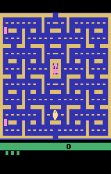
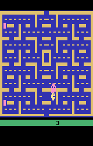

*My summary (still a draft) of the paper [Playing Atari with Deep Reinforcement Learning](https://arxiv.org/abs/1312.5602) by Volodymyr Mnih, Koray Kavukcuoglu, David Silver, Alex Graves, Ioannis Antonoglou, Daan Wierstra, Martin Riedmiller*

## Overview

In late 2013, DeepMind researchers published a Reinforcement Learning approach called [Deep Q-Networks](../../permanent/deep-q-networks.md), which was one of the first deep learning models that could successfully "learn control policies" (i.e. play games), only from observing the raw pixels from the game.


This paper was published about one month before Google announced it would acquire DeepMind in January 2014.

In this article, I'm going to walk through the architecture they described in the paper, and attempt to implement it using [MLX](https://github.com/ml-explore/mlx) (which is a library I've been meaning to play with).

## High-Level

The paper describes a [CNN](../../permanent/convolutional-neural-network.md) architecture to process game frames, and the final layers predicted the expected future rewards (i.e. the game score) by taking each available action (i.e. move up, move left, etc). The influential [[AlexNet]] paper had just been released a year earlier, leading to an explosion of experimentation with CNNs.

A naive approach to processing frames from the games could be to process a sequential batch of frames at each training step. However, these frames would be strongly correlated. Instead, they used a technique, from a 1993 attempt to train a robotic policy using neural networks, called **Experience Replay**, which effectively stores a history of game states, their corresponding score (rewards) from action taken, and samples from this each training step.

In practice, the agent plays randomly for a bit, gets the rewards throughout the game, and then uses a neural network to predict the rewards. As the model trains, the agent increasingly uses the model to take the optimal action, which balances exploiting and exploring.

The paper was also made possible thanks to the [The Arcade Learning Environment (ALE)](https://jair.org/index.php/jair/article/view/10819), released a year prior, which provides an evaluation methodology and toolkit for testing RL agents in Atari games. They test 7 Atari 2600 games, outperforming all previous approaches, and human experts on three games.

## Approach Detail

### Architecture

They describe the model as follows:

> The input to the neural network consists of an 84 × 84 × 4 image produced by $\phi$. The first hidden layer convolves 16 8 × 8 filters with stride 4 with the input image and applies a rectifier nonlinearity. The second hidden layer convolves 32 4 × 4 filters with stride 2, again followed by a rectifier nonlinearity. The final hidden layer is fully connected and comprises 256 rectifier units. The output layer is a fully connected linear layer with a single output for each valid action. The number of valid actions varied between 4 and 18 in the games we considered.

So that's two conv layers with [ReLU](../../permanent/relu.md), followed by two fully-connected layers. In an MLX model, that might look like this:

```python
import mlx.core as mx
import mlx.nn as nn

class DQN(nn.Module):
    def __init__(self, num_actions: int):
        super().__init__()
        self.conv1 = nn.Conv2d(in_channels=4, out_channels=16, kernel_size=8, stride=4)
        self.conv2 = nn.Conv2d(in_channels=16, out_channels=32, kernel_size=4, stride=2)

        self.fc1 = nn.Linear(2592, 256)  # 9x9x32 = 2592
        self.fc2 = nn.Linear(256, num_actions)

    def __call__(self, x):
        # MLX expects height, width, channels, and needs float, not int, representations.
        x = x.transpose(0, 2, 3, 1) / 255.
        x = nn.relu(self.conv1(x))    # (batch, 84, 84, 4) -> (batch, 20, 20, 16)
        x = nn.relu(self.conv2(x))    # -> (batch, 9, 9, 32)
        batch_size = x.shape[0]
        x = x.reshape(batch_size, -1) # -> (batch, 2592)
        x = nn.relu(self.fc1(x))      # -> (batch, 256)
        x = self.fc2(x)               # -> (batch, num_actions)
        return x

batch_size = 32
num_actions = 5
frame_stack = 4
input = mx.random.normal((batch_size, frame_stack, 84, 84))

model = DQN(num_actions)
output = model(input)
print(output.shape)  # (32, 4)
```

### Dataset

The ALE provides an evaluation set built on top of the [Stella](https://stella-emu.github.io/) an Atari emulator, and is maintained by the Farama Foundation. Farama also maintains the Gymnasium library, a handy toolkit for testing reinforcement learning agents.

I'm going to load the Pacman game, which requires only a few lines of code:

```python
import gymnasium as gym
import ale_py

env = gym.make("ALE/Pacman-v5")
```

The environment that Gymnasium provides has a few different ways of interacting, but for this purpose, we can reset the game with the `reset()` method, which gives us the state of the game and some info about the game.

```python
state, info = env.reset()
print(state.shape)
print(info)
```

The state of the game is just a numpy image, which we can take a look at:

```python
from matplotlib import pyplot as plt

plt.title("Pacman State")
plt.axis("off")
plt.imsave(PUBLIC_MEDIA_DIR / "pacman_state_1.png", state)
```



We can take an action in the game, by passing one of the actions represented as an integer into `step(action: int)`. Where 0 is noopt, and 1, 2, 3, 4 is up, right, left, down, respectively.

For example, if I go right for 100 frames, and print the game state, you can see we've moved to the right:

```python
for i in range(100):
    state, reward, terminated, truncated, info = env.step(2)

plt.title("Pacman State after moving to the right")
plt.axis("off")
plt.imsave(PUBLIC_MEDIA_DIR / "pacman_state_2.png", state)
```



We can use the RecordVideo wrapper to record a video of the agent exploring the space with a random policy.

```python
import gymnasium as gym
import ale_py
import random

env = gym.wrappers.RecordVideo(
    gym.make("ALE/Pacman-v5", render_mode="rgb_array"),
    video_folder=PUBLIC_MEDIA_DIR / "pacman_ale",
    episode_trigger=lambda episode_id: True
)

observation, info = env.reset()

done = False
while not done:
    action = random.choice(range(env.action_space.n))
    observation, reward, terminated, truncated, info = env.step(action)
    done = terminated or truncated

env.close()
```

<video controls loop><source src="../../_media/pacman_ale/rl-video-episode-0.mp4" type="video/mp4"></video>

### Preprocessing

The preprocessing from the paper converts the RGB representation into grayscale and puts four consecutive frames together, representing one game state. This exact processing is provided by the `AtariPreprocessing` wrapper in Gymnasium:

```python
import gymnasium.wrappers as wrappers

env = gym.make("ALE/Pacman-v5", frameskip=1)
env = wrappers.AtariPreprocessing(env)
```

```python
obs, _ = env.reset()
plt.imsave(PUBLIC_MEDIA_DIR / "pacman_preprocessed.png", obs, cmap="grey")
```


Now we can stack the last N timesteps together, which is how a single observation is recognised.

```python
env = wrappers.FrameStackObservation(env, stack_size=4)
```

Which might look something like this:


### $\epsilon$-greedy policy

A key component of Reinforcement Learning is the tradeoff between **exploring** and **exploiting**. The is, we need to ensure that the model takes enough random actions to examine the space adequately, but also follows the policy it is learning at times, so that it makes progress when going in the correct direction (see [Exploration-Exploitation Dilemma](../../../../permanent/exploration-exploitation-dilemma.md)).

They set an epislon parameter which slowly anneals (changes throughout training), starting at 1, always selecting random, and gradually going to 0.1, where only 10% of the time we are going random, the rest we are using the highest reward action, as predicted by the model so far.

> The behavior policy during training was $\epsilon-greedy$ with  annealed linearly from 1 to 0.1 over the first million frames, and fixed at 0.1 thereafter.

```python
epsilon = 1.0  # Epsilon greedy parameter
epsilon_min = 0.1  # Minimum epsilon greedy parameter
epsilon_max = 1.0  # Maximum epsilon greedy parameter
epsilon_interval = (
    epsilon_max - epsilon_min
)  # Rate at which to reduce chance of random action being taken
epsilon_greedy_frames = 1000000.0


def get_next_action(epsilon):
    if epsilon > random.random():
        action = mx.random.randint(0, env.action_space.n).item()
    else:
        action = mx.argmax(model(mx.expand_dims(state, 0))).item()
    return action


def anneal_epsilon(epsilon):
    epsilon -= epsilon_interval / epsilon_greedy_frames
    epsilon = max(epsilon, epsilon_min)
    return epsilon
```

### Experience Replay

They utilise an idea from early RL and neural network experiments, all the way back from 1993, called **Experience Replay Buffers**, where they store an agents experience's at each timestep, $e_t = (s_t, a_t, r_t, s_{t+1})$.

> we utilise a technique known as experience replay [13] where we store the agent's experiences at each timestep, $et = (st, at, rt, st+1)$ in a dataset $D = e1, ..., eN$, pooled over many episodes into a replay memory. During the inner loop of the algorithm, we apply Q-learning updates, or minibatch updates, to samples of experience, $e ∼ D$, drawn at random from the pool of stored samples.

```python
from typing import List
from collections import namedtuple
from pydantic import BaseModel

Experience = namedtuple('Experience', ['state', 'action', 'reward', 'state_next', 'done'])

class ReplayBuffer:
    """Experience replay buffer to store and sample transitions."""
    def __init__(self, capacity: int):
        self.buffer = deque(maxlen=capacity)
    
    def add(self, experience: Experience):
        self.buffer.append(experience)
    
    def sample(self, batch_size: int) -> List[Experience]:
        batch = random.sample(self.buffer, batch_size)
        states = mx.stack([exp.state for exp in batch])
        actions = mx.array([exp.action for exp in batch], dtype=mx.int32)
        rewards = mx.array([exp.reward for exp in batch], dtype=mx.float32)
        next_states = mx.stack([exp.next_state for exp in batch])
        dones = mx.array([float(exp.done) for exp in batch], dtype=mx.float32)
        return batch, states, actions, reward, next_states, dones
    
    def __len__(self) -> int:
        return len(self.buffer)
```

We can go ahead and play it for a while, so we have a bit of a replay buffer:

```python
state, _ = env.reset()
for i in range(32):
    # Take action in environment
    next_state, reward, terminated, truncated, _ = env.step(action)
    next_state = preprocess_frame(next_state)
    done = terminated or truncated
    
    # Store experience in replay buffer
    replay_buffer.add(Experience(state, action, reward, next_state, done))
    state = next_state
```

#### Train one step

Assuming a replay buffer, a single train step is to sample from the replay buffer.

Calculate the ground truth as the actual reward given the state, but here we also include rewards into the future, this is liekly the trickiest part to wrap your head around.

```python
def get_targets(next_states):
    # Compute target Q values
    next_q_values = target_model(next_states)
    max_next_q = mx.max(next_q_values, axis=1)
    targets = rewards + gamma * max_next_q * (1 - dones)
    return targets
```

An interesting point to note here is that we use a target network. The papers mention that:

> The parameters from the previous iteration θi−1 are held fixed when optimising the loss function Li (θi)

Basically, keeping a separate copy of the weights it prevents the "moving target" problem where Q-value updates chase a constantly shifting target, which can lead to oscillations or divergence in training. By keeping the target network fixed for many steps, the optimization becomes more stable, similar to how freezing parts of a network helps in transfer learning.

The loss is [Huber Loss](../../../../permanent/huber-loss.md) between the actual rewards, discounted into the future, and the predicted discounted rewards. Huber Loss is specifically chosen over Mean Squared Error (MSE) because it's less sensitive to outlier rewards that can occur in games with large, sparse reward signals. For small errors, Huber Loss behaves like MSE, providing strong gradients, but for large errors, it behaves like Mean Absolute Error, reducing the impact of extreme values that might destabilize training.

Since only one action is taken in each experience step, we mask out the loss for the other actions.

```python
def compute_loss(states, actions, targets):
    # Forward pass to get Q-values
    q_values = model(states)
    
    # Select the Q-values for the actions taken
    masks = mx.eye(num_actions)[actions]
    q_action = mx.sum(q_values * masks, axis=1)
    
    # Compute Huber loss
    return nn.losses.huber_loss(q_action, targets, reduction='mean')


def loss_and_grad(model_params, states, actions, targets):
    model.update(model_params)
    loss = compute_loss(states, actions, targets)
    return loss

grad_fn = mx.grad(loss_and_grad)
```

This idea is based on the [Bellman Equation](../../permanent/bellman-equation.md), but it is essentially trying to find a policy that always takes the correct answer to maximise rewards but considers rewards given in the future to be less important than immediate rewards.

```python
def train_one_step():
    # Sample batch from replay buffer
    states, actions, rewards, next_states, dones = replay_buffer.sample(batch_size)

    # Compute target Q values
    next_q_values = target_model(next_states)
    max_next_q = mx.max(next_q_values, axis=1)
    targets = rewards + gamma * max_next_q * (1 - dones)
    
    params = model.trainable_parameters()
                
    # Compute gradients
    grads = grad_fn(params, states, actions, targets)
    
    # Update parameters
    optimizer.update(model, grads)
```

### Metrics

By plotting the average total reward during training, the loss appears to be unstable, but instead plotting the average predicted max Q-value over a fixed batch of states shows an increase in the amount of future reward expected, increasing steadily.

### Training Loop

Here is the full training loop.

```python
def train_dqn(num_episodes=10000, max_steps_per_episode=10000):
    # Initialize metrics tracking
    rewards_history = []
    loss_history = []
    q_values_history = []
    
    # Main training loop
    for episode in range(num_episodes):
        state, _ = env.reset()
        episode_reward = 0
        episode_loss = []
        
        for step in range(max_steps_per_episode):
            # Get action based on epsilon-greedy policy
            epsilon = anneal_epsilon(epsilon)
            action = get_next_action(epsilon)
            
            # Take action in environment
            next_state, reward, terminated, truncated, _ = env.step(action)
            done = terminated or truncated
            episode_reward += reward
            
            # Store experience in replay buffer
            replay_buffer.add(Experience(state, action, reward, next_state, done))
            state = next_state
            
            # Only train once we have enough samples
            if len(replay_buffer) >= batch_size:
                loss = train_one_step()
                episode_loss.append(loss)
            
            # Update target network periodically
            if step % target_update_freq == 0:
                target_model.update(model.parameters())
            
            if done:
                break
        
        # Record metrics
        rewards_history.append(episode_reward)
        if episode_loss:
            loss_history.append(sum(episode_loss) / len(episode_loss))
        
        # Track average Q-values on fixed set of states
        if episode % 100 == 0:
            q_values = mx.mean(mx.max(model(evaluation_states), axis=1))
            q_values_history.append(q_values.item())
            
            print(f"Episode {episode}, Reward: {episode_reward}, "
                  f"Loss: {loss_history[-1] if episode_loss else 'N/A'}, "
                  f"Avg Q-value: {q_values.item()}, Epsilon: {epsilon}")
    
    return rewards_history, loss_history, q_values_history
```

I'm running into some memories issues with MLX, so haven't managed to fully reproduce the paper yet. You can checkout the entire code base [here](https://github.com/lextoumbourou/deep-q-network-mlx).